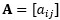

{:toc .large-only}

## 벡터

- 데이터를 수학적으로 표현하고 다루기 위한 개념
- 스칼라들의 집합으로 표현할 수 있으며, 크기와 방향을 가지는 요소
  - 스칼라: 벡터/행렬을 구성하는 요소인 각 숫자들을 의미
- 열로 구성되어 있는 열벡터(Column)와 행으로 구성되어 있는 행벡터(Row)로 나뉨
- 벡터의 첫 번째 요소는 x좌표, 두 번째 요소는 y좌표, 세 번째 요소는 z좌표를 의미함
- 벡터는 공간상 벡터의 점으로 나타내는 것이 일반적이며, 이 점은 벡터의 끝점으로 놓고 시작점은 원점(0,0)에 위치하는 것으로 가정한다.

 

> 참고사이트: https://velog.io/@junsoo96/%EB%B2%A1%ED%84%B0Vector, https://wikidocs.net/214400, https://www.youtube.com/watch?v=ArgTeYVuJUo

### 벡터 연산

- 벡터의 덧셈: 같은 위치에 있는 성분들을 더한다.
  - 
- 벡터의 뺄셈: 같은 위치에 있는 성분들을 뺀다.
  - 
- 스칼라의 곱(상수곱): 벡터의 모든 요소에 스칼라 c를 곱한다.
  - 
- 벡터의 곱셈: 내적/외적

### 벡터의 길이(norm)

- ∥p∥로 표현
- 피타고라스 정리를 사용하여 정의 가능
- p와 p를 내적한 후 루트를 씌워주는 것과 같다.
  - 

### 벡터 내적

- 두 벡터의 각 성분을 곱한 후 그 결과를 모두 더하는 연산
  - 
- 벡터 내적은 두 벡터가 얼마나 유사한 방향을 가지고 있는지를 나타낸다.
- 두 벡터가 비슷한 방향을 가지고 있을수록 내적 값은 크고, 서로 다른 방향을 가지고 있을수록 내적 값은 작다.
- 두 벡터가 서로 수직이면 내적 값은 0이 된다.

### 벡터 사이의 각도

- 두 벡터 사이의 각도를 θ이라고 할 경우, 벡터 사이의 각도를 구하는 공식은 아래와 같다.
  - 

### 벡터 사이의 거리

- **유클리드 거리**
- 두 데이터가 얼마나 유사한가를 측정하기 위해 사용
- 두 벡터의 차로 정의
  - d(x,y) = ∥x−y∥ = 

> 참고사이트: https://www.youtube.com/watch?v=dQJuPo_x3og

### 벡터 사이의 유사도 정리

- ∥x-y∥²는 제곱 유클리드 거리로 제곱근 계산을 피하여 계산을 단순화하기 위해 사용

### 선형독립/선형종속

n개의 벡터집합의 선형결합이 0일 때, 즉일 때 이를 만족시키는 해가  밖에 존재하지 않으면 벡터집합은 선형독립이이고, 그렇지 않으면 선형종속이다.

### 기저

- 벡터의 집합이 선형독립이면서 벡터공간을 생성할 수 있다면, 이 벡터의 집합을 기저라고 한다.
- 기저가 있으면 벡터공간을 만들 수 있으며, 역으로 벡터공간이 존재한다면 그것의 기저가 반드시 존재한다고 할 수 있다.
- n차원 공간을 만들려면 n개의 기저가 필요

> 참고사이트: https://gosamy.tistory.com/47, http://contents.kocw.or.kr/contents4/document/lec/2012/KonKuk/ChoiYunjeong/6.pdf

### 차원

- 벡터공간 V의 기저를 이루는 벡터의 개수
- 영벡터들로 이루어진 공간은 0차원이다.

## 행렬

- 여러 개의 벡터를 표현
- 주로 행렬은 대문자로, 행렬의 성분은 소문자로 표기:
- 행렬의 가로 줄을 열(n), 세로 줄을 행(m)이라고 한다.
- m=n인 행렬을 정방행렬이라고 한다.
- 모든 원소가 0인 행렬은 영행렬이다.

### 행렬의 연산

- 행렬의 덧셈: 같은 위치에 있는 성분들을 더한다.
  - 
  - 두 행렬의 크기가 같아야 가능하다.
- 행렬의 뺄셈: 같은 위치에 있는 성분들을 뺀다.
  - 
  - 두 행렬의 크기가 같아야 가능하다.
- 스칼라의 곱(상수곱): 행렬의 모든 요소에 스칼라 c를 곱한다.
  - 
- 행렬의 곱셈: 앞의 행렬 A의 행에 뒤의 행렬 B의 열을 곱한다.
  - 
  - 앞의 행렬의 열의 수와 뒤의 행렬의 행의 수가 같아야 연산이 가능하다.
  - 즉, 앞의 행렬 A의 크기가 m*r이고 뒤의 행렬 B의 크기가 r*n일 때 곱셈 연산이 가능하고, 이때 얻어지는 행렬의 크기는 m*n이다.
  - A의 i번째 행벡터와 뒤의 B의 j번째 열벡터의 내적으로 볼 수 있다.
  - 교환법칙이 성립하지 않는다.(AB!=BA) 하지만 분배법칙(A(B+C)=AB+AC)과 결합법칙((AB)C=A(BC))은 성립한다.

> 참고사이트: https://www.youtube.com/watch?v=ihZdZu9P8JU

### 전치행렬

- 모든 행과 열을 바꾼 행렬
- 
- 

> 참고사이트: http://www.ktword.co.kr/test/view/view.php?m_temp1=2439&id=990

### 정방행렬

행렬 X의 행과 열의 수가 같을 때, 즉 **n*n** 크기의 행렬을 정방행렬이라고 한다.

아래는 실제 응용에 많이 사용되는 정방행렬들이다.

#### 대각행렬

- 대각원소 외의 모든 원소가 0인 정방행렬
- 
- 대각행렬이 앞에 곱해지면, 각 행에 대각행렬의 주대각 성분이 곱해짐
- 대각행렬이 뒤에 곱해지면, 각 열에 대각행렬의 주대각 성분이 곱해짐
- 

> 참고사이트: http://www.ktword.co.kr/test/view/view.php?no=4695

#### 단위행렬

- 주 대각성분이 모두 1 이고, 그외 성분이 모두 0인 정방행렬
- 
- IX = XI = X

#### 대칭행렬

- 대각선을 중심으로 서로 반대편의 성분들이 같은 정방행렬
- , 
- X, Y가 대칭행렬이면 X+Y, kX도 대칭행렬이다.

#### 삼각행렬

- 상삼각행렬: 대각원소 아래의 원소가 모두 0인 행렬
- 하삼각행렬: 대각원소 위의 원소가 모두 0인 행렬
- 

#### 역행렬

- A 행렬과 A 행렬의 역행렬의 곱은 I다. (I는 단위행렬이다.)
- 

> 참고사이트: http://www.ktword.co.kr/test/view/view.php?no=4653, https://www.youtube.com/watch?v=3prtOI9i0E4&list=PLxz77rwoJPpWMrEaUpfGTG9P7X_faMYGi&index=6

#### 직교행렬

- 정방행렬 A의 전치행렬과 역행렬이 동일한 경우
- 즉, 

### 행렬식

- 정방행렬 A를 실수값으로 나타내는 함수
- 행렬식 표기:
- 2차 행렬식
  - 
- 3차 행렬식
  - 

> 참고사이트: https://www.youtube.com/watch?v=fuVMiyahzH4&list=PLxz77rwoJPpWMrEaUpfGTG9P7X_faMYGi&index=4, https://velog.io/@pongchi/%EA%B3%B5%EC%97%85%EC%88%98%ED%95%99-%ED%96%89%EB%A0%AC%EC%8B%9D

#### 행렬식의 성질

행렬끼리의 곱셈은 교환법칙이 성립하지 않지만, 행렬식 안에서의 곱셈은 교환법칙이 성립한다. (행렬값은 실수이므로)

### 고유값과 고유벡터

- 를 만족하는 0이 아닌 벡터 x가 존재하면, λ를 고유값, x를 λ에 대응하는 고유벡터라고 한다.
  - A: n*n 행렬, λ: 람다
- Ax와 x는 평행(같은 방향)이다.

#### 특성방정식

위 식에서 각 항에 벡터 x를 나누면이다.

#### 고유값과 고유벡터 구하기

행렬 A가로 주어졌을 때

특성방정식에 따라 아래와 같이 구할 수 있다.

> 참고사이트: https://www.youtube.com/watch?v=-L0y6nPQFcM&list=PLxz77rwoJPpWMrEaUpfGTG9P7X_faMYGi&index=8, https://angeloyeo.github.io/2019/07/17/eigen_vector.html

### 대각화

- 행렬을 대각행렬로 만드는 것
- 대각화 가능 조건
  - 아래 식을 만족하는 행렬 P와 대각행렬 D가 존재한다.
  - 

## 선형변환

- n차원 벡터 공간에서 m차원 벡터 공간으로 데이터를 변환하는 매핑 함수
- 선형변환 가능 조건
  - T(u+v) = T(u)+T(v) : 벡터 덧셈 연산 보존
  - T(cu) = cT(u) : 스칼라 곱셈 연산 보존
  - (T: 선형변환)

> 참고사이트: https://www.youtube.com/watch?v=VS7BVNCYnDE, http://www.ktword.co.kr/test/view/view.php?no=4651, http://www.ktword.co.kr/test/view/view.php?no=5768

#### 예시) 회전변환

### 행렬변환

- 행렬 A를 이용하여 벡터 x를 Ax로 변환하는 것을 n차원 벡터 공간에서 m차원 벡터 공간으로의 행렬변환이라고 한다.
- 
