{:toc .large-only}

## 확률론

- 확률실험 : 수행 결과가 확률적으로 변하는 실험
- 표본공간 : 확률실험에 의해 관찰될 수 있는 모든 결과의 집합
- 사건 : 표본공간의 부분집합으로, 확률실험의 결과를 표현하는 방법
- 상호배반사건 : 사건 A와 B가 A∩B=∅ 일 때 성립
  - ∅: 원소가 없는 공집합
- 확률 P(A) : 표본공간 S의 부분집합으로 정의되는 사건 A를 하나의 실수값으로 매핑시키는 함수, 아래 조건을 만족
  - 0 ≤ P(A) ≤ 1
  - P(S) = 1, P(∅) = 0
  - 두 배반사건 A, B에 대해 P(A∪B)=P(A)+P(B)

### 결합확률과 조건부확률

- 결합확률 : 두 사건 A와 B가 동시에 발생할 확률 P(A∩B)
  - ex) 주사위를 던져서 짝수이면서 4보다 크거나 같은 숫자가 나올 확률 (1/3)
  - A와 B가 서로 배반사건인 경우는 P(A∩B)=0
- 조건부확률 : 추가적인 조건이 주어졌을 때 사건이 일어날 확률
  - 사건 B가 이미 관찰되었다는 조건에서 사건 A가 일어날 확률: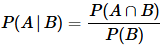
  - 사건 A가 이미 관찰되었다는 조건에서 사건 B가 일어날 확률: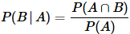
  - ex) 주사위를 던져서 나온 숫자가 4보다 크거나 같다는 것이 관찰되었다는 조건에서 짝수의 눈이 나올 확률 (2/3)
  - 서로 독립적인 사건 A, B에 대한 조건부확률은 P(A\|B)=P(A), P(B\|A)=P(B)

### 선험확률과 후험확률

- 사전 정보 없이 계산되는 확률을 선험확률(사전확률)이라고 함
  - P(A): A의 선험확률, P(B): B의 선험확률
- 추가적인 정보를 얻은 후 계산되는 확률을 후험확률(사후확률)이라고 함
  - P(A\|B): 사건 B가 이미 관찰되었다는 조건에서 사건 A가 일어날 후험확률

### 베이즈 정리

- 선험확률을 바탕으로 후험확률을 얻는 공식
- 조건부확률의 식을 정리하면: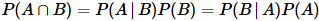
- 이를 다시 정리하면: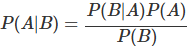
- 사전확률 P(A)가 서로 독립적이고(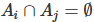) 완전하다면 (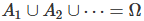) 아래와 같이 정리할 수 있다.
  - 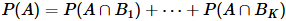
- 이를 베이즈 정리에 확장하면 아래와 같다.
  - 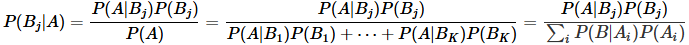
- 즉, 베이즈 정리는 새로운 정보를 토대로 확률을 업데이트해 나가는 데 의미가 있다.

> 참고사이트: https://junpyopark.github.io/bayes/, https://datascienceschool.net/02%20mathematics/06.06%20%EB%B2%A0%EC%9D%B4%EC%A6%88%20%EC%A0%95%EB%A6%AC.html, http://www.ktword.co.kr/test/view/view.php?m_temp1=3730&id=887, https://angeloyeo.github.io/2020/01/09/Bayes_rule.html

## 확률변수

- 시행의 결과로 나타나는 여러 사건을 수치로 나타내는 변수
- 주로 X와 같이 대문자로 나타내고, 그 변수가 취할 수 있는 값은 x와 같이 소문자로 표시한다.
  - ex) 주사위 던지기에서 나온 숫자를 3으로 나눈 나머지를 확률변수 X로 두면, 가질 수 있는 값 x는 {0, 1, 2}
- 확률변수가 주사위 던지기처럼 정수인 경우 이산확률변수, 몸무게 재기처럼 연속된 실수인 경우 연속확률변수

### 확률분포

확률변수 X가 가질 수 있는 임의의 값 x에 대해, 이 값을 가질 확률들의 분포를 확률분포라고 한다.

### 누적분포함수

- 확률변수 X가 x보다 작거나 같은 값을 가질 확률

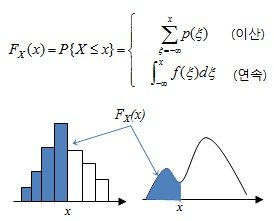

### 확률밀도함수

- 누적분포함수의 미분값으로 확률밀도함수를 구할 수 있다.
- 항상 0에서 1 사이의 값을 가진다.

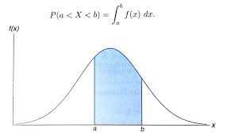

### 확률변수의 통계량

- 확률변수의 분포 특성을 나타내는 대표적인 값
- 기대치(또는 평균), 표준편차, 분산 등이 있다.

### 가우시안 분포(정규분포)

- 어떤 모집단의 특징값을 조사했을 때 가장 일반적으로 가정할 수 있는 형태
- 평균을 중심으로 좌우대칭인 종 모양의 확률분포를 가지며 퍼진 정도는 분산에 의해 결정된다.
- 확률변수가 특정 구간 (a,b) 내의 값을 가질 확률은 두 점 a,b 사이 곡선 아래의 넓이다.
- 전체 곡선 아래의 넓이는 1이다.

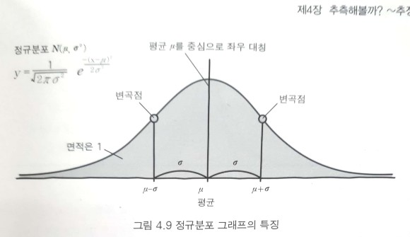
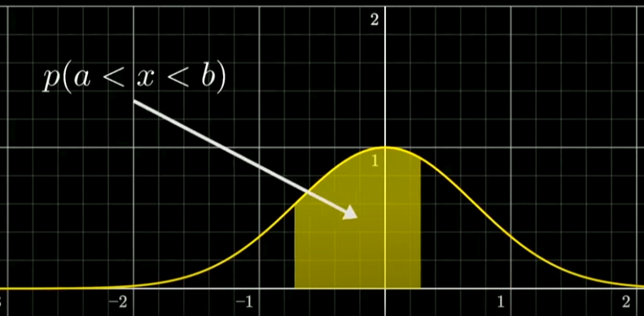

> 참고사이트: https://www.youtube.com/watch?v=SoKjCUcDBf0&t=701s

## 랜덤벡터

- 두 개 이상의 확률변수로 이루어진 다변량 확률변수를 랜덤벡터라고 함
- 두 개의 확률변수 X₁, X₂로 이루어진 2차원 벡터를 이변량 랜덤벡터라고 한다.

### 확률분포

- 랜덤벡터의 확률분포를 결합확률분포라고 한다.

### 다변량 가우시안 분포함수

- n차원 랜덤벡터 X에 대한 평균 μ, 공분산행렬 Σ가 주어졌을 때, 다변량 가우시안 분포함수는 다음과 같이 정의된다.
- 이변량 가우시안 확률밀도함수는 2차원 평면 위에서 정의되는 한 점에 대해 확률밀도값이 정해지므로, 3차원 공간상에서 종 모양의 입체 형태를 띠게 된다.
  - 평균 벡터는 종의 중심 위치를 결정하고 공분산행렬은 종의 퍼진 형태를 결정하게 된다.

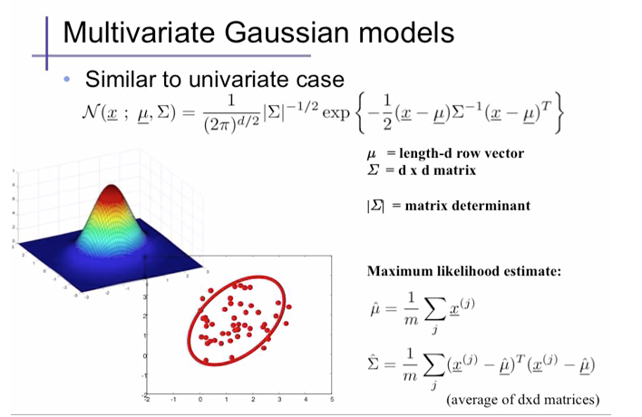
