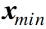

{:toc .large-only}

## 분류의 개념

- 입력 데이터를 이미 정의된 몇 개의 클래스로 구분 (ex. 숫자인식, 얼굴인식 등)
- 베이즈분류기, K-최근접이웃분류기, 결정트리, 랜덤포레스트, SVM, 신경망(MLP, CNN, LSTM 등)

## 데이터 분류

### 결정경계

 

- 결정경계 = 𝑔(𝒙;𝜽)
- 주어진 데이터를 분류하는 기준을 정의하는 모델
- 머신 학습의 궁극적인 목적은 결정 경계를 찾는 것이다.
- 결정 경계의 차원은 데이터의 벡터 공간의 차원보다 한 차원 낮다.

> 참고사이트: https://dsbook.tistory.com/67, https://panython.tistory.com/10

### 결정경계를 얻는 방법

- 확률 기반 방법
  - 를 추정하여 분류
  - 베이즈 분류기
- 데이터 기반 방법
  - 데이터 간의 관계로 분류
  - K-최근접이웃 분류기

## 베이즈 분류기

- 새로운 데이터가 어떤 클래스에 속하는지를 판단하는 기준
- 클래스별 확률밀도함수를 이용하여 데이터를 분류
  - 확률밀도함수: 데이터가 각 클래스로부터 생성되었을 확률
  - 가장 큰 확률을 가지는 클래스로 분류

### 우도비에 의한 분류

- 이진 분류 문제: 데이터 x가 주어졌을 때, 두 개의 클래스에 속할 확률 p(C₁\|x), p(C₂\|x) 중 확률값이 큰 클래스로 할당
- 판별 함수: g(x) = p(C₁\|x)-p(C₂\|x)
- 우도비: 각 클래스에서 x가 관찰될 확률밀도의 비율
- 베이즈 분류기: 베이즈 정리로부터 유도된 결정경계를 이용한 분류

p(C₁)=p(C₂)인 경우(각각 전체 데이터의 50%씩 차지) 결정경계는 p(x\|C₁)=p(x\|C₂)가 되는 지점이 될 것이다.

만약 p(C₁)≠p(C₂)인 경우 결정경계는 p(x\|C₁)=p(x\|C₂)를 만족하는 지점을 따라 왼쪽 또는 오른쪽으로 치우치게 될 것이다.

### 다중 클래스 분류기

- 클래스가 3개 이상인 다중 클래스 분류 문제
- 각 클래스에 대한 판별 함수: 
- 우도비에 대한 분류와 마찬가지로 데이터 x가 주어졌을 때 특정 클래스로부터 얻어졌을 확률에 베이즈 정리를 적용하여 얻음

### 수행 단계

1. 학습 데이터 수집
1. 학습 데이터로부터 클래스별 분포함수 추정 =>
1. 테스트 데이터입력
1. 각 클래스별 판별함수 값 계산 =>
1. 가 가장 큰 클래스 k로 할당

### 가우시안 확률분포(정규분포)를 따르는 경우

- 가우시안 분포의 확률밀도함수:
  - μ: 평균, Σ: 공분산
- 결정규칙: 

### 공분산행렬의 형태에 따른 판별함수

#### 클래스 공통 단위 공분산행렬

- 
- 모든 클래스의 공분산이 동일하게 단위행렬의 상수배인 행렬을 가지는 경우
- 결정규칙:
  - 이 식이 가지는 의미는 입력 데이터에서 각 클래스의 평균까지의 거리를 계산하여 그 거리가 가장 작은 클래스로 분류하는 것으로, 이러한 분류기를 **최소 거리 분류기**라고 한다.

#### 클래스 공통 공분산행렬

- 
- 모든 클래스가 동일한 공분산을 갖지만 그 형태가 일반적인 행렬이 되는 경우
- 타원형 데이터 분포
- 결정규칙:
  - 데이터 x에서 평균까지의 거리를 계산할 때 공분산도 함께 고려하여 계산하는 것으로, 이러한 거리를 **마할라노비스 거리**라고 한다.
  - 만약 공분산 Σ가 대각행렬이면 데이터의 각 요소 사이의 상관관계는 존재하지 않고 요소별로 표준편차 값으로 나누어 준 후 유클리디안 거리를 계산하는 방식이 되는데, 이를 **정규화된 유클리디안 거리**라고 한다.

#### 일반적인 공분산행렬

- 
- 각 클래스의 공분산이 서로 다른 일반적인 형태를 가지는 경우
- 서로 다른 타원형 분포
- 결정규칙:
  - 추정해야 할 파라미터 수가 많아져서 추정 오차가 최종 결정규칙에 나쁜 영향을 줄 가능성이 커짐

## 최근접이웃 분류기

- 클래스와 상관없이 모든 데이터 중 가장 작은 거리값을 갖는 데이터가 속하는 클래스로 할당
- 

### 수행 단계

1. 주어진 데이터 x와 모든 학습 데이터 {x₁, x₂. ...}과의 거리를 계산한다.
1. 거리가 가장 가까운 데이터를 찾아으로 둔다.
1. 이 속하는 클래스에 할당한다. 즉, y()과 같은 값을 가지도록 y(x)를 결정한다.

### 문제점

- 과다적합 발생
- 단 하나의 데이터만으로 분류를 결정하므로 데이터에 포함된 잡음에 매우 민감한 문제를 가지게 된다.
- 이를 해결하기 위해 K-최근접이웃 분류기를 사용

### K-최근접이웃 분류기

- 주어진 데이터로부터 거리가 가까운 순서대로 K개의 데이터를 찾은 후, 그 중 가장 많은 수의 데이터가 속한 클래스로 할당

### 가우시안 베이즈 분류기 vs K-최근접이웃 분류기

- **가우시안 베이즈 분류기**
  - 각 클래스에 대한 확률분포함수를 미리 가정하고 추정
  - 학습 데이터를 통해 평균과 표준편차만 계산하여 활용
    - 일단 파라미터를 추정하고 나면 이후 분류 과정에서 학습 데이터가 불필요
- **K-최근접이웃 분류기**
  - 확률분포모델을 미리 가정하지 않고 데이터 집합을 이용하여 추정
  - 새로운 데이터가 주어질 때마다 학습 데이터 전체와의 거리 계산이 필요
    - 항상 학습 데이터를 저장하고 있어야 하므로 비용(계산량, 메모리) 증가
- 데이터 분포가 복잡한 비선형 구조를 가질 때는 K-최근접이웃 분류기가 효율적

### 적절한 K값의 결정

- K가 1인 경우
  - 바로 이웃한 데이터에만 의존하여 클래스 결정
  - 노이즈에 민감하며 과다적합 발생
- K가 1보다 훨씬 큰 경우
  - 주어진 데이터 주변 영역이 아닌 전체 데이터 영역에서 각 클래스가 차지하는 비율(선험확률)에 의존하게 됨
- 주어진 데이터의 분포 특성에 따라 결정
- 여러 값을 사용해 분류를 수행해 봄으로써 가장 좋은 성능을 주는 값을 선택

### 거리 함수

- 거리 함수에 따라 분류 성능에 직접적인 영향을 줌
- 유클리디안 거리 함수를 가장 많이 사용
- 마할라노비스 거리 함수나 정규화된 유클리디안 거리 함수는 데이터 집합의 분산을 고려함
- 여러 함수를 사용해 분류를 수행해 봄으로써 가장 좋은 성능을 주는 값을 선택
