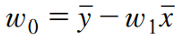

{:toc .large-only}

## 회귀의 개념

- 입력변수와 출력변수 사이의 매핑 관계를 찾는 것
- 시계열 예측(ex. 주가 예측, 환율 예측 등)에 응용
- 선형회귀, 비선형회귀, 로지스틱 회귀, SVM, 신경망
- 분류와의 다른 점은 출력의 형태
  - 분류의 출력값은 클래스의 레이블, 회귀의 출력값은 연속적인 실숫값
- 예측 오차를 최소화하는 회귀함수 y=𝑓(𝒙;𝜽)를 찾는 것이 목표
  - 오차함수를 최소화하는 파라미터 𝜽를 구하는 방법을 최소자승법(최소제곱법)이라고 한다.

### 보간법과 회귀

- 데이터들을 가장 잘 표현하는 직선·곡선을 찾기 위해 보간법이나 회귀 사용
- 보간법을 적용한 보간 곡선은 제곱 오차가 0이지만 얻어지는 매우 복잡
- 회귀를 적용한 회귀 직선은 작은 오차는 있지만 입출력 관계 표현에 적합

## 선형회귀

- 입출력 쌍의 데이터를 통해 입력과 출력의 관계를 설명하는 선형 모델(일차식, 직선)을 찾는 문제
- 데이터 집합
  에 대해 (𝑥, 𝑦) 관계를 설명할 수 있는 선형함수
  를 찾는 것

### 좋은 선형회귀 모델

- 모든 데이터에 대해 잔차가 가능한 작아야 함
- 잔차의 제곱의 합을 사용한 **평균제곱오차**로 최적의 선형함수를 얻을 수 있다.
  - **최적의 파라미터**는 아래와 같다.
  - 
  - 

### 예측과 평가

- 회귀함수를 사용한 새 데이터에 대한 예측
  - 
- 테스트 데이터 집합에 대한 평가 기준
  - 평균 제곱 오차
  - 평균 제곱근 오차

### 다변량 선형회귀

- 입력이 여러 개의 값(n차원)으로 구성되면 다변량 선형회귀라고 한다.
- 위 그림에서 나이와 몸무게에 따른 수축기 혈압의 관계를 찾는 것은 결국 입출력 데이터를 설명할 수 있는 평면을 찾는 것이다.
- 만약 입력 x가 n차원이라면 회귀함수는 n차원 공간의 초평면이 된다.
- 회귀함수:
- 오차함수:
- 최적의 파라미터:
  - 여기서 데이터 집합 X는 기존 데이터 집합의 각 데이터 맨 앞에 1을 추가해서 n+1 차원으로 만든 데이터들의 집합을 의미

### 선형회귀의 확장

- x와 y의 관계를 선형 매핑으로 표현할 수 없는 경우 선형화 과정을 거친 후 선형회귀를 적용
- 더욱 복잡한 형태의 곡선으로 매핑을 위한 방법
  - 다항 회귀
  - 비선형 입력 변환함수를 사용한 선형회귀 (비선형 기저함수)
  - 비선형회귀 (신경망, SVM)

## 로지스틱 회귀

- 범주형 데이터의 회귀
- 선형회귀분석의 종속변수(출력)를 범주형으로 확장한 것
- 분류 문제에 적용 가능
- 입력값이 각 클래스에 속하는 확률값을 회귀분석으로 예측
- 로지스틱 함수: 𝑥∈(−∞,∞)를 항상 (0,1) 범위로 매핑하는 S자형 함수

### 로지스틱 함수를 이용한 분류

- 함수의 출력값 → 클래스 레이블에 대한 사후확률 P(y=1\|x)
- P(y=1\|x)≤0.5 → 𝑥∈𝐶₁
- P(y=1\|x)>0.5 → 𝑥∈𝐶₂
- 

#### 파라미터 m과 b 값에 따른 로지스틱 함수의 형태

### 오즈비

- 입력 x가 클래스 𝐶₁에 속할 확률과 𝐶₂에 속할 확률의 비율
- 

### 로짓 함수

- 오즈비에 대해 로그를 취한 함수
- 

### 로지스틱 회귀의 결정경계

- 

### 로지스틱 회귀의 매개변수 추정

- p(y\|x)의 확률함수는 베르누이 분포를 따름
  - 베르누이 분포: 시행 결과가 성공/실패 두 가지로 나타남
- **최대 우도 추정법**을 통해 파라미터 m, b를 추정

> 선형회귀에서는 선형함수의 출력값과 관찰된 데이터의 출력값이 모두 연속한 실수값으로, 그 잔차를 이용하여 정의되는 오차함수를 최소화하는 방향으로 파라미터를 최적화하였다. 
> 그러나 로지스틱 회귀에서는 선형함수의 출력값으로 계산되는 확률값은 실제 데이터로부터 얻을 수 없고, 데이터로 주어지는 출력값은 0과 1로 정해지는 클래스 레이블이다. 
> 따라서 선형회귀에서 사용한 제곱 오차를 사용할 수 없고, 계산되는 데이터에 대한 로그 우도를 최대화하는 최대 우도 추정법을 통해 파라미터 m, b를 추정할 수 있다.
