{:toc .large-only}

## 군집화의 개념

- 데이터 집합의 분포 특성을 분석하여, 서로 교차하지 않는 복수 개의 부분집합(cluster)으로 나누는 문제
- 입력 데이터로부터 추출된 특징 공간에서 특징값의 유사성에 따라 비슷한 데이터들끼리 묶음
- 대표적인 군집화 알고리즘으로 K-평균 군집화, 계층적 군집화가 있음

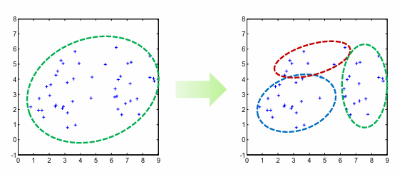

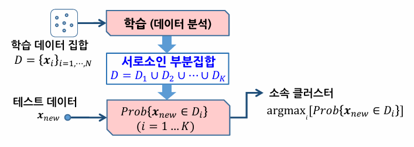

### 분류와의 차이

- 분류는 입력값으로 클래스 레이블, 즉 목표 출력값이 주어짐
- 분류는 목표 출력값을 이용해 학습하는 지도학습을 수행하고, 군집화는 목표 출력값이 없는 비지도학습을 수행
- 군집화를 적용하는 경우
  - 데이터에 대한 클래스 레이블이 주어지지 않는 경우
  - 데이터에 대한 클래스 레이블링에 비용이 많이 드는 경우

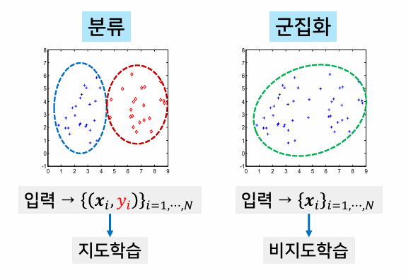

## K-평균 군집화

- 주어진 데이터 집합을 K개의 그룹으로 묶는 알고리즘
- 각 그룹은 그룹 내에 속하는 데이터들의 평균을 대표 벡터로 가짐

### 수행단계

1. 시작(초기화): 데이터 집합으로부터 임의로 K개의 벡터를 선택하여 K개의 초기 대표 벡터 집합을 생성
1. 데이터 그룹핑: 각 데이터에 대해 K개의 대표 벡터들과의 거리를 계산하여 가장 가까운 대표 벡터의 클러스터에 속하도록 레이블링. 이 과정을 통해 데이터 집합을 K개의 클러스터로 나눔
1. 대표 벡터 수정
1. 반복 여부 결정: 수정 전과 후의 벡터의 차이가 없거나 설정된 반복 횟수에 도달할 때까지 2~4번 과정을 반복함

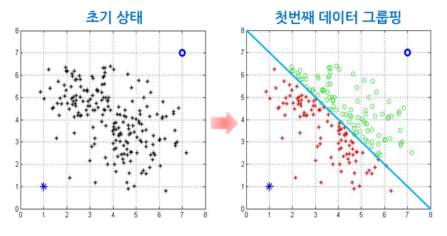

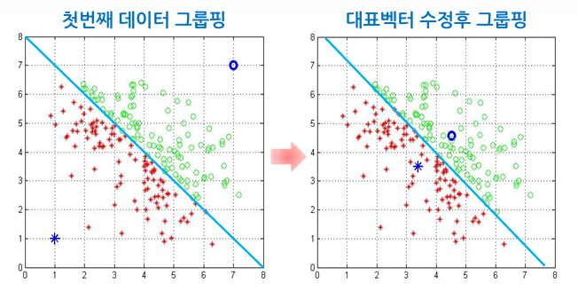

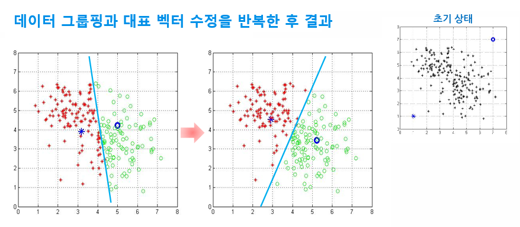

### 고려해야 할 사항

#### 1. 반복수행 과정의 의미

대표 벡터 계산과 데이터 그룹핑 과정의 반복적인 수행을 통해 좋은 군집을 찾는 것이 확실히 보장되는가?

- 목적함수 J를 최소화하기 위해 반복 수행함
- 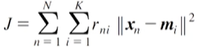
- J는 각 클러스터의 분산을 모두 더한 값
  - J가 작을수록 각 클러스터 내의 데이터들이 잘 결집되어 있음
  - J가 클수록 각 클러스터 내의 데이터들이 서로 뭉쳐있지 않음
- 반복 수행할 때마다 목적함수 J의 값을 감소시켜서 지역 극소점을 찾는 것을 보장한다.

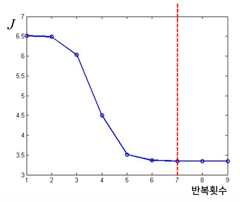

#### 2. 초기값에 대한 의존성 문제

초기 대표 벡터의 설정이 군집화의 성능에 미치는 영향은?

- 초기값에 민감
- 초기에 임의로 결정하는 대표 벡터에 따라 최종적으로 찾아지는 해가 달라짐 (구하지 못할 수도 있음)
- 각 데이터 간의 거리가 어느 기준 이상 떨어진 것들을 후보로 선택하거나 전체 입력 범위를 균등 분할하여 선택하는 등의 방법을 사용함

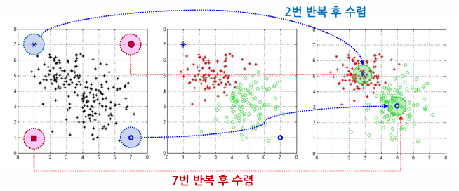

#### 3. K 값에 따른 변화

적절한 K값을 어떻게 선택할 것인가?

- K값의 선정은 주어진 문제에 의존적이므로 쉽게 판단하기 어려움
- 다양한 K값을 적용해보고 군집화 결과들을 비교하여 선택하거나, 계층적 군집화 알고리즘을 사용하는 방법 등이 있다.

## 계층적 군집화

- 전체 데이터를 몇 개의 배타적인 그룹으로 나누는 대신, 큰 군집이 작은 군집을 포함하는 계층 형태를 이루도록 군집화를 수행하는 방법
- 병합적 방법: 각 데이터가 하나의 군집을 이루는 최소 군집에서 시작하여 가까운 군집들끼리 단계적으로 병합하여 더 큰 군집을 만들어 가는 방법
- 분할적 방법: 모든 데이터가 하나의 군집에 속하는 최대 군집에서 시작하여 특정 기준에 따라 군집을 분할해 가는 방법
  - 비용이 많이 들어 비실용적

### 병합적 방법의 알고리즘

1. 데이터 집합으로부터 각 데이터가 각각의 군집이 되도록 N개의 군집을 설정함
1. 가능한 모든 군집 쌍에서 군집 간의 거리를 계산함
1. 거리가 가장 가까운 두 군집을 병합하여 새로운 클러스터를 생성
1. 새로운 클러스터를 클러스터 풀에 넣고, 원래 클러스터(합친 두 군집)를 제거함
1. 오직 하나의 클러스터가 남을 때까지 2~5번 과정을 반복함

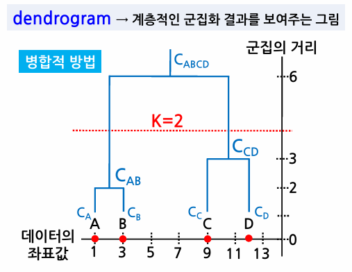

### 군집 간의 거리를 계산하는 방식

- 최단 연결법: 가장 가까운 데이터 쌍 값의 거리
  - 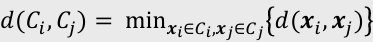
  - 고립된 군집을 찾는 데 유용
- 최장 연결법: 가장 멀리 떨어진 데이터 쌍 간의 거리
  - 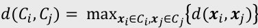
  - 응집된 군집을 찾는 데 유용
- 최단 연결법과 최장 연결법은 아웃라이어(군집에서 벗어나 따로 동떨어진 데이터)의 영향을 많이 받으므로 이를 중심 연결법으로 해결
- 중심 연결법: 두 군집의 평균 간의 거리
  - 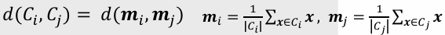
  - 특이값에 강건함
- 평균 연결법: 모든 데이터 쌍 간 거리의 평균
  - 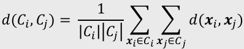
  - 작은 분산을 가지는 군집을 형성함
- Ward's 방법: 병합 후의 클러스터 내부의 분산값
  - 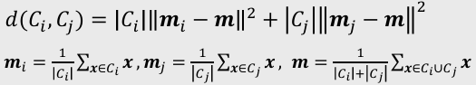
  - 비슷한 크기의 군집을 병합함

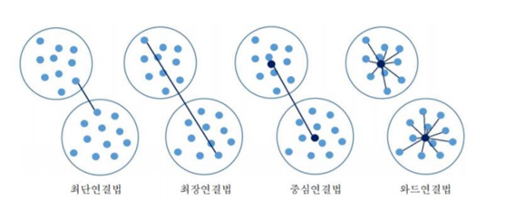

### 군집의 수를 결정하는 방법

- 덴드로그램에서 군집 간의 거리가 증가하는 동안, 군집의 수가 늘어나지 않고 일정 기간 유지되는 지점을 선택한다.
- 아래 그림에서 군집의 거리가 3에서 6까지 증가하는 동안 새로운 클러스터가 생성되지 않으므로 군집의 거리가 4가 되는 지점을 기준으로 하고, 그 아래에 만들어진 군집의 개수인 2가 적절한 클러스터의 수가 된다.

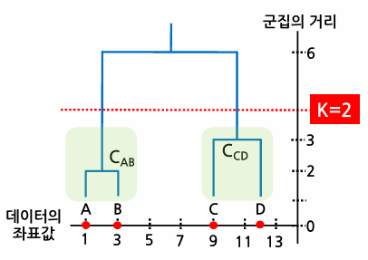
