{:toc .large-only}

## 특징추출의 개념

- n차원의 입력벡터 x에 대해 변환함수 ∅를 적용하여 m차원의 특징벡터 y를 얻는 변환
- 분석에 불필요한 정보를 제거하고 핵심 정보만 추출
- 차원 축소를 통해 분석 시스템의 효율 향상

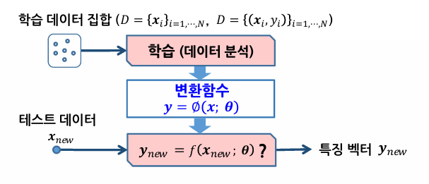

### 변환함수의 종류

- **선형변환**
  - n차원 열벡터 x에 변환행렬 W(n\*m)을 곱하여 m차원 특징을 획득 (n\<m)
  - 통계적 방법으로 특징벡터 y가 원하는 분포가 되도록 하는 W를 찾음
- **비선형변환**
  - 복잡한 비선형함수 ∅(x)를 이용하여 n차원 벡터를 m차원 벡터로 매핑
  - 수작업에 의한 특징추출: 입력 데이터의 특성과 분석 목적에 맞는 특징을 개발자가 설계함
  - 표현학습에 사용: 비선형 변환함수를 신경망 등의 머신러닝 모델로 표현

## 선형변환에 의한 특징추출

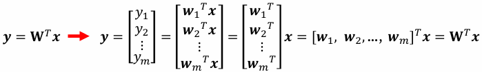

- 특징벡터 y는 입력벡터 x를 W의 열벡터로 사영한 값

### 2차원 데이터 x를 1차원 특징 y로 변환

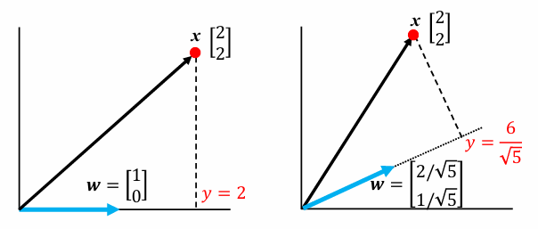

### 3차원 데이터 x를 2차원 특징 y로 변환

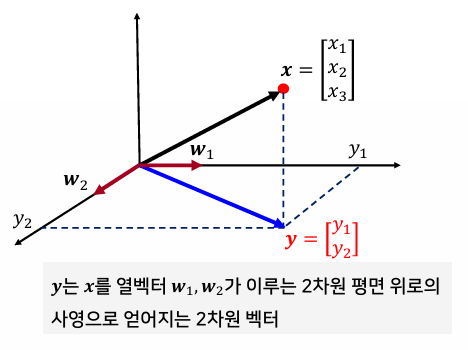

### 전체 데이터 집합 X에 대한 특징추출

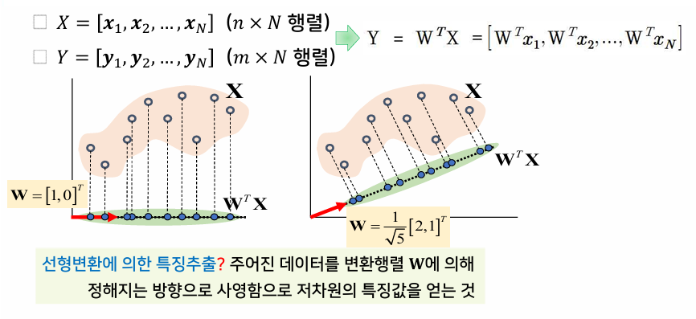

### 변환행렬에 따른 특징의 분포

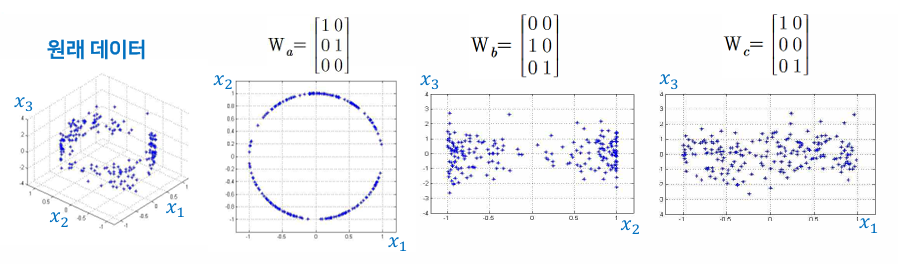

- 변환행렬 W에 따라 얻어지는 특징추출이 다르다.
- 좋은 특징추출이란?
  - 변환행렬 W를 적절히 조절해서 분석 목적(분류)에 맞는 특징 분포를 만드는 것

### 선형변환을 사용하는 대표적인 통계적 특징추출 방법

- 주성분분석법(PCA)
  - 클래스 정보 미사용
  - 비지도 학습
- 선형판별분석법(LDA)
  - 클래스 정보 사용
    지도 학습

## 주성분분석법(PCA)

- 목적: 변환 전의 데이터 정보를 차원 축소 후에도 최대한 유지
- 데이터 집합이 가능한 넓게 퍼질 수 있도록 사영을 수행
- 데이터의 분산이 가장 큰 방향으로의 선형변환을 수행
- 가장 큰 분산과 그 방향 = 공분산행렬의 최대 고유치와 고유벡터
  - 데이터의 공분산행렬의 고유치와 고유벡터를 찾아 고유치가 가장 큰 값부터 순서대로 이에 대응하는 m개의 고유벡터를 찾아서 행렬 W를 구성

#### 예) 얼굴 영상의 표현

- n차원의 얼굴 영상을 m개의 기저벡터를 사용해서 표현
  - n차원을 m차원으로 차원 축소
  - 좋은 기저벡터 → Eigenface
    - Eigenface: 얼굴 영상에 PCA를 적용하여 찾아진 고유벡터를 영상으로 표현한 것

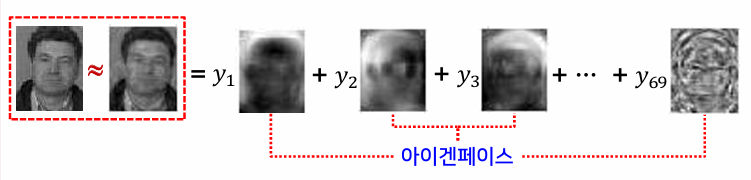

### 알고리즘의 수행 단계

1. 입력 데이터의 평균과 공분산을 계산
1. 공분산에 대한 고유치 분석을 통해 고유치행렬과 고유벡터행렬을 계산
1. 고유치가 큰 것부터 순서대로 m개의 고유치를 선택
1. 선택한 고유치에 대응되는 고유벡터를 열벡터로 가지는 변환행렬을 생성
1. 생성된 변환행렬에 의한 선형변환으로 특징 데이터를 얻음

### 주성분분석법의 특성과 문제점

- 데이터 분석에 대한 특별한 목적이 없는 경우 가장 합리적인 차원 축소의 기준이다.
- 클래스 레이블 정보를 활용하지 않아 분류의 핵심 정보의 손실을 초래할 수 있다.
- 데이터의 비선형 구조를 반영하지 못함

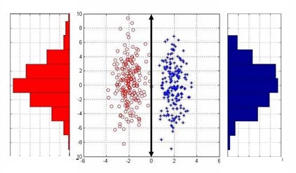

> 주성분분석이 적합하지 않은 데이터 집합의 예

## 선형판별분석법(LDA)

- 목적: **클래스 레이블 정보를 적극 활용**
- 클래스 간 판별이 잘 되는 방향으로 차원 축소
- 각 클래스가 가능한 서로 멀리 떨어질 수 있도록 거리를 유지
- 클래스 간의 거리는 목적함수 J
  - 목적함수 J를 최대로 하려면 각 클래스 내의 산점도는 작게, 클래스 간의 산점도는 크게 하여 분류에 적합한 특징으로의 변환을 유도

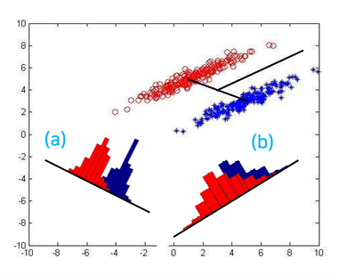

> (a) 클래스 간 차이를 유지하는 선형변환 (b) 클래스 간 오버랩을 발생시켜 성능을 저하시키는 선형변환

### 알고리즘의 수행 단계

1. 입력 데이터를 각 클래스 레이블에 따라 M개의 클래스로 나누어 각각 평균과 클래스 간 산점행렬, 그리고 클래스 내 산점행렬을 계산
1. 행렬의 고유치 분석을 통해 고유치행렬과 고유벡터행렬을 계산
1. 고유치가 큰 것부터 순서대로 m개의 고유치를 선택
1. 선택한 고유치에 대응되는 고유벡터를 열벡터로 가지는 변환행렬을 생성
1. 생성된 변환행렬에 의한 선형변환으로 특징 데이터를 얻음

### 선형판별분석법의 특성과 문제점

- 주성분분석법과 마찬가지로 복잡한 비선형 구조를 가진 경우에는 적절한 변환이 불가
- 주성분분석법과 마찬가지로 고유벡터의 개수 m의 값을 결정해주어야 한다.
- 행렬에 의해 찾아지는 고유벡터의 개수가 제한된다.
- 입력 데이터 수가 입력 차원보다 작은 경우 클래스 내 산점행렬의 역행렬이 존재하지 않음
  - 이 경우에는 PCA로 먼저 차원을 축소한 후 LDA를 수행

## 거리 기반 차원 축소 방법(MDS)

- 목적: 두 데이터 쌍 간의 거리를 최대한 유지하는 방향으로 차원 축소
- 거리의 정의에 따라 다양한 방법이 존재
  - 다차원 척도법, t-SNE, Isomap

### 다차원 척도법(MDS)

- 거리행렬 D가 값으로 주어진 경우 유클리디안 거리 사용

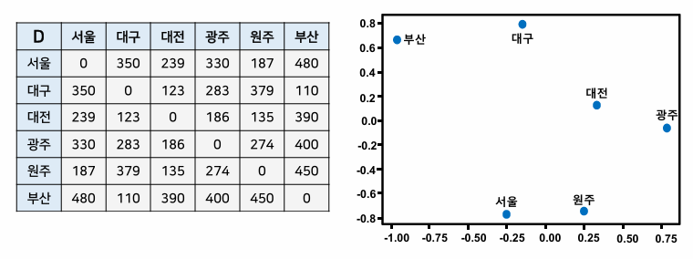

### t-SNE

- t-통계적 이웃 임베딩
- 조건부확률을 이용하여 데이터 간의 거리와 특징 간의 거리의 유사도를 정의
- 유사도를 정의할 때 t–분포를 사용
- 거리가 멀리 떨어진 데이터 사이의 관계를 더 잘 반영

### Isomap

- 측지 거리 사용
  - 데이터들을 정점으로 가지는 그래프 간의 경로를 데이크스트라 알고리즘으로 계산

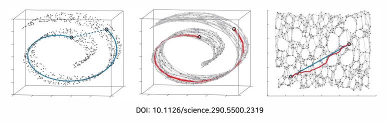

### 거리 기반 차원 축소 방법의 특징

- 입력 데이터와 특징 데이터 간의 매핑 함수를 정의하지 않음
  - 새로운 데이터에 대해서는 그에 대응하는 특징값을 찾을 수 없음
  - 데이터 시각화의 용도로 주로 사용

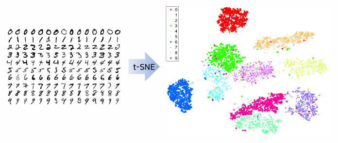
