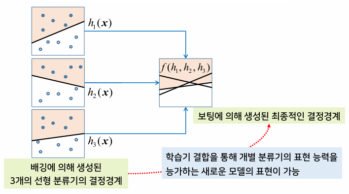
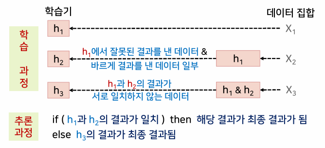
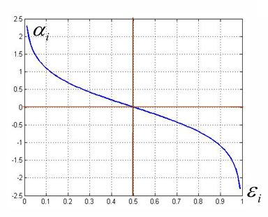
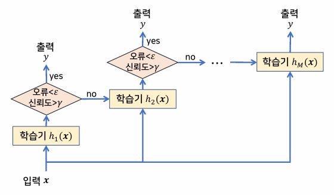
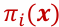
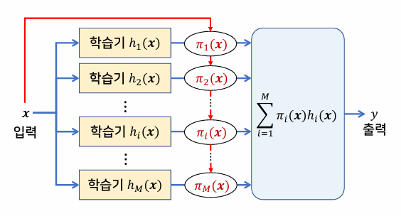
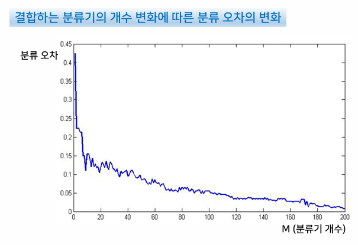
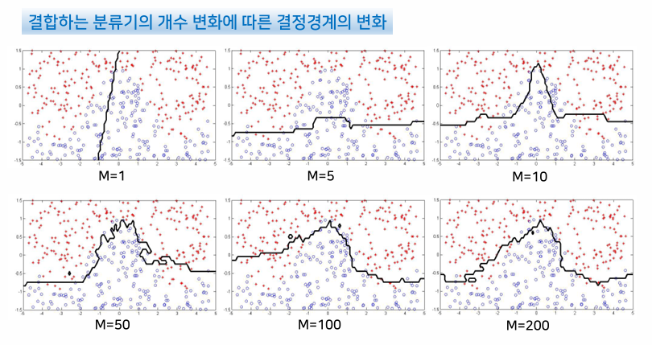

{:toc .large-only}

## 앙상블 학습의 개념

복수 개의 학습기를 결합함으로써 결과적으로 더 좋은 성능을 가진 학습기를 만드는 방법

### 학습기의 차별화 방법

- 학습 알고리즘의 차별화
  - 접근 방법이 서로 다른 학습기를 선택
  - ex) 베이즈 분류기와 K-NN 분류기를 결합하거나, 신경망과 SVM을 결합
- 모델 선택과 관련된 파라미터의 차별화
  - K값이 서로 다른 복수의 K-NN 분류를 사용하거나, 은닉층의 뉴런 수를 달리하면서 여러 가지 모델을 사용
- 학습 데이터의 차별화
  - 같은 모델을 사용하되 학습 데이터 집합을 달리하여 복수 개의 학습기를 생성

### 학습기 결합 방법

- 병렬적 결합: 각 학습기의 결과를 한 번에 모두 함께 고려하여 하나의 최종 결과를 생성
- 순차적 결합: 각 학습기의 결과를 단계별로 결합

### 학습 데이터 생성 방법에 따른 분류

- **필터링에 의한 방법** → 초기 부스팅 방법, 캐스케이딩 방법
  - 각 학습기를 학습할 때마다 새로운 데이터를 생성하고, 이를 이미 학습이 완료된 학습기에 필터링함으로써 제대로 처리되지 못하는 데이터들이 학습되도록 한다.
- **리샘플링에 의한 방법** → 배깅 방법
  - 각 학습기를 학습할 때마다 학습 데이터를 새로 생성하지 않고, 주어진 전체 학습 데이터로부터 일부 집합을 추출하여 각 학습기를 학습한다.
- **가중치 조정에 의한 방법** → AdaBoost 방법
  - 모든 학습기에 대해 동일한 학습 데이터를 사용하되, 각 데이터에 대해 가중치를 두어 학습에 대한 영향도를 조정

## 배깅과 보팅

### 배깅에 의한 학습

- 부트스트랩 방법을 앙상블 학습에 적용한 것
  - 부트스트랩: 제한된 데이터 집합을 이용하여 시스템의 학습과 평가를 동시에 수행하기 위한 리샘플링 기법
- bagging: bootstrap aggregating의 약자

#### 고려사항

- 데이터 집합의 크기
  - 전체 학습 데이터의 집합의 크기가 충분히 크지 않으면 각 학습기를 위한 학습 데이터의 크기를 전체 학습 데이터의 크기와 동일하게 설정
- 학습기의 모델
  - 판별함수가 데이터 집합의 변화에 민감한 모델을 선택하는 것이 바람직 (ex. 다층 퍼셉트론, 최근접이웃 분류기)

### 보팅에 의한 학습

- M개의 학습기 결과를 모두 동일한 정도로 반영하여 평균한 결과를 얻는 방법 (단순평균법)
- committee machine이라고도 함

### 배깅과 보팅에 의한 결정경계

- 이진 분류 문제

### 배깅과 보팅에 의한 오차

- 각 학습기가 내는 오차값들이 서로 독립적일 때, 결합된 학습기의 일반화 오차는 각각의 개별적인 학습기의 평균적인 일반화 오차의 1/M배로 감소
- 이것은 어디까지나 각 학습기가 내는 오차값들이 서로 독립적일 때 적용되며, 일반적으로는 일반화 오차의 감소가 클 것으로 기대하기는 어렵다.

## 부스팅

- 간단한 학습기들이 상호보완적 역할을 할 수 있도록 단계적으로 학습을 수행하여 결합함으로써 성능을 증폭시키는 방법
- 먼저 학습된 학습기의 결과가 다음 학습기의 학습에 정보를 제공하여 이전 학습기의 결점을 보완

### 필터링에 의한 부스팅

- 가장 처음 제안된 부스팅 방법
- 첫 번째와 두 번째 학습기의 결과가 서로 일치하지 않는 데이터들만 모아서 세 번째 학습기를 위한 데이터 집합을 만든다.
- 학습 데이터의 규모가 매우 커야 한다.

### AdaBoost 알고리즘

- 같은 데이터 집합을 반복해서 사용하되, 학습할 때마다 각 데이터에 대한 가중치(중요도)를 조정하여 학습의 변화를 꾀함
- 이전 단계의 학습 결과를 활용하여 다음 단계의 학습에 사용될 데이터에 가중치를 부여함으로써 분류기 간의 차별성 부여
- AdaBoost: Adaptive + Boost
- 분류기의 중요도는 각 학습기의 결합 과정에서 결합계수로 사용된다.
- 오분류율이 0.5보다 작으면 학습데이터에 대한 오차를 기하급수적으로 감소시킬 수 있음을 보임
- 두 개의 클래스에 대한 이진 분류 문제에 적합

#### 오분류율에 따른 결합 중요도

- 오분류율: ε, 결합 중요도: α

## 결합 방법

### 평균법

- 학습기의 출력이 수치형일 때 적합
- 단순평균과 가중평균이 있다.

### 보팅법

- 분류 문제에서 주로 사용
- 다수결 부표와 가중 보팅이 있다.
- 학습기의 출력값 유형에 따라 0 또는 1의 값으로 클래스를 표현하는 하드 보팅, 0과 1 사이의 확률값을 갖는 소프트 보팅으로 구분할 수 있다.

### 결합을 위한 학습기(결합기)

- 기본 학습기의 결과를 결합하는 학습기(결합기) 사용
- 기본 학습기의 학습에 사용되지 않는 새로운 학습 데이터 집합을 준비한다.

### 캐스케이딩

- 여러 복잡도를 가진 학습기들을 순차적으로 결합하는 방법
- 단계가 높아질수록 더욱 복잡하면서 성능이 좋은 학습기를 사용하는 것이 효과적
- 계산 시간을 줄이면서 성능도 보장
- 학습기의 출력에 대한 오류와 신뢰도를 측정하여 오류가 일정 수준 이상인 데이터들을 선택하여 다음 단계의 학습에 사용
  - 신뢰도가 γ보다 높지 않은 데이터들도 함께 선택하는 것이 바람직
- 신뢰도가 충분히 높다면 다음 단계의 학습기를 수행하지 않고 결과를 출력

### 전문가 혼합

- 복수 개의 학습기를 가중합하여 최종 학습기를 만드는 결합 방법
- 가중합 계수를 입력에 대한 함수 형태로 사용함으로써 주어진 입력에 따라 어떤 학습기를 중요하게 사용할지를 결정

## 앙상블 학습의 결과 예시

