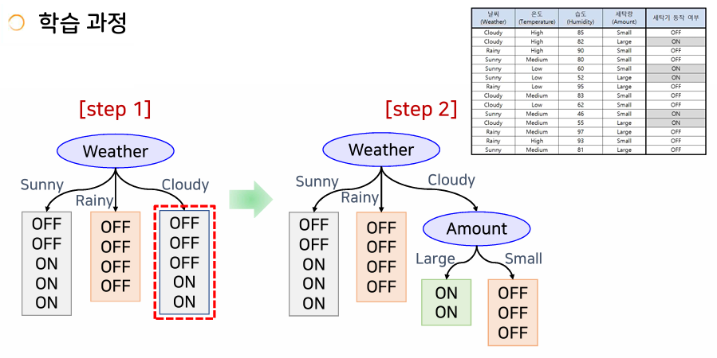
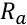
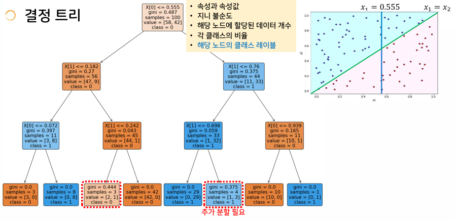
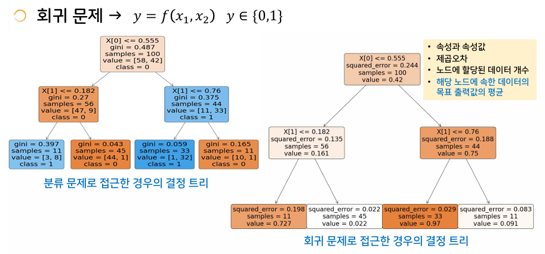
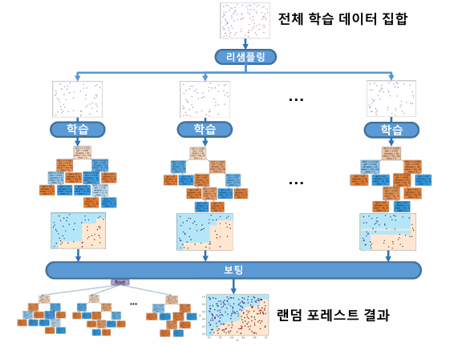
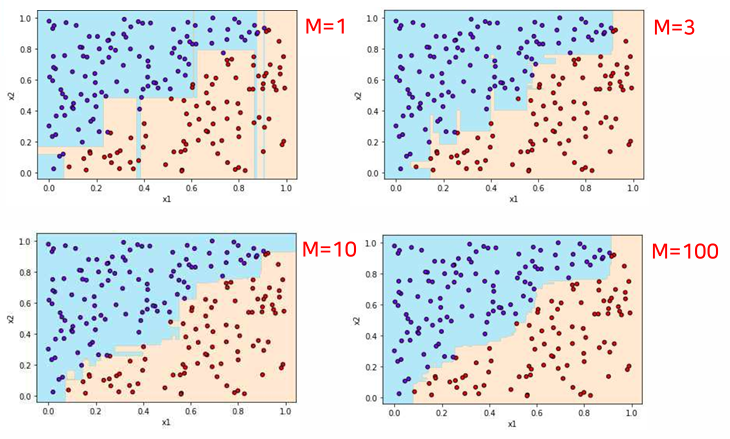
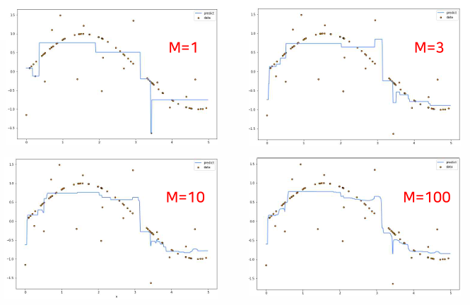

{:toc .large-only}

## 결정트리

- 주어진 문제에 관해 결정을 내리는 함수를 트리 형태로 구성
- 분류 문제를 위해 개발되었으나 회귀 문제에도 적용되도록 확장되어 최근에는 CART(Classification And Regression Trees)라는 이름으로 불리기도 한다.
- 학습을 통해 얻어지는 트리 구조에 데이터의 각 입력 요소의 역할이 잘 표현되어 있어 결과에 대한 설명력이 뛰어남
- 복잡한 함수를 표현할 때 데이터의 노이즈에 민감한 과다적합 문제를 해결하기 위한 랜덤 포레스트 방법이 있다.
- 개발자가 직접 규칙을 정의하여 트리로 표현하는 것이 아니라, 데이터를 이용하여 자동으로 트리를 생성함

### 속성 선택을 위한 평가 기준

- 지니 불순도 I(N)
  - 각 노드에 할당된 클래스 레이블이 얼마나 다른지 그 혼합 정도를 측정하는 값
- 지니 평가지수 G()
  - 속성 a를 갖는 부모 노드 에서 자식 노드들의 지니 불순도의 가중합
- 루트 노드에서부터 지니 평가지수를 최소화하는 속성 노드를 선택하여 레벨을 확장하는 과정을 반복한다.

### 속성 노드 선택을 위한 다양한 평가지수

- 정보 이득
  - 데이터 집합의 분할 전 후의 엔트로피(데이터 혼잡도) 차이
- 분산 감소량
  - 모든 노드에 대한 분산의 가중 평균
- Chi-square
  - 부모 노드와 하위 노드 간 차이의 통계적 유의성을 활용

### 결정 트리를 이용한 분류

- 계단 형태의 결정 경계가 얻어짐 (실제 결정경계와 차이가 있음)
- 트리의 깊이를 늘리는 것만으로는 한계가 있음

### 회귀를 위한 결정 트리

- 속성과 속성값은 분류로 얻어진 결정 트리와 같다.
- 회귀의 출력값은 해당 영역의 목표값을 가장 잘 근사하는 실수값이 되어야 한다.

## 랜덤 포레스트

- 결정 트리의 과다적합 문제에 대한 해결책
- 결정 트리와 앙상블 학습 기법을 결합한 방법
- 배깅 방법으로 데이터를 리샘플링하여 M개의 결정 트리를 학습하고 결합하는 방법
  - 결합 방법: 주로 보팅법(분류), 출력값의 평균(회귀)
- 간단한 학습기의 결합으로 복잡한 함수 표현 및 일반화 성능 향상
- 높은 설명 능력, 빠른 학습

### 랜덤 포레스트를 이용한 분류

- M은 결정트리의 갯수

### 랜덤 포레스트를 이용한 회귀

