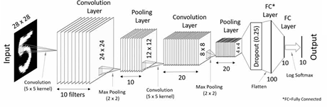
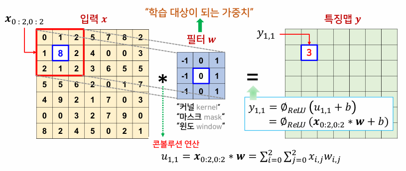
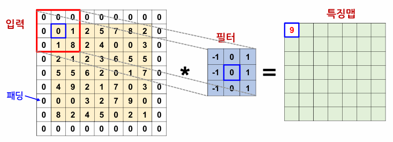
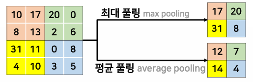
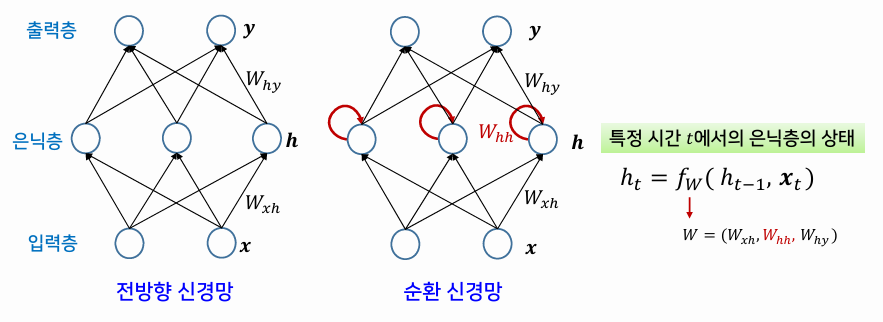
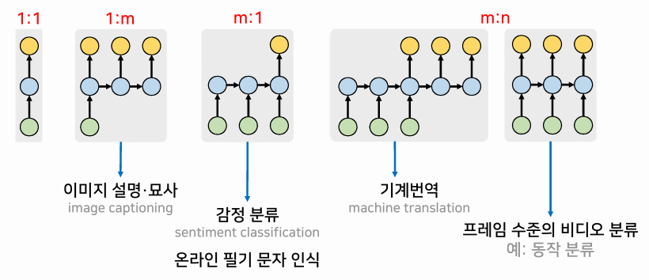
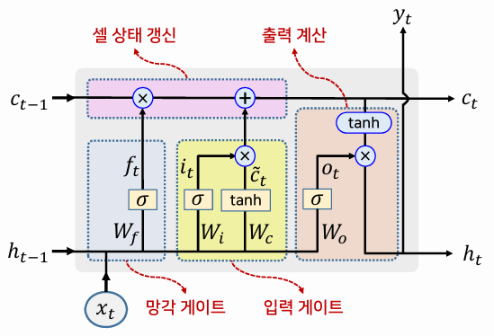
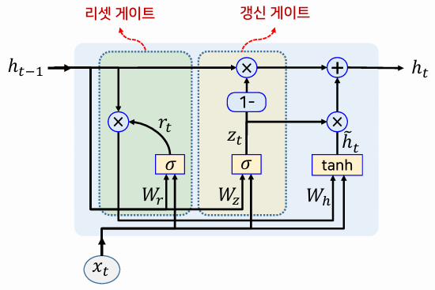

{:toc .large-only}

## 딥러닝

- 심층 신경망 기반의 머신러닝 분야
- 심층 신경망은 효율적인 표현은 가능하지만, 학습이 느려지고 낮은 일반화 성능 등의 학습의 어려움이 존재
- 이러한 학습의 어려움을 극복하게 만든 요인
  - 충분히 큰 학습 데이터 집합
  - 높은 컴퓨팅 파워와 GPU를 활용하는 기술
  - 다양한 학습 기법 개발
  - 더 정교한 모델의 등장

## 학습 성능 향상을 위한 기법

### 기울기 강하 학습법 문제

- 오차가 충분히 작지 않은 지역 극소에서 학습이 멈춤

#### 해결 방법

- **시뮬레이티드 어닐링**(담금질) 방법으로 학습률을 처음에는 크게 설정하고 점차적으로 줄여감
- 한 번에 하나의 샘플만 사용해서 학습을 진행하는 **확률적 기울기 강하** 학습법 사용

### 느린 학습 문제

- 플라토 문제: 기울기 강하 학습법의 오차함수의 학습곡선에서 평평한 구간을 의미
- 기울기 소멸 문제: 활성화 함수의 기울기가 작아져서 발생

#### 해결 방법

- 활성화 함수의 변화
  - 시그모이드 함수, 하이퍼탄젠트 함수 대신 기울기가 줄어들지 않는 함수(ReLu 등) 사용
- 가중치 초기화
  - 셀 포화가 일어나지 않도록 작은 값이면서 각 뉴런의 가중치가 서로 달라지도록 랜덤하게 설정
- 모멘텀
  - 기울기 수정식의 파라미터 변화량에 이전의 움직임(관성)을 반영하여 학습 속도의 저하를 방지하거나 학습의 불안정성을 감소시킴
- 적응적 학습률
  - 가중치마다 서로 다른 학습률을 갖고, 가중치가 변화된 크기의 누적합을 활용하여 변화폭에 따라 학습률을 적응적으로 결정하는 방법
  - RMSProp, AdaDelta, Adam 등
- 배치 정규화
  - 학습하는 동안 각 노드의 활성화 함수로 들어가는 데이터 배치에 대한 입려깅 셀 포화를 방해하지 않는 범위 내에 존재하도록 정규화시키는 방법
- 2차 미분 방법
  - 기울기 수정식에서 기울기의 변화량을 결정할 때 오차함수의 2차 미분인 곡률 정보를 함께 사용하는 방법
  - 계산 시간이 길어 실질적 사용에 한계

### 과다 적합 문제

- 학습 데이터에 포함된 노이즈까지 학습하게 되어 테스트 데이터에 대해 정확도가 떨어지는 현상
- 신경망의 복잡도가 높을수록 발생할 가능성이 높아짐

#### 해결 방법

- 조기 종료
  - 검증용 데이터 집합을 활용하여 과다적합 발생 전에 학습 종료 시점을 결정
- 정규항
  - 오차함수에 정규항을 구차하여 가중치가 지나치게 커지는 것을 방지
- 드롭아웃
  - 학습에서 가중치를 수정할 때 임의로 선택한 은닉 노드의 일부를 제외
- 데이터 증대
  - 원래 데이터에 대해 데이터 변형(노이즈 추가, 크기 조정 등)을 가하여 추가적인 데이터 생성

## CNN(합성곱 신경망)

- 인간의 시각 피질에 존재하는 신경세포들의 정보처리 기제로부터 영감을 받음
- 영상 데이터처럼 격자 구조를 가진 데이터에 적합하도록 개발된 모델
- 최근 딥러닝 응용에서 가장 많이 사용되는 심층 신경망의 형태

- 신경세포
  - 입력층과 출력층을 제외하고 콘볼루션, 서브샘플링(풀링), 완전 연결 3가지 유형의 세포들이 층을 구성
- 네트워크 구조
  - 층상 구조
  - 입력층은 2D 격자 구조x채널의 개수로 구성
  - 콘볼루션층과 풀링층은 2차원 특징맵x필터의 개수
  - **부분적인 연결** 및 **가중치 공유**를 통해 파라미터의 개수를 감소시켜 신경망의 복잡도를 낮춤
  - 완결 연결층 MLP(다층 퍼셉트론) 구조
- 학습 알고리즘
  - 오류 역전파 알고리즘

### 콘볼루션층

- 주어진 2D 입력에 대해 콘볼루션 연산을 반복적으로 수행
- 콘볼루션 연산: 해당 위치의 요소에 필터(가중치)를 곱해서 모두 더하는 선형 연산
- 모든 노드에는 동일한 필터(가중치)가 적용되는데, 이를 가중치 공유라고 함

#### 패딩

- 입력 데이터의 가장자리를 0으로 채워 데이터의 가장자리에 대해서도 콘볼루션 연산을 동일하게 적용

#### 보폭

- 필터를 움직이는 간격
- 출력 특징맵의 크기 조정 가능

### 풀링층

- 보통 콘볼루션층을 수행한 다음에 거치는 층으로 서브샘플링이라고도 함
- 특징맵의 크기를 작게 만듦으로써 계산 속도를 높이고 정보를 추상화
- 필터 내의 값들에 대해 최대값 또는 평균값을 구하는 연산
- 연산 전후의 특징맵 수는 변하지 않고 그대로 유지

## RNN(순환 신경망)

- 시간에 따라 순차적으로 제공되는 순차 데이터를 다루기 위한 모델
- RNN을 확장한 다층 RNN, 양방향 RNN 구조가 있음
- 응용 목적에 따라 입력 요소와 출력 요소의 대응 관계가 달라짐
  - 1:m은 이미지 캡셔닝
  - m:1은 감정 분류, 온라인 필기 문자 인식 등
  - m:n은 기계번역, 프레임 수준의 비디오 등

### RNN의 학습

- 사전 역전파(BPTT) 학습 알고리즘을 사용하는 지도학습
- 기울기 소멸 문제 또는 기울기 폭발 문제를 해결하기 위해 LSTM, GRU와 같은 셀이 등장

### LSTM과 GRU

#### LSTM

- 시간의 흐름과 무관하게 셀의 정보를 원하는 만큼 기억할 수 있도록 고안된 순환 신경망 셀
- 여러 종류의 메모리 게이트를 통해 입력과 계산 결과를 선별적으로 허용하여 각 입력값이 영향을 미칠 수 있는 범위를 확장시켜 장기의존성 문제를 해결함
- 메모리와 출력을 제어하기 위해 3개의 게이트 사용
  - 망각 게이트: 셀 상태의 정보를 얼마나 잊어버릴지 결정
  - 입력 게이트: 셀이 출력할 후보의 값(또는 셀 상태에 추가될 새로운 정보)을 얼만큼 전달할지를 결정
  - 출력 게이트: 현재 셀 상태의 중요도를 반영하여 출력의 크기를 결정

#### GRU

- Gated Recurrent Unit(게이트 순환 유닛)
- LSTM 셀 구조를 단순하게 개선한 것
  - 2개의 입력, 하나의 출력
- 2개의 게이트 사용
  - 리셋 게이트: 이전의 출력을 얼만큼 받아들일지 조정
  - 갱신 게이트: LSTM 셀의 망각 게이트와 입력 게이트를 합친 것으로, 받아들일 새로운 내용과 이전의 출력 내용의 비율을 조정

