{:toc .large-only}

## 신경망

- 생물학적 신경회로망을 모델링한 수학적 **함수**
- 원하는 입출력 매핑 함수의 형태를 스스로 찾는 학습 능력을 가짐
- 여기서의 신경망은 인공신경망을 의미함
- 인간 뇌의 정보처리 방식을 모델링하는 방법
  - 신경세포
    - 하나의 신경세포가 수행하는 기능을 수학적 함수로 정의
  - 신경망 구조
    - 신경세포들이 서로 정보를 전달하는 연결 구조
  - 학습 알고리즘
    - 신경세포들 간의 연결 강도를 조정하는 방법
- 활성화 함수를 적절히 정의해 줌으로써 원하는 특성을 가진 신경망 모델을 개발할 수 있다.

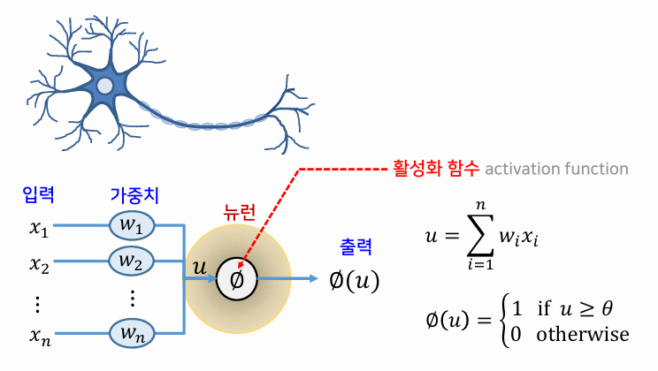

### 활성화 함수

- 하나의 뉴런의 특성을 결정하는 역할

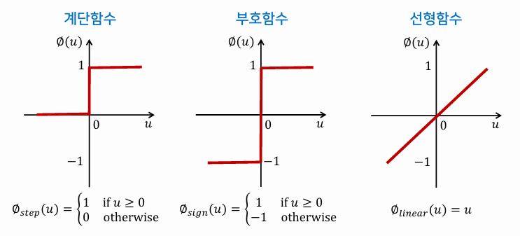

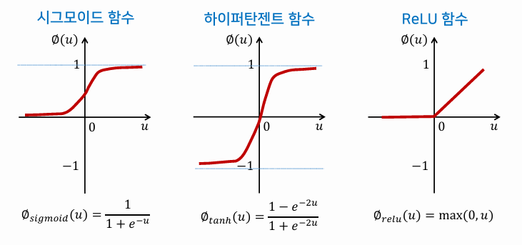

### 신경망의 연결 구조

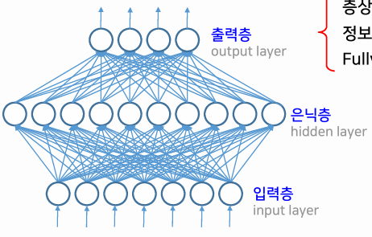

- 층상 구조
- 입력층 → 출력층으로 정보가 흐름
- Fully connected network(완전 연결된 네트워크)라고도 함
- 은닉층이 존재하지 않으면 단층 신경망, 존재하면 다층 신경망
- 정보 흐름이 입력층 → 출력층 한 방향으로만 흐르면 전방향 신경망, 입력층으로 되돌아가면 회귀 신경망

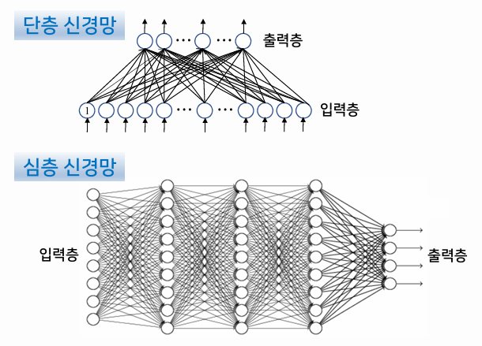

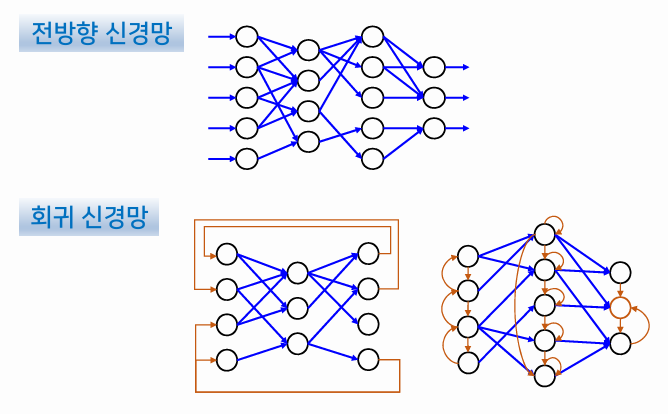

### 신경망의 학습

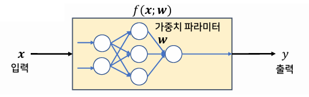

- 신경망에 어떤 입력 x가 주어졌을 때, 출력 y가 원하는 값이 되도록 가중치 w를 조정하여 함수 f를 찾는 과정
- 가중치 조정식: 

## 다층 퍼셉트론

### M-P 뉴런

- 단일 신경세포에 대한 첫 번째 모델

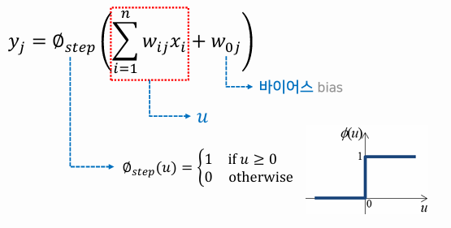

### 퍼셉트론

- M-P 뉴런을 여러 개 결합하여 네트워크 형태를 갖춘 신경망
- 패턴인식을 수행하는 최초의 신경망
- 단층 전방향 완전 연결 신경망
- 선형 활성화 함수 사용
- XOR 문제를 해결하기 불가능함

### 다층 퍼셉트론

- MLP(Multi-Layer Perceptron)
- 1개 이상의 은닉층을 가짐
- 은닉 뉴런에는 비선형 활성화 함수 사용 (시그모이드, 하이퍼탄젠트)
- 출력 뉴런에는 선형 활성화 함수를 사용하기도 함
- 다층 전방향 완전 연결 신경망
- 가중치에 따라 매우 다양한 형태의 함수가 표현될 수 있다.
- 복잡한 비선형 결정경계를 가진 분류 문제도 해결 가능

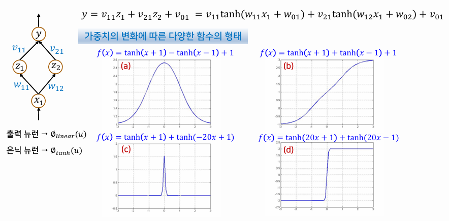

### 다층 퍼셉트론의 학습

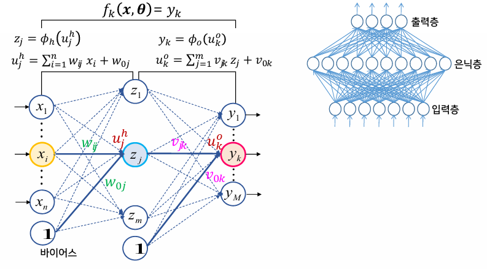

- 입력 x에 대한 출력 y와 목표 출력 t의 차이를 최소화 하는 것이 목표
- 이러한 출력값의 차이를 구하는 오차 함수로 평균 제곱 오차 E(X,θ) 사용
- 오차함수 E(X,θ)를 최소화하는 최적의 가중치 θ를 찾아야 함

### 오차 함수의 일반적 형태

- 오차함수는 매우 복잡한 형태의 비선형함수
- 기울기 강하 학습법을 통해 비선형함수의 최소값을 찾을 수 있다.
- 기울기 강하 학습법을 다층 퍼셉트론에 적용한 것이 **오류 역전파 학습 알고리즘**이다.
  - 출력 뉴런의 오차가 은닉 뉴런에 거꾸로 전파되어 오는 형태

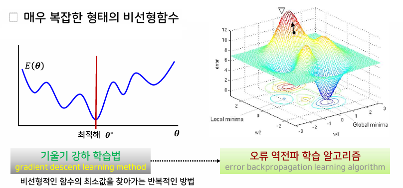

### 다층 퍼셉트론 학습의 고려사항

#### 지역 극소의 문제

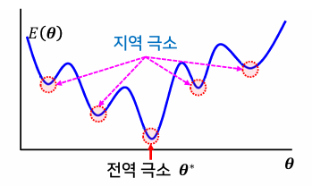

- 최적해(전역 극소)에 도달하지 못하고 지역 극소에서 움직이지 못하는 것
- 학습률을 적응적으로 조정하거나, 지역 극소로부터 빠져나올 수 있게 하는 시뮬레이티드 어닐링 기법 등으로 해결
- 현실적인 해결책으로는 탐색의 시작점을 결정하는 초기치를 변화시키면서 여러 번 학습을 시도하거나, 충분히 많은 수의 은닉 노드를 사용하는 방법이 있다.

#### 수렴 속도의 문제

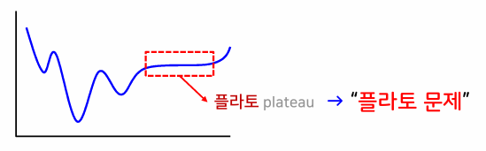

- 원하는 해에 수렴하기까지 긴 학습 시간이 필요함 (플라토 문제)
- 해결 방법으로 모멘텀 방법, 뉴턴 방법, 자연 기울기 방법 등이 있다.

#### 학습 종료점의 문제

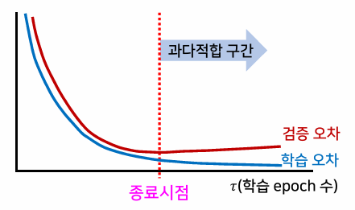

- 과다적합을 피할 수 있는 적절한 학습 종료 시점의 결정이 필요
- 해결 방법으로 검증 데이터 집합을 따로 두어, 학습이 진행되는 과정에서 검증 집합에 대한 검증 오차도 함께 계산해 볼 수 있다.

#### 은닉 뉴런의 수

- 실제 문제에서 학습의 속도와 찾아지는 해의 성능을 좌우함
- 입력 데이터 차원과 데이터의 개수 등을 고려하여 조정하는 것이 좋다.

### 다층 퍼셉트론의 학습 전략

#### 학습 모드의 설정

- 온라인 모드
  - 각 데이터에 대해 가중치 수정
  - 오차 감소 속도는 빠르나 학습이 불안정
- 배치 모드
  - 모든 데이터에 대해 전방향 계산 후 오차를 모두 더하여 가중치 수정
  - 오차 감소 속도는 느리나 학습이 안정적
- 미니 배치 모드
  - 모든 데이터를 작은 부분집합으로 나누어 가중치 수정
  - 데이터 규모가 큰 경우에 적합

#### 모델 설정

- 은닉 노드의 수
  - 많을수록 표현 가능한 함수가 다양하고 복잡해짐
  - 계산 비용과 일반화 성능을 고려해서 문제에 맞게 적절히 결정
- 초기 조건 설정
  - 초기 가중치는 작은 범위의 실수값으로 랜덤하게 설정
  - 학습률은 1보다 작은 값에서 시작하여 진행 상황에 따라 조정
- 활성화 함수
  - 은닉 노드는 비선형함수(시그모이드 함수, 하이퍼탄젠트 함수, ReLU 함수) 사용
  - 출력 노드는 목표 출력값이 임의의 실수값인 회귀 문제에서는 선형함수를, 클래스 레이블인 분류 문제에서는 비선형함수 사용
- 오차 함수
  - 제곱 오차함수: 목표 출력값이 연속한 실수값을 갖는 회귀 문제에 적합
  - 교차엔트로피 오차함수: 목표 출력값이 1 또는 0의 값을 갖는 분류 문제에 적합
