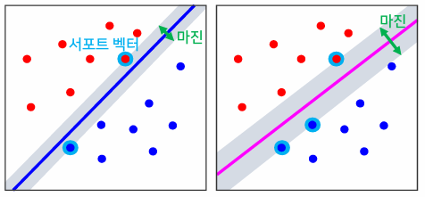
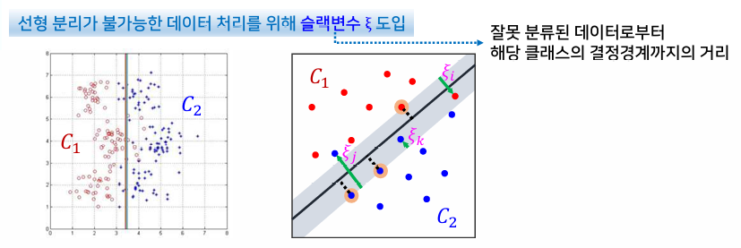

{:toc .large-only}

## 선형 분류기

- 선형 판별함수를 기반으로 분류를 수행하는 학습 시스템
- 분류 시스템의 복잡도가 가장 낮으며, 성능도 좋지 못함
- But, 과다적합의 발생을 피할 수 있음

## SVM 분류기

- **서포트 벡터 머신**(Support Vector Machine: SVM), **최대 마진 분류기** 라고도 함
- 서포트 벡터: 결정경계에 가장 가까운 곳에 위치한 데이터
- 마진: 서포트 벡터로부터 결정경계까지의 거리
- 마진을 이용하여 결정경계를 찾는 목적함수를 정의한다.
- 일반화 오차를 줄이기 위해 클래스 간격과 마진을 최대로 하는 결정경계를 찾는 것이 바람직하다.

### SVM 분류기의 학습

1. 학습 데이터를 이용하여 파라미터 추정을 위한 목적함수 Q(α)를 정의함
2. 주어진 조건을 만족하면서 Q(α)를 최소화하는 라그랑주 승수의 추정치를 이차계획법에 의해 찾음
3. 라그랑주 승수의 추정치가 0이 되지 않는 서포트 벡터를 찾아 집합을 생성함
4. 라그랑주 승수의 추정치와 서포트 벡터를 이용하여 wo의 추정치를 계산함
5. 서포트 벡터 집합과 파라미터 벡터, 그리고 wo의 추정치를 저장해 둠

### SVM 분류기의 분류

- SVM은 이진 분류기이므로, 다중 클래스 분류 문제는 1대 나머지 방법 또는 1대1 방법을 적용해서 해결함
- 1대 나머지 방법
  - 가장 보편적인 방법으로 k개의 SVM 분류기 사용
  - 결정영역이 모호함, 데이터 집합의 크기가 불균형적
- 1대 1 방법
  - 가능한 모든 클래스의 쌍에 대해 서로 다른 SVM과 보팅
  - 결정영역이 모호함, 학습과 테스트에 계산 비용이 많이 소요됨

### 슬랙변수

- 잘못 분류된 데이터로부터 해당 클래스의 결정경계까지의 거리
- 데이터가 해당 클래스의 결정경계를 넘어서 다른 클래스 영역에 존재할 수 있도록 허용함으로써 선형 분리가 불가능한 문제에 어느 정도 대처가 가능
- 슬랙변수 값이 클수록 더 심한 오분류를 허용

## 커널법

- 비선형 분류 문제를 보다 적극적으로 해결하기 위한 방법
- 고차원 매핑을 통해 비선형 문제를 선형화하여 해결하면서 커널 함수를 통해 계산량 증가의 문제를 해결하는 방법

### 커널 함수

n차원의 입력 데이터 x를 m차원의 특징 데이터 Φ(x)로 매핑시킨 후 이를 SVM을 이용하여 분류하는 경우, 고차원 매핑 Φ(x)와 Φ(y)를 직접적으로 정의하는 대신에 두 벡터의 내적 Φ(x)⋅Φ(y)를 하나의 함수 **k(x,y)**로 정의하여 사용

- 대표적인 커널 함수
  - 선형 커널
  - 다항식 커널
  - 시그모이드 커널
  - 가우시안 커널
