## 인공 신경망(Artificial neural networks)이란?

인간과 동물의 두뇌를 구성하는 생물학적 신경 시스템의 원리를 바탕으로 설계된 계산 시스템

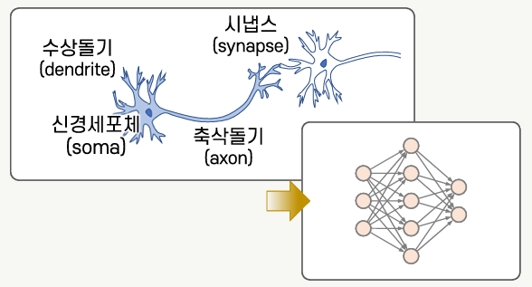

- 많은 수의 층으로 구성할수록(=심층 신경망) 더욱 높은 차원의 표현이 가능함
- 딥러닝: 심층 신경망을 학습하기 위해 활용되는 머신러닝 알고리즘

## 신경망의 기본 구조

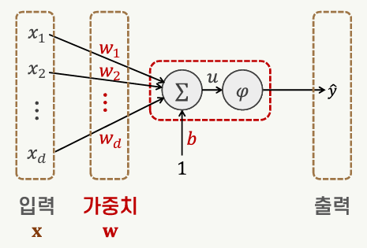

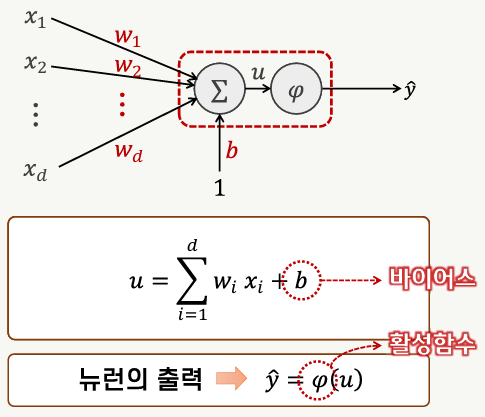

- 활성함수(activation function)
  - 일반적으로 **비선형** 특성을 갖는 함수를 사용함
  - u의 값이 0보다 작으면 출력을 억제하고 0보다 크면 출력을 내도록 설계함
- 바이어스(bias)
  - 뉴런이 활성화되는 레벨을 조정함

### 활성홤수의 종류

#### 계단 함수

- 단위 계단 함수
- 정의역을 유한한 개수의 구간으로 나누어서 각 구간에서 상수인 함수

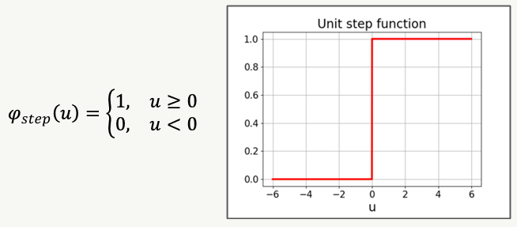

#### 시그모이드 함수

- S자 형태의 곡선 함수
- 로지스틱 함수(logistic), 쌍곡탄젠트(tanh), 오차 함수(erf) 등

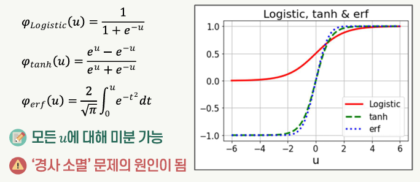

#### ReLU

- 심층망에서 경사 소멸 문제를 개선하기 위해 시그모이드 대안으로 활용되는 활성함수

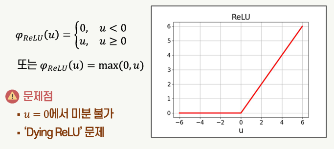

#### ReLU의 변형

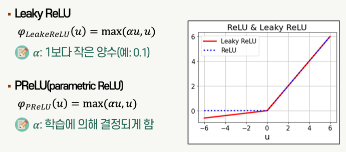

## 단층 피드포워드 신경망

### 피드포워드 신경망

입력층에서 출력층 방향으로 뉴런 층의 연결이 이루어지는 구조

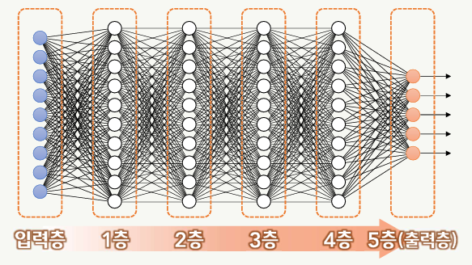

### 단층 퍼셉트론

하나의 층으로 구성된 가장 기본적인 피드포워드 신경망 구조

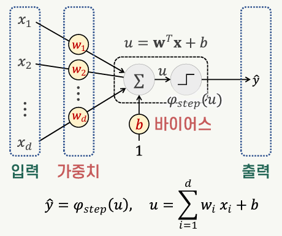

- 지도학습 방식으로 학습: 학습표본 (x, y)의 집합
  - x: 입력
  - y: 레이블
- 학습 대상 파라미터
  - x: 입력이 뉴런에 전달되는 연결의 가중치
  - b: 바이어스

### 퍼셉트론의 학습

1. 파라미터(w와 b) 초기화: 작은 크기의 랜덤 값으로 초기화함
1. 모든 학습표본을 대상으로 파라미터 업데이트 반복
   1. t번 반복 업데이트된 w(t)와 b(t)를 이용하여 k번째 학습표본 x(k)에 대한 출력 y^(k)를 예측함 
      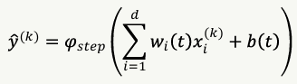
   1. 오차와 입력의 곱에 비례하여 w와 b를 업데이트함 
      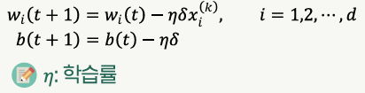
