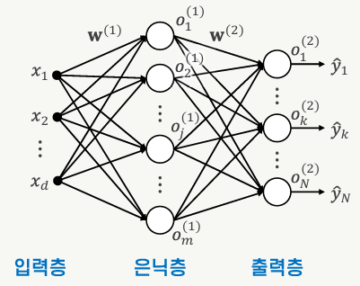
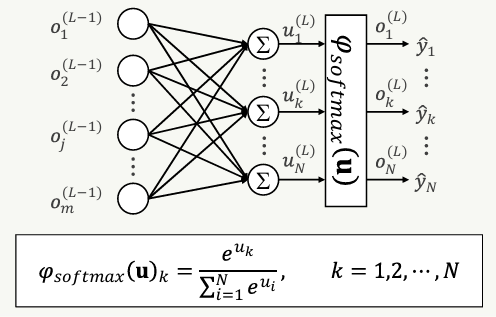
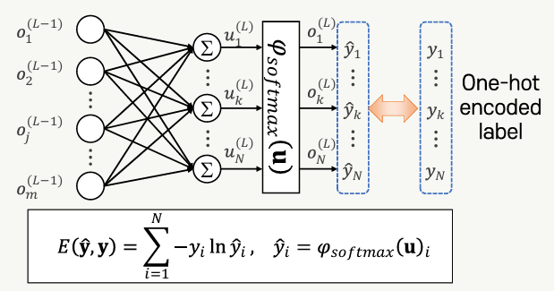

## 단층 퍼셉트론의 한계

- 선형함수로 표현되는 결정경계로 국한되는 학습 능력
- 배타적 논리합(XOR) 문제를 해결하지 못함
- 다층 퍼셉트론을 이용하면 다양한 경계의 표현이 가능함

### 다층 퍼셉트론

- 입력층과 출력층 사이에 1개 이상의 층이 있는 피드포워드 신경망
- 은닉층(hidden layer)
  - 입력층과 출력증 사이에 배치된 층
  - 직접적인 레이블이 제공되지 않음
- 손실함수(loss function)
  - 모델의 출력이 목표 출력을 얼마나 잘 예측하고 있는지 평가하기 위해 정의된 함수
  - = 비용함수(cost function)
- 역전파(backpropagation)
  - 다층 피드포워드 신경망의 훈련에 사용되는 알고리즘
  - 가중치에 대한 손실함수의 편미분을 체인 룰에 따라 계산하여 가중치를 업데이트하는 과정을 출력층으로부터 이전 층으로 역순으로 반복하여 진행함

### 역전파

- 1974년 Paul Werbos, 1986년 David Rumelhart 등이 발표한 다층 피드포워드 신경망의 학습 알고리즘
- 지도학습 방식
- 미분 가능한 활성함수를 사용
  - Rumelhart의 본문에서는 뉴런의 활성함수로 시그모이드 함수 사용
  - 모든 u에 대해 미분을 구할 수 있음

### 역전파 알고리즘

- 출력층에서 입력층 방향으로 역방향 진행
- 체인 룰에 따라 각 층의 학습 대상 파라미터(가중치, 바이어스)에 대한 손실함수의 편미분을 구한 후 이를 학습률에 따라 반영하여 가중치를 업데이트
- 경사 하강법을 이용한 최적화

### 모멘텀을 이용한 학습

- w의 변화량을 속도(velocity)라는 개념으로 봄
- 모멘텀의 비율로 이전 시점의 속도(w의 변화량)를 w의 업데이트에 반영함
- 변화의 방향이 급격히 변화하는 것을 완화함으로써 경사 하강법을 개선할 수 있다.

## 다중 클래스 분류를 위한 다층 퍼셉트론 학습

### 소프트맥스(softmax)

- 3개 이상의 다중 클래스 분류 문제에서 출력층의 활성함수로 적합한 함수
- 출력층이 클래스 집합의 확률분포를 나타내는 값을 출력함
- 각각의 출력은 0과 1 사이의 값을 갖고, 모든 출력의 합은 1이다.

### 교차 엔트로피(cross entropy)

- 추정된 확률분포와 레이블에 해당되는 확률분포의 차이를 측정하는데 적합한 손실함수

