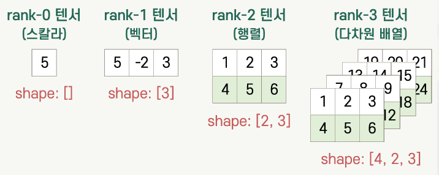
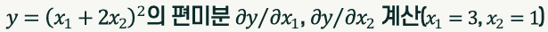
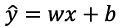
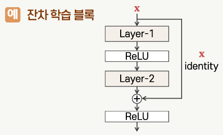

## 딥러닝 프레임워크

- 딥러닝을 위해 설계된 라이브러리, 기본적인 데이터 집합, 미리 구성된 네트워크 및 기타 유용한 도구를 제공하는 소프트웨어
- 텐서플로(TensorFlow), 파이토치(PyTorch), 카페(Caffe), MXNet 등
- 주요 기능:
  - 자동 미분
  - 기본적인 신경망 구성 요소
  - 손실함수 및 최적화 도구
  - 계산 자원 활용
  - 모델의 저장 및 로드

## 텐서플로

- 2015년에 구글 브레인 팀에서 구글 내부의 연구 및 제품 개발을 위해 만든 심층 신경망을 위한 오픈소스 딥러닝 프레임워크
- 2019년 9월에 텐서플로 2.0을 발표함
- 라이선스: 아파치 라이선스 2.0
- 파이썬 언어를 위한 API 제공
  - C++, Java 등의 언어를 위한 API도 제공함
- 텐서플로 2.0부터 Keras라는 고수준 신경망 API를 통합

### 텐서플로 실행 모드

#### 지연 실행(lazy execution) 모드

- 텐서플로 1.x 버전의 실행 모드
- 정적 계산 그래프 형태로 모델을 구성
- 세션 생성 후 데이터를 전달하여 계산을 실행

```python
import tensorflow.compat.v1 as tf
tf.disable_v2_behavior()

# 계산 그래프 정의
a = tf.placeholder(tf.float32)
b = tf.placeholder(tf.float32)
c = a + b
print('c =', c) # c = Tensor("add:0", dtype=float32)
# 값이 계산되지 않은 Tensor가 출력됨
```

#### 즉시 실행(eager execution) 모드

- 텐서플로 2.0 버전부터 도입된 실행 모드
- 일반 파이썬 코드처럼 호출 즉시 계산함
- 장점
  - 지연 실행 모드에 비해 직관적인 코드
  - 모델의 테스트가 용이
- 단점
  - 프로그램 실행이 느림
  - 속도를 개선하기 위해 그래프 모드 활용

#### 그래프 실행 모드

- 텐서플로 그래프를 실행하는 방식
  - `tf.Graph`: 데이터 흐름 형태로 표현되는 계산 구조
- 컴파일러 최적화로 빠른 계산 가능
- 병렬 처리 활용
- 파이썬 인터프리터가 없는 장치에서도 사용 가능
- `tf.function`: 즉시 실행 모드의 함수를 그래프 모드로 변환gkdu tlfgod
- `@tf.function`: 그래프 실행 모드로 사용하려는 함수 앞에 `@tf.function` 수식어 사용
- 변환된 함수는 동일한 형태의 입력에 대해서는 첫 호출 시 그래프로 변환 후 실행되고, 그 이후에는 이미 변환된 그래프를 실행

```python
train_step_graph = tf.function(train_step)
for i in range(epochs):
  for k in range(len(y)):
    train_step_graph(x[k], y[k])
```

```python
@tf.function
def train_step(x, y):
  ...
```

## 텐서

- 동일 자료형의 데이터를 저장하는 다차원 배열
- numpy의 배열과 유사한 형태로 데이터를 저장하는 객체



- 상수 텐서
  - 값을 수정할 수 없는 텐서
  - `tf.constant` 함수를 사용하여 만듦
- 변수 텐서
  - 값을 수정할 수 있는 텐서
  - `tf.Variable` 클래스의 인스턴스를 생성
  - 변수 텐서에 다른 값을 저장할 때는 `assign`, `assign_add`, `assign_sub` 메소드를 사용

```python
 a = tf.constant(10.)
 b = tf.constant([1, 2, 3, 4])
 c = tf.constant([[[1, 2], [3, 4], [5, 6]],
                  [[7, 8], [9, 10], [11, 12]],
                  [[13, 14], [15, 16], [17, 18]],
                  [[19, 20], [21, 22], [23, 24]]], dtype=tf.float32)
 print('a: dtype =', a.dtype, '\n', a)
 print('b: shape =', b.shape, '\n', b)
 print('c: device =', c.device)
```

```python
 x = tf.Variable(10.)
 y = tf.Variable([1, 2, 3, 4])
 z = np.array([[1., 3.], [2., 4.], [3., 5.]], dtype=np.float32)
 print('x: dtype =', x.dtype, '\n', a)
 print('y: shape =', y.shape, '\n', b)
 print('z: device =', z.device)

 x.assign_add(20.)
 print('x = ', x.numpy())
```

### 텐서플로에서 텐서의 활용

- 입력 데이터 정의
- 모델 파라미터 정의: 가중치, 바이어스 등
- 계산 수행
  - 행렬 곱셈, 합성곱 및 활성함수와 같은 수학적 연산에 활용
  - 텐서에 대한 다양한 연산 제공
- 중간 결과 저장
  - 모델 계산 중에 중간 결과를 저장하는 데 사용
- 손실함수 정의

## 자동 미분

### tf.GradientTape API를 이용한 자동 미분

- `tf.GradientTape` 문맥 생성
- 정방향 진행의 연산을 테이프에 기록
  - 테이프의 `watch` 메소드로 추적할 텐서를 지정
  - 변수 텐서(trainable 속성의 디폴트 값이 True임)는 기본적으로 추적 대상이므로 별도로 추적 대상으로 지정할 필요 없음
- 테이프를 되감기하며 미분 계산
  - `tf.GradientTape`의 `gradient` 메소드 사용



```python
import tensorflow as tf

x1 = tf.Variable(3.)
x2 = tf.Variable(1., trainable=False)
with tf.GradientTape() as t:
  t.watch(x2)
  y = (x1 + 2 * x2) ** 2
dy_dx = t.gradient(y, [x1, x2])
print(f'dy/dx1 = {dy_dx[0]}') # dy/dx1 = 10.0
print(f'dy/dx2 = {dy_dx[1]}') # dy/dx2 = 20.0
```

### 자동 미분을 이용한 선형 회귀 학습

- 선형 회귀 문제:
  - 
  - x는 독립변수, y는 종속변수
  - 학습표본 집합을 바탕으로 w와 b를 학습하여 결과를 구함
  - 손실 함수: 오차 제곱
  - 경사 하강법을 이용한 w와 b의 학습

```python
# 학습표본 집합 및 가중치와 바이어스 등 정의
x = tf.constant([1., 3., 5., 7.])
y = tf.constant([2., 3., 4., 5.])
w = tf.Variable(1.)
b = tf.Variable(0.5)
learning_rate = 0.01
epochs = 1000

# 학습 단계의 처리 함수 정의
def train_step(x, y):
  with tf.GradientType() as t:
    y_hat = w * x + b
    loss = (y_hat - y) ** 2
  grads = t.gradient(loss, [w, b])
  w.assign_sub(learning_rate * grads[0])
  b.assign_sub(learning_rate * grads[1])

# 학습표본 집합에 대한 반복 학습
for i in range(epochs):
  for k in range(len(y)):
    train_step(x[k], y[k])

print('w: {:8.5f}   b: {:8.5f}'.format(w.numpy(), b.numpy()))
# w: 0.50000   b: 1.50000

# 학습된 파라미터를 이용한 모델 실행
f = 'x:{:8.5f} -->  y:{:8.5f}'
for k in range(len(y)):
  y_hat = w * x[k] + b
  print(f.format(x[k].numpy(), y_hat.numpy()))
# x: 1.00000 --> y: 2.00000
# x: 3.00000 --> y: 3.00000
# x: 5.00000 --> y: 4.00000
# x: 7.00000 --> y: 5.00000
```

## Keras를 이용한 모델 구현

### Keras의 개요

- 신경망 구현을 위한 고수준 오픈소스 라이브러리
- 2.4 버전부터는 텐서플로만 지원
- 텐서플로의 `tf.keras` 모듈에 제공됨
- 여러 가지 신경망 층, 활성함수, 손실함수, 최적화기 등을 제공

### Keras를 이용한 신경망 모델 구성

- `tf.keras.Sequential` 클래스를 이용한 순차적으로 연결된 모델 구성
  - `tf.keras.Sequential(layers=None, name=None)`
    - layers: 모델에 연결할 층의 리스트
    - name: 생성된 모델의 이름
- `tf.keras.layers.InputLayer` 클래스를 이용한 입력층 구성
  - `tf.keras.layers.InputLayer(input_shape=None, name=None)`
    - input_shape: 입력의 형태 지정
    - name: 생성된 입력층의 이름
- `tf.keras.layers.Dense` 클래스를 이용한 완전연결층 구성
  - `tf.keras.layers.Dense(units, activation=None, use_bias=True, kernel_initializer='glorot_uniform', bias_initializer='zeros')`
    - units: 출력의 수(뉴런의 수)
    - activation: 사용할 활성함수
    - use_bias: 바이어스 사용 여부 (default: True)
    - kernel_initializer, bias_initializer: 가중치 및 바이어스의 초기화

```python
# add 메소드 사용
bp_model_tf = keras.Sequential()
bp_model_tf.add(layers.InputLayer(input_shape=(2,))) # 입력층
bp_model_tf.add(layers.Dense(4, activation='sigmoid'))
bp_model_tf.add(layers.Dense(nClasses, activation='softmax')) # 출력층

# 파라미터로 전달
bp_model_tf = keras.Sequential([
  layers.Dense(4, input_shape=(2,) activation='sigmoid'),
  layers.Dense(nClasses, activation='softmax') # 층이 연결되므로 input_shape 지정할 필요X
])
```


### 함수형 API를 이용한 모델 구성

- 다양한 형태의 층과 비순차적 연결이 존재하는 모델 구성에 활용
- 각 층의 출력에 해당되는 텐서를 이어지는 층의 인스턴스에 전달하는 형식으로 그래프 구성



```python
inputs = keras.Input(shape=(nDim,)) # 입력 텐서
h = layers.Dense(4, activation='sigmoid')(inputs) # 은닉층에 inputs 연결
y = layers.Dense(nClasses, activation='softmax')(h) # 출력층에 은닉층의 출력 연결
bp_modal_tf = keras.Modal(inputs, y) # 입력과 출력 전달
```

### 서브클래싱 API를 이용한 모델 구성

- `tf.keras.Model` 클래스의 서브클래스로 목적에 맞게 설계된 모델 클래스를 선언하는 것

```python
class BP_iris(keras.Model):
  def __init__(self):
    super(BP_iris, self).__init__()
    self.h_layer = layers.Dense(4, activation='sigmoid')
    self.o_layer = layers.Dense(nClasses, activation='softmax')

  def call(self, x):
    x = self.h_layer(x)
    return self.o_layer(x)

bp_model_tf = BP_iris()
```

### 모델의 컴파일

- 모델의 훈련을 위한 설정
- `tf.keras.Model.compile(optimizer='rmsprop', loss=None, metrics=None)`
  - optimizer: 최적화기를 지정하는 스트링 또는 최적화기 인스턴스
  - loss: 손실함수를 지정하는 스트링 또는 손실함수 인스턴스
  - metrics: 훈련 및 테스트 과정에서 평가를 위한 척도의 리스트

```python
bp_model_tf.compile(optimizer=optimizers.SGD(0.1, momentum=0.9), loss=losses.SparseCategoricalCrossentropy(), metrics=['accuracy'])
```

### 모델의 훈련

- 지정된 에폭(epoch) 만큼 모델의 훈련을 반복
- `tf.keras.Model.fit(x, y, batch_size, epochs, verbose, validation_split, validation_data, shuffle)`
  - x, y: 입력 데이터와 레이블
  - batch_size: 미니배치 크기 (default: 32)
  - epochs: 전체 x, y에 대한 훈련 반복 횟수
  - verbose: 훈련 진행 정보 출력 방식
  - validation_split: x, y에 제공된 데이터 중 검증용 데이터의 비율
  - validation_data: 검증용 데이터 및 레이블의 튜플
  - shuffle: 데이터 순서를 섞은 후 훈련을 할 것인지 지정 (default: True)
  - 반환 결과: History 객체 (매 에폭에서의 손실 및 평가척도 값(훈련 및 검증)을 담고 있는 객체)

```python
bp_model_tf.fit(X_tr, y_tr, batch_size=15, epochs=1000, verbose=2, validation_data=(X_val, y_val))
```

### 모델을 이용한 예측

- 입력 데이터에 대한 출력을 예측함
- `tf.keras.Model.predict(x, batch_size, verbose)`
  - x: 입력 데이터 집합이 저장된 numpy 배열
  - batch_size: 미니배치 크기 (default: 32)
  - verbose: 훈련 진행 정보 출력 방식
  - 반환 결과: 예측한 출력이 저장된 numpy 배열

```python
y_hat = bp_model_tf.predict(X_val, verbose=0)
y_hat_lbls = np.array([np.argmax(y_hat[k])
                for k in range(len(X_val))])
```
