## 최적화와 경사 하강법

### 최적화 문제

- 목적함수를 최적화하는 파라미터를 결정하는 문제
- 딥러닝에서는 훈련 데이터 집합에 대한 **손실함수를 최소화**하는 것이 곧 최적화 문제

### 볼록 최적화

- 목적 함수가 볼록함수(convex function)이고 해를 찾기 위한 정의역이 볼록집합(convex set)인 최적화 문제

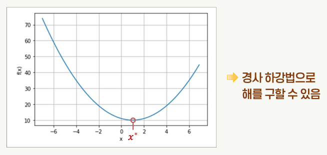

### 경사 하강법

- 초기값 x0으로부터 시작하여 경사를 따라 이동하여 목적함수의 최소값에 해당되는 지점인 x\*에 도달하는 방법
- 목적함수 경사의 음의 방향으로 파라미터 x를 변화시킴

  - 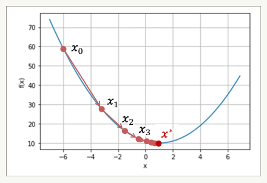

- 목적함수가 볼록함수가 아니라면 지역 최소점, 안장점 등에 의해 최적해를 찾지 못할 가능성이 있다.
- 모든 파라미터에 대한 목적함수의 편미분이 0이지만 전역 최소치에 해당되지 않는 파라미터 값인 경우

  - 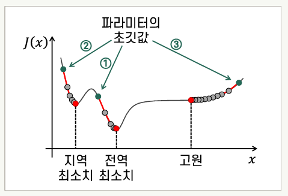

#### 배치 경사 하강법

- Batch Gradient Descent (=배치 GD)
- **모든** 훈련용 표본으로 한 단계의 파라미터 업데이트를 위한 경사를 계산하는 방식
- 1회의 에폭(epoch)에 파라미터가 한 번 업데이트됨
- 한 번의 업데이트에 긴 계산 시간이 소요됨

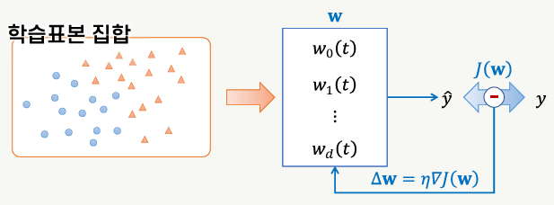

#### 확률적 경사 하강법

- Stochastic Gradient Descent (=SGD)
- 훈련 집합에서 **무작위** 순서로 하나씩 표본에 대한 경사를 계산하여 파라미터 업데이트
- 1회의 에폭(epoch)에 파라미터가 N번 업데이트됨
- 배치 방식에 비해 매우 빠르게 파라미터가 업데이트됨
- 무작위로 표본을 선택하므로 배치 경사 하강법에 비해 파라미터의 변화가 불규칙하게 진행됨
  - 지역 최소치, 안장점 등에서 빠져나올 수 있음
- 극소점 근처에 도달한 상태에서도 파라미터가 계속 변화
  - 최적의 파라미터로 수렴하지 않을 수 있음
  - 에폭이 진행됨에 따라 점차 학습률을 줄이는 **동적 학습률**을 활용할 수 있다.
- 모멘텀을 적용하면 이전 업데이트 양을 일정 비율 반영하여 파라미터를 업데이트

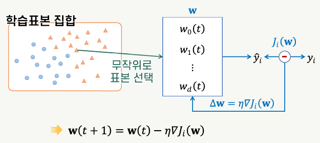
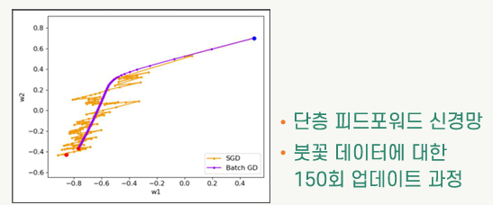

#### 미니배치 확률적 경사 하강법

- mini-batch SGD
- 전체 학습표본 집합을 **미니배치**라고 하는 작은 크기의 부분집합으로 분할하여 모델을 훈련
- 각각의 미니배치는 학습표본 집합에서 무작위로 선택
- 파라미터의 업데이트는 미니배치 단위로 함
- 배치 경사 하강법에 비해 빠르게 파라미터 업데이트 진행
- 확률적 경사 하강법(SGD)에 비해 파라미터 업데이트의 불규칙성이 완화되어 최적값에 가깝게 파라미터 값이 결정될 수 있음
- 훈련을 위한 행렬 연산을 최적화함으로써 계산 성능을 높일 수 있음
  - 특히 GPU를 사용하는 경우 미니배치 단위의 처리를 하면 행렬 연산의 최적화에 유리함
  - 미니배치의 크기가 작은 것이 비해 큰 것이 성능 향상에 유리함

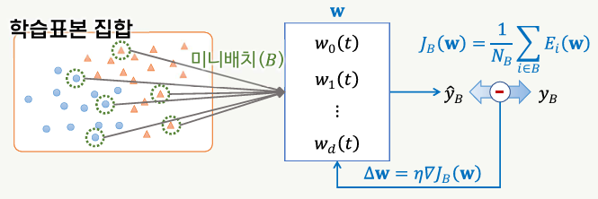
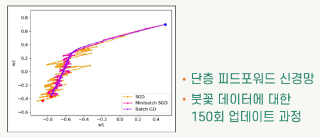

#### 경사 하강법의 구현

```python
# 모델의 컴파일 (확률적 경사 하강법 사용)
bp_model_tf.compile(optimizer=optimizers.SGD(0.1, momentum=0.9),
                    loss=losses.SparseCategoricalCrossentropy(),
                    metrics=['accuracy'])

# 모델의 훈련 (미니배치 크기: 15)
bp_model_tf.fit(X_tr, y_tr, batch_size=15, epochs=1000,
                verbose=2, validation_data=(X_val, y_val))
```

### 동적 학습률

- 학습의 진척에 따라 점차 학습률을 줄이는 방식

#### 계단형 감쇠 스케줄러

- 반복 횟수의 구간을 정하여 각 구간에 정해진 학습률을 적용
- `tf.keras.optimizers.schedules` 모듈의 `PiecewiseConstantDecay` 클래스 인스턴스 활용

```python
boundaries = [700, 900]
values = [0.1, 0.05, 0.01]
lr_fn = optimizers.schedules.PiecewiseConstantDecay(boundaries, values) # 에폭에 따라 학습률 변화
bp_model_tf.compile(optimizer=optimizers.SGD(lr_fn, momentum=0.9),
                    loss=losses.SparseCategoricalCrossentropy(),
                    metrics=['accuracy'])
```

#### 지수함수 감쇠 스케줄러

- 반복 횟수에 따라 초기값으로부터 지수함수 형태로 감쇠함
- `tf.keras.optimizers.schedules` 모듈의 `ExponentialDecay` 클래스 인스턴스 활용

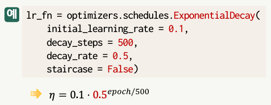

#### 다항식 감쇠 스케줄러

- 반복 횟수의 다항식 함수에 의해 감쇠함
- `tf.keras.optimizers.schedules` 모듈의 `PolynomialDecay` 클래스 인스턴스 활용

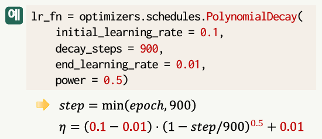

## 심층 신경망의 학습 문제

### 경사 소멸 문제

- 심층망을 학습하는 과정에서 입력층으로 갈수록 경사의 크기가 0에 근접하여 연결 가중치의 업데이트가 진행되지 않는 현상

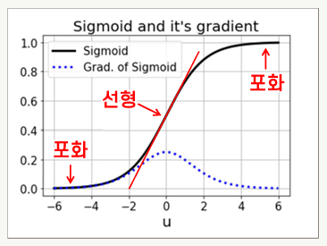

#### 개선 방법

- 활성함수 개선 (ReLU, Leaky ReLU, GELU)
  - 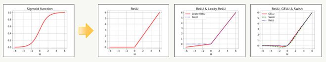
- 스킵 연결
  - 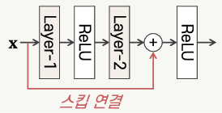
- 가중치의 적절한 초기화
- 배치 정규화: 데이터 집합의 평균과 분산을 조정

### 경사 폭발 문제

- 경사가 점점 더 큰 값을 가져 연결 가중치가 발산하는 상황
- 원인:
  - 부적절한 가중치의 초기값
  - 지나치게 높은 학습률

#### 개선 방법

- 배치 정규화
- 경사 절단
- 규제: 모델의 복잡도가 필요 이상으로 높아지지 않도록 함
- 최적화 알고리즘의 개선 (Adma, RMSprop 등)

### 과적합 문제

- 특정 학습 데이터 집합에 지나치게 의존적으로 학습되는 현상
- 일반화 오류 발생

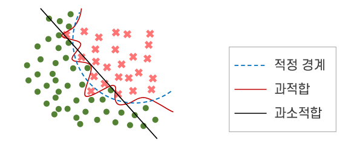
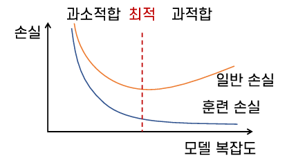

#### 개선 방법

- 드롭아웃: 모델을 학습하는 동안 적절한 확률에 따라 뉴런을 무작위로 선택하여 일시적으로 제거
- 규제: 모델의 복잡도를 낮추어 더 단순한 모델로 만들기 위한 처리 절차
- 데이터 증강 (데이터를 가공하여 늘리는 것)
- 훈련의 조기 종료: 훈련용 집합에 대한 손실은 감소하고 있지만 검증용 집합에 대한 손실이 증가하기 시작하면 조기 종료
  - 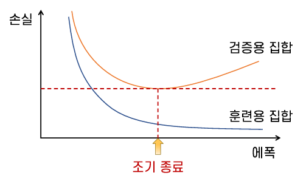

## 가중치의 초기화

### 사전 학습에 의한 가중치 초기화

- Geoffrey Hinton이 연구한 **심층 신뢰망**을 사전 학습하여 연결가중치 초기화 방법
- 랜덤 값이 아닌 적절한 방식으로 연결가중치를 초기화

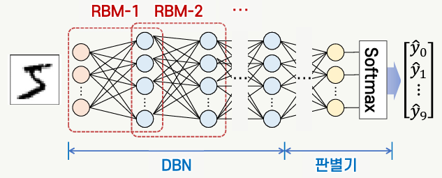

### Glorot 초기화 방법

- Xavier Glorot, Yoshua Bengio에 의해 연구된 방법
- 연결 가중치를 뉴런의 fan-in(한 뉴런에 들어오는 입력의 수)과 fan-out(한 뉴런에서 나가는 출력의 수)에 따라 결정되는 값의 범위에 속하는 랜덤 값으로 초기화
- Keras의 초기화를 위한 모듈인 `initializers`에 2가지 유형의 초기화기 제공
  - `tf.keras.initializers.GlorotUniform`
    - [-limit, limit] 범위의 균등분포로 초기값 선택
    - 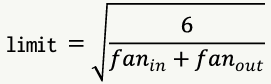
    - `layers.Dense(10, activation='relu', kener_initializer='glorot_uniform')`
  - `tf.keras.initializers.GlorotNormal`
    - 평균이 0, 표준편차가 σ인 정규분포로 초기값 선택
    - 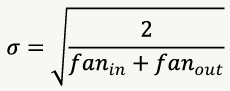
    - `layers.Dense(10, activation='relu', kener_initializer='glorot_normal')`

### He 초기화 방법

- Kaiming He 등에 의해 연구된 방법
- ReLU 유형의 활성함수를 사용하는 신경망에 적합한 초기화 방법
- fan-in을 바탕으로 하여 정해지는 랜덤 값에 따라 가중치 초기화
- Keras의 초기화를 위한 모듈인 `initializers`에 2가지 유형의 초기화기 제공
  - `tf.keras.initializers.HeUniform`
    - [-limit, limit] 범위의 균등분포로 초기값 선택
    - 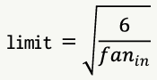
    - `layers.Dense(10, activation='relu', kener_initializer='he_uniform')`
  - `tf.keras.initializers.HeUniform`
    - 평균이 0, 표준편차가 σ인 정규분포로 초기값 선택
    - 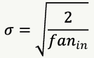
    - `layers.Dense(10, activation='relu', kener_initializer='he_normal')`

## 최적화기의 개선

### 모멘텀

- 이전 업데이트 양을 일정 비율 반영하여 파라미터를 업데이트하는 방법

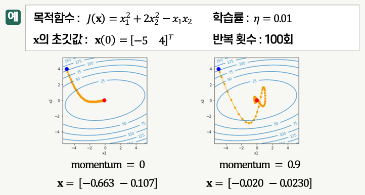

### 네스테로프 가속 경사(NAG)

- 경사의 계산 지점을 모멘텀에 해당되는 만큼 이동한 위치에서 함으로써 파라미터 변화의 방향을 개선한 것

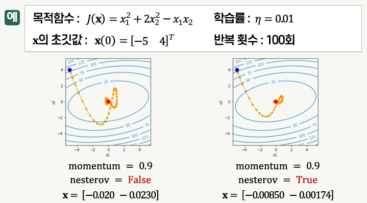

### Adagrad

- Adaptive Gradient
- 학습률을 **적응적**으로 적용하기 위한 최적화 방법
- 변화가 큰 파라미터의 학습률은 작게, 변화가 작은 파라미터의 학습률은 크게 함으로써 파라미터의 변화가 극소점을 향해 진행되게 함

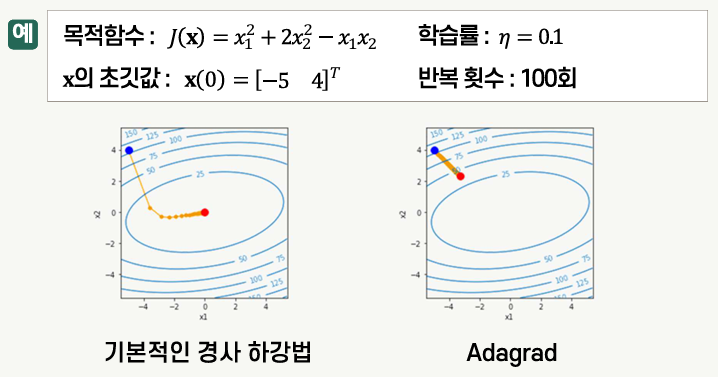

### RMSProp

- Root Mean Square Propagation
- Adagrad에서 학습률이 지나치게 작아지는 문제를 방지함

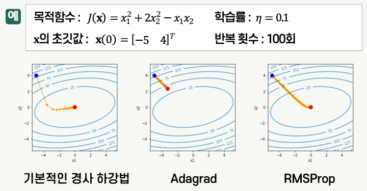

### Adam

- Adaptive Momentum estimation
- 모멘텀과 RMSProp을 결합한 최적화 알고리즘
- 1차 모멘트와 2차 모멘트를 모두 고려하여 파라미터를 업데이트
