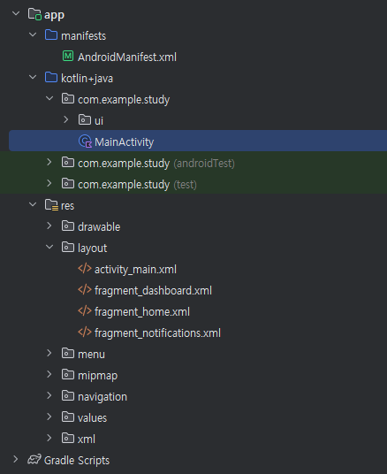
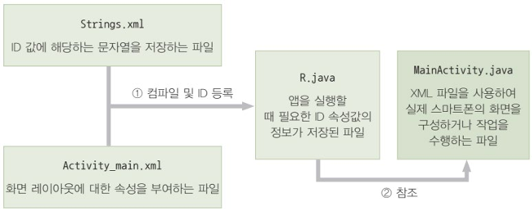
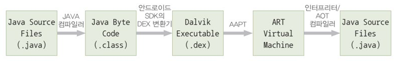
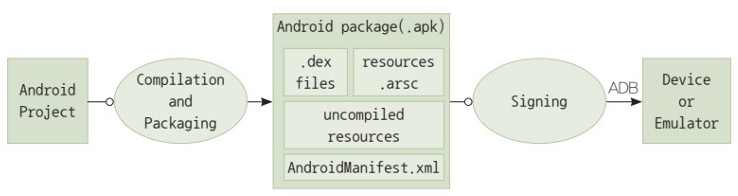

{:toc .large-only}

## 안드로이드 프로젝트

하나의 앱을 개발하기 위해 통합 개발 환경(IDE) 내에 구성하는 작업 공간(workspace)

### 주요 컴포넌트

- 액티비티(Actitity): 하나의 스마트폰 화면을 관리하는 컴포넌트
- 서비스(Service): 스마트폰 화면과 별도로 백그라운드에서 독립적으로 동작하는 컴포넌트
- 방송 수신자: 안드로이드 플랫폼에서 발생하는 다양한 이벤트를 수신하고 처리하는 컴포넌트
- 콘텐츠 제공자: 데이터를 체계적으로 관리하고 앱이 활용할 수 있도록 인터페이스를 제공하는 컴포넌트

### Activity

- 안드로이드 앱에서 하나의 화면을 표현하기 위한 구성요소
- 다양한 기능을 수행하기 위한 코드가 작성됨

### 레이아웃

- 안드로이드 화면 출력 및 화면 배치를 의미
- 출력 양식이나 양식의 설계 등을 모두 레이아웃이라는 말로 사용함

### XML 코드

- eXtensible Markup Language의 약자로 마크업 언어
- 앱의 레이아웃을 개발할 때 이용하는 코드
- 앱의 실행 코드는 JAVA를 통해 프로그래밍되고, 앱의 각 컴포넌트(이미지, 버튼 등)은 XML로 작성됨

## 주요 파일 및 폴더

| 파일 및 폴더명               | 설명                                                                                         |
| ---------------------------- | -------------------------------------------------------------------------------------------- |
| java/MainActivity.java       | 스마트폰 화면을 구성하는 Activity를 정의하는 파일로 앱 실행 시 처음으로 실행되는 코드를 의미 |
| build/R.java(R 클래스/R.jar) | 앱이 동작하면서 참조하는 자원(문자열, 이미지, 소리 등)들의 ID가 정의된 파일                  |
| res/drawable                 | 화면에 표시되는 이미지 파일(png, jpg, gif)이 정의되는 폴더                                   |
| res/layout/activity_main.xml | MainActivity.java에 대한 레이아웃을 정의하는 XML 파일                                        |
| res/values/strings.xml       | 앱이 동작하면서 참조하는 문자열들이 정의된 파일                                              |
| AndroidManifest.xml          | 앱에 대한 전반적인 정보를 담고 있는 파일로 앱의 구성요소나 권한 등을 정의                    |



> Android Studio로 생성한 프로젝트 폴더 구조

#### MainActivity.java

- 안드로이드 앱의 화면을 구성하거나 사용자와 상호작용하는 Activity 클래스를 상속받아 새로운 액티비티를 생성함
- 사용자가 발생시키는 이벤트에 반응하여 새로운 액티비티(화면)를 생성하거나 사용자의 요구사항을 만족시키는 동작 작업을 수행함

#### strings.xml

```xml
<resources>
    <string name="app_name">Study</string>
    <string name="title_home">Home</string>
    <string name="title_dashboard">Dashboard</string>
    <string name="title_notifications">Notifications</string>
</resources>
```

- 문자열 리소스를 관리
- `app_name`: 고유 식별자(리소스 ID), `Study`: 변수값

#### R.java

- 빌드 과정에서 개발툴(AAPT)에 의해 자동적으로 작성됨
  - <u>개발자가 임의로 R.java 파일을 변경해서는 안됨</u>
- JAVA 프로그램이나 XML 파일에서 참조하는 리소스 ID는 R.java 파일에서 정의됨
  - 모든 리소스 파일들을 컴파일 한 후에 리소스 ID를 자동으로 R.java에 등록함
- 안드로이드 앱이 사용하는 자원을 참조하기 위해 사용되는 ID가 정의된 클래스 R을 포함
  - R 클래스는 내부 클래스(layout, string, drawable, id 등)를 포함하며, 각 내부 클래스에는 해당 유형의 리소스에 대한 상수가 포함

```java
package com.example.myapp;

public final class R {
    public static final class string {
        public static final int app_name = 0x7f0a0000;
        public static final int hello_message = 0x7f0a0001;
        // 다른 문자열 리소스...
    }

    public static final class layout {
        public static final int activity_main = 0x7f030000;
        // 다른 레이아웃...
    }

    public static final class drawable {
        public static final int ic_launcher = 0x7f020000;
        // 다른 이미지 리소스...
    }

    public static final class id {
        public static final int button1 = 0x7f080001;
        // 다른 ID...
    }

    // 다른 리소스 유형...
}
```

#### AndroidManifest.xml

- 앱을 구성하는 전반적인 기능에 대한 명세를 포함하고 있는 파일
- 안드로이드 앱 컴포넌트의 선언
- 안드로이드 앱의 실행을 위한 소유 권한 정의
- 안드로이드 앱이 필요로 하는 최소한의 API 레벨 정의
- 안드로이드 앱이 필요로 하는 하드웨어와 소프트웨어 기능 정의
- 안드로이드 앱이 필요로 하는 API 라이브러리 정의

### 주요 파일들의 참조 관계



- 실행 부분과 데이터 부분으로 구분됨
  - Activity 내에 입력하는 JAVA 소스 코드가 실행 부분이라면 strings.xml과 activity_main.xml 내에 정의되는 XML 구조의 코드는 데이터 부분에 해당됨
- 실행 부분과 데이터 부분의 연결은 R.java가 담당(주소록 역할)
  - R.java는 XML 구조로 정의된 데이터들을 실행 부분에서 활용할 수 있도록 변수 형태의 ID와 주소값을 포함함
- MainActivity.java 파일 안에서 정의되는 Activity는 앱의 시작점이 됨
  - 일반적인 프로그래밍 언어들의 main 함수와 같은 역할을 수행

## 안드로이드 앱의 동작 원리

### 실행 과정



- 개발자가 작성한 JAVA 코드는 컴파일러에 의해 JAVA 바이트 코드로 컴파일 됨
- JAVA 환경에서는 JAVA 바이트 코드를 JAVA 가상머신을 통해 실행하지만, 안드로이드는 ART/Dalvik이라고 하는 별도의 가상머신에서 JAVA 바이트 코드를 실행함
- 안드로이드 SDK가 제공하는 DEX 변환기를 이용하여 JAVA 바이트 코드를 Dalvik의 실행 포맷인 .dex 파일(Dalvik 바이트 코드)로 변환함
- 변환된 .dex 파일과 리소스 파일들은 설치할 수 있는 .apk 파일로 만들어짐
- .apk 파일의 생성은 AAPT(Android Asset Packaging Tool)라는 개발도구를 이용하고, 이 과정을 **패키징**이라고 함
- 패키징 과정이 끝나 만들어진 .apk 파일을 플랫폼에 설치하면 런타임에서 실행할 수 있음

> Dalvik: JIT(Just In Time) 방식의 컴파일 환경 기반의 안드로이드 가상머신<br/>
> ART(Android Run Time): 앱을 설치하기 전에 컴파일을 끝내고 앱을 실행하는 안드로이드 가상머신

### 배포 과정



- 안드로이드 프로젝트에 대한 코드 컴파일 작업이 수행되면 JAVA 프로그램의 .class 파일이 생성되고, .class 파일을 이용하여 안드로이드 실행환경(Dalvik, ART)에 적합한 .dex 파일이 생성됨
- 컴파일된 리소스 파일(XML)은 resources.arsc 라는 파일로 생성되고, 안드로이드 앱의 설정 환경을 정의하는 AndroidManifest.xml 파일이 생성됨
- 최종적으로 컴파일되지 않은 리소스 파일(이미지, 아이콘 파일 등)들과 .dex 파일, resources.arsc 파일, AndroidManifest.xml 파일이 함께 패키징되어 .apk 파일이 생성됨
- 이후 서명 Key를 이용하여 .apk 파일에 서명 작업을 하여 .apk 파일이 타인에 의해서 위변조되는 것을 방지함
  - 서명 Key는 디버그 목적으로 앱을 빌드할 때 사용하는 Debug Key와 배포 목적으로 빌드할 때 사용하는 Release Key로 구분됨
  - 이러한 서명 작업에서 사용한 키 값은 안드로이드 앱의 업데이트에서 개발자의 식별에 사용됨
- 마지막으로 Google Play에 업로드를 수행함
