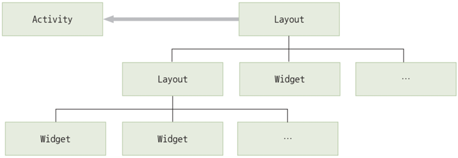
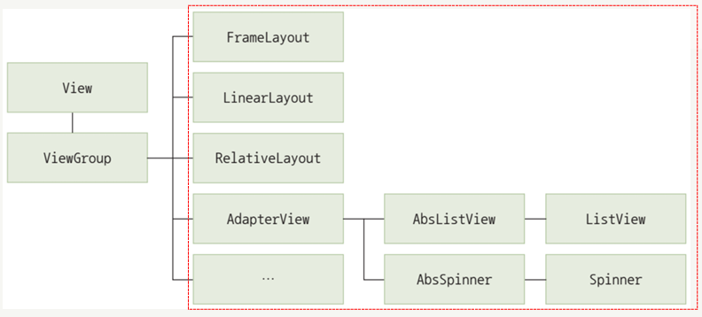
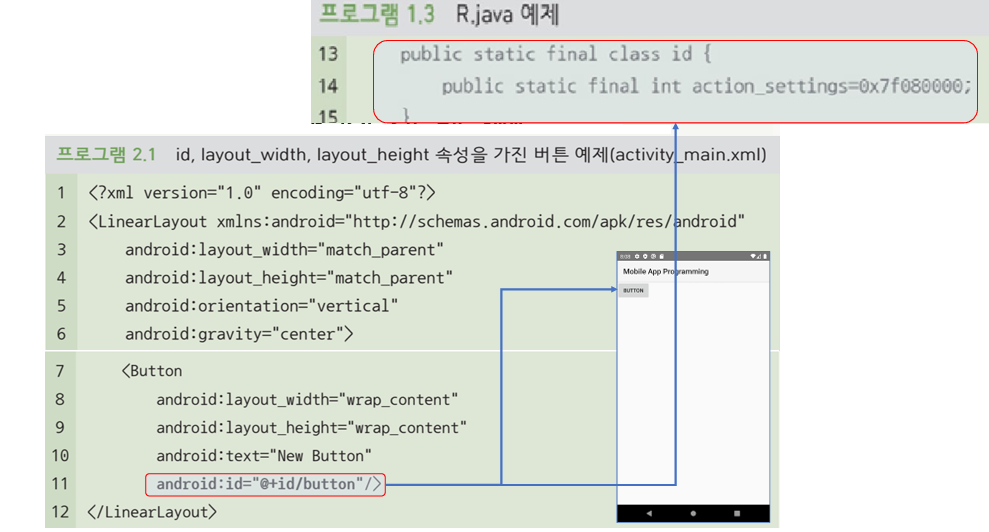

{:toc .large-only}

## Activity와 View의 관계

- Activity는 안드로이드 앱의 각 화면을 구성하는 단위
- View는 화면상의 사각 영역에 자신의 모양을 그리고 사용자의 입력을 받아들이는 객체
- 여러 개의 View가 모여서 하나의 Activity를 구성하고, 여러 개의 Activity가 모여서 하나의 안드로이드 앱을 구성

## View의 구성

- View는 크게 위젯(Widget)과 레이아웃(Layout)으로 구분됨
  - 위젯은 사용자와 상호작용을 위한 인터페이스 역할
  - 레이아웃은 이러한 위젯을 화면에 정렬하며 배치하는 역할
- 하나의 화면을 구성하는 View들은 트리구조 형태로 연결됨
  - 위젯은 레이아웃에 포함되며 레이아웃은 다른 레이아웃의 하위 구성요소로 포함될 수 있음
  - 위젯과 레이아웃의 구분은 불명확해지고 있으며 레이아웃이면서 위젯을 특징을 가지는 경우도 있음
- 하나 이상의 Activity가 최상위 레이아웃을 참조하여 화면을 그리게 됨



### 위젯

- 스마트폰 화면에서 사용자 인터페이스를 구성하는 역할
- View 클래스로부터 파생되며, 간단하게 View라고 부르기도 함
- TextView, EditView, Button, RadioButton 등이 대표적인 위젯임
- 스스로 화면에 특정 내용을 출력할 수 있는 능력을 가지고 있음
- 사용자들과 직접적인 상호작용을 이끌어내고, 상호작용의 결과를 JAVA 코드에 전달하여 다른 위젯이 가진 UI에 출력하기도 함

### 레이아웃

- View를 담는 쟁반 역할을 함
- ViewGroup 클래스로 구현됨
  - 대부분의 ViewGroup 파생 클래스들은 화면에 보이지 않으면서 다른 View들을 유기적으로 모아 두는 쟁반 역할만 수행
  - 특정 ViewGroup 클래스는 화면에 리소스를 출력하면서 위젯 역할도 수행함 (ex. ListView는 하위 View들을 순차적으로 배치함)



## View 속성

### id 속성

- View의 이름을 정의하는 속성
- `@+id/ID` 형식으로 정의
  - `@`: id를 R.java에 등록하거나 R.java로부터 참조할 때 사용됨
  - `+`: ID를 새로 정의한다는 의미이며, 처음 정의할 때만 사용하고 참조할 때는 사용하지 않음
  - `id/`: 안드로이드 개발에 반드시 사용되어야 함
  - `ID`: ID 속성값(이름)이며 고유한 값으로 지정해야 함
- View의 유형과 목적을 나타내는 직관적인 이름을 붙이는 것이 좋음



### background 속성

- View의 배경에 대한 정보를 정의하는 속성
- `#` 다음에 16진수로 색상코드를 사용함
  - 안드로이드에서 사용 가능한 색상 코드 유형: #RGB, #ARGB, #RRGGBB, ##AARRGGBB
- 단순한 색상뿐 아니라 여러 가지 객체로 배경을 지정할 수 있는 방법을 제공함

```xml
<!--background 속성에 ic_launcher라는 id를 가진 이미지 사용-->
<Button
  ...
  android:background="@mipmap/ic_launcher"
  ...
/>
```

### rotation 속성

- View의 각도를 설정하는 속성
- 속성값으로 0.0부터 360.0 사이의 각도 정보를 실수로 입력받음
- rotationX는 수평 각도, rotationY는 수직 각도를 결정
- JAVA 코드에서 `setRotation(float)` 함수를 통해 수정할 수 있음

```xml
<!-- ImgaeView가 45도 기울어진 형태로 출력됨 -->
<ImgaeView
  ...
  android:ratation="45"
  ...
/>
```

### padding 속성

- View의 안쪽 여백
- View와 View의 콘텐츠(내용물) 사이의 간격을 지정
- 각 방향에 개별적으로 여백을 주기 위해서는 paddingTop, paddingBottom, paddingLeft, paddingRight 속성을 사용할 수 있음

```xml
<!-- ImgaeView에 50dp만큼의 여백을 지정 -->
<ImgaeView
  ...
  android:padding="50dp"
  ...
/>
```

### visibility 속성

- View의 표시 여부를 지정하는 속성
- visibility 속성을 이용하여 Activity의 실행 중에 특정 조건이나 이벤트에 따라 동적으로 View를 보이게 하거나 숨길 수 있음

| 속성값    | 설명                                        |
| --------- | ------------------------------------------- |
| visible   | View가 보이는 상태                          |
| invisible | View가 숨겨진 상태이지만 자리는 차지함      |
| gone      | View가 숨겨진 상태이고 자리도 차지하지 않음 |

```xml
<ImgaeView
  ...
  android:visibility="visible"
  ...
/>
```

### focusable 속성

- View를 대상으로 포커스 기능의 사용 가능 여부를 지정하는 속성
- 안드로이드에서 포커스는 다양한 View 중 사용자가 선택한 View를 구분하여 표시하고 상세 기능이 활성화되는 기능
- 사용자와의 상호작용으로 문자열을 입력받으려면 focusable 속성값을 true로 정의해야 함
- 일반적인 View의 기본값은 false이고, EditText나 Button처럼 사용자와의 상호작용을 기본적인 기능으로 하는 위젯들은 기본값이 true

```xml
<EditText
  ...
  android:focusable="true"
  ...
/>
```

### alpha 속성

- View의 투명도를 지정하는 속성
- 속성값으로 0.0~1.0 사이의 실수값을 입력받음
- 값이 높아질수록 선명해지고 낮아질수록 투명해짐
- JAVA에서 `setAlpha(float)` 함수를 통해 수정할 수 있음

```xml
<ImgaeView
  ...
  android:alpha="0.5"
  ...
/>
```
