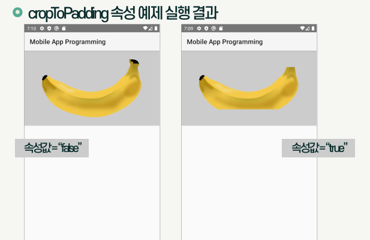

{:toc .large-only}

## Activity와 View의 관계

- Activity는 안드로이드 앱의 각 화면을 구성하는 단위
- View는 화면상의 사각 영역에 자신의 모양을 그리고 사용자의 입력을 받아들이는 객체
- 여러 개의 View가 모여서 하나의 Activity를 구성하고, 여러 개의 Activity가 모여서 하나의 안드로이드 앱을 구성

## View의 구성

- View는 크게 위젯(Widget)과 레이아웃(Layout)으로 구분됨
  - 위젯은 사용자와 상호작용을 위한 인터페이스 역할
  - 레이아웃은 이러한 위젯을 화면에 정렬하며 배치하는 역할
- 하나의 화면을 구성하는 View들은 트리구조 형태로 연결됨
  - 위젯은 레이아웃에 포함되며 레이아웃은 다른 레이아웃의 하위 구성요소로 포함될 수 있음
  - 위젯과 레이아웃의 구분은 불명확해지고 있으며 레이아웃이면서 위젯을 특징을 가지는 경우도 있음
- 하나 이상의 Activity가 최상위 레이아웃을 참조하여 화면을 그리게 됨


### 위젯

- 스마트폰 화면에서 사용자 인터페이스를 구성하는 역할
- View 클래스로부터 파생되며, 간단하게 View라고 부르기도 함
- TextView, EditView, Button, RadioButton 등이 대표적인 위젯임
- 스스로 화면에 특정 내용을 출력할 수 있는 능력을 가지고 있음
- 사용자들과 직접적인 상호작용을 이끌어내고, 상호작용의 결과를 JAVA 코드에 전달하여 다른 위젯이 가진 UI에 출력하기도 함

### 레이아웃

- View를 담는 쟁반 역할을 함
- ViewGroup 클래스로 구현됨
  - 대부분의 ViewGroup 파생 클래스들은 화면에 보이지 않으면서 다른 View들을 유기적으로 모아 두는 쟁반 역할만 수행
  - 특정 ViewGroup 클래스는 화면에 리소스를 출력하면서 위젯 역할도 수행함 (ex. ListView는 하위 View들을 순차적으로 배치함)


## View 속성

### id 속성

- View의 이름을 정의하는 속성
- `@+id/ID` 형식으로 정의
  - `@`: id를 R.java에 등록하거나 R.java로부터 참조할 때 사용됨
  - `+`: ID를 새로 정의한다는 의미이며, 처음 정의할 때만 사용하고 참조할 때는 사용하지 않음
  - `id/`: 안드로이드 개발에 반드시 사용되어야 함
  - `ID`: ID 속성값(이름)이며 고유한 값으로 지정해야 함
- View의 유형과 목적을 나타내는 직관적인 이름을 붙이는 것이 좋음


### background 속성

- View의 배경에 대한 정보를 정의하는 속성
- `#` 다음에 16진수로 색상코드를 사용함
  - 안드로이드에서 사용 가능한 색상 코드 유형: #RGB, #ARGB, #RRGGBB, ##AARRGGBB
- 단순한 색상뿐 아니라 여러 가지 객체로 배경을 지정할 수 있는 방법을 제공함

```xml
<!--background 속성에 ic_launcher라는 id를 가진 이미지 사용-->
<Button
  ...
  android:background="@mipmap/ic_launcher"
  ...
/>
```

### rotation 속성

- View의 각도를 설정하는 속성
- 속성값으로 0.0부터 360.0 사이의 각도 정보를 실수로 입력받음
- rotationX는 수평 각도, rotationY는 수직 각도를 결정
- JAVA 코드에서 `setRotation(float)` 함수를 통해 수정할 수 있음

```xml
<!-- ImgaeView가 45도 기울어진 형태로 출력됨 -->
<ImgaeView
  ...
  android:ratation="45"
  ...
/>
```

### padding 속성

- View의 안쪽 여백
- View와 View의 콘텐츠(내용물) 사이의 간격을 지정
- 각 방향에 개별적으로 여백을 주기 위해서는 paddingTop, paddingBottom, paddingLeft, paddingRight 속성을 사용할 수 있음

```xml
<!-- ImgaeView에 50dp만큼의 여백을 지정 -->
<ImgaeView
  ...
  android:padding="50dp"
  ...
/>
```

### visibility 속성

- View의 표시 여부를 지정하는 속성
- visibility 속성을 이용하여 Activity의 실행 중에 특정 조건이나 이벤트에 따라 동적으로 View를 보이게 하거나 숨길 수 있음

| 속성값    | 설명                                        |
| --------- | ------------------------------------------- |
| visible   | View가 보이는 상태                          |
| invisible | View가 숨겨진 상태이지만 자리는 차지함      |
| gone      | View가 숨겨진 상태이고 자리도 차지하지 않음 |

```xml
<ImgaeView
  ...
  android:visibility="visible"
  ...
/>
```

### focusable 속성

- View를 대상으로 포커스 기능의 사용 가능 여부를 지정하는 속성
- 안드로이드에서 포커스는 다양한 View 중 사용자가 선택한 View를 구분하여 표시하고 상세 기능이 활성화되는 기능
- 사용자와의 상호작용으로 문자열을 입력받으려면 focusable 속성값을 true로 정의해야 함
- 일반적인 View의 기본값은 false이고, EditText나 Button처럼 사용자와의 상호작용을 기본적인 기능으로 하는 위젯들은 기본값이 true

```xml
<EditText
  ...
  android:focusable="true"
  ...
/>
```

### alpha 속성

- View의 투명도를 지정하는 속성
- 속성값으로 0.0~1.0 사이의 실수값을 입력받음
- 값이 높아질수록 선명해지고 낮아질수록 투명해짐
- JAVA에서 `setAlpha(float)` 함수를 통해 수정할 수 있음

```xml
<ImgaeView
  ...
  android:alpha="0.5"
  ...
/>
```

## View 위젯

### TextView

- 문자열을 화면에 출력하는 위젯

| 속성       | 설명                                                                                                                                                                    |
| ---------- | ----------------------------------------------------------------------------------------------------------------------------------------------------------------------- |
| text       | - text 속성에 출력할 문자열을 지정하여 사용<br/>- strings.xml에 id와 함께 문자열을 정의하고 참조하여 사용 가능                                                          |
| textSize   | - 폰트 크기를 지정(실수형)<br/>- sp, dp, px, in, nm 등의 단위를 지정해야 함                                                                                             |
| textColor  | - 텍스트 색상을 지정<br/>- 개발자가 별다른 속성값을 지정하지 않으면 안드로이드 기본색인 불투명한 밝은 회색으로 적용됨                                                   |
| textStyle  | - 텍스트 스타일을 지정<br/>- normal, bold, italic 중 하나를 지정하거나 `\|`로 묶어 두 개 이상 지정할 수 있음 (`\|` 앞뒤에 공백 없이 붙여서 작성)                        |
| typeface   | - 폰트(글꼴)을 지정<br/>- normal, sans, serif, monospace 중 하나의 글꼴만 지정할 수 있음                                                                                |
| singleLine | - 문자열을 위젯의 폭에 맞춰 한 줄에 출력하는 속성<br/>- 위젯의 폭에 맞는 문자열만큼만 출력하고, 나머지 부분은 `...`로 생략되어 출력<br/>- 기본값은 false (여러 줄 출력) |

```xml
<!-- text 속성에 출력할 문자열을 지정하여 사용 -->
<TextView
  ...
  android:text="New Text"
/>

<!-- strings.xml에 id와 함께 문자열을 정의하고 참조하여 사용 -->
<resources>
  <string name="hello_world">Hello world!</string>
</resources>

<TextView
  android:layout_width="wrap_content"
  android:layout_height="wrap_content"
  android:text="@string/hello_world"
  android:textSize="30dp"
  android:textColor="#ff405aff"
  android:textStyle="bold|italic"
  android:typeface="serif"
  android:singleLine="true"
/>
```

### ImageView

- 화면에 그림을 보여주는 위젯
- 화면의 그림은 아이콘으로 활용할 수도 있고 일반적인 비트맵으로 출력할 수도 있음
- 이미지 파일을 res 폴더에 복사해 놓으면 AAPT가 컴파일 전에 res 폴더의 이미지 파일명 ID를 자동으로 R.java에 정의해 줌

| 속성               | 설명                                                                                                                                                                                                                          |
| ------------------ | ----------------------------------------------------------------------------------------------------------------------------------------------------------------------------------------------------------------------------- |
| src                | - 출력할 이미지를 지정<br/>- 일반적으로 리소스 폴더에 이미지를 복사해 놓고 ID를 지정하여 사용<br/>- 외부 이미지나 색상 코드를 지정할 수도 있음                                                                                |
| maxWidth/maxHeight | 이미지의 가로/세로 크기의 최대값을 지정                                                                                                                                                                                       |
| minWidth/minHeight | 이미지의 가로/세로 크기의 최소값을 지정                                                                                                                                                                                       |
| adjustViewBounds   | - 이미지의 종횡비를 맞추기 위해 ImageView의 크기에 대한 한계값을 지정<br/>- true면 종횡비를 유지하면서 maxWidth, maxHeight 속성값에 따라 출력되고, false면 이미지의 가로/세로 모두 화면 전체를 채우게 됨<br/>- 기본값은 false |
| cropToPadding      | - 레이아웃 내부에 적용된 padding 속성에 따라 이미지를 자를지 여부를 지정<br/>- true면 padding과 겹치는 이미지 부분은 잘려서 출력되고, false면 padding 속성을 무시하고 이미지 출력<br/>- 기본값은 false                        |
| scaleType          | - 이미지의 크기를 조정하는 기준을 지정<br/>- matrix, fitXY, center, centerCrop 등 설정 가능<br/>- fitXY: 이미지 가로/세로가 화면 크기에 맞추어 출력됨<br/>- matrix: 이미지가 좌측 상단을 기준으로 출력됨                      |



```xml
<!-- adjustViewBounds가 true가 아니므로 layout_height 속성의 우선순위가 maxHeight보다 높아 세로 크기가 100dp로 출력됨 -->
<ImageView
  android:layout_width="match_parent"
  android:layout_height="100dp"
  android:src="@drawable/banana"
  android:maxHeight="200pt"
/>

<!-- adjustViewBounds가 true이므로 layout_width, layout_height보다 maxWidth, maxHeight의 우선순위가 높아 가로/세로가 50dp로 출력됨 -->
<ImageView
  android:layout_width="match_parent"
  android:layout_height="match_parent"
  android:src="@drawable/banana"
  android:maxWidth="50pt"
  android:maxHeight="50pt"
  android:adjustViewBounds="true"
/>

<!-- adjustViewBounds가 true이고 maxWidth, maxHeight 속성이 없으므로 가로/세로 종횡비를 유지하면서 부모 레이아웃의 크기를 채우는 형태로 출력됨 -->
<ImageView
  android:layout_width="match_parent"
  android:layout_height="match_parent"
  android:src="@drawable/banana"
  android:background="#cccccc"
  android:adjustViewBounds="true"
/>
```


### Button

- 사용자로부터 선택 이벤트를 수집할 수 있는 인터페이스를 제공하는 위젯
- 터치 동작을 통해 선택 명령을 내릴 수 있음

| 속성        | 설명                                                                                                                      |
| ----------- | ------------------------------------------------------------------------------------------------------------------------- |
| text        | 버튼 내부에 출력되는 문자열                                                                                               |
| textAllCaps | - 버튼 내부에 출력되는 문자열을 대문자로 출력할 지 여부<br/>- 기본값은 true                                               |
| onClick     | - 버튼의 클릭 이벤트가 발생할 때 수행되는 동작을 연결하는 속성<br/>- 수행할 함수는 MainActivity.java의 클래스 내부에 정의 |

```java
// MainActivity.java
public class MainActivity extends AppCompatActivity {
  ...
  public void onButtonClick(View view) {
    TextView text1 = (TextView) findViewById(R.id.text1);
    switch(view.getId()) {
      case R.id.button1:
        text1.setText("hello");
        break
      case R.id.button2:
        text1.setText("world");
        break;
    }
  }
}
```

```xml
<Button
  android:id="@+id/button1"
  android:layout_width="wrap_content"
  android:layout_height="wrap_content"
  android:text="hello"
  android:onClick="onButtonClick"
/>
<Button
  android:id="@+id/button2"
  android:layout_width="wrap_content"
  android:layout_height="wrap_content"
  android:text="world"
  android:onClick="onButtonClick"
/>
<TextView
  android:id="@+id/text1"
  android:layout_width="wrap_content"
  android:layout_height="wrap_content"
/>
```


### EditText

- 사용자로부터 문자열을 입력받을 수 있는 인터페이스를 제공하는 위젯
- TextView의 서브클래스로, TextView의 모든 속성을 사용할 수 있음

| 속성    | 설명                                                                                                                         |
| ------- | ---------------------------------------------------------------------------------------------------------------------------- |
| text    | EditText가 처음 화면에 출력될 때 빈칸에 기본적으로 들어갈 문자열을 지정                                                      |
| getText | - EditText에 입력한 문자열을 JAVA 코드에서 활용하기 위해 참조하는 메서드<br/>- toString 메서드를 통해 문자열로 변환하여 사용 |

```java
// MainActivity.java
public class MainActivity extends AppCompatActivity {
  ...
  public void onButtonClick(View view) {
    EditText edit = (EditText) findViewById(R.id.edit);
    String str = edit.getText().toString();
    Toast.makeText(MainActivity.this, str, Toast.LENGTH_SHORT).show();
  }
}
```

```xml
<EditText
  android:id="@+id/edit"
  android:layout_width="wrap_content"
  android:layout_height="wrap_content"
  android:text="Input Please"
/>
<Button
  android:id="@+id/button"
  android:layout_width="wrap_content"
  android:layout_height="wrap_content"
  android:text="Button"
  android:onClick="onButtonClick"
/>
```

### CheckBox

- 사용자가 문자열 리스트에서 다수의 구성요소를 선택하기 위한 인터페이스를 제공하는 위젯

| 속성      | 설명                                                         |
| --------- | ------------------------------------------------------------ |
| text      | CheckBox에 들어갈 문자열을 지정                              |
| isChecked | 체크된 경우 true, 체크되지 않은 경우 false를 반환하는 메서드 |

```xml
<CheckBox
  android:id="@+id/checkbox1"
  android:layout_width="wrap_content"
  android:layout_height="wrap_content"
  android:text="apple"
/>
<CheckBox
  android:id="@+id/checkbox2"
  android:layout_width="wrap_content"
  android:layout_height="wrap_content"
  android:text="banana"
/>
<CheckBox
  android:id="@+id/checkbox3"
  android:layout_width="wrap_content"
  android:layout_height="wrap_content"
  android:text="orange"
/>
```


### RadioButton

- 사용자가 문자열 리스트에서 하나의 구성요소를 선택하기 위한 인터페이스를 제공하는 위젯
- RadioGroup 태그로 선택 범위를 지정함

| 속성      | 설명                                                         |
| --------- | ------------------------------------------------------------ |
| text      | RadioButton에 들어갈 문자열을 지정                           |
| isChecked | 체크된 경우 true, 체크되지 않은 경우 false를 반환하는 메서드 |

```xml
<RadioGroup
    android:layout_width="wrap_content"
    android:layout_height="wrap_content"
    android:orientation="vertival"
>
  <RadioButton
    android:id="@+id/radio1"
    android:layout_width="wrap_content"
    android:layout_height="wrap_content"
    android:text="apple"
  />
  <RadioButton
    android:id="@+id/radio2"
    android:layout_width="wrap_content"
    android:layout_height="wrap_content"
    android:text="banana"
  />
  <RadioButton
    android:id="@+id/radio3"
    android:layout_width="wrap_content"
    android:layout_height="wrap_content"
    android:text="orange"
  />
</RadioGroup>
```

### Switch

- On/Off를 전환하는 토글 형태의 인터페이스를 제공하는 위젯
- 사용자가 앱의 특정 기능을 켜고 끄는 용도와 특정 상황에 대한 동의를 수집하는 목적으로 활용됨

| 속성      | 설명                                                         |
| --------- | ------------------------------------------------------------ |
| text      | Switch에 들어갈 문자열을 지정                                |
| isChecked | 체크된 경우 true, 체크되지 않은 경우 false를 반환하는 메서드 |

```java
// MainActivity.java
public class MainActivity extends AppCompatActivity {
  ...
  public void onButtonClick(View view) {
    Switch switch = (Switch) findViewById(R.id.switch);
    TextView text = (TextView) findViewById(R.id.text);
    switch(view.getId()) {
      case R.id.button:
        if(switch.isChecked()) {
          text.setText("Switch On");
        } else {
          text.setText("Switch Off");
        }
        break;
    }
  }
}
```

```xml
<Switch
    xmlns:andrioid="http://schemas.android.com/apk/res/android"
    android:id="@+id/switch"
    android:layout_width="wrap_content"
    android:layout_height="wrap_content"
    android:text="approval"
/>
<Button
  android:id="@+id/button"
  android:layout_width="wrap_content"
  android:layout_height="wrap_content"
  android:text="Button"
  android:onClick="onButtonClick"
/>
<TextView
  android:id="@+id/text"
  android:layout_width="wrap_content"
  android:layout_height="wrap_content"
/>
```


