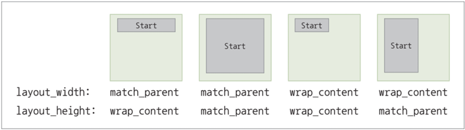

{:toc .large-only}

## ViewGroup

- 다양한 View에 대한 그룹을 관리
- 계층적 관리 구조를 제공하여 화면 관리의 효율성을 높여줌
- 각 View 마다 ViewGroup 내부에서 표현되는 구체적인 형태를 지정할 수 있음

### layout_width와 layout_height 속성

- View가 레이아웃에 배치될 때 크기를 결정하는 기준이 됨
- 서로 독립적으로 동작함

| 속성값           | 설명                                                      |
| ---------------- | --------------------------------------------------------- |
| match_parent     | View가 위치한 레이아웃의 크기에 맞춰 최대한의 크기로 출력 |
| wrap_content     | View가 출력하는 내용물의 크기에 맞춰 최소한의 크기로 출력 |
| 직접 값(literal) | 입략한 값에 따라 크기가 결정되어 출력                     |



### layout_margin 속성

- View와 형제 View 사이의 간격을 지정하는 속성
- View가 레이아웃에 독립적으로 있을 경우 부모 View 사이의 간격으로 설정됨
- 개별적인 여백을 지정하고 싶다면 layout_marginLeft, layout_marginRight, layout_marginTop, layout_marginBottom 사용

#### padding과의 차이

- layout_margin은 View와 부모 또는 형제 View 사이에 적용됨
- padding은 View와 내용물(그림, 문자 등) 사이에 적용됨
- layout_margin은 바깥 여백, padding은 안쪽 여백
- padding은 View 내부에 적용되므로 크기에 포함되지만 layout_margin은 크기에 포함되지 않음
- padding은 View 자체 속성이지만 layout_margin은 레이아웃 속성

```xml
<LinearLayout
  ...
  android:layout_margin="20px"
  android:padding="15dp"
  ...
/>
```

## LinearLayout

- 내부 구성요소를 선형으로 배치하는 ViewGroup

### orientation 속성

- LinearLayout 내부에 포함된 View들을 배치하는 방향을 지정하는 속성
- orientation 속성을 별도 지정하지 않으면 기본값으로 horizontal이 적용되어 수평 방향으로 뷰를 배치함

| 속성값     | 설명                                   |
| ---------- | -------------------------------------- |
| horizontal | 왼쪽에서 오른쪽으로 수평 방향으로 배열 |
| vertical   | 위에서 아래로 수직 방향으로 배열       |

```xml
<LinearLayout
  ...
  android:orientation="vertical"
  ...
/>
```


### baselineAligned 속성

- 수평으로 높이가 다른 TextView를 배치할 때 아래쪽을 기준으로 TextView들을 정렬하는 속성
- 기본값은 true

```xml
<LinearLayout
  ...
  android:baselineAligned="true"
  ...
/>
```


### gravity 속성

- View 안쪽에 배치되는 내용물의 정렬 방식을 결정하는 속성
- 수평/수직 방향을 지정할 수 있으며 `|` 연산자로 두 속성을 묶어서 지정할 수 있음
  - `center`는 `center_horizontal | center_vertical`과 같음
  - `center_vertical | right`은 수직으로는 중앙, 수평으로는 오른쪽 정렬
- 각 정렬 방식은 비트 필드(bit field)로 정의되어 있으며, center 속성값과 fill 속성값은 수평/수직 정렬 상태 플래그(flag)의 조합으로 정의됨
- 기본값은 좌측 상단에 배치됨

| 속성값            | 설명           |
| ----------------- | -------------- |
| center            | 중앙 정렬      |
| left              | 왼쪽 정렬      |
| right             | 오른쪽 정렬    |
| top               | 상단 정렬      |
| bottom            | 하단 정렬      |
| center_vertical   | 수직 중앙 정렬 |
| center_horizontal | 수평 중앙 정렬 |

```xml
<LinearLayout
  ...
>
  <TextView
    ...
    android:gravity="center"
    ...
  />
</LinearLayout>
```

### layout_weight 속성

- 상위 레이아웃의 영역에서 내부 레이아웃이나 위젯의 영역 할당 비율을 지정하는 속성
- 0이면 원래 크기만큼만 영역을 차지하고, 1 이상이면 상위 레이아웃에 포함된 레이아웃이나 위젯들이 layout_weight 값의 크기에 비례하여 상위 레이아웃 영역을 차지하게 됨

```xml
<LinearLayout
  android:layout_width="match_parent"
  android:layout_height="match_parent"
>
  <TextView
    android:layout_width="match_parent"
    android:layout_height="wrap_content"
    android:text="Top Text!!(1)"
    android:layout_weight="1"
    ...
  />
  <TextView
    android:layout_width="match_parent"
    android:layout_height="wrap_content"
    android:text="Top Text!!(3)"
    android:layout_weight="3"
    ...
  />
  <TextView
    android:layout_width="match_parent"
    android:layout_height="wrap_content"
    android:text="Top Text!!(2)"
    android:layout_weight="2"
    ...
  />
</LinearLayout>
```

- 위 예제 코드에서 부모 View(LinearLayout)의 전체 높이에 대해 각 TextView가 1:3:2의 비율로 레이아웃 영역을 할당받음
- layout_weight 속성을 0으로 지정하면 레이아웃 분할에서 제외되고, layout_weight가 0이 아닌 View들이 나머지 영역에 대해 layout_weight 비율로 할당받음
- layout_height 속성을 0dp로 설정해도 layout_weight 속성에 따라 레이아웃 영역을 할당받아 동일하게 노출됨
- 부모 View(LinearLayout)의 orientation 속성이 vertical인 경우는 TextView의 layout_width 속성을 wrap_content나 0dp로 설정하면 됨


## RelativeLayout

- ViewGroup에서 View들 사이의 상대적인 관계를 이용하여 View의 위치를 지정하고 배치하는 레이아웃
- 특정 View와 다른 View 사이의 관계를 지정하려면, 먼저 속성에 다른 View를 지칭하기 위한 식별자(R.java에 등록된 ID)가 필요
- View의 기본 위치는 부모 레이아웃의 좌측 상단

| 속성값                          | 설명                                                                         |
| ------------------------------- | ---------------------------------------------------------------------------- |
| layout_above                    | 지정된 View의 위에 배치                                                      |
| layout_below                    | 지정된 View의 아래에 배치                                                    |
| layout_toLeftOf                 | 지정된 View의 왼쪽에 배치                                                    |
| layout_toRightOf                | 지정된 View의 오른쪽에 배치                                                  |
| layout_alignLeft                | 지정된 View와 왼쪽 변을 맞춤                                                 |
| layout_alignTop                 | 지정된 View와 위쪽 변을 맞춤                                                 |
| layout_alignRight               | 지정된 View와 오른쪽 변을 맞춤                                               |
| layout_alignBottom              | 지정된 View와 아래쪽 변을 맞춤                                               |
| layout_alignParentLeft          | 부모와 왼쪽 변을 맞춤                                                        |
| layout_alignParentTop           | 부모와 위쪽 변을 맞춤                                                        |
| layout_alignParentRight         | 부모와 오른쪽 변을 맞춤                                                      |
| layout_alignParentBottom        | 부모와 아래쪽 변을 맞춤                                                      |
| layout_alignBaseline            | 지정된 View와 베이스라인을 맞춤                                              |
| layout_alignWithParentIfMissing | layout_toLeftOf 등의 속성에 대해 기준이 발견되지 않으면 부모를 기준으로 사용 |
| layout_centerHorizontal         | 부모의 수평 중앙에 배치                                                      |
| layout_centerVertical           | 부모의 수직 중앙에 배치                                                      |
| layout_centerInParent           | 부모의 수평, 수직 중앙에 배치                                                |

```xml
<RelativeLayout
  android:layout_width="match_parent"
  android:layout_height="match_parent"
  android:orientation="vertical"
>
  <TextView
    android:id="@+id/target"
    android:layout_centerInParent="true"
    android:text="TARGET"
  />
  <TextView
    android:text="DEFAULT"
  />
  <TextView
    android:layout_above="@id/target"
    android:text="TOP"
  />
  <TextView
    android:layout_below="@id/target"
    android:text="BOTTOM"
  />
  <TextView
    android:layout_toLeftOf="@id/target"
    android:text="LEFT"
  />
  <TextView
    android:layout_toRightOf="@id/target"
    android:text="RIGHT"
  />
</RelativeLayout>
```


```xml
<RelativeLayout
  android:layout_width="match_parent"
  android:layout_height="match_parent"
  android:orientation="vertical"
>
  <TextView
    android:id="@+id/target"
    android:layout_centerInParent="true"
    android:text="TARGET"
  />
  <TextView
    android:text="DEFAULT"
  />
  <TextView
    android:layout_alignTop="@id/target"
    android:text="TOP"
  />
  <TextView
    android:layout_alignBottom="@id/target"
    android:text="BOTTOM"
  />
  <TextView
    android:layout_alignLeft="@id/target"
    android:text="LEFT"
  />
  <TextView
    android:layout_alignRight="@id/target"
    android:text="RIGHT"
  />
</RelativeLayout>
```


### 문제점

- RelativeLayout에서 어떤 View는 상대적인 위치를 결정하기 위해 다른 View에 종속적일 경우가 발생됨
- 기준이 되는 다른 View가 먼저 정의되어야 종속되는 View의 위치가 결정됨
- LinearLayout과 달리 사용자의 화면에 보이는 View 순서와 레이아웃 XML 상에 View가 정의된 순서가 다를 수 있음
- 화면에 출력되는 순서와 무관하게 View 사이의 종속적인 위치만 고려하여 관계를 정의하다 보면, 대체되는 배치를 찾기 어렵거나 유지보수에 어려움이 발생할 수 있음
- 기준이 되는 View가 삭제되거나 위치를 이동하면, 종속되는 View는 원하는 위치를 결정하지 못하게 됨

## AbsoluteLayout

- 절대적인 위치 지정이 가능한 레이아웃으로 RelativeLayout의 반대 속성을 가지는 레이아웃
- 관계나 순서에 상관없이 지정한 절대 좌표에 View를 배치함
- layout_x, layout_y 속성을 지정하면 부모의 좌측 상단(0,0)을 기준으로 하는 좌표에 View가 배치됨

```xml
<AbsoluteLayout
  android:layout_width="match_parent"
  android:layout_height="match_parent"
>
  <TextView
    android:layout_x="50dip"
    android:layout_y="350dip"
    android:text="Absolute(50, 350)"
  />
  <TextView
    android:layout_x="130dip"
    android:layout_y="90dip"
    android:text="Absolute(130, 90)"
  />
</AbsoluteLayout>
```


## FrameLayout

- 모든 자식 View가 FrameLayout의 좌측 상단에 나타나는 레이아웃
- 자식 View가 두 개 이상일 때는 추가된 순서대로 겹쳐서 표시
- XML 코드에 먼저 정의된 자식 View가 아래에 위치하고 나중에 추가된 자식 View가 위에 겹쳐서 출력됨

| 속성값             | 설명                                                                                                                       |
| ------------------ | -------------------------------------------------------------------------------------------------------------------------- |
| foreground         | 자식 View의 위쪽에 살짝 얹히는 이미지를 지정함                                                                             |
| foregroundGravity  | foreground 이미지의 위치를 결정함                                                                                          |
| measureAllChildren | 레이아웃 크기를 모든 자식 View의 크기에 맞출 것인지, visibility 속성이 visible로 설정된 자식 View에만 맞출 것인지를 결정함 |

```xml
<FrameLayout
  android:layout_width="match_parent"
  android:layout_height="match_parent"
>
  <TextView
    android:layout_width="match_parent"
    android:layout_height="wrap_content"
    android:src="@drawable/banana"
  />
  <TextView
    android:layout_width="match_parent"
    android:layout_height="wrap_content"
    android:src="@drawable/earth"
  />
</FrameLayout>
```


## TableLayout

- 표 형태로서 자식 View를 배치하는 레이아웃
- TableRow 객체 하나가 하나의 행에 해당됨
  - 여러 개의 행이 하나의 TableLayout에 배치되려면 적응적으로 세로의 크기가 조정되어야 함
  - 이에 따라 TableRow의 높이는 wrap_content로 설정해야 함
- TableRow 내부는 여러 개의 열(셀)로 구성되며 하나의 열에는 하나의 자식 View가 포함됨
  - 하나의 셀에 배치되는 자식 View는 무조건 주어진 셀 안에 배치되므로 layout_width 속성은 wrap_content를 기본값으로 가짐
  - 자식 View의 높이는 기본 속성값으로 wrap_content로 설정되지만, 필요한 경우 match_parent로 지정하여 하나의 셀로 행을 채울 수도 있음
- TableRow의 개수가 행의 개수이고 하나의 TableRow 안에 배치되는 자식 View의 개수가 열(셀)의 개수이므로 TableLayout의 전체 크기는 행X열로 계산됨
- 가로 행과 세로 열의 개수에는 특별한 제한이 없음


| 속성값         | 설명                                                                                                     |
| -------------- | -------------------------------------------------------------------------------------------------------- |
| shrinkColumns  | 콤마로 구분된 열 인덱스 목록. TableLayout의 전체 너비가 화면보다 클 때, 지정된 열을 축소시켜 화면에 맞춤 |
| stretchColumns | 콤마로 구분된 열 인덱스 목록. TableLayout의 너비가 화면보다 작을 때, 지정된 열을 확장시켜 화면에 맞춤    |

```xml
<TableLayout
  android:layout_width="match_parent"
  android:layout_height="match_parent"
>
  <TableRow>
    <TextView
      android:text="SUN"
    />
    <TextView
      android:text="MON"
    />
    <TextView
      android:text="TUE"
    />
  </TableRow>
</TableLayout>
```


```xml
<TableLayout
  android:layout_width="match_parent"
  android:layout_height="match_parent"
  android:stretchColumns="1"
>
  <TableRow>
    <TextView
      android:text="SUN"
    />
    <TextView
      android:text="MON"
    />
    <TextView
      android:text="TUE"
    />
  </TableRow>
</TableLayout>
```


## 레이아웃 중첩

- 레이아웃은 View들을 담는 하나의 컨테이너(쟁반)이므로 View로부터 파생된 모든 ViewGroup과 View를 레이아웃 안에 포함할 수 있음
- 레이아웃 내에 포함되는 ViewGroup에 다른 View들을 중첩하여 배치할 수 있음
- 레이아웃 자체도 View의 파생 클래스이므로 레이아웃끼리 중첩하여 배치 가능
- 레이아웃 중첩은 화면 디자인의 유지보수를 쉽게 하고 XML 코드의 가독성을 향상시킴

```xml
<LinearLayout>
  <TextView />
  <TableLayout>
    <TableRow>
      <TextView/>
      <TextView/>
      <TextView/>
    </TableRow>
    <TableRow>
      <TextView/>
      <TextView/>
      <TextView/>
    </TableRow>
  </TableLayout>
  <LinearLayout>
    <TextView />
    <TextView />
    <TextView />
  </LinearLayout>
</LinearLayout>
```


