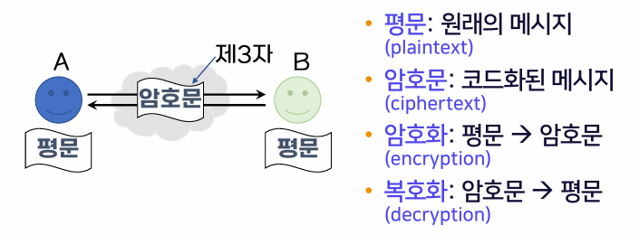
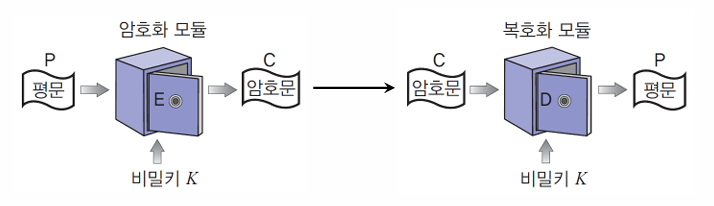
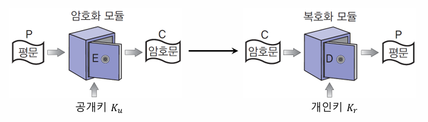
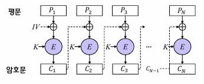
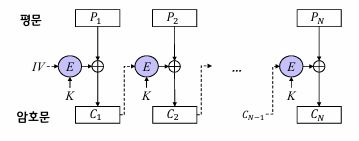
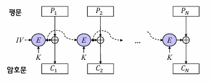
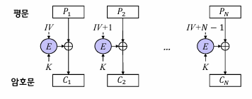

{:toc .large-only}

## 컴퓨터 보안

- 컴퓨팅 환경이 관여된 모든 상황에 대한 정보보호
- 컴퓨팅 환경에 저장되거나 처리되는 정보를 다양한 위협으로부터 보호하기 위한 정책 및 기법

### 정보보호의 목표

#### 기밀성 (Confidentiality)

- 허락되지 않은 자가 정보의 내용을 알 수 없도록 하는 것
- 정보에 접근하더라도 무의미한 내용만 보이도록 함

#### 무결성 (Integrity)

- 허락되지 않은 자가 정보를 임의로 수정할 수 없도록 하는 것
- 만약 허락되지 않은 자에 의해 수정이 발생했다면 이를 확인할 수 있어야 함

#### 가용성 (Availablity)

- 허락된 자가 정보에 접근하고자 할 때 이것이 방해받지 않도록 하는 것
- 즉, 정보에 대한 접근 권한이 있는 자는 필요할 때 언제든지 정보를 사용할 수 있어야 함
- 정해진 시간 내에 정보를 볼 수 있음을 보장해야 함

#### 그 외의 목표

- 부인방지: 정보에 관여한 자가 이를 부인하지 못하게 하는 것
- 인증: 어떤 실체가 정말 주장하는 실체가 맞는지 확인할 수 있고 신뢰할 수 있어야 함
- 접근제어: 접근 권한이 있는 자와 없는 자를 구분하여 제어할 수 있어야 함

## 암호

- 두 사람이 안전하지 않은 채널을 통해 정보를 주고받더라도 제3자는 이 정보의 내용을 알 수 없도록 하는 것
- 키(key): 암호화와 복호화를 위한 가장 중요한 열쇠

### 대칭키 암호

- 암호화와 복호화에 같은 키 하나를 사용하는 방식
- 장점: 암호화와 복호화 속도가 빠름
- 단점: 키 분배 문제 (암호화/복호화 하는 양쪽이 같은 키 값을 알아야 함)
- 대표적인 알고리즘: DES, AES, IDEA 등

#### 블록 암호

평문을 고정된 크기의 블록으로 나누어 각 블록마다 암호화 과정을 수행하여 블록 단위로 암호문을 얻는 대칭키 암호 방식

#### 스트림 암호

평문과 같은 길이의 키 스트림을 생성하여 평문과 키를 비트 단위로 XOR 연산하여 암호문을 얻는 대칭키 암호 방식

### 공개키 암호

- 암호화와 복호화에 서로 다른 두 개의 키를 사용하는 방식
- 공개키: 누구나 공개키를 이용하여 암호화 가능
- 개인키: 오직 자신만 개인키를 이용하여 복호화 가능
- 장점: 키 관리가 쉬움, 키 분배 문제 해결
- 단점: 대칭키 암호에 비해 속도가 느림
- 대표적인 알고리즘: RSA, ECC, ElGamal 등

## 블록 암호화 알고리즘

### ECB

- 전자 코드 북(Electronic Code Book) 모드
- 평문을 일정한 블록 단위로 나누어 암호화하는 방식
- 장점: 암호화/복호화 시 병렬 처리가 가능하다.
- 단점: 동일한 평문 블록은 동일한 암호문을 생성하여 패턴 분석이 가능하므로 보안에 취약하다.

### CBC

- 암호 블록 연결(Cipher Block Chaining) 모드
- 첫 블록은 IV(초기화 벡터)로 암호화하고, 이후 블록은 이전 암호문 결과와 XOR 연산을 순차적으로 반복하는 방식
- 장점: 암호화 시 한 블록이 손상되면 그 이후의 블록들에 모두 오류가 발생되므로 데이터 무결성을 검증할 수 있다.
- 단점: 암호화 시 이전 암호화 결과가 다음 암호화에 영향을 주므로 병렬 처리를 할 수 없다. (복호화 시에는 병렬 처리 가능)

### CFB

- 암호 피드백(Cipher FeedBack) 모드
- CBC의 변형으로, 블록 암호를 자기 동기 스트림 암호로 변환하는 방식
- 장점 : 암호화/복호화 과정에 암호화 함수만 사용하므로 복호화 함수가 필요 없음
- 단점 : CBC와 마찬가지로 암호화 시 병렬 처리를 할 수 없다.

### OFB

- 출력 피드백(Output FeedBack) 모드
- 주로 영상이나 음성 데이터와 같은 디지털화된 아날로그 신호에 사용한다.
- 장점 : 암호화 시 블록이 손상되더라도 이후의 블록에는 영향을 미치지 않는다. 복호화 함수가 필요 없다.
- 단점 : 암호화 시 병렬 처리를 할 수 없다. 공격자가 암호문 블록을 비트 반전시키면, 대응하는 평문 블록이 비트 반전된다.(비트 플리핑 공격)

### CTR

- 카운터(Counter) 모드
- 암호화 시 증가하는 카운터 값과 시작값 nonce를 암호화하여 키 스트림을 생성하고, 생성된 키 스트림과 평문 블록을 XOR 연산하여 암호문을 만드는 방식
- 장점 : 암호화/복호화 시 병렬 처리가 가능하다. 암호화 시 블록이 손상되더라도 이후의 블록에는 영향을 미치지 않는다. 복호화 함수가 필요 없다.
- 단점 : nonce나 카운터 값을 재사용하면 보안성이 떨어질 수 있다. 공격자가 암호문 블록을 비트 반전시키면, 대응하는 평문 블록이 비트 반전된다.(비트 플리핑 공격)

### 참고사이트

[블록 암호화 모드(ECB, CBC, CFB, OFB, CTR)](https://blog.skby.net/%EB%B8%94%EB%A1%9D-%EC%95%94%ED%98%B8%ED%99%94-%EB%AA%A8%EB%93%9Cecb-cbc-cfb-ofb-ctr/) 
[정보보안 - 블록 암호화 기법의 종류와 특징 : ESB, CBC, CFB, OFB, CTR](https://ohaengsa.tistory.com/entry/%EC%A0%95%EB%B3%B4%EB%B3%B4%EC%95%88-%EB%B8%94%EB%A1%9D-%EC%95%94%ED%98%B8%ED%99%94-%EA%B8%B0%EB%B2%95%EC%9D%98-%EC%A2%85%EB%A5%98%EC%99%80-%ED%8A%B9%EC%A7%95) 
[블록 암호 운용 방식](https://ko.wikipedia.org/wiki/%EB%B8%94%EB%A1%9D_%EC%95%94%ED%98%B8_%EC%9A%B4%EC%9A%A9_%EB%B0%A9%EC%8B%9D)
[블록 암호의 운영 모드](https://blog.naver.com/wnrjsxo/221713141818)
