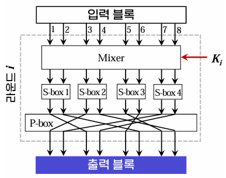

{:toc .large-only}

## 컴퓨터 보안

- 컴퓨팅 환경이 관여된 모든 상황에 대한 정보보호
- 컴퓨팅 환경에 저장되거나 처리되는 정보를 다양한 위협으로부터 보호하기 위한 정책 및 기법

### 정보보호의 목표

#### 기밀성 (Confidentiality)

- 허락되지 않은 자가 정보의 내용을 알 수 없도록 하는 것
- 정보에 접근하더라도 무의미한 내용만 보이도록 함

#### 무결성 (Integrity)

- 허락되지 않은 자가 정보를 임의로 수정할 수 없도록 하는 것
- 만약 허락되지 않은 자에 의해 수정이 발생했다면 이를 확인할 수 있어야 함

#### 가용성 (Availablity)

- 허락된 자가 정보에 접근하고자 할 때 이것이 방해받지 않도록 하는 것
- 즉, 정보에 대한 접근 권한이 있는 자는 필요할 때 언제든지 정보를 사용할 수 있어야 함
- 정해진 시간 내에 정보를 볼 수 있음을 보장해야 함

#### 그 외의 목표

- 부인방지: 정보에 관여한 자가 이를 부인하지 못하게 하는 것
- 인증: 어떤 실체가 정말 주장하는 실체가 맞는지 확인할 수 있고 신뢰할 수 있어야 함
- 접근제어: 접근 권한이 있는 자와 없는 자를 구분하여 제어할 수 있어야 함

## 암호

- 두 사람이 안전하지 않은 채널을 통해 정보를 주고받더라도 제3자는 이 정보의 내용을 알 수 없도록 하는 것
- 키(key): 암호화와 복호화를 위한 가장 중요한 열쇠

### 대칭키 암호

- 암호화와 복호화에 같은 키 하나를 사용하는 방식
- 장점: 암호화와 복호화 속도가 빠름
- 단점: 키 분배 문제 (암호화/복호화 하는 양쪽이 같은 키 값을 알아야 함)
- 블록 암호, 스트림 암호 방식이 있다.
- 대표적인 알고리즘: DES, AES, IDEA 등

### 공개키 암호

- 암호화와 복호화에 서로 다른 두 개의 키를 사용하는 방식
- 공개키: 누구나 공개키를 이용하여 암호화 가능
- 개인키: 오직 자신만 개인키를 이용하여 복호화 가능
- 장점: 키 관리가 쉬움, 키 분배 문제 해결
- 단점: 대칭키 암호에 비해 속도가 느림
- 대표적인 알고리즘: RSA, ECC, ElGamal 등

## 블록 암호

- 평문을 고정된 크기의 블록으로 나누어 각 블록마다 암호화 과정을 수행하여 블록 단위로 암호문을 얻는 대칭키 암호 방식

### 블록 암호 알고리즘

- 출력 블록의 각 비트는 입력 블록과 키의 모든 비트에 영향을 받음
- 주로 단순한 함수를 반복적으로 적용함으로써 암호학적으로 강한 함수를 만듦
  - 라운드 함수: 반복되는 함수
  - 라운드 키: 각 라운드 함수에 작용하는 키
  - 키 스케쥴: 키를 입력하여 라운드 키를 발생시키는 과정
- 파이스텔 구조와 SPN 구조가 있음

#### 파이스텔(Feistel) 구조

- 하나의 입력 블록을 분할하여 좌우 두 개의 블록으로 구분 후 짝수 번의 라운드를 진행
- 각 라운드의 출력 블록이 다음 라운드의 입력 블록
- 라운드 함수와 관계없이 역변환(복호화) 가능
- DES, SEED 등 예전 알고리즘에 사용

#### SPN 구조

- 하나의 입력 블록을 여러 개의 소블록으로 나눈 후 라운드를 진행
- 각 라운드의 출력 블록이 다음 라운드의 입력 블록
- 라운드 함수가 역변환 가능해야 함
- 더 많은 병렬성을 제공
- AES, ARIA 등 최근의 블록 암호에 사용

### 블록 암호의 사용 모드

#### ECB 모드

- 전자 코드 북(Electronic Code Book) 모드
- 평문을 일정한 블록 단위로 나누어 암호화하는 방식
- 암호화 시 블록이 손상되더라도 이후의 블록에는 영향을 미치지 않는다.
- 장점: 암호화/복호화 시 병렬 처리가 가능하다.
- 단점: 동일한 평문 블록은 동일한 암호문을 생성하여 패턴 분석이 가능하므로 보안에 취약하다.

#### CBC 모드

- 암호 블록 연결(Cipher Block Chaining) 모드
- 첫 블록은 IV(초기화 벡터)로 암호화하고, 이후 블록은 이전 암호문 결과와 XOR 연산을 순차적으로 반복하는 방식
- 장점: 암호화 시 한 블록이 손상되면 그 이후의 블록들에 모두 오류가 발생되므로 데이터 무결성을 검증할 수 있다. (메시지 인증에 사용)
- 단점: 암호화 시 이전 암호화 결과가 다음 암호화에 영향을 주므로 병렬 처리 불가능

#### CFB 모드

- 암호 피드백(Cipher FeedBack) 모드
- CBC의 변형으로, 블록 암호를 자기 동기 스트림 암호로 변환하는 방식
- 장점:
  - 암호화 시 한 블록이 손상되면 그 이후의 블록들에 모두 오류가 발생되므로 데이터 무결성을 검증할 수 있다. (메시지 인증에 사용)
  - 암호화/복호화 과정에 암호화 함수만 사용하므로 복호화 함수가 필요 없음
- 단점: CBC와 마찬가지로 암호화 시 병렬 처리를 할 수 없다.

#### OFB 모드

- 출력 피드백(Output FeedBack) 모드
- 주로 영상이나 음성 데이터와 같은 디지털 신호화된 아날로그 신호에 사용한다.
- 장점:
  - 암호화 시 블록이 손상되더라도 이후의 블록에는 영향을 미치지 않는다.
  - 복호화 함수가 필요 없음
- 단점:
  - 암호화 시 병렬 처리를 할 수 없다.
  - 공격자가 암호문 블록을 비트 반전시키면, 대응하는 평문 블록이 비트 반전된다.(비트 플리핑 공격)

#### CTR 모드

- 카운터(Counter) 모드
- 암호화 시 증가하는 카운터 값과 시작값 nonce를 암호화하여 키 스트림을 생성하고, 생성된 키 스트림과 평문 블록을 XOR 연산하여 암호문을 만드는 방식
- 장점:
  - 암호화/복호화 시 병렬 처리가 가능하다.
  - 암호화 시 블록이 손상되더라도 이후의 블록에는 영향을 미치지 않는다.
  - 복호화 함수가 필요 없다.
- 단점:
  - nonce나 카운터 값을 재사용하면 보안성이 떨어질 수 있다.
  - 공격자가 암호문 블록을 비트 반전시키면, 대응하는 평문 블록이 비트 반전된다.(비트 플리핑 공격)

#### 정리

| 모드                 | 병렬 처리 | 에러 전파 | 복호화 함수 필요 |
| -------------------- | :-------: | :-------: | :--------------: |
| ECB (전자 코드북)    |     O     |     X     |        O         |
| CBC (암호 블록 연결) |     X     |     O     |        O         |
| CFB (암호 피드백)    |     X     |     O     |        X         |
| OFB (출력 피드백)    |     X     |     X     |        X         |
| CTR (카운터)         |     O     |     X     |        X         |

#### 참고사이트

[블록 암호화 모드(ECB, CBC, CFB, OFB, CTR)](https://blog.skby.net/%EB%B8%94%EB%A1%9D-%EC%95%94%ED%98%B8%ED%99%94-%EB%AA%A8%EB%93%9Cecb-cbc-cfb-ofb-ctr/) 
[정보보안 - 블록 암호화 기법의 종류와 특징 : ESB, CBC, CFB, OFB, CTR](https://ohaengsa.tistory.com/entry/%EC%A0%95%EB%B3%B4%EB%B3%B4%EC%95%88-%EB%B8%94%EB%A1%9D-%EC%95%94%ED%98%B8%ED%99%94-%EA%B8%B0%EB%B2%95%EC%9D%98-%EC%A2%85%EB%A5%98%EC%99%80-%ED%8A%B9%EC%A7%95) 
[블록 암호 운용 방식](https://ko.wikipedia.org/wiki/%EB%B8%94%EB%A1%9D_%EC%95%94%ED%98%B8_%EC%9A%B4%EC%9A%A9_%EB%B0%A9%EC%8B%9D) 
[블록 암호의 운영 모드](https://blog.naver.com/wnrjsxo/221713141818)

## 스트림 암호

- 평문과 같은 길이의 키 스트림을 생성하여 평문과 키를 비트 단위로 XOR 연산하여 암호문을 얻는 대칭키 암호 방식
- 키 스트림을 생성할 때 규칙성이 없어 예측이 불가능한 랜덤 수열이 가장 안전함
  - 의사 랜덤(pseudorandom) 수열 생성: 예측이 어려우면서도 자동화된 생성
  - ex) LFSR (선형 귀환 시프트 레지스터)

## 대칭키 암호 알고리즘

### DES

- Data Encryption Standard
- 파이스텔 구조
- 블록 암호 알고리즘

### TDES

- Triple Data Encryption Standard
- DES를 3회 반복
  - DES의 안전성 문제 해결
  - DES보다 3배 느림

### AES

- Advanced Encryption Standard
- 2001년 미국 NIST에서 공표
- SPN 구조
- 블록 암호 알고리즘
  - 128비트 단위의 블록을 128/192/256비트 중 하나의 키로 암호화
- 마지막 라운드는 3라운드, 그 외의 라운드는 4라운드 암호화 과정

## 전자봉투의 암호화/복호화

### 암호화 과정

1. 철수의 메시지 평문에 해시 함수를 적용하여 해시값(메시지 다이제스트)을 생성함
2. 이 해시값을 철수의 사설키로 암호화하여 전자서명을 생성함
3. 메시지와 전자서명, 철수의 공개키가 들어있는 인증서를 대칭키(비밀키)로 암호화
4. 이 대칭키를 영희의 공개키로 암호화하여 전자봉투를 생성함
5. 3번의 암호문과 4번의 전자봉투를 영희에게 전송함

### 복호화 과정

1. 영희는 암호문과 전자봉투를 수신
2. 전달받은 전자봉투를 영희의 사설키로 복호화하여 대칭키(비밀키)를 획득함
3. 획득한 대칭키로 암호문을 복호화하여 메시지, 전자서명, 철수의 인증서를 획득함
4. 철수의 인증서에 있는 공개키를 통해 전자서명을 복호화하여 해시값을 획득함
5. 메시지에서 생성한 해시값과 3번의 해시값을 비교하여 메시지 위변조 여부를 검증함

### 참고사이트

[전자봉투(Digital Envelope)](https://m.blog.naver.com/sdug12051205/221575078655) 
[전자봉투 (Digital Envelope)](https://blog.skby.net/%EC%A0%84%EC%9E%90%EB%B4%89%ED%88%AC-digital-envelope/)
