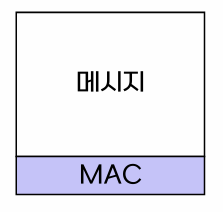
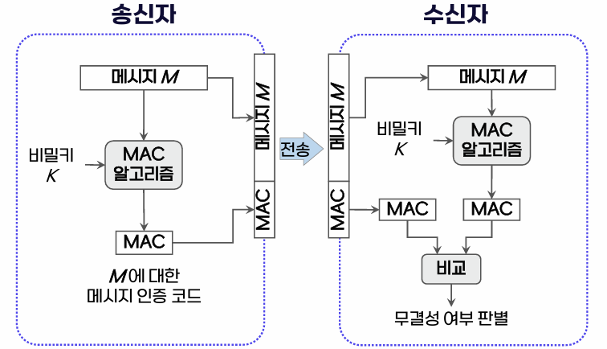
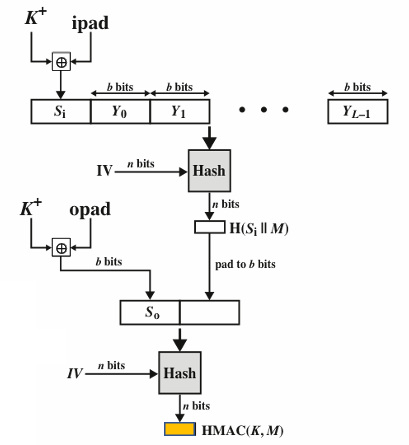
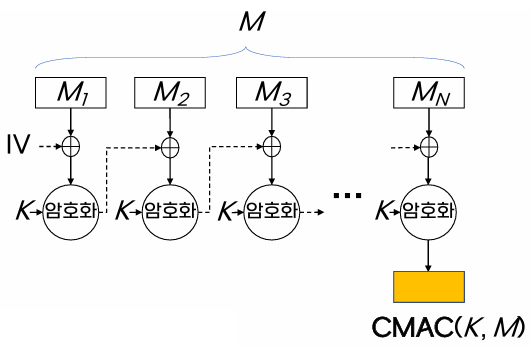
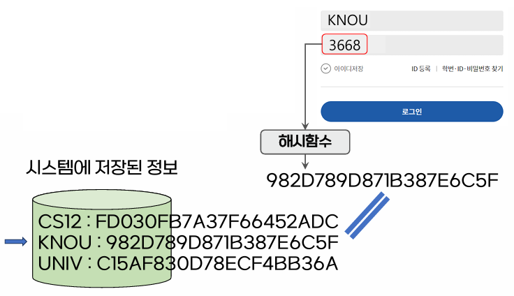

{:toc .large-only}

## 인증

어떤 실체가 정말 그 실체가 맞는지 확인하는 과정

### 메시지 인증

- 수신된 메시지에 대한 인증
- 메시지의 내용이 전송 도중 변경되지 않고 정확하고 완전하게 수신되었는지 확인하는 것
- 메시지에 대한 무결성 확인

### 메시지 인증 코드 (MAC)

- Message Authentication Code
- 메시지 인증을 위한 부가적인 정보
- 송신자는 메시지를 보낼 때 MAC을 함께 전송
- 수신자는 받은 메시지의 변조 여부를 MAC을 이용해 확인

#### MAC 인증 과정

- 송신자는 비밀키와 MAC 알고리즘을 이용하여 메시지 M으로부터 MAC을 생성한다.
- 수신자는 송신자와 똑같은 비밀키와 MAC 알고리즘으로 MAC을 생성한다.
- 송신자의 MAC과 수신자의 MAC을 비교하여 무결성 여부를 판별한다.
- 만약 중간에서 메시지나 MAC이 위변조 되었다면, 송신자와 수신자의 MAC이 달라진다.

#### MAC의 특징

- 비밀키 이용
  - 제3자가 메시지의 내용을 위변조할 수 없음
- 기밀성은 제공 안함
  - 제3자가 메시지와 MAC을 볼 수 있음
- 작은 크기
  - 메시지 크기와는 무관

### MAC 알고리즘

#### HMAC (Hash-based MAC)

- 해시함수에 기반
- 비밀키를 메시지에 덧붙인 후 해시함수를 적용

#### CMAC (Cipher-based MAC)

- 블록암호에 기반
- CBC 모드를 메시지에 적용

## 사용자 인증

- 시스템에 접근하려는 사용자에 대한 인증
- 비밀번호 방식, 생체인식 방식, 토큰 방식, 2단계 인증 등이 있다.

### 비밀번호 방식

- 가장 일반적인 방식의 사용자 인증
- 사용자가 입력하는 비밀번호가 시스템에 저장된 정보와 일치하는지 여부로 인증
- 시스템은 사용자 id와 비밀번호의 쌍을 알고 있어야 함
- 해시함수를 통해 비밀번호를 **해시코드**로 저장하여 시스템에 저장된 비밀번호가 유출되는 것에 대비
  - 해시코드를 탈취당해도 원본 비밀번호를 알 수 없으므로 로그인 불가

### 생체인식 방식

- 개개인의 고유한 정보인 특정 생체정보를 이용하는 사용자 인증
- 지문, 홍채, 얼굴, 음성, 손등이나 손바닥 혈관 등
- 사용자의 생체정보를 미리 시스템에 저장해 두어야 함

### 토큰 방식

- 사용자가 소유하고 있는 특정한 정보를 이용하는 사용자 인증
- 토큰 안에 저장된 정보를 통해 얻을 수 있는 결과값 이용
- 보안 토큰, 스마트카드, 실물키, 휴대전화 등
  - ex) 휴대전화로 일회용 인증 코드를 받아 이를 확인

### 2단계 인증 방식 (2FA)

- Two-Factor Authentication
- 사용자가 알고 있는 정보(ex. 비밀번호)와 소유하고 있는 정보(ex. 토큰)를 모두 이용하는 사용자 인증
- 서로 다른 성격의 정보를 혼합하여 이용함으로써 좀 더 엄밀한 사용자 인증 가능
- 다중요소 인증(MFA: Multi-Factor Authentication) 이라고도 함
  - 알고 있는 정보, 소유하고 있는 정보, 고유한 속성 중 둘 이상을 이용하여 사용자 인증
