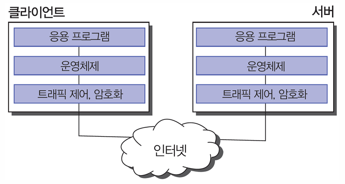
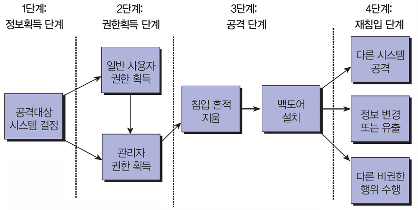

{:toc .large-only}

## 서버/클라이언트 구조

- 서버: 서비스를 제공하는 컴퓨터
- 클라이언트: 서버에 접근하여 서비스를 제공받는 컴퓨터

### 인터넷 공격에 대한 방어 지점

#### 응용 프로그램 계층

- 서버 프로그램은 종종 백도어나 버그 같은 취약성을 가짐
- 공격자는 이러한 보약 취약성을 이용하여 운영체제에 대한 접근 권한을 획득함

#### 운영체제 계층

- 보안의 가장 근본적인 레벨로 컴퓨터의 모든 행위를 관장
- 대부분의 공격 목적은 운영체제의 제어권을 확보하는 것이다.

#### 네트워크 제어

- 시스템의 in/out 트래픽을 제어하여 잠재적으로 유해한 네트워크 트래픽을 줄일 수 있음
- 운영체제 내 또는 별도의 독립된 장비에서 수행될 수 있음

#### 전송 데이터 제어

- 인터넷을 통해 전송되는 정보는 누구나 열람 가능
- 전송자는 정보를 암호화하여 전송한 뒤 수신자 쪽에서 복호화하여 확인하는 것이 바람직

### 서버 침입 및 정보유출 단계

## 서버 공격의 유형

### 계정 크랙 공격

공격자가 서버에 접속할 수 있는 계정의 ID와 패스워드를 알아내는 공격

#### 전수 공격 (Brute Force Attack)

- 계정의 ID, 패스워드를 자동 조합하여 크랙하는 공격
- 사용할 수 있는 문자의 종류와 길이 제한에 맞게 시도 (ex. 숫자 4글자: 0000부터 9999까지 자동 조합)
- 많은 시간이 소요됨

#### 사전 공격 (Dictionary Attack)

- ID와 패스워드가 될 가능성이 있는 단어를 사전 파일로 만들어 놓고, 사전 파일의 단어를 대입하여 크랙하는 공격
- 사전 파일: 서버를 이용하는 사람의 다양한 정보(생넌월일, 전화번호 등)로 생성 (ex. Kim, 010203 -> kim010203)
- 전수 공격보다 시간이 훨씬 단축됨

### 네트워크 공격

#### 스푸핑 (Spoofing)

- IP 주소, MAC 주소 등의 정보를 속임으로써 권한을 획득하여 중요 정보를 가로채고 서비스 방해까지 행하는 공격

#### 스니핑 (Sniffing)

- 네트워크 패킷으로 전달되는 중요 정보를 도청하는 공격

#### 서비스 거부(DoS) 공격

- 대량의 패킷을 이용하여 네트워크를 마비시키거나 특정 서비스의 수행을 방해하는 공격

### 시스템 취약점을 이용한 공격

#### 버퍼 오버플로 공격

- 메모리에 할당된 버퍼의 양을 초과하는 데이터를 입력하여 프로그램의 복귀 주소를 조작함으로써 공격자가 원하는 코드를 실행하는 공격
- 스택 오버플로, 힙 오버플로 공격이 있음

#### 레이스 컨디션(race condition) 공격

- 두 프로세스가 동일한 자원을 사용하기 위해 경쟁하는 것을 이용한 공격
- 시스템 프로그램과 공격 프로그램이 경쟁 상태에 이르게 하여 시스템 프로그램의 권한을 획득해 공격 프로그램이 원하는 파일에 접근 가능하게 하는 방법

#### 기본 설정 오류를 이용한 공격

- 시스템을 활용하기 위한 다양한 설정 중 취약한 설정에 대한 공격
- 공유 폴더나 관리자 암호를 취약한 암호로 설정하여 사용하는 경우를 이용
- IIS 웹 서버 설정에서 쓰기 권한을 부여한 경우 등

### 사회공학적인 공격

- 사람을 속여서 민감한 정보를 유출하게 하는 기술
- 내부자와의 결탁이나 내부자의 부주의로 인한 정보유출
- 피싱, 파밍 등으로 인한 정보유출

## 서버 보안 대책

### 계정과 패스워드 보호

#### 계정 관리

- 사용자별 또는 그룹별 접근 권한 부여
- 루트(root) 권한에 대한 사용 제한
- 불필요한 사용자 계정 삭제
- guest, anonymous 등 특정 공개용 계정 사용 제한
- 새로운 사용자 추가 시 일관성 있는 정책 유지
- 잘못된 비밀번호가 일정 횟수 시도된 계정 잠그기

#### 패스워드 관리

- 유추 가능한 단어를 패스워드로 사용하지 않기
- 문자, 숫자, 특수문자를 조합하여 패스워드 만들기
  - 다양한 문자 조합보다 긴 패스워드 사용이 안전
- 패스워드 파일을 해시함수로 일방향 암호화하여 보관하기
- 섀도(shadow) 패스워드 시스템 사용

### 시스템 접근 제어

#### 임의적 접근 제어 (DAC)

- Discretionary Access Control
- 관리자 혹은 자원 소유자가 보안 관리자의 개입 없이 **자율적 판단에 따라** 보유하고 있는 자원의 접근 권한을 다른 사용자에게 부여
- 자원의 공동 활용이 더 중요시되는 환경에 적합
- 자원의 유출 가능성 내포
- 접근 제어 목록(ACL: Access Control List) 유지
  - 자원별로 어떤 사용자가 어떤 접근 권한을 갖는지에 대한 정보 관리

#### 강제적 접근 제어 (MAC)

- Mandatory Access Control
- 각 객체에 비밀등급을, 각 사용자에 허가등급을 부여
- 사용자가 객체에 접근할 때마다 사전에 정의된 규칙에 근거하여 접근 권한 부여
- 규칙의 적용은 모든 사용자 및 객체에 대해 일정함
- 객체의 소유자에 의해 접근 제어 관계가 변경되지 않음
- 정보의 기밀성이 매우 중요시되는 환경에 적합

#### 역할 기반 접근 제어 (RBAC)

- Role-Based Access Control
- 권한은 역할과 관련이 있음
- 사용자는 역할의 멤버가 됨으로써 권한을 배정 받음
- ex) 운영자 역할은 모든 자원에 접근 가능하지만 보안 관리자가 아니므로 접근 권한은 변경 불가

#### 최소 권한

- Least Privilege
- 사용자와 객체에 꼭 필요한 최소한의 권한만 부여
- 보안에 대한 취약 요소를 줄이기 위함
- ex) 스크립트나 바이너리는 주로 루트 계정만 사용하므로 기타 계정에는 권한 제거
- ex) 리눅스의 apache 계정은 웹 서버만 실행하므로 다른 실행 권한 제거

#### UNIX 계열의 접근 제어

- chmod 명령어
  - 파일과 디렉터리에 대한 접근 권한 변경
- chown 명령어
  - 파일과 디렉터리에 대한 소유자 및 소유 그룹 변경

### 파일 시스템 보호

#### UNIX 계열

- 접근 및 변경 권한을 루트로 설정
  - ~/.login, ~/.profile, crontab 등
- 불필요한 파일에 설정된 SetUID, SetGID 비트 제거
  - 실행 파일에 SetUID가 설정되어 있으면 해당 파일이 실행될 때 실행시킨 사용자가 아닌 파일 소유자의 권한으로 실행됨
- umask 설정

#### 윈도우

- 보안 기능이 강화된 NTFS 파일 시스템 사용 권장
- administrator 계정의 사용 권한 관리

#### 파일 시스템 보호 정책

- 파일 시스템 백업 및 복구
- 파일 시스템의 무결성 검사
  - UNIX용 tripwire 등 무결성 점검 도구 이용

### 시스템 파일 설정과 관리

#### UNIX 계열

- mount 테이블을 이용한 파일 시스템 관리
- TCP-wrapper, xinetd 등을 활용하여 호스트 접근 제어 관리
- telnet, rcp 대신 ssh, scp 사용

#### 윈도우

- NTFS에 대한 사용 권한 설정
- 레지스트리 원격 액세스 권한 제어 및 백업

### 운영제체의 취약점 관리

- 작업 용도에 따른 시스템 파티션 분리
  - 루트 영역과 사용자 파일 시스템 분리
- 불필요한 서비스 중지 및 프로그램 제거
- 패치 관리

### 시스템 로그 설정과 관리

- UNIX 계열: syslog를 통해 시스템 로그 설정
- 윈도우: 이벤트 뷰어를 통해 시스템 로그, 응용 프로그램 로그, 보안 로그 등 관리
- 로그 파일 분석: 비정상적인 시간대의 접근, 실패한 로그인, 의심스러운 su 명령 등 확인
