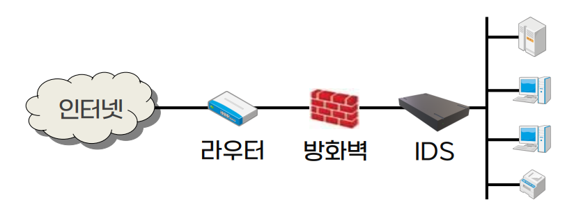
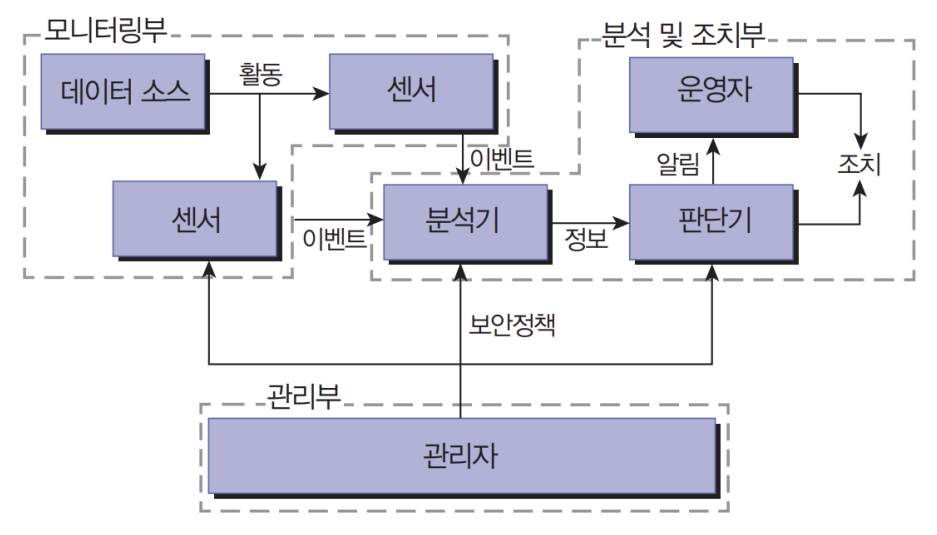

{:toc .large-only}

## 침입차단 시스템 (방화벽, Firewall)

- 외부 네트워크의 공격자나 인증되지 않은 사용자, 혹은 유해한 정보로부터 보호하기 위한 보안 정책과 이를 수행하는 하드웨어, 소프트웨어 등
- 외부 네트워크와 내부 네트워크 중간지점에서 두 네트워크 사이를 오가는 트래픽의 종류와 양을 제어함
- 방화벽 구성 방식
  - 패킷 필터링
  - 서킷 게이트웨이
  - 애플리케이션 게이트웨이
  - 하이브리드 방식

### 패킷 필터링

- OSI 7계층 중 네트워크 계층(3 계층)과 트랜스포트 계층(4 계층)의 패킷을 필터링하여 내부 네트워크 보안을 설정
- 패킷 필터링 라우터에 의해 TCP 포트와 IP 주소 패킷 중 전체 혹은 일부를 필터링
- 장점
  - 네트워크 제어에 대한 반응 속도가 매우 빠름
  - 사용자에게 투명한 서비스 제공
  - 기존 프로그램과의 연동에 유연함
- 단점
  - TCP/IP 헤더는 조작이 쉬워 보안성이 약함
  - 로그인과 인증 방식이 강력하지 않음
  - 트래픽의 접속제어 방식과 접속량에 따라 성능에 큰 영향을 받음

### 서킷 게이트웨이

- OSI 7계층 중 세션 계층(5 계층)에서 애플리케이션 계층(7 계층)까지 방화벽 기능 수행
- 외부 네트워크에서 내부 네트워크로 접속하려면 서킷 프록시(proxy) 프로그램이 설치되어 있어야 함
- 초기의 방화벽 방식으로, 현재는 보안 기능이 복잡해지면서 거의 사용하지 않음

### 애플리케이션 게이트웨이

- = 프록시 게이트웨이(proxy gateway)
- OSI 7계층 중 애플리케이션 계층(7 계층)에서 방화벽 기능 수행
- 서비스 요청 및 요구된 데이터는 애플리케이션 게이트웨이를 통해서만 전달
- 로그인 정보가 애플리케이션 게이트웨이에 기록 및 제어됨
- IP 주소 및 TCP 포트를 이용하여 네트워크 보안 설정
- 사용자 인증과 서비스별로 프록시 서버가 트래픽의 보안 검사 실시
- 장점
  - 외부와 내부 네트워크가 프록시 서버를 통해서만 연결되므로 패킷 필터링 방식보다 보안이 우수함
  - 강력한 로그인과 감시 기능
- 단점
  - 애플리케이션 계층에서 처리하므로 속도가 떨어짐
  - 일부 서비스의 투명도가 떨어짐
  - 프록시 사용으로 새로운 서비스에 대한 유연성이 부족

### 하이브리드 방식

- 패킷 필터링과 애플리케이션 게이트웨이를 혼합한 방식
- 사용자의 편의성과 보안성을 충족시킬 수 있도록 원하는 서비스에 따라 선택적으로 보안 정책을 구축 및 관리
- 장점
  - 빠른 반응 속도
  - 보안 설정 수준이 높음
  - 변경 용이
- 단점
  - 관리가 어렵고 복잡함

### 방화벽의 구축 형태

#### 스크리닝 라우터

- 외부로 나가거나 내부로 들어오는 패킷을 허용하거나 거부할 수 있는 네트워크 장비
- IP 주소(출발지 및 목적지)에 의한 필터링, TCP 포트 번호에 의한 필터링 등을 수행

#### 베스천 호스트

- 외부 네트워크와 내부 네트워크를 연결하는 통로가 되는 방화벽 호스트
- 접근제어 및 애플리케이션 게이트웨이로서 프록시 서버의 설치, 인증, 로그 등을 담당

#### 듀얼 홈 호스트

- 외부 네트워크와 내부 네트워크가 물리적으로 분리
- 두 네트워크 간의 유일한 통로를 구축하여 두 인터페이스에 필터링을 실시
- 방화벽 초기의 형태

#### 스크린 호스트 게이트웨이

- 스크리닝 라우터와 베스천 혹은 듀얼 홈 호스트 결합
- 외부에서 내부 네트워크로 들어오는 정보
  - 1차: 패킷 필터링
  - 2차: 프록시 서버로 사용자 인증 및 서비스 인증
- 장점
  - 트래픽을 2단계로 방어하여 안정성, 보안성 우수
  - 많이 사용되는 방화벽 시스템으로 융통성 우수
- 단점
  - 구축 비용이 비쌈
  - 라우팅 테이블이 변경되면 방어할 수 없음

#### 스크린 서브넷 게이트웨이

- 스크리닝 라우터 두 개와 베스천 호스트를 이용하여 외부와 내부 네트워크 사이에 중립적 네트워크를 구축
- 웹 서버 등 기관에서 외부로 공개할 정보 서버를 DMZ(비무장지대)에서 운영

### 방화벽의 취약점

- 터널링 공격
  - 차단되어야 할 패킷이 다른 네트워크 프로토콜에 의해 캡슐화되어 공격에 사용되면 차단할 수 없음
- 응용 기반 공격
  - 응용개체 간 직접 패킷을 전송하는 경우, 응용 모듈에 포함된 취약성에 의해 발생될 수 있는 공격은 차단할 수 없음
  - ex) 버퍼 오버플로가 발생할 수 있는 HTTP 명령어를 웹 응용 모듈에 전송

## VPN (가상사설망)

- Virtual Private Networks
- 공중망을 이용하여 사설망처럼 직접 운용 관리하는 것
- 저렴한 비용으로 서비스 제공자와의 유연한 연결 가능
- 안전성, 성능 향상, QoS, 보안을 제공
- 인트라넷 안에서 사용되며 중요 정보, 시스템, 자원에 대한 접속을 컨트롤
- 기밀정보의 안전한 전송을 보장

### VPN의 기능

- 보안 및 정보 보호
- 서비스 품질(QoS, Quality of Service) 향상
  - 손실률, 패킷 지연율 개선
- 다중 VPN 구성
- 신뢰성, 유용성, 보안 관리 기능
- 다중 서비스 공급자 지원
- 다중방송(multicast) 가능

### VPN의 분류

- 방화벽 기반
  - 관리 포인트 단순
  - 트래픽 증가 시 암호화/복호화에 따른 성능저하
- 라우터 기반
  - 성능 문제 극복
  - 보안성 제공 불가
- 전용
  - 성능 문제 극복
  - 편의성 제공
- 소프트웨어 형태
  - 개인 용도
  - 이동 중 사용 목적

### VPN 기술 동향

- VPN 구성
  - 기반 기술: 터널링 기술, 키 관리 기술, VPN 관리 기술
  - 그 외: 인증 및 암호화 기술, 라우터나 방화벽에서 제공하는 보안 기술
- VPN 구현과 관련된 주요 이슈
  - 최신 보안 모델과 변화 움직임
  - MPLS VPN과 IPsec VPN의 적절한 이용을 통한 전체 VPN 서비스망 구축 등

## 네트워크 접근제어(NAC) 시스템

- Network Access Control
- 패치가 제대로 이루어지지 않은 시스템이나, 인증을 제대로 거치치 않은 시스템의 네트워크 접근을 통제하는 시스템

### NAC 동작 과정

1. 네트워크 접근을 요청하는 장치가 있으면 해당 장치가 NAC에 등록되어 있는지 확인
1. 만약 등록되지 않았다면 정책에 따라 추가로 사용자 인증을 거쳐 진행 여부를 결정
1. 등록된 장치이거나 인증된 사용자의 새로운 장치라면 보안 패치나 백신이 잘 적용되었는지 확인 후 미흡하면 보완
1. 모든 준비가 완료되면 네트워크 접근을 허용

## 침입탐지 시스템 IDS

- Intrusion Detection System
- 컴퓨터 자원의 기밀성, 무결성, 가용성을 저해하는 행위를 실시간으로 탐지하는 시스템
- 허가받지 않은 접근이나 공격 시도를 감지하여 시스템 또는 네트워크 관리자에게 통보
- 방화벽이 막을 수 없는 경우에도 공격을 탐지
- 서브넷의 시스템 해킹 시 이를 탐지
- 해킹의 구체적인 내용을 관리자에게 알려주어 그에 따른 대응을 할 수 있도록 하는 솔루션

### IDS의 기능

- 사용자와 시스템 행동에 대한 모니터링 및 분석
- 시스템 설정과 취약성에 대한 감사 기록
- 중요 시스템과 데이터 파일에 대한 무결성 평가
- 알려진 공격에 대한 행위 패턴 인식
- 비정상적 행위 패턴에 대한 통계적 분석

### IDS의 구성

- 모니터링부
  - 정보수집 단계
  - 호스트나 네트워크로부터 데이터 수집
  - 수집된 데이터는 특정 패턴을 검출하기 위해 다음 단계로 넘어감
- 분석 및 조치부
  - 정보 가공 및 축약 단계
  - 분석 및 침입 탐지 단계
  - 보고 및 조치 단계
- 관리부
  - 모니터링부와 분석 및 조치부에 대한 통제 및 관리
  - 모니터링부와 분석 및 조치부에 보안정책 제공

### IDS의 모니터링 방법

#### 응용 기반

- 애플리케이션 계층에서의 정보 수집
  - DB 관리 소프트웨어, 웹 서버, 방화벽 등에 생성된 로그 포함
- 장점
  - 시스템상의 미세한 침입 탐지 가능
  - ex) 사용자에 대해 특정 응용 서비스에 대한 특징을 사용하는 것을 모니터링
- 단점
  - 애플리케이션 계층의 취약성을 공격하여 침입 탐지 방법의 무결성 훼손 가능

#### 호스트 기반 (HIDS)

- 호스트상에서 발생하는 이벤트를 통해 침입 탐지
- 특정 시스템에서 발생하는 행위에 대한 정보 수집
  - 시스템 로그, 운영체제 프로세스에 의해 생성된 로그 포함
  - 사용자 명령어와 기본 로그 파일만 사용하는 것부터 시스템 콜 레벨의 감사 자료를 사용하는 것까지 다양
- 장점
  - 문제가 되는 행위를 지정된 사용자 ID에 매핑 가능
  - 오용과 관련된 행동 변경을 추적 가능
  - 암호화된 환경에서 동작 가능
- 단점
  - 네트워크 행위가 보이지 않음
  - 다양한 운영체제를 지원해야 함
  - 운영체제의 취약성은 에이전트와 분석도구에 대한 무결성 훼손 가능

#### 목표 기반

- 목표 객체(특정 데이터나 프로세스)에 대한 무결성 분석
  - 공격 프로세스의 결과인 특정 파일과 시스템 객체 등을 모니터링
- 장점
  - 무결성을 분석하여 다른 방법으로는 할 수 없는 침입 탐지 가능
  - 시스템 변형 공격의 존재 유무에 대해 신뢰성 있는 탐지 가능
  - 시스템 복구를 위해 대체되어야 할 파일을 결정하여 효율적으로 복구
- 단점
  - 하위 단말 시스템의 프로세스에 많은 부하
  - 실시간 탐지 프로세스에는 부적합

#### 네트워크 기반 (NIDS)

- 네트워크 패킷을 분석하여 침입 탐지
  - 무차별 모드를 이용한 패킷 스니핑으로 수집
- 장점
  - 초기 구축 비용이 저렴함
  - 운영체제에 독립적
  - 감사나 로그 메커니즘을 위한 특별한 요구사항 필요 없음
  - SYN flooding, 패킷 폭풍 같은 네트워크 공격을 모니터링
- 단점
  - 호스트상에서 수행되는 세부 행위 탐지 불가
  - 암호화된 패킷은 분석 불가
  - 고속 대규모 네트워크 환경에서는 탐지율이 낮음

#### 통합 방식

- 응용 기반, 호스트 기반, 네트워크 기반 센서들을 조합
- 장점
  - 모든 레벨에서의 행위를 모니터링
  - 시간이나 공간 제약 없이 모니터링하기 용이
  - 사고 분석과 합법척 처리(범죄고발 등) 수행에 도움
- 단점
  - 구성요소 간 상호동작성을 위한 산업표준 부재로 서로 다른 제품 간의 요소 결합이 어려움
  - 통합된 시스템의 관리와 이행이 어려움

### IDS의 정보수집과 분석 시기

#### 일괄처리 방식

- 일정한 시간 단위로 배치 방식에 의해 정보를 수집 및 분석
- 장점
  - 보안위협 수준이 낮고 단일공격에 의한 시스템의 손상 가능성이 높을 경우 적합
  - 실시간 방식보다 시스템에 대한 프로세스 부하가 적음
  - 시스템과 인적 자원이 제한된 조직에 적합
- 단점
  - 사건 발생에 대한 즉각적인 대응이 어려움
  - 수집된 정보 집합은 분석 시스템상의 디스크 저장공간을 많이 소비함

#### 실시간 방식

- 연속적인 정보수집과 분석, 보고 기능 제공
- 공격을 방해하기 위해 탐지 프로세스가 빠른 응답을 발생시킴
  - 이메일, SMS 등을 통한 오프사이트 경고 지원
- 장점
  - 관리자가 공격을 저지할 수 있도록 충분히 빠른 공격 탐지 가능
  - 관리자는 시스템 복구를 위한 사고 처리를 빠르게 수행할 수 있음
- 단점
  - 많은 메모리와 프로세스 리소스 소비
  - 설정값이 잘못되면 허위 경고가 많이 발생할 수 있음

### IDS의 분석 방법

#### 시그니처 분석

- 알려진 공격이나 시스템 오용과 관련된 것을 규정한 패턴과의 일치 여부 확인
  - 벤더가 공급하는 DB를 통해 알려진 공격에 대한 시그니처 분석
  - 고객에 의해 명시된 시그니처가 추가될 수 있음
  - 벤더는 주기적으로 시그니처 DB 업데이트 연동
- 장점
  - 통계적 분석보다 효율적
- 단점
  - 알려지지 않은 공격은 대처 불가

#### 통계적 분석

- 정상적인 행위 패턴으로부터 그 편차를 찾아내는 것
  - 해당 시스템의 정상적인 사용에 대한 다양한 속성을 판정
  - 관찰된 값이 정상적인 범위에 속하지 않을 경우 침입 가능성 신호 발생
- 장점
  - 알려지지 않은 공격 검출 가능
  - 범위를 벗어나는 좀 더 복잡한 공격을 탐지할 수 있도록 도움
- 단점
  - 잘못된 경고 신호를 보낼 가능성 높음
  - 작업의 변동이 많은 경우 적합하지 않음

#### 무결성 분석

- 파일이나 객체의 어떤 측면이 변경되었는지에 초점
  - 파일이나 디렉터리 속성, 내용, 데이터 스트림 등
- 해시 알고리즘 같은 강력한 암호 메커니즘 사용
- 장점
  - 변조된 파일 혹은 네트워크 패킷 탈취기 설치 등의 공격 흔적 검출
- 단점
  - 일괄처리 방식을 사용하므로 실시간 대응에 도움이 안 됨

## 침입방지 시스템 IPS

- Intrusion Prevention System
- 공격 탐지 시 자동으로 대응 작업을 수행하여 행위를 중지시키는 시스템
- 수동적인 침입 탐지 시스템과 달리 능동적으로 동작함

### IPS의 분류

#### 호스트 기반 (HIPS)

- 소프트웨어 제품이 일반적임
- 방화벽 규칙 집합과 같은 정책이나 정상/비정상 접근에 대한 학습을 통해 응용 프로그램을 보호함
- 커널과 함께 동작하는 방식과 커널에 독립적으로 동작하는 방식으로 구분

#### 네트워크 기반 (NIPS)

- 침입 방지 능력과 빠른 대응 속도를 위해 네트워크 라인상에 위치
- 세션 기반 탐지를 지원하는 시스템
- 통합 장비로 기능이 강화되고 있으며, 수십 Gbps 이상의 초고속 환경에서 적용 가능하도록 성능 개선이 이루어지고 있음
