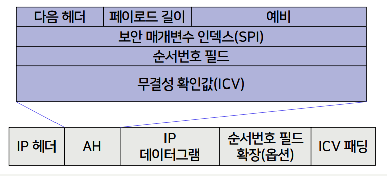

{:toc .large-only}

## 보안 위협요소

- 물리적인 위협
  - 네트워크 시스템에 대한 직접적인 파괴나 손상을 입히는 행위 또는 도난 등
- 기술적인 위협
  - 수동적 공격: 통신회선상의 정보를 무단으로 **취득**하는 행위
  - 능동적 공격: 통신회선상의 정보를 **변조 및 위조**하는 행위

## 네트워크 보안

- 수동적 공격에 대한 방어
  - 통신회선상의 데이터를 암호화
  - 통신회선에 대한 제3자의 접속시도를 방지
- 능동적 공격에 대한 방어
  - 통신회선상의 데이터를 암호화
  - 수신 측에서 데이터에 대한 무결성을 확인

### 네트워크 보안의 목표

- 기밀성
- 무결성
- 가용성
- 부인방지
- 사용자의 신분확인 및 인증
- 데이터 발신처 확인
- 접근제어

### 네트워크 보안 모델

- 네트워크 보안 서비스
  - 네트워크 보안을 강화하기 위한 제반 서비스
  - 보안공격을 방어하기 위한 것
- 네트워크 보안 메커니즘
  - 네트워크 보안공격을 예방, 탐지, 복구하기 위한 제반 기법
  - 보안 서비스를 구성하는 기술

### 네트워크 보안 서비스

#### 인증

- 수신된 데이터의 실체가 원하는 실체인지 확인
- 대등개체 인증 (peer entity authentication)
  - 통신 당사자 간에 서로의 신분 확인, 자격 유무 점검
  - 대등한 개체 간의 신뢰성 있는 연결 확립 또는 전송 과정에 적용
  - 패스워드 및 암호화 기법
- 데이터 발신처 인증 (data origin authentication)
  - 데이터 발신처를 확인한 후 해당 발신처의 자격 유무 확인
  - 송수진자 상호 간의 통신 없이 정보를 제공하는 단발성 네트워크 (ex. 이메일)
  - 데이터 수정 등에 대한 보안은 제공 못함

#### 접근제어

- 비인가된 사용자의 위협으로부터 정보 자원을 보호
- 사용자의 신분을 확인하고 해당 사용자가 정보자원에 대해 어느 수준의 접근권한을 갖고 있는지 확인
- 보호해야 할 정보자원에 대한 불법적인 접근이 이루어지지 못하게 함

#### 기밀성

- 네트워크를 통해 전달되는 정보의 내용이 노출되는 것을 방지
- 네 가지 형태로 구분
  - 접속 기밀성: 통신 당사간 간에 오가는 모든 데이터를 보안
  - 비접속 기밀성: 단발성 데이터를 보안
  - 선택영역 기밀성: 특정 데이터를 선택하여 보안
  - 트래픽 흐름 기밀성: 데이터 전송 흐름을 보안

#### 데이터 무결성

- 데이터의 내용이 인가되지 않은 방식에 의해 변경 또는 삭제되는 것을 방지
- 다섯 가지 형태로 구분
  - 복구 기능을 갖는 접속 무결성: 변조된 데이터를 복구
  - 복구 기능이 없는 접속 무결성: 변조된 데이터를 재요청
  - 선택영역 접속 무결성
  - 비접속 무결성
  - 선택영역 비접속 무결성

#### 부인방지

- 발신 부인방지: 데이터의 발신자가 발신 사실을 부인하지 못하도록 방지
- 수신 부인방지: 데이터의 수신자가 수신 사실을 보인하지 못하도록 방지

#### OSI 7계층과 보안 서비스

### 네트워크 보안 메커니즘

#### 암호화

- 인증, 기밀성, 무결성을 제공하는 강력한 수단
- 두 호스트 간 혹은 두 응용 시스템 간에 적용

#### 전자서명

- 인증과 무결성을 제공하는 수단
- 데이터에 대한 서명과 서명된 데이터에 대한 검증 절차
  - 서명: 비밀정보인 서명자의 개인키를 사용하여 전자서명 생성
  - 검증: 공개정보인 서명자의 공개키를 사용하여 서명된 데이터를 검증함으로써 정보를 보낸 사람이 그 사람이 맞는지 확인
- 개인키 소유자가 아니면 누구도 서명된 데이터 생성 불가
- 서명자는 그 데이터에 서명하고 송신했음을 부인 불가
- 데이터를 받은 사람은 서명된 데이터를 변조 및 위조 불가

#### 접근제어

- 사용자의 접근권한을 결정하거나 사용자에게 접근권한을 부여하기 위해 사용자의 고유성, 정보, 자격 등을 이용
- 다음과 같은 정보들을 사용
  - 접근제어 정보
  - 패스워드 등과 같은 인증정보
  - 자격, 소유, 기타 부가적 표시
  - 보안 레이블
  - 접근시도 시간, 경로 및 접근지속 시간

#### 데이터 무결성

- 네트워크 상에서 데이터의 정확성을 점검하는 메커니즘
- 송신자
  - 데이터 자체에 대한 특정값을 계산하여 무결성 기능 제공
  - 메시지 인증 코드(MAC), 조작 점검 코드(MDC) 등 무결성 정보 생성
- 수신자
  - 수신한 데이터와 관계 있는 무결성 정보를 생성
  - 수신한 무결성 정보와 비교하여 데이터의 변경 여부 확인
- 데이터 재사용을 막기 위해 타임스탬프 사용

#### 인증교환

- 패스워드 같은 단순한 신분확인 정보 이용부터 암호기술 이용까지 다양함
- 사용자 특성이나 소유권한 이용 가능
- 타임스탬프, 동기 클록, 2-방향 혹은 3-방향 핸드셰이크, 부인방지 등 선택

#### 트래픽 패딩

- 트래픽 흐름의 해석을 방지하기 위해 다양한 수준의 보안을 제공하는 메커니즘
- 실제의 데이터가 아닌 정보를 고의로 네트워크에 흘림
- 기밀성 서비스에 의해 보호된다면 더욱 효율적임

#### 라우팅 제어

- 네트워크로 전달되는 데이터에 대한 보안요구를 충족하기 위해 물리적/논리적 전송경로를 선택하는 메커니즘
- 물리적으로 안전한 서브네트워크, 릴레이 시스템, 링크 등을 사용
- 특정 보안수준을 갖는 데이터는 보안 방침에 따라 특정 서브네트워크, 릴레이 시스템, 링크 등을 통해 전송되는 것이 금지될 수 있음
  - 이 경우 접속 설정자나 비접속 데이터 단위의 송신자는 이들을 피하는 라우팅 절차를 규정해야 함

#### 공증

- 통신 중인 데이터의 무결성, 발신지, 목적지 등과 같은 특성을 보증하는 것
- 통신 실체들이 신뢰할 수 있는 제3자에 의해 이루어짐
- 각 통신 실체는 공증에 의한 서비스를 제공하기 위해 전자서명, 암호화 및 데이터 무결성 등의 메커니즘을 사용할 수 있음
- 공증이 이루어질 때 데이터는 안전하게 통신됨

#### 기타 보안 메커니즘

- 신뢰 기능
- 보안 레이블
- 이벤트 감지
- 보안감사 추적
- 보안복구

#### 보안 서비스를 구성하는 보안 메커니즘

## TCP/IP 보안

### IPsec

- IP를 위한 보안 메커니즘
- IP에 대한 인터페이스 변경 없이 IP를 사용하는 모든 사용자에게 보안을 제공
- 모든 상위 계층 프로토콜을 위한 보안을 제공할 수 있지만 오버헤드를 유발할 수 있음
- 송수신자가 암호연산을 수행하므로 프로토콜 처리비용과 통신시간 증가

#### 인증 헤더 (AH)

- Authentication Header
- IP 데이터그램의 무결성과 출처 보장 (기밀성 보장X)
- 인증 데이터를 데이터그램 내의 헤더에 포함

#### 캡슐화 보안 페이로드 (ESP)

- Encapsulation Security Payload
- 무결성과 출처 보장 및 **기밀성 보장**
- 인증 데이터를 마지막에 위치
- 트랜스포트 모드: IP 헤더는 암호화 안함
- 터널 모드: IP 헤더도 암호화 함

### SSL/TLS

- SSL (Secure Socket Layer)
  - 넷스케이프(Netscape)사에서 개발
  - 웹 서버와 브라우저 간의 트래픽 보호
  - 애플리케이션 계층과 TCP 사이에 위치
- TLS (Transport Layer Security)
  - SSL 버전 3.0을 기반으로 한 IETF 표준

#### 핸드셰이크 프로토콜

- 서버와 클라이언트 사이에 처음 통신을 하기 위한 보안 파라미터 협상, 서버 인증, 클라이언트 인증 등에 이용

#### 레코드 프로토콜

- 전송할 메시지를 블록으로 나눠 암호화 후 전송
- 전송받은 데이터를 검증 및 복호화 후 재조립
