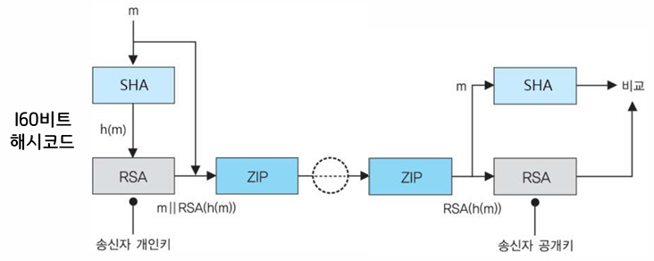
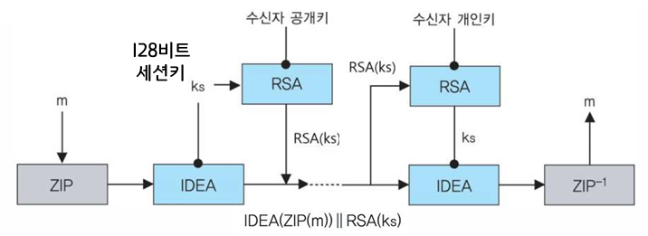
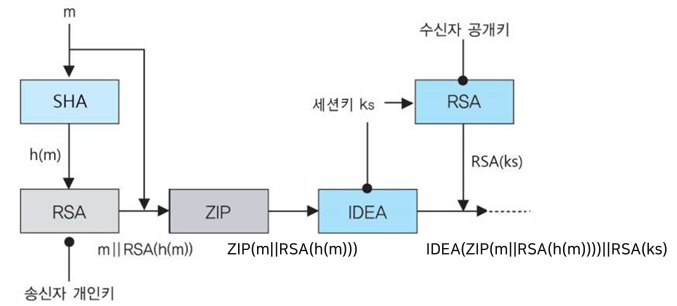
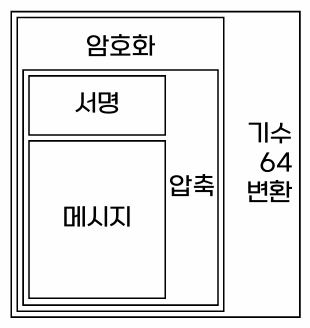
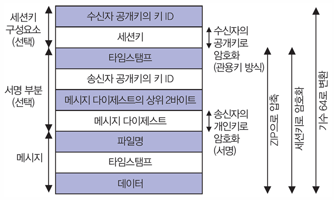
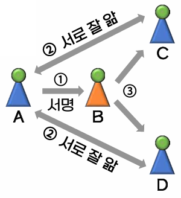

{:toc .large-only}

## 이메일의 특성

- 수신자에게 도달할 때까지 여러 호스트를 거침
- 엽서와 같이 이메일의 내용이 노출됨
- 전송 도중에 얼마든지 도청/변조될 가능성이 있음

## 이메일 보안

### PGP

- Pretty Good Privacy
- 인터넷에서 사용되는 이메일 보안 도구
- 보내려는 내용을 암호화함으로써 키가 있어야만 내용 확인 가능
- 엽서가 아닌 밀봉된 봉투에 넣어서 보냄
- 기밀성, 인증, 무결성, 부인방지 기능 지원

### PGP 보안 서비스

#### 인증

- 송신측
  - 메시지 m에 해시 알고리즘 SHA을 적용하여 해시 코드값 h(m)을 생성
  - 송신자의 **개인키**로 RSA 암호 알고리즘을 동작시켜 해시 코드값을 암호화하여 전자서명을 만듦 (RSA(h(m)))
  - 메시지에 전자서명을 압축하여 전송함 (ZIP)
- 수신측
  - 수신받은 압축을 풀고 메시지와 전자서명을 얻음
  - 메시지 m에 해시 알고리즘 SHA을 적용하여 해시 코드값 h(m)을 생성
  - 송신자의 **공개키**로 RSA 암호 알고리즘을 동작시켜 전자서명을 복호화하여 해시 코드값 h(m)을 얻음
  - 두 해시 코드값을 비교하여 인증함
- SHA와 DSA 또는 RSA의 결합은 효과적인 전자서명 기법을 제공

#### 기밀성

- 송신측
  - 메시지를 압축하고 IDEA 대칭키 암호 알고리즘으로 암호화함 (IDEA(ZIP(m)))
  - 수신자 **공개키**로 RSA 암호 알고리즘을 동작시켜 비밀키를 암호화함 (RSA(ks))
  - 암호화된 메시지 IDEA(ZIP(m))과 암호화된 비밀키 RSA(ks)를 전송함
  - 비밀키는 매 전송마다 새로 생성하는 세션키
- 수신측
  - 수신자 **개인키**로 RSA 암호 알고리즘을 동작시켜 RSA(ks)를 복호화함 (ks)
  - 비밀키 ks로 IDEA 알고리즘을 동작시켜 IDEA(ZIP(m))을 복호화하여 평문을 얻음
- 메시지 암호화를 위해 TDEA, AES 또는 IDEA 사용
- 일회용 세션키를 사용함으로써 안전성 강화
- 세션키 분배를 위해 ElGamal 또는 RSA 알고리즘 사용

#### 기밀성과 인증

- 두 가지 서비스를 같은 메시지에 사용
- 전자서명 -> 압축 -> 암호화 순서

#### 압축

- 파일 저장과 이메일 전송의 두 가지 경우에 대해 공간 절약
- 압축 알고리즘은 ZIP 사용
- 서명과 암호화 사이 단계에서 압축
- 압축된 메시지가 원래의 평문보다 더 작은 중복성을 가짐

#### 이메일 호환성

- PGP가 사용되면 전송되는 블록의 일부는 암호화됨
  - 인증 서비스만 사용하면 해시 코드가 암호화되고, 기밀성 서비스를 사용하면 메시지와 서명문이 암호화됨
- 아스키 문자 블록만 사용하는 이메일 시스템과 호환을 위해 암호화된 8비트 코드를 아스키 문자 흐름으로 변환하는 기수 64 변환 기법 사용
  - 데이터를 6비트 단위로 나눠 각 6비트를 하나의 문자로 표현하여 세 바이트가 네 문자로 변환됨

| 기능          | 알고리즘                         | 설명                                           |
| ------------- | -------------------------------- | ---------------------------------------------- |
| 인증          | SHA, DSA, RSA                    | - 메시지 해시코드 생성 - 해시코드를 서명   |
| 기밀성        | TDEA, AES, IDEA ElGamal, RSA | - 세션키로 메시지를 암호화 - 세션키 암호화 |
| 압축          | ZIP                              | - 메시지 압축                                  |
| 이메일 호환성 | 기수 64 변환                     | - ASCII 부호로 변환                            |

### PGP 전송 과정

#### 송신자

- 인증이 필요하면 평문의 해시코드를 사용하여 서명을 생성
- 평문과 서명 모두를 압축
- 기밀성이 요구되면 압축된 블록을 암호화하고, ElGamal이나 RSA로 암호화된 세션키를 첨부
- 최종적으로 전체 블록을 기수 64 형식으로 변환

#### 수신자

- 전송받은 블록을 기수 64 형식에서 2진 형식으로 변환
- 블록이 암호화되어 있으면 세션키를 복구하여 블록을 복호화
- 압축을 해제
- 메시지가 서명되어 있으면 서명으로부터 해시코드를 복구하고 자신이 계산한 해시코드와 비교하여 인증

### PGP 메시지 형식

### PGP에서 사용되는 키

| 키 이름  | 알고리즘        | 용도                                                                                                |
| -------- | --------------- | --------------------------------------------------------------------------------------------------- |
| 세션키   | TDEA, AES, IDEA | - 송신할 메시지를 암호화 - 수신한 암호화된 메시지를 복호화 - 한 번만 사용되고 랜덤하게 생성 |
| 공개키   | RSA 등          | - 메시지와 함께 전송할 세션키를 암호화 - 수신한 전자서명 검증                                   |
| 개인키   | RSA 등          | - 전자서명 생성 - 수신한 암호화된 세션키를 복호화                                               |
| 암호구문 | TDEA, AES, IDEA | - 키 링에 저장할 개인키를 암호화 - 키 링에 저장된 암호화된 개인키를 복호화                      |

### PGP의 키 링 구조

- 송수신자의 키 ID
  - 공개키마다 키 ID를 연관시킴
  - 기밀성과 인증을 제공하는 모든 PGP 메시지에 포함
- 개인키 링, 공개키 링 자료구조
  - 개인키 링: 사용자가 소유하는 공개키/개인키 쌍을 저장
  - 공개키 링: 사용자에게 알려진 다른 사용자의 공개키를 저장

### PGP의 신뢰고리

사람 사이의 신뢰를 공개키와 연관시킨 신뢰망 방식으로, 부정한 공개키 사용에 대한 대책으로 이용

1. A는 B의 공개키에 서명
1. A와 C, A와 D는 서로 잘 알고 공개키가 틀림없이 본인의 것으로 알고 있음
1. C와 D는 잘 모르는 B의 공개키를 처음 수신받았지만, 잘 아는 A의 서명이 있어 이 공개키는 틀림없이 B의 것으로 판단할 수 있음

### S/MIME

- Secure/Multipurpose Internet Mail Extension
- 인터넷 이메일 표준인 MIME의 보안기능을 강화하기 위해 공개키 암호기술을 적용한 것
- S/MIME의 목표로 암호화, 전자서명, 사용용이성, 융통성, 상호운용성 등이 있음

#### MIME

- 멀티미디어 이메일의 표현에 대한 표준
- 이메일에 의해 일어날 수 있는 콘텐츠 타입의 형식을 변형으로부터 보호하기 위한 형태로 바꾸어주는 전달 부호화를 정의

| 타입        | 서브타입                             |
| ----------- | ------------------------------------ |
| Text        | Plain, Enriched                      |
| Multipart   | Mixed, Parallel, Alternative, Digest |
| Message     | RFC 822, Partial, External-body      |
| Image       | jpeg, gif                            |
| Video       | mpeg                                 |
| Audio       | Basic                                |
| Application | Postscript, octet-stream             |

### SMTP

- 전통적인 이메일 형식 표준
- 일반적으로 텍스트 기반의 이메일에 이용
  - 7비트 기반 텍스트만 지원
  - 실행 파일이나 이진 파일을 보낼 수 없음
- 메시지는 봉투와 콘텐츠로 구성됨
  - 봉투: 배달을 위해 필요한 모든 메시지
  - 콘텐츠: 수신자에게 전달될 객체(헤더, 바디)
