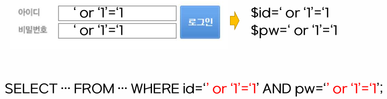
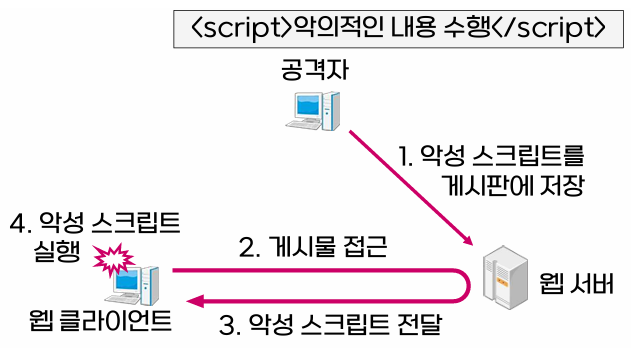
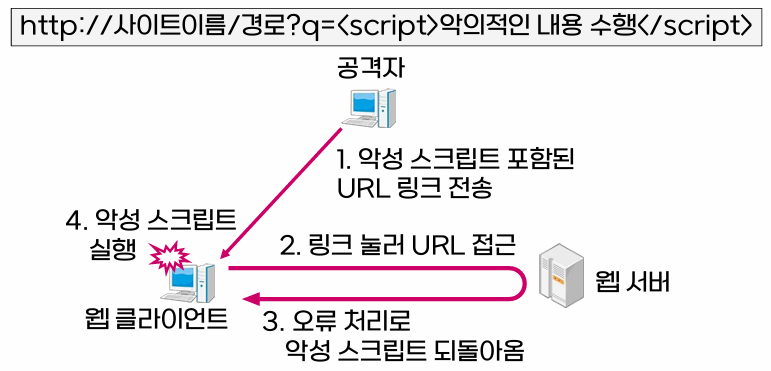

{:toc .large-only}

## 웹 서비스 보안

### SQL injection

- 웹 서버 데이터베이스 공격
- SQL 문에 추가적인 SQL을 삽입(injection)함으로써 악의적인 행위를 가능하게 하는 공격
- 따옴표, 더블 하이픈(SQL문의 주석)을 삽입하는 방법 등이 있음
- 예) 로그인 페이지에서 ID와 비밀번호 부분에 SQL문을 넣어 인증을 우회

#### 방어 방법

- 사용자의 입력값을 미리 검사
- SQL문을 매개변수화된 쿼리 형태로 작성
- 웹 애플리케이션의 데이터베이스에 대한 접근권한을 최소화

### 크로스 사이트 스크립팅(XSS)

- 웹 클라이언트 공격
- 이메일이나 웹 페이지에 악성 스크립트를 포함시켜 웹 클라이언트가 웹 페이지를 열면 자동으로 악성 스크립트가 실행되게 하는 공격
- 이를 통해 사용자의 정보가 공격자 사이트로 넘어감
- 저장된 XSS: 페이지에 악성 스크립트를 포함시켜 웹 클라이언트가 접근하면 실행되게 함
- 반사된 XSS: 악성 스크립트가 포함된 URL 전송하여 웹 서버에서 오류 처리로 웹 클라이언트에게 되돌아오게 함

#### 방어 방법

- 사용자의 입력값을 미리 검사
  - 길이, 문자, 형식 등에 대한 유효성 검사
- 사용자로 보낼 출력값을 미리 검사
  - `<script>` 태그 제거
  - `<` `>` 같은 특수문자를 `&lt;`, `&gt;` 같이 일반문자로 변환

### 접근제어 실패

- 웹 애플리케이션 공격
- 사용자와 자원에 대한 접근제어가 완벽하지 못한 경우 이를 통한 공격
- 예) URL을 쉽게 유추할 수 있는 관리자 페이지(`http://사이트이름/admin`), URL에 사용자 정보를 포함하는 경우(`http://사이트이름?ID=사용자1`)

#### 방어 방법

- 올바른 접근제어 적용
  - 예) 관리자 페이지에 접근권한을 설정하여 오직 관리자만 접근할 수 있도록 함

### 웹 서버 공격

- 웹 서버 공격
- 웹 서버의 테스트 기능, 디렉터리 목록을 보여주는 기능 등이 일반 사용자에게 노출되지 않도록 관리 필요
- 주기적으로 웹 서버의 취약점 점검 및 보안 패치 적용

## 모바일 보안

- 모바일 환경
  - LAN 환경: Wifi를 통한 무선 네트워크
  - WAN 환경: 5G, LTE, 와이브로 등을 통한 무선 네트워크
- 무선 네트워크를 이용하기 위해서는 최초에 네트워크에 접속하는 과정 필요
- 모바일 환경은 편의성이 좋은 반면, 유선에 비해 보안이 취약하다. (전파에 대한 도청)

### 무선 LAN 보안

- IEEE 802.11에서 무선 LAN을 정의하며 무선 LAN 보안과 관련된 내용을 포함
- 이후 IEEE 802.11i에서 강화된 무선 LAN 보안을 별도로 제시

#### WEP

- Wired Equivalent Privacy
- IEEE 802.11에서 제시
- 무선 LAN 환경에서 기밀성을 제공하기 위한 알고리즘
  - 스트림 암호 방식: RC4 알고리즘
  - 키 분배 메커니즘: 없음
- 현재는 취약성이 드러나 사용하지 않음

#### RSN

- Robust Security Network
- IEEE 802.11i 표준
- 인증기법, 키 관리, 키 교환, 기밀성과 무결성 기법 등을 포함

| 서비스         | 프로토콜 | 설명                                                                                          |
| -------------- | -------- | --------------------------------------------------------------------------------------------- |
| 기밀성, 무결성 | TKIP     | - 임시키 무결성 프로토콜 - WEP로 구현된 하드웨어의 펌웨어 업데이트를 위해 사용            |
|                | CCMP     | - IEEE 802.11i의 기본 프로토콜 - AES 알고리즘 이용                                        |
| 접근제어       | 802.1X   | - 포트 기반 네트워크 접근제어(NAC) 표준 - 모바일 장치와 액세스 포인트 외에 인증 서버 필요 |
| 인증, 키 교환  | EAP      | - 확장형 인증 프레임워크 - 모바일 장치가 인증을 받을 때 사용되는 프로토콜                 |

### WPA, WPA2, WPA3

- Wifi Protected Access
- 무선 LAN 보안기능을 제공하는 장비를 인증하기 위해 정의된 규격
- WPA: 2003년도에 소개
- WPA2
  - IEEE 802.11i가 완료된 2006년부터 본격적으로 적용
  - WPA2-Enterprise: 인증 서버 이용
  - WPA2-Personal: 인증 서버 없이 미리 키를 나누어 사용
- WPA3
  - WPA2에 네 가지 특성을 추가. 단순화하면서도 보안은 강화
    - 화면이 제한적인 장치를 위한 보안설정 절차 단순화
    - 사용자가 단순한 패스워드를 사용해도 강화된 보안을 제공
    - 개별적 데이터 암호화를 통해 개방된 네트워크 환경에서도 보안 강화
    - 192비트 보안 모드 추가
