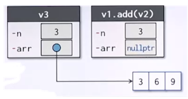

{:toc .large-only}

## 클래스

### 클래스 선언

```cpp
class ClassName {
가시성_지시어1:
  데이터 멤버 선언;
  멤버함수 선언; // 원형 선언 또는 멤버함수 정의
가시성_지시어2:
  데이터 멤버 선언;
  멤버함수 선언; // 원형 선언 또는 멤버함수 정의
};
```

### 캡슐화

- 객체 내부의 상세한 구현 부분과 외부 사용자의 관점을 분리함
- 내부 속성 등 구현에 대한 부분은 공개하지 않으며(정보은닉), 객체 외부에서는 공개된 인터페이스를 통해 객체를 사용할 수 있음


### 가시성 지시어

- 클래스의 멤버가 공개되는 범위를 나타냄
- ex) private, public, protected

|    가시성 지시어     | 공개 범위와 용도                                                                                                                                                                                          |
| :------------------: | --------------------------------------------------------------------------------------------------------------------------------------------------------------------------------------------------------- |
| private<br/>(디폴트) | - 소속 클래스의 멤버함수<br/>- 친구 클래스의 멤버함수 및 친구함수<br/>- 그 외의 범위에는 비공개<br/>- 정보은닉을 위해 사용<br/>-클래스의 구현을 위한 내부 상태(데이터 멤버)는 일반적으로 private로 지정함 |
|        public        | - 전 범위<br/>- 주로 외부에 제공할 인터페이스를 공개하기 위해 사용됨                                                                                                                                      |

### const 멤버함수

- 데이터 멤버의 값을 수정하지 않는 멤버함수
- const 멤버함수에서 데이터 멤버의 값을 수정하면 컴파일러가 오류 메시지를 내보낸다.

### 객체의 정의 및 사용

#### 객체의 정의

```cpp
ClassName objName;
ClassName objName1, objName2, ...;
```

#### 객체 사용 형식

객체 이름에 멤버선택 연산자(.)를 사용하여 객체의 멤버를 엑세스함

```cpp
objName.memFunc();
```

### Counter 클래스

**Counter.h**

```cpp
#ifndef COUNTER_H_INCLUDED // Counter.h가 중복 include 되지 않았는지 검사
#define COUNTER_H_INCLUDED // Counter.h가 처음 include 될 때 정의됨

class Counter {
  int value; // private 데이터 멤버
public:
  void reset() // 계수기의 값을 0으로 초기화
    { value = 0; }
  void count() // 계수기의 값을 1 증가시킴
    { ++value; }
  int getValue() const // 계수기의 현재 값을 반환함
    { return value; }
};

#endif
```

- 첫 줄의 `#ifndef`는 조건부 컴파일 명령어로 지정된 매크로 명칭이 정의되어 있지 않으면 이후의 명령들이 컴파일되고, 그렇지 않으면 `#endif` 또는 `#else`가 나타날 때까지 문장들을 건너뛴다.
  - Counter.h 파일이 처음 include 되었다면 `#ifndef COUNTER_H_INCLUDED`는 true 이므로 다음 명령들이 컴파일되고, 그렇지 않다면 `#endif` 전까지 명령들을 건너뛴다.

**CntMain.cpp**

```cpp
#include <iostream>
#include "Counter.h"
using namespace std;

int main()
{
  Counter cnt; // Counter 객체의 정의

  cnt.value = 0; // (오류) private 멤버 접근
  cnt.value++; // (오류) private 멤버 접근

  cnt.reset(); // 계수기를 0으로 초기화
  cnt.count(); // 계수기를 1 증가시킴

  return 0;
}
```

### 소스 파일의 구성

- 일반적으로 클래스를 선언할 때 헤더 파일과 소스 프로그램 파일인 2개의 파일을 만든다.
- 파일의 명칭은 클래스의 이름을 사용하여 Counter.h, Counter.cpp 등으로 만드는 것이 일반적이다.
- 헤더 파일에는 함수의 원형만 선언하고 소스 프로그램 파일에 실제 멤버함수를 정의
  - 소스 프로그램 파일에서 클래스명 뒤에 '::'를 붙여 정의


## 생성자

- 객체가 생성될 때 수행할 작업을 정의하는 특수한 멤버함수
- 생성자에 인수를 전달할 수 있도록 매개변수를 선언할 수 있음
- 생성자를 여러 개 정의할 수 있음
- 클래스의 이름을 사용하여 선언함
- 생성자 머리부에 반환 자료형을 표시하지 않으며, return 명령으로 값을 반환할 수 없음
- 생성자를 public으로 선언해야 외부에서 객체를 생성할 수 있음

```cpp
class ClassName {
  ...
  public:
    ClassName(fParameterList) { // 생성자
      ...
    }
};
```

### 초기화 리스트

- 생성자의 머리부에 데이터 멤버를 초기화하는 값들을 나열한 리스트
- `데이터멤버이름{초기값}` 형태로 초기값을 지정

```cpp
class Counter {
  int value;
public:
  Counter() : value{0} {}
};
```

### 소멸자

- 객체가 소멸될 때 수행할 작업을 정의하는 특수한 멤버함수
- 클래스의 이름에 '~'를 붙여 선언함
- 소멸자 머리부에 반환 자료형을 표시하지 않으며, return 명령으로 값을 반환할 수 없음
- 매개변수가 없으며, 클래스에 하나의 소멸자만 정의할 수 있음
- public으로 선언하는 것이 일반적임
- 상속을 통해 파생 클래스를 정의하는 경우 virtual을 지정하여 가상함수가 되도록 하는 것이 좋음

```cpp
class ClassName {
  ...
  public:
    ~ClassName() { // 소멸자
      ...
    }
};
```

### 디폴트 생성자

- 매가변수가 없는 생성자 또는 모든 매개변수에 디폴트 인수가 지정된 생성자
- 클래스를 선언할 때 생성자를 선언하지 않으면 컴파일러는 묵시적으로 디폴트 생성자를 정의함


#### 디폴트 생성자가 없는 클래스

```cpp
class CounterM {
  const int maxValue;
  int value;
public:
  CounterM(int mVal)
    : maxValue{mVal}, value{0} {} // 생성자
}

int main()
{
  CounterM cnt1(999);
  CounterM cnt2; // 에러 - 디폴트 생성자가 없음
}
```

#### 객체 배열

```cpp
class Counter {
  int value;
public:
  void reset() { value = 0; }
  void count() { ++value; }
  int getValue() const
    { return value; }
};

int main()
{
  // 묵시적 디폴트 생성자를 통해 객체 배열 선언
  Counter cntArr[4]; // 4개의 Counter 객체로 구성되는 배열
  Counter *pt = new Counter[10];
}
```

### 복사 생성자

- 동일 클래스의 객체를 복사하여 객체를 만드는 생성자
- 복사 생성자를 명시적으로 선언하지 않으면 컴파일러는 묵시적으로 복사 생성자를 정의함
- 묵시적 복사 생성자는 얕은 복사를 실행하기 때문에 복사 생성자를 명시적으로 선언해주는 것이 좋다.
- 매개변수는 const 상수 클래스 참조형이어야 한다.


#### 묵시적 복사 생성자

```cpp
class CounterM {
  const int maxValue;
  int value;
public:
  CounterM(int mVal):
    maxValue{mVal}, value{0} {}
  // CounterM(const CounterM& c): // 묵시적 복사 생성자
  //   maxValue{c.maxValue}, value{c.value} {}
}

int main()
{
  CounterM cnt4{99}; // cnt4 객체 정의
  CounterM cnt5{cnt4}; // cnt4를 복사한 객체 cnt5 정의
  CounterM cnt6 = cnt4; // cnt4를 복사한 객체 cnt6 정의
}
```

#### 얕은 복사의 문제

- 복사 생성자를 명시적으로 선언하지 않거나, 객체를 그대로 복사하는 경우 얕은 복사가 실행된다.
- 복사 객체와 복사 대상 객체의 데이터 멤버가 같은 메모리를 가리키므로 객체가 소멸될 때 에러가 발생한다.

```cpp
class VecF {
  int n;
  float *arr;
public:
  // VecF(const VecF& c): // 묵시적 복사 생성자
  //   n{c.n}, arr{c.arr} {}
}

int main()
{
  float a[3] = { 1, 2, 3 };
  VecF v1(3, a); // 1, 2, 3을 동적 메모리에 할당
  VecF v2(v1); // v1를 복사한 객체 v2 정의 (데이터 멤버가 같은 메모리 공간을 가리킴)
  return 0; // v1의 소멸자가 실행되어 arr 공간을 반납함
  // v2의 소멸자가 실행될 때 arr 공간을 반납하지만 이미 v1 소멸자를 통해 반납되었기 때문에 에러 발생
}
```


#### 깊은 복사

- 객체를 복사할 때 별도의 저장공간을 할당받아 복사한다.
- 복사 객체와 복사 대상 객체의 데이터 멤버가 다른 메모리를 가리키므로 얕은 복사의 문제가 발생하지 않는다.

```cpp
class VecF {
  int n;
  float *arr;
public:
  VecF(const VecF& fv): n { fv.n } {
    arr = new float[n];
    memcpy(arr, fv.arr, sizeof(float)*n);
  }
}
```

### 이동 생성자


- 왼쪽 항이 l-value, 오른쪽 항이 r-value
- l-value는 값을 저장할 수 있는 실체가 있는 대상이고 r-value는 값을 제공
- 복사 생성자는 l-value를 참조하여 값을 복사하고, 이동 생성자는 r-value를 참조하여 값을 이동한다.
- 불필요한 데이터 복사를 방지하기 위해 사용

#### r-value 참조

- r-value 참조는 `&&` 기호로 선언한다.
- r-value 참조의 대상은 사용된 후 즉시 소멸된다.

```cpp
int&& c = 30; // r-value 참조
VecF&& vRRef2 = v2; // 오류 - r-value 참조로 l-value를 참조할 수 없음
VecF&& vRRef1 = v1.add(v2); // OK - 함수의 반환 객체는 r-value임. 반환된 객체를 사용하고 나면 그 객체는 더 이상 필요 없으며, 즉시 소멸된다.
```

#### 이동 생성자의 선언

```cpp
class ClassName {
  ...
public:
  ClassName(Classname&& obj) {
    ... // 생성되는 객체에 obj의 내용을 이동하는 처리
  }
}
```

- 이동 생성자는 일반적으로 매개변수에 const 키워드를 사용하지 않는다.

#### 예시

```cpp
class VecF {
  int n;
  float *arr;
public:
  ...
  VecF(VecF&& fv): n{fv.n}, arr{fv.arr} {
    fv.arr = nullptr;
    fv.n = 0;
  }
  ~VecF() {
    delete[] arr;
  }
}

int main() {
  float a[3] = { 1, 2, 3 };
  float b[3] = { 2, 4, 6 };
  VecF v1(3, a);
  VecF v2(3, b);
  VecF v3(v1.add(v2));
  return 0
}
```

1. `VecF(VecF&& fv): n{fv.n}, arr{fv.arr}` : v3에 `v1.add(v2)` 객체의 값을 복사한다.
   
1. `fv.arr = nullptr; fv.n = 0;` : `v1.add(v2)` 객체의 데이터 멤버의 참조를 끊는다. 즉 1번에서 복사된 데이터 멤버가 v3로 **이동**된다.
   
1. `v1.add(v2)` 객체는 사용된 후 소멸된다.

> `fv.arr = nullptr; fv.n = 0;`를 실행하지 않으면 v3에 복사한 데이터 멤버의 메모리가 여전히 `v1.add(v2)` 객체에 참조된 상태이며 `v1.add(v2)`의 메모리가 소멸될 때 v3의 데이터 멤버도 삭제되어, 나중에 v3가 소멸될 때 이중 삭제 에러가 발생한다.

### staic 데이터 멤버

- 클래스에 속하는 모든 객체들이 공유하는 데이터 멤버
- 객체 생성과 관계 없이 프로그램이 시작되면 static 데이터 멤버를 위한 메모리 공간이 할당됨
- 일반 데이터 멤버와는 달리 static 데이터 멤버는 클래스 선언문 내에서는 선언만 하고 클래스의 외부에서 별도로 정의해야 한다.


### static 멤버함수

- 특정 객체에 대한 처리를 하는 것이 아니라, 소속 클래스 단위의 작업을 수행하는 함수
- static 멤버함수는 객체가 정의되지 않아도 사용할 수 있음
- static 멤버함수 안에서는 일반 멤버를 사용할 수 없으며, static 멤버만 사용할 수 있음

```cpp
class NamedObj {
  char* name;
  int id;
  static int nConstr; // static 데이터 멤버
  static int nDestr; // static 데이터 멤버
public:
  static int nObj() { // static 멤버함수
    return nConstr - nDestr;
  }
}
```
