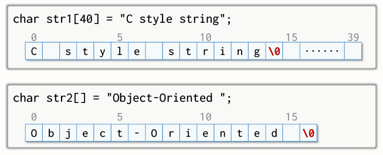

{:toc .large-only}

## 연산자 다중정의란?

- C++에서 제공하는 연산자를 사용자가 선언한 클래스의 객체에 대하여 사용할 수 있도록 다중정의하는 것
- 연산자의 의미를 임의로 바꾸지 않는다.
- 연산자의 고유한 특성이 유지되도록 한다.
  - 연산자의 우선순위나 피연산자 수 불변
  - 전위 표기와 후위 표기 연산자의 의미 유지

### 주요 연산자 다중정의 대상

- 클래스의 객체 간 대입 및 이동 대입 연산자
  - 특히 동적 할당을 받는 포인터를 포함하는 경우 고려할 필요가 있음
- 수치형 객체의 산술 연산자 다중정의
  - 교환법칙도 함께 고려함
- 두 객체를 비교하기 위한 관계 연산자의 다중정의
- 스트림 입력 및 출력을 위한 `>>`, `<<` 연산자

### 다중정의를 할 수 없는 연산자

- 멤버 선택 연산자(.)
- 멤버에 대한 포인터 연산자 (.\*)
- 유효범위 결정 연산자(::)
- 조건 연산자(? :)

### 연산자 다중정의 위치

- 클래스의 멤버로 정의하는 방법
  - 연산자의 구현 과정에서 객체의 멤버를 엑세스 할 수 있음
- 클래스 외부에서 정의하는 방법
  - 클래스의 멤버가 아니므로, 객체의 private 멤버는 직접 사용할 수 없음 (필요하다면 private 멤버를 엑세스할 수 있는 방법을 마련해야 함)

## 단항 연산자의 다중정의

- 단항 연산자: 피연산자가 1개인 연산자
- ++, -- 등

### 전위 표기법

연산자가 피연산자 앞에 표기되는 형태

```cpp
int a, b = 10;
a = ++b; // a: 11, b: 11

int a, b = 10;
a = --b; // a: 9, b: 9
```

- 함수 이름 대신 operator 키워드와 연산자 기호를 사용한다.
- 형식 매개변수가 없다.

```cpp
// opSymbol: ++, -- 등의 단항 연산자 기호
ReturnClass ClassName::operator opSymbol()
{
  ...
}
```

```cpp
class IntClass1 {
  int a;
public:
  IntClass1(int n=0): a(n) {}
  IntClass1& operator ++ () { // 전위 표기 ++ 연산자 다중정의
    ++a;
    return *this;
  }
}
```

### 후위 표기법

연산자가 피연산자 뒤에 표기되는 형태

```cpp
int a, b = 10;
a = b++; // a: 10, b: 11

int a, b = 10;
a = b--; // a: 10, b: 9
```

- 함수 이름 대신 operator 키워드와 연산자 기호를 사용한다.
- 형식 매개변수에 int를 표기하며, 이는 int형 인수를 전달한다는 의미가 아니라 후위 표기법을 사용하는 단항 연산자임을 나타냄

```cpp
// opSymbol: ++, -- 등의 단항 연산자 기호
ReturnClass ClassName::operator opSymbol(int)
{
  ...
}
```

```cpp
class IntClass2 {
  int a;
public:
  IntClass2(int n=0): a(n) {}
  IntClass2 operator ++ (int) { // 후위 표기 ++ 연산자 다중정의
    IntClass2 tmp(*this);
    ++a;
    return tmp;
  }
}
```

- tmp에 객체를 복사해두고 데이터 멤버 a를 1 증가시킨 후 복사해둔 객체를 반환한다.

### 예제: Pencils 클래스

n타 m자루 형태로 연필의 개수를 표현하는 클래스를 정의한다. (1타는 12자루)

```cpp
class Pencils {
	int dozens; // 타
	int np; // 낱개
public:
	Pencils() : dozens(0), np(0) {};
	Pencils(int n) {
		dozens = n / 12; np = n % 12;
	}
	Pencils(int d, int n) : dozens(d), np(n) {}
	Pencils& operator++ () { // ++ 연산자 전위 표기
		if (++np >= 12) { // 낱개를 1 증가시킨 후 12보다 크거나 같으면
			++dozens, np = 0; // 타 수를 1 증가시키고, 낱개는 0
		}
		return *this; // 증가된 결과를 반환
	}
	Pencils operator++(int) { // ++ 연산자 후위 표기
		Pencils tmp(*this); // 현재 객체를 보존
		if (++np >= 12) { // 낱개를 1 증가시킨 후 12보다 크거나 같으면
			++dozens, np = 0; // 타 수를 1 증가시키고, 낱개는 0
		}
		return tmp; // 보존된 객체를 반환
	}
	void display() const {
		if (dozens) {
			cout << dozens << "타 ";
			if (np) cout << np << "자루";
			cout << endl;
		}
		else
			cout << np << "자루" << endl;
	}
};

Pencils p1(5, 7);
Pencils p2(23);

p1.display(); // 5타 7자루
(++p1).display(); // 5타 8자루
p1.display(); // 5타 8자루
cout << endl;

p2.display(); // 1타 11자루
p1 = p2++;
p1.display(); // 1타 11자루
p2.display(); // 2타
```

## 이항 연산자의 다중정의

- 이항 연산자: 피연잔자가 2개인 연산자
- +, -, \*, /, &&, || 등
- 좌측 피연산자는 클래스 객체 자신(\*this), 우측 피연산자는 매개변수 arg

```cpp
ReturnClass ClassName::operator opSymbol (ArgClass arg)
{
  ...
}
```

### 덧셈 연산자의 다중정의

```cpp
class Complex2 {
  double rPart, iPart;
public:
  Complex2(double r=0, double i=0): rPart(r), iPart(i) {}

  Complex2 operator+ (const Complex2& c) const
  {
    Complex2 tmp(*this);
    tmp.rPart += c.rPart;
    tmp.iPart += c.iPart;
    return tmp;
    // 혹은 아래처럼 간략하게 작성 가능
    // return Complex2(rPart + c.rPart, iPart + c.iPart);
  }

  Complex2 operator+ (double r) const
  {
    return Complex2(rPart + r, iPart);
  }

  double real() const { return rPart; } // 실수부의 값 반환
  double imag() const { return iPart; } // 허수부의 값 반환
}

Complex2 operator+ (double r, const Complex2& c)
{
  return Complex2(r + c.real(), c.imag());
}
```

- 객체와 객체 사이의 덧셈인 경우 `Complex2 operator+ (const Complex2& c) const`로 정의
  - tmp를 이용해 현재 객체를 보존
  - `operator+`와 매개변수 c를 const로 선언하여 \*this와 c가 변경되지 않도록 한다.
- 객체와 실수 사이의 덧셈인 경우 `Complex2 operator+ (double r) const`로 정의
- 실수와 객체 사이의 덧셈인 경우 `Complex2 operator+ (double r, const Complex2& c)`로 정의
  - 이때는 좌측 피연산자가 클래스가 아니므로 클래스 외부에서 선언해야 함
  - rPart와 iPart는 private 멤버이기 때문에 외부 함수에서 접근할 수 없음
  - Complex2 클래스에서 rPart, iPart를 리턴하는 멤버함수를 정의

## 대입 연산자의 다중정의

- 우측 피연산자 데이터를 좌측 피연산자에 복사함
- 우측 피연산자가 객체인 경우 얕은 복사로 인해 문제가 발생할 수 있음
- 깊은 복사를 할 수 있도록 대입 연산자 다중정의 필요

```cpp
VecF& VecF::operator= (const VecF& fv) {
  if(n != fv.n) {
    delete[] arr; // 기존 메모리 반환
    arr = new float[n = fv.n]; // 새로운 메모리 할당
  }
  memcpy(arr, fv.arr, sizeof(float)*n); // 데이터 복사
  return *this;
}
```

### 이동 대입 연산자의 다중정의

- 좌측 피연산자에 대입할 우측 피연산자는 r-value
  - 좌측 피연산자에 대입 후에는 값이 필요 없음
- 불필요한 복사를 피함으로써 효율성을 높일 수 있음

```cpp
VecF& VecF::operator= (VecF&& fv) {
  delete[] arr;
  n = fv.n;
  arr = fv.arr;
  fv.arr = nullptr; // 데이터 멤버의 참조를 끊는다.
  return &this;
}
```

#### move 함수

- std 라이브러리에서 제공하는 함수
- 인수로 전달되는 객체의 r-value 참조를 반환

```cpp
VecF tmp = move(v1); // 이동 생성자
v1 = move(v2); // 이동 대입 연산자
v2 = move(tmp); // 이동 대입 연산자
```

## [] 연산자의 다중정의

- const로 선언된 객체를 매개변수로 받기 위해 2개의 다중정의 필요
- 하나는 대입을 위하고, 하나는 값을 읽기 위함

```cpp
int& SafeIntArray::operator[] (int i) {
  if(i < 0 || i >= limit) {
    cout << "첨자가 범위를 벗어나 프로그램을 종료합니다."
    exit(EXIT_FAILURE);
  }
  return arr[i]; // i번째 원소의 값 반환
}

int SafeIntArray::operator[] (int i) const {
  if(i < 0 || i >= limit) {
    cout << "첨자가 범위를 벗어나 프로그램을 종료합니다."
    exit(EXIT_FAILURE);
  }
  return arr[i]; // i번째 원소의 값 반환
}
```

## 문자열 클래스

- 문자열의 끝을 알리기 위해 널(null)문자 '\0'를 사용함
  - '\0'까지 포함한 길이로 생성됨
- 문자열을 저장하기 위한 char형 배열



### cstring

- C 스타일 문자열에 대한 작업을 수행할 수 있는 라이브러리
- `#include <cstring>`로 cstring을 참조한다.

| 함수                                                       | 설명                                                                     |
| ---------------------------------------------------------- | ------------------------------------------------------------------------ |
| size_t strlen(const char\* str)                            | 문자열의 길이를 구하는 함수                                              |
| char* strcpy(char\* strDestination, const char* strSource) | 문자열을 복사하는 함수. strSource 문자열을 strDestination으로 복사한다.  |
| char* strcat(char\* strDestination, const char* strSource) | 문자열을 연결하는 함수. strDestination 뒤에 strSource 문자열을 연결한다. |

```cpp
#include <cstring>

int main()
{
  n = strlen("abcde");
  strcpy(str1, "CS");
  strcat(str2, "CS");
}
```

### 문자열 클래스 만들기

```cpp
int MyString::length() const // 문자열 길이 반환 메서드
{
  return len;
}

MyString& MyString::operator= (MyString&& mstr) // 이동 대입 연산자
{
  delete[] buf;
  len = mstr.len;
  bufSize = mstr.bufSize;
  buf = mstr.buf;
  mstr.buf = nullptr;
  return *this;
}

MyString MyString::operator+ (const MyString& mstr) // 문자열 연결 연산자
{
  MyString tmstr(len + mstr.len);
  strcpy(tmstr.buf, buf);
  strcpy(tmstr.buf + len, mstr.buf);
  return tmstr;
}
```

### string

- 문자열을 저장하기 위한 표준 C++ 라이브러리 클래스
- `#include <string>`로 참조
- [], +, =, +=, ==, !=, >, >= 등의 연산자 제공
- length, append, find, c_str 등의 멤버함수 제공
- stoi, stod, to_string, swap, getline 등의 함수 제공

## 형 변환 연산자의 다중정의

- 자동 형 변환을 위한 연산자
- 변환할 값을 제공하는(송신 측 클래스)에서 정의하는 방법과 값이 변환될 클래스(수신 측 클래스)에서 정의하는 방법이 있다.

### 송신 측 클래스에 정의하는 방법

- 수신 측 클래스의 이름으로 연산자를 정의

#### ex) MyString 객체를 C 스타일 문자열로 변환하기

```cpp
operator char*() const
{
  char *pt = new char[len + 1];
  strcpy(pt, buf);
  return pt;
}
```

### 수신 측 클래스에 정의하는 방법

- 송신 측 클래스의 객체를 인수로 받는 인수 생성자를 정의
  - ex) MyString(const char\* str);
- 송신 측 클래스의 private에 접근해야 하는 경우, 송신 측 클래스에 private 멤버에 액세스 할 수 있는 멤버함수가 정의되어 있어야 함

#### ex) Meter 클래스와 Feet 클래스

```cpp
Class Feet {
  ...
  Feet(const Meter& m) {
    int cmeter = m.getM() * 100 + m.getCm(); // 송신 측 클래스에서 private 멤버에 접근할 수 있도록 만든 멤버함수
    in = static_cast<int>(cmeter / 2.54 + 0.5);
    ft = in / 12;
    in %= 12;
  }
  operator Meter() const
  {
    int m = static_cast<int>((ft * 12 + in) * 2.54 + 0.5);
    return Meter(m / 100, m % 100);
  }
}

int main()
{
  Meter mLen;
  Feet fLen(10, 5);
  mLen = fLen; // 송신 측 클래스에 정의된 형 변환
  fLen = mLen; // 수신 측 클래스에 정의된 형 변환
  return 0;
}
```

### 묵시적 형 변환을 금지하는 방법

- 생성자 등을 통한 묵시적 형 변환을 금지하는 방법
- `explicit` 키워드 사용

```cpp
class MyString {
  ...
  explicit MyString(const char* str);
}

int main()
{
  MyString str;
  str = "Programming"; // 에러 : 묵시적 형 변환 금지
}
```
