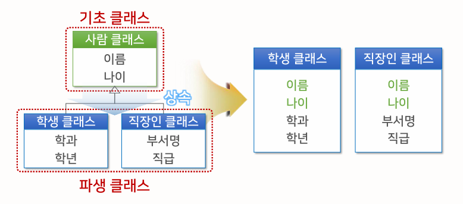
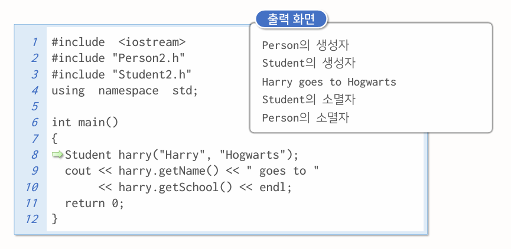
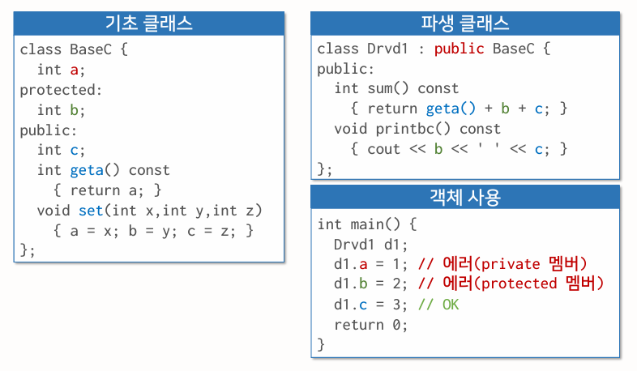
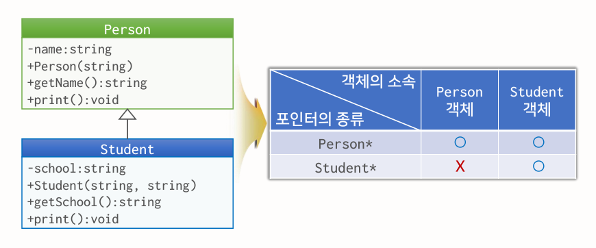
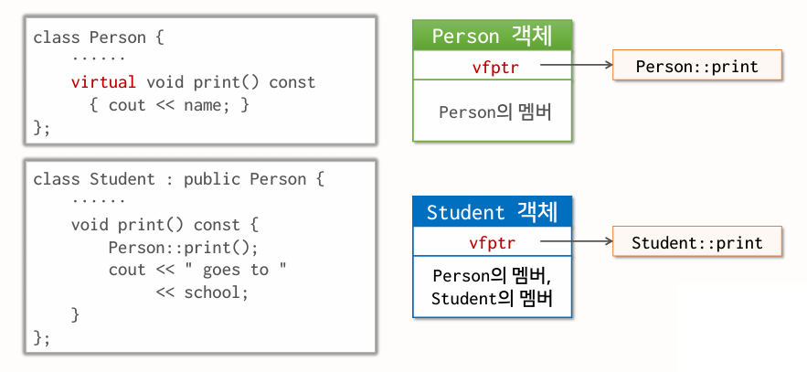

{:toc .large-only}

## 상속

- 객체지향 언어에서 계층관계를 사용하여 클래스 간의 속성 및 함수를 공유하는 개념
- 속성을 상속하는 클래스를 기초 클래스라고 하고, 상속받는 클래스를 파생 클래스라고 한다.



### 기초 클래스 선언

```cpp
class Person {
    string name;
public:
    string getName() const { return name; }
    void setName(const string& n) { name = n; }
    void print() const { cout << name; }
}
```

### 파생 클래스 선언

```cpp
class Student: public Person {
    string school;
public:
    string getSchool() const { return school; }
    void setSchool(const string& s) { school = s; }
    void print() const {
        Person::print();
        cout << "goes to" << school;
    }
}
```

- 기초 클래스 앞에 가시성 지시어를 붙인다.
  - public, pretected, private 중 하나를 사용

```cpp
int main() {
    Person dudley; // 기초 클래스 선언
    dudley.setName("Dudley"); // 기초 클래스 함수 호출
    Student harry; // 파생 클래스 선언
    harry.setName("Harry"); // 파생 클래스 함수 호출
    harry.setSchool("Hogwarts"); // 파생 클래스 함수 호출
    dudley.print(); // Dudley
    cout << endl;
    harry.print(); // Harry goes to Hogwarts
    cout << endl;
    harry.Person::print(); // Harry
    cout << endl;
    return 0;
}
```

- 파생 클래스에서 기초 클래스의 멤버함수를 중복 선언하는 것을 재정의(overriding)라고 한다.
  - 기초 클래스의 멤버함수를 실행하려면 `Person::`을 명시하여 실행한다.

### 파생 클래스의 생성자와 소멸자

```cpp
Student(const string& n, const string& s): Person(n) {
    cout << "Student의 생성자" << endl;
    school = s;
}
~Student() const {
    return school;
}
```

- 파생 클래스의 생성자에 기초 클래스의 이름을 선언해야 한다.
  - 기초 클래스의 생성자가 매개변수를 필요로 하는 경우 매개변수 전달
- 파생 클래스의 소멸자에서 기초 클래스의 소멸자를 호출할 필요는 없다.
- 생성할 때는 기초 클래스의 생성자가 먼저 실행된 후 파생 클래스의 생성자가 실행된다.
- 소멸할 때는 파생 클래스의 소멸자가 먼저 실행된 후 기초 클래스의 소멸자가 실행된다.



### 가시성 지시어

| 가시성 지시어    | 공개 범위                                                                                                                                             |
| ---------------- | ----------------------------------------------------------------------------------------------------------------------------------------------------- |
| private (디폴트) | - 소속 클래스의 멤버함수<br/>- 친구 클래스의 멤버함수 및 친구함수                                                                                     |
| protected        | - 소속 클래스의 멤버함수<br/>- 친구 클래스의 멤버함수 및 친구함수<br/>- 파생 클래스의 멤버함수</br>- 파생 클래스의 친구 클래스의 멤버함수 및 친구함수 |
| public           | 전 범위                                                                                                                                               |

#### 기초 클래스로부터 상속받은 멤버의 가시성

| 가시성 상속 지시어      | B의 public 멤버는   | B의 protected 멤버는 | B의 private 멤버는 |
| ----------------------- | ------------------- | -------------------- | ------------------ |
| `class D1: private B`   | D1의 private 멤버   | D1의 private 멤버    | D1의 private 멤버  |
| `class D2: protected B` | D2의 protected 멤버 | D2의 protected 멤버  | D2의 private 멤버  |
| `class D3: public B`    | D3의 public 멤버    | D3의 protected 멤버  | D3의 private 멤버  |

- 기초 클래스의 private 멤버는 파생 클래스에서 접근 불가
- private 멤버와 protected 멤버는 클래스 외부에서 접근 불가



### final 클래스

- 파생 클래스에 final을 선언하면 파생 클래스를 더 이상 정의할 수 없다.

```cpp
class C final: public B {
    ...
};
```

### 클래스 계층구조와 포인터

- 기초 클래스의 포인터는 파생 클래스의 객체를 가리킬 수 있다.
- 그러나 파생 클래스의 포인터는 기초 클래스의 객체를 가리킬 수 없다.



```cpp
int main()
{
    Person *p1, *p2;
    Person dudley("Dudley");
    Student *s1, *s2;
    Student harry("Harry", "Hogwarts");
    p1 = &dudley; // OK
    s1 = &harry; // OK
    p2 = &harry; // OK
    s2 = &dudley; // 에러: 파생 클래스의 포인터에서 기초 클래스의 객체를 가리킬 수 없음
    return 0;
}
```

## 가상함수

### 정적 연결

```cpp
Person *p1 = new Student("Harry", "Hogwarts");
p2->print() // Person::print() 호출
((Student *)p2)->print() // Student::print() 호출
```

- 포인터를 통해 클래스의 멤버함수를 호출할 경우 컴파일될 때 포인터에 따라 멤버함수가 결정된다.
- 실제로 연결된 객체는 Student 클래스이지만 Person 포인터를 통해 호출되므로 `p2->print()`로 호출되는 함수는 `Person::print()`이다.
- 기초 클래스의 포인터에서 파생 클래스의 멤버함수를 호출하려면 형 변환을 해야 한다. (ex. `((Student *)p2)`)
- 이러한 형 변환은 포인터가 컴파일될 때 가리켰던 객체를 계속 가리킬 것이라는 보장이 없으므로 문제가 발생할 수 있다.

### 동적 연결

- 포인터를 통해 클래스의 멤버함수를 호출할 경우 포인터가 가리키는 **실제 객체**가 무엇인가에 따라 **실행 중에** 멤버함수가 결정된다.
- C++에서는 가상함수(virtual function)로 동적 연결을 구현
- 기초 클래스의 멤버함수 앞에 예약어 `virtual`을 붙여 표현한다.
- 기초 클래스의 가상함수 멤버함수는 파생 클래스에서 재정의 하더라도 가상함수이며, 동적 연결이 적용된다.

```cpp
class Person {
    ...
    virtual void print() const {}
}
```

- 가상함수를 포함하고 있는 클래스는 만들어질 때 객체에 1개의 포인터(vfptr)가 할당되어 가상함수 테이블을 가리키게 된다.



### 소멸자의 동적 연결

- 기초 클래스에서는 소멸자를 가상함수로 지정해야 한다.
  - 기초 클래스의 포인터에 연결된 파생 클래스 객체를 제거할 때 기초 클래스의 소멸자만 동작하기 때문

```cpp
virtual ~BaseClass() { delete [] ptB; }
```

### 업 캐스팅과 다운 캐스팅

#### 업 캐스팅(upcasting)

- 파생 클래스의 포인터를 기초 클래스의 포인터로 변환하는 것
- 묵시적 형 변환 가능

#### 다운 캐스팅(downcasting)

- 기초 클래스의 포인터를 파생 클래스의 포인터로 변환하는 것
- 묵시적 형 변환을 할 수 없으며, 형 변환 연산자로 **명시적 형 변환**을 해야함

#### static_cast

컴파일될 때 형 변환을 결정하는 정적인 명시적 형 변환

#### dynamic_cast

- 실행 중에 형 변환을 결정하는 동적인 변환. 만일 형 변환이 일어날 수 없을 때는 nullprt을 반환한다.
- 실행 중에 포인터가 가리키는 객체가 변할 수 있으므로 `dynamic_cast`을 사용하는 것이 안전하다.
- `dynamic_cast`를 사용하려면 클래스 선언문에 가상함수를 포함해야 함

```cpp
Person *p1 = new Person("Dudley");
Student *s1 = new Student("Harry", "Hogwarts");
Person *p2 = s1; // 업 캐스팅

Student *s2 = p1; // 에러: 묵시적 형 변환 불가
Student *s2 = static_cast<Student*>(p2); // p2이 가리키는 객체가 Student이므로 정상 다운 캐스팅
Student *s2 = dynamic_cast<Student*>(p1); // p1이 가리키는 객체가 Student가 아니므로 nullptr 반환
Student *s2 = dynamic_cast<Student*>(p2); // p2이 가리키는 객체가 Student이므로 정상 다운 캐스팅
```
