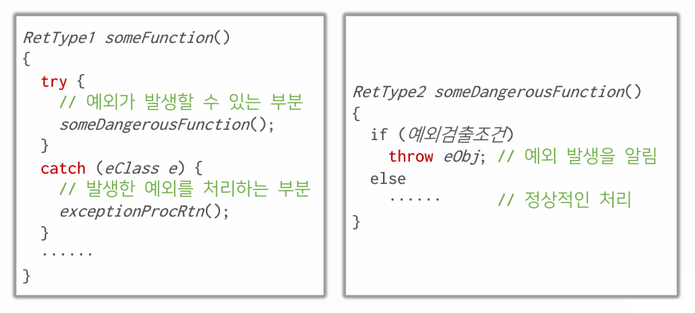
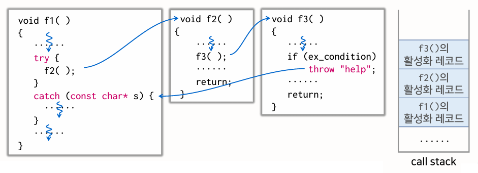
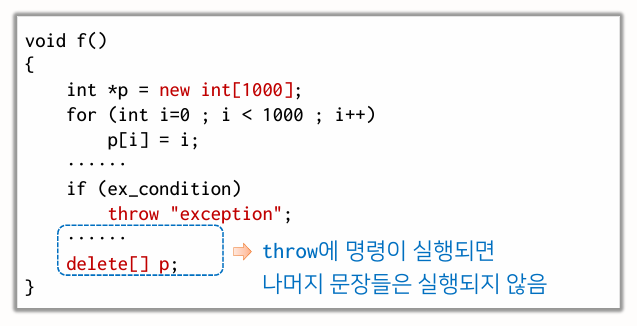
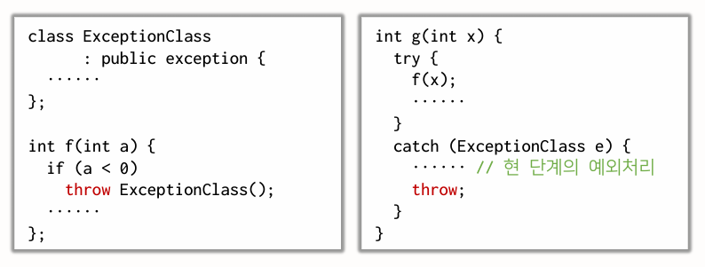
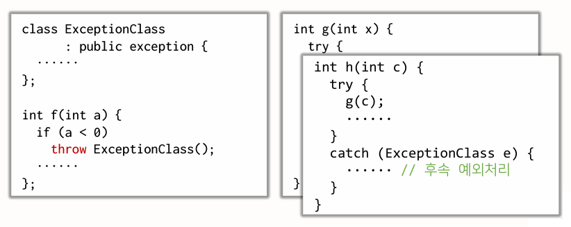

{:toc .large-only}

## 예외

- exception
- 프로그램 실행 도중 발생할 수 있는 비정상적인 사건으로 대표적인 상황은 아래와 같다.
  - 변수의 값에 따라 연산을 수행하지 못하는 경우
  - 사용자의 입력이 프로그래머가 기대한 것과 다른 경우
  - 프로그램에서 자원을 필요로 할 때 컴퓨터가 자원이 부족한 경우

### 예외가 발생하는 상황의 예

#### 연산식 수행 오류

```cpp
double hmean(double a, double b)
{
    return 2.0 * a * b / (a + b);
}
```

- 위 예제에서 a == -b인 경우 0으로 나누기 연산을 하게 되어 에러 발생
- if문을 사용하여 `exit()` 호출로 프로그램의 실행을 종료시킬 수 있다.

```cpp
double hmean(double a, double b)
{
    if (a == -b) {
        cout << "나누기를 할 수 없습니다." << endl;
        exit(EXIT_FAILURE); // 종료 사유 코드
    }
    return 2.0 * a * b / (a + b);
}
```

#### 메모리 할당 오류

```cpp
void f() {
    int *p = new(nothrow) int[1000000000];
    ······   // 할당된 메모리의 활용
}
```

- 메모리 할당이 이루어지지 않은 경우 `new(nothrow)`는 nullptr을 반환하므로, 이를 이용하여 메모리 할당 오류를 검사할 수 있다.

```cpp
void f() {
    int *p = new(nothrow) int[1000000000];
    if (!p) { // p가 nullptr이면
        cerr << "메모리 할당 오류" << endl;
        exit(EXIT_FAILURE);
    }
    ······
}
```

## 예외처리

C++ 언어의 예외처리 체계는 try 블록과 catch 블록, 그리고 throw 문장으로 구성된다.



하나의 try 블록에 여러 개의 catch 블록 사용이 가능하다.

예외가 발생하면 catch 블록 중에서 매개변수의 형이 일치하는 catch 블록으로 제어가 전달된다.

`catch (...)`는 모든 종류의 예외를 포착할 수 있다.

```cpp
try {
    ······  // 예외가 발생할 가능성이 있는 함수 호출
}
catch (eClass1 e) {
    ······ // 예외처리 블록1
}
catch (eClass2 e) {
    ······ // 예외처리 블록2
}
catch (...) {
    ······ // 그 외의 모든 예외 처리
}
```

### 제어의 전달



예외가 발생한 경우 throw 문장은 자신을 감싸고 있는 가장 가까운 try 블록이 끝나는 부분으로 제어를 전달한다. (이 때 지역변수는 소멸된다.)

그 다음에는 catch 블록과 매개변수의 형을 비교하여 형이 같은 매개변수를 가지는 catch 블록으로 제어가 전달된다.

이 때 throw 문장 뒤의 코드가 실행되지 못해서 할당된 메모리가 반납되지 않으면 메모리가 유실되게 된다.



이러한 문제를 개선하기 위해 **스마트 포인터**를 이용한다.

### 스마트 포인터

- 헤더파일 `<memory>`을 소스파일에 포함시켜 사용
- delete 명령어를 실행하지 않아도 메모리 해제 가능
- **unique_ptr**: 할당된 메모리를 한 개의 포인터만 가리킬 수 있음
  - 다른 unique_ptr에 대입할 수 없으며, 이동 대입만 할 수 있음
  - unique_ptr이 제거되거나 nullptr을 대입하면 가리키고 있던 메모리를 반납함
- **shared_ptr**: 할당된 메모리를 여러 개의 포인터로 가리킬 수 있음
  - 다른 shared_ptr에 대입 및 이동 대입 가능
  - shared_ptr이 제거되거나 nullptr을 대입하면 그 메모리를 가리키는 shared_ptr이 더 이상 없으면 메모리를 반납함

```cpp
#include <iostream>
#include <memory>
using namespace std;

void f() {
    unique_ptr<int[]> p { new int[1000] };
    ...
    if (ex_condition)
        throw "exception";
    ...
}
```

throw 문장에서 catch 블록으로 이동하면서 지역변수가 소멸되므로 unique_ptr가 제거되면서 메모리를 반납한다.

또는 vector를 활용하는 방법도 있다.

```cpp
#include <iostream>
#include <vector>
using namespace std;

void f() {
    vector<int[]> p(1000);
    ...
    if (ex_condition)
        throw "exception";
    ...
}
```

### noexcept

- 함수가 예외를 일으키지 않음을 지정하는 지정자

```cpp
template <typename T>
T max(const vector<T>& v) noexcept {
    auto p = v.begin();
    T m = *p++;
    for (; p != v.end(); p++)
        if (m < *p)  m = *p;
    return m;
}
```

## 예외처리 클래스

- 클래스 설계 시 예외처리 기능을 포함시킴
- 클래스 선언문 내에 예외처리 담당 클래스를 선언하여 활용함

```cpp
class Array {
    int  *buf;
    int  size;
public:
    int& operator[](int offset);
    class BadIndex { // 예외처리 클래스
    public:
        int wrongIndex;
        BadIndex(int n): wrongIndex(n) {}
    };
};

int& Array::operator[](int offset)
{
    if (offset < 0 || offset >= size)  // 예외조건 검사
        throw BadIndex(offset); // 예외객체 생성 및 전달
    return buf[offset];
}

int main()
{
    Array arr(10);
    try {
        for (int i = 0; i <= 10; i++)
        arr[i] = i;
    }
    catch (Array::BadIndex e) {
        cerr << "인덱스 범위 오류 : " << e.wrongIndex << endl;
    }
    cout << arr << endl;
    return 0;
}
```

클래스 내부에서 예외 발생 시 예외처리 클래스를 throw 하고, catch 블록에서 매개변수로 예외처리 클래스를 받아서 처리한다.

### exception 클래스

- C++에서 예외처리 담당 클래스의 기초 클래스로 제공하는 클래스
- 헤더파일 `<exception>`을 소스파일에 포함시켜 사용
- 예외의 종류를 char\* 형태로 반환하는 가상함수 `what()`을 멤버함수로 가지고 있음

```cpp
#include <exception>

class Array {
    ···
public:
    ···
    class BadIndex: public exception {
    public:
        int wrongIndex;
        BadIndex(int n) : wrongIndex(n), exception() {}
        const char* what() const { return "Array Exception::"; }
    };
};
```

### 예외 객체의 다시 던지기

현 단계의 catch 블록에서 처리를 완결할 수 없는 예외에 대해 후속 처리를 할 수 있도록 예외 객체를 다시 throw 할 수 있다.




