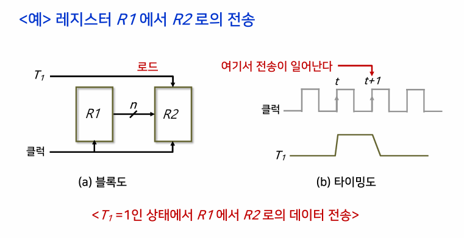
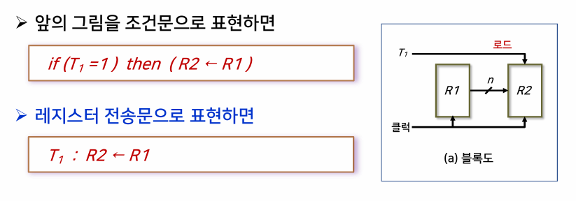

{:toc .large-only}

## 처리장치의 개요

- 중앙처리장치(CPU) 내에서 데이터를 처리하는 연산을 실행한다.
- CPU는 처리장치와 제어장치가 결합된 형태이고, 제어장치는 연산의 실행 순서를 결정한다.
- 제어장치가 처리장치에 제어신호를 보내면 처리장치에서 제어장치로 상태신호를 보낸다.

## 처리장치의 구성

- 산술논리연산장치(**ALU**)
  - 산술, 논리, 비트연산 등의 연산 수행
  - 독립적으로 데이터를 처리하지 못하며, 반드시 레지스터들과 조합하여 데이터를 처리
- 레지스터 세트
  - 연산에 사용되는 데이터나 연산의 결과를 저장
- 내부 버스
  - 산술논리연산장치와 레지스터 사이의 정보 전송 경로
  - 입력버스와 출력버스로 나뉨

## 마이크로 연산

- 레지스터에 저장되어 있는 데이터에 대해 이루어지는 기본적인 연산

### 레지스터 전송 마이크로 연산

- 한 레지스터에서 다른 레지스터로 2진 데이터를 전송하는 연산
- R2 ← R1
  - R1: 출발 레지스터
  - R2: 도착 레지스터

#### 레지스터의 표현

#### 하드웨어적인 측면에서의 레지스터 전송

- T1이 t+1 클록의 상승 천이 시점에서 0으로 돌아오며 R1에서 R2로 단 한 번 값의 전송이 발생한다.
- T1이 시간 t에서 활성화되었지만 실제 전송은 시간 t+1에서 다음 상승 천이가 일어날 때까지 발생하지 않으며, 레지스터 R2의 내용이 R1으로 전송되는 것은 T1이 1에서 0으로 떨어지는 순간에 이루어진다.

- n: 전송되는 비트 수
- T1: 제어신호
- T1=1인 상태에서 R1에서 R2로 데이터 전송
- T1: R2 ← R1

#### 레지스터 전송문장에서 사용되는 기본적인 기호

| 기호                | 의미                                              | 사용 예               |
| ------------------- | ------------------------------------------------- | --------------------- |
| 영문자(숫자와 함께) | 레지스터를 표시                                   | AR, R2, DR, IR        |
| 괄호                | 레지스터의 일부분                                 | R2(1), R2(7:0), AR(1) |
| 화살표              | 자료의 이동 표시                                  | R1 ← R2               |
| 쉼표                | 동시에 실행되는 두 개 이상의 마이크로 연산을 구분 | R1 ← R2, R2 ← R1      |
| 대괄호              | 메모리에서의 어드레스                             | DR ← M[AR]            |

### 산술 마이크로 연산

- 레지스터 내의 데이터에 대해 실행되는 산술연산
- 기본적인 산술연산으로는 덧셈, 뺄셈, 1 증가, 1 감소, 보수연산이 있다.

### 논리 마이크로 연산

- 레지스터 내의 데이터에 대한 비트를 조작하는 연산
- 기본적인 논리연산으로는 AND, OR, XOR, NOT 연산이 있다.

### 시프트 마이크로 연산

- 레지스터 내의 비트 데이터를 시프트하는 연산
  - sl: 왼쪽으로 1비트씩 이동시킴
  - sr: 오른쪽으로 1비트씩 이동시킴
- 시프트 연산을 수행하더라도 R2의 값은 변하지 않는다.
- sr이나 sl에 대해서 입력 비트는 0으로 가정한다.
- 출력비트의 값은 버려진다.

## 처리장치의 동작

### 마이크로 연산을 수행하는 과정

ex) R0 ← R1+R2 연산을 수행하는 과정

1. 선택신호 A는 R1의 내용을 버스 A로 적재
1. 선택신호 B는 R2의 내용을 버스 B로 적재
1. 선택신호 F는 ALU에서 산술연산 A+B를 수행
1. 선택신호 H는 시프터에서 시프트 연산을 수행
1. 선택신호 D는 연산결과를 R0으로 적재

### 내부버스를 구성하는 방법

- **멀티플렉서(MUX)와 디코더**를 이용
  - 멀티플렉서는 출발 레지스터 선택
  - 디코더는 도착 레지스터 선택
- 레지스터에서 ALU로 이동: 입력버스
- ALU에서 레지스터로 이동: 출력버스

## 산술논리연산장치(ALU)

- S2: 산술연산과 논리연산을 구분하는 선택입력 (0: 산술, 1: 논리)
- S1, S0: 실행할 산술연산 혹은 논리연산 지정
- C: 입력캐리
- k개의 선택입력으로 최대 2^k의 연산을 표시할 수 있다.
- 산술연산장치와 논리연산장치의 결합으로 구성된다.

#### ALU에 대한 연산표

- ex) F = A+B 연산을 수행하려면 0010(S2:0, S1:0, S0:1, C:0) 선택신호를 보내야 한다.
- 논리연산은 입력캐리 C와 무관함

### 상태 레지스터

- ALU의 연산 결과에 의한 상태 변화(캐리의 변화)를 보관하는 레지스터
- S(부호 비트): 0이면 양수, 1이면 음수
- Z(제로 비트): 연산 결과가 0이면 1 (NOR 논리게이트에 사용)
- V(오버플로 비트): 레지스터에 연산 결과를 저장할 자리가 없는 오버플로 발생 시 1
- C(캐리 비트): 캐리가 발생하면 1, 아니면 0
  - 캐리: 자리 올림수

### 시프터

- 입력 데이터의 모든 비트들을 각각 서로 이웃한 비트로 자리를 옮기는 시프트 연산을 수행

## 제어단어

- 제어변수(선택신호)들의 묶음
  - 선택신호: 마이크로 연산을 선택하는 변수
- 16개의 2진 제어변수가 있고 제어변수를 묶어 제어단어를 구성한다.

### 선택신호와 제어단어의 구성

- A 필드: ALU로 입력되는 A 버스 선택(3비트)
- B 필드: ALU로 입력되는 B 버스 선택(3비트)
- D 필드: 도착 레지스터 선택(3비트)
- F 필드: ALU의 연산 선택(4비트)
- H 필드: 시프터의 연산 선택(3비트)

### 제어단어의 비트 수

- 제어단어의 비트 수는 각 선택신호들의 비트 수를 더하여 구할 수 있다.
- ex) 7개의 레지스터가 있고, ALU가 12가지 연산, 시프터가 6개의 연산으 수행한다면
  - 레지스터가 7개와 입력 데이터(기억장치)를 합한 8개 공간의 데이터가 MUX로 들어오고. MUX는 8개 중 하나를 선택하려면 3비트가 필요하다.
  - ALU는 16개의 연산 중 하나를 선택하려면 4비트가 필요하다.
  - 시프터에서 6개의 연산 중 하나를 선택하려면 3비트가 필요하다.
  - 디코더에서 레지스터 7개와 출력 데이터(기억장치)를 합한 8개 중에 하나를 선택하려면 3비트가 필요하다.
  - 이를 모두 합하면 A:3 + B:3 + D:3 + F:4 + H:3 = 20비트이다.

### 제어단어의 작성 방법

- ex) R1 <- R2-R3
  - A 필드: ALU의 A 버스 입력으로 R2의 내용을 보낸다.
  - B 필드: ALU의 B 버스 입력으로 R3의 내용을 보낸다.
  - D 필드: 연산 결과를 도착 레지스터 R1으로 보낸다.
  - F 필드: ALU에서 감산 연산(F=A-B)을 수행한다.
  - H 필드: 시프터에서 연산을 수행하지 않는다. (시프트 없음)
