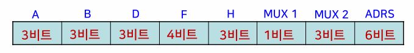
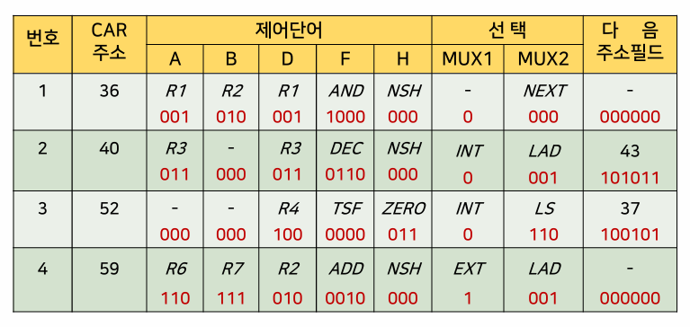
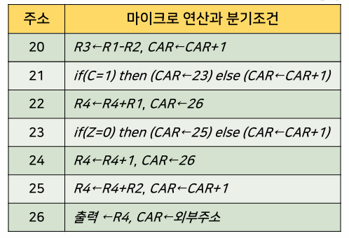
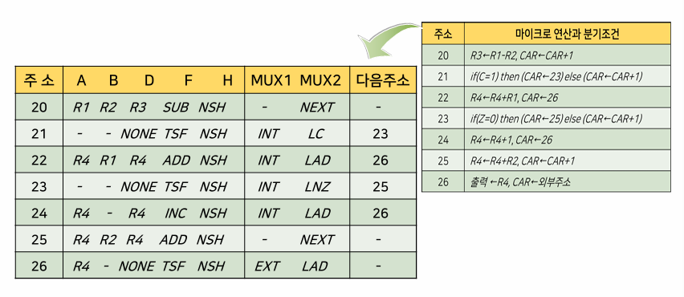
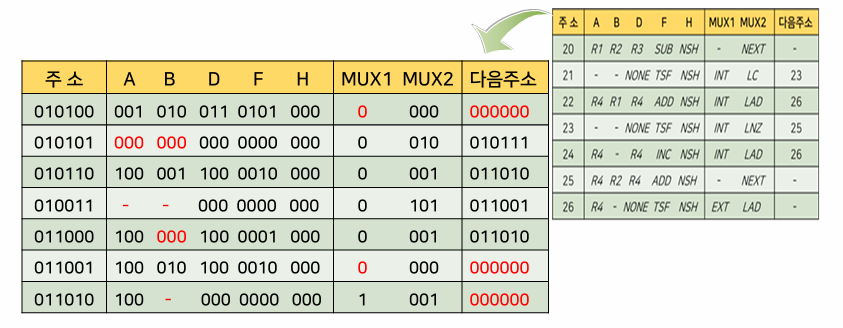

{:toc .large-only}

## 제어장치의 개요

- 컴퓨터시스템의 모든 장치들을 유기적으로 제어하는 장치
- 기억장치로부터 명령어를 하나씩 읽어내어 연산코드 결과에 따라 제어신호를 발생시켜 명령어를 수행한다.

## 제어장치의 구성

- 명령어 레지스터
- 명령어 해독기
- 순서 제어기
- 주소 처리기

## 제어장치의 동작

1. 프로그램카운터(PC)에 저장된 주소로 기억장치에 접근한다.
1. 기억장치에서 명령어를 읽어와 명령어 레지스터(IR)에 저장하고, 프로그램 카운터를 1 증가시킨다.
1. 읽어온 명령어에서 연산코드는 명령어 해독기로, 오퍼랜드는 주소처리기로 보낸다.
1. 주소처리기는 명령어 수행에 필요한 오퍼랜드의 주소 또는 다음 명령어의 주소를 계산한다.
1. 제어신호 발생기에서 연산코드를 해독하여 명령어 수행을 위한 제어신호를 발생한다.

## 제어장치의 유형

- 마이크로 프로그램에 의한 제어장치
  - 제어단어와 같은 제어정보를 특별한 기억장치에 기억시킨 구조
  - 프로그램에 의한 제어방식
  - 장점: 제어신호를 수정하고자 할 때 융통성이 뛰어남
  - 단점: 기억장치에서 명령을 인출하는 별도의 시간 때문에 속도가 느림
  - 대부분의 컴퓨터에서 사용
- 하드웨어에 의한 제어장치
  - 순서회로와 같은 게이트와 플립플롭으로 이루어짐
  - 장점: 순서회로로 구성되어 고속 동작이 가능
  - 단점: 회로의 동작방법이 바뀌면 다시 설계해야 함
  - 특수한 컴퓨터에서 사용

### 제어단어

- 0과 1의 스트링으로 표현
- 각 제어단어에는 마이크로 명령어가 포함
- 마이크로 명령어는 하나 혹은 다수의 마이크로 연산을 나타낸다.

## 마이크로 프로그램에 의한 제어장치의 구조

### 제어기억장치 (ROM)

- 마이크로 명령어들을 저장하고 있는 기억장치

### 다음 주소 생성기 (순서기)

- 다음에 수행될 마이크로 명령어의 주소를 만들어 낸다.
  - 이 주소는 다음 클록 펄스가 입력될 때 CAR로 이동되어 ROM으로부터 다음 마이크로 명령어를 읽는데 사용된다.
  - 마이크로 명령어 내에는 처리장치의 마이크로 연산을 실행시키는 제어비트와 실행될 마이크로 명령어의 순서를 정하는 비트가 포함된다.
- 다음 마이크로 명령어의 주소를 결정하는 방법
  - CAR의 1 증가
  - 제어기억장치의 주소를 CAR로 적재
  - 외부로부터 온 주소를 CAR에 적재
  - 제어동작을 시작하는 초기주소 적재

### 제어 주소 레지스터

- 다음에 읽을 마이크로 명령어의 주소를 저장하는 레지스터

### 제어 데이터 레지스터

- 제어기억장치로부터 다음 마이크로 명령어를 읽어올 때까지 현재의 마이크로 명령어를 저장
- 마이크로 명령어의 순차적 진행이 복잡해지므로 시스템의 간소화를 위해 일반적으로 생략한다.

## 마이크로 프로그램에 의한 제어장치의 동작

1. CAR에 새로운 주소가 들어오면 이 주소에 있는 26비트의 마이크로 명령어를 제어기억장치로부터 인출
1. 마이크로 명령어의 제어단어는 CAR의 다음 동작을 결정
1. 처리장치에서 해당하는 상태비트를 새로운 값으로 갱신하며, 다음 주소를 CAR로 전송
1. CAR의 새로운 주소는 제어기억장치의 다음 마이크로 명령어를 지정
1. 이러한 과정을 각 클럭의 천이 때마다 반복

### 구성요소별 동작

- MUX 1
  - 외부주소나 내부주소 중 하나를 선택하여 CAR로 적재
  - 선택 신호가 0이면 현재 마이크로 명령어의 주소부분을 적재
  - 선택 신호가 1이면 외부주소를 적재
- MUX 2
  - 상태비트의 값에 따라 CAR의 동작을 결정
    - 입력 중 하나를 선택하여 3비트의 선택신호를 보내 CAR에서 수행될 동작을 결정

### 마이크로 명령어의 내역

- 제어기억장치에 저장된 마이크로 명령어(제어단어 포함)에 의해 동작
- 위 구성도에서 마이크로 명령어의 내역(제어신호)은 26비트로 구성되며, 이 26비트의 내역은 아래와 같다.
  - 16비트: 처리장치 제어를 위한 제어단어
    - A 필드: 처리장치의 레지스터 중 하나의 출발 레지스터 선택
    - B 필드: 처리장치의 레지스터 중 다른 하나의 출발 레지스터 선택
    - D 필드: 처리장치의 레지스터 중 도착 레지스터 선택
    - F 필드: 처리장치의 ALU 연산 선택
    - H 필드: 처리장치의 시프트 연산 선택
  - 6비트: ROM의 64단어를 선택하기 위한 주소비트
    - ADRS 필드: ROM의 2진 번지에 해당하는 10진 주소
  - 3비트: MUX 2의 8개 입력 중 하나를 선택
    - MUX 2 필드: 상태비트의 값에 따라 CAR를 구동
  - 1비트: MUX 1에서 외부에서 입력한 주소와 내부 마이크로 명령어의 주소 중 하나를 선택
    - MUX 1 필드: 0과 1로서 내부와 외부 주소를 선택

#### MUX 2의 선택기능

| 2진코드 | 기호 | 기능                                 |
| ------- | ---- | ------------------------------------ |
| 000     | NEXT | CAR를 증가(다음 주소로 간다)         |
| 001     | LAD  | CAR에 주소를 적재(무조건 분기)       |
| 010     | LC   | 캐리가 있으면 적재(C=1이면 분기)     |
| 011     | LNC  | 캐리가 없으면 적재(C=0이면 분기)     |
| 100     | LZ   | 제로면 적재(Z=1이면 분기)            |
| 101     | LNZ  | 제로가 아니면 적재(Z=0이면 분기)     |
| 110     | LS   | 부호가 바뀌었으면 적재(S=1이면 분기) |
| 111     | LV   | 범람이 바뀌었으면 적재(V=1이면 분기) |

#### 마이크로 명령어의 예

- 주소 36에 저장되어 있는 마이크로 명령어 :
  - 레지스터 R1(필드 A)와 레지스터 R2(필드 B)에 AND 연산(F 필드)을 수행하여 그 결과를 레지스터 R1(필드 D)로 전송한다.
  - MUX 2 필드는 NEXT, 다음 주소 필드와 MUX 1 필드는 대시(-) 이다.
  - 이를 레지스터 전송문으로 나타내면 R1 ← R1∧R2, CAR ← CAR+1 이다.
- 주소 40에 저장되어 있는 마이크로 명령어 :
  - 레지스터 R3(필드 A)에 DEC 연산(F 필드)을 수행하여 그 결과를 레지스터 R3(필드 D)로 전송한다.
  - MUX 2 필드는 LAD, 다음 주소 필드는 43, MUX 1 필드는 INT(0) 이다.
  - 이를 레지스터 전송문으로 나타내면 R3 ← R3-1, CAR ← 43 이다.
- 주소 52에 저장되어 있는 마이크로 명령어 :
  - H 필드가 ZERO 이므로 시프터에 모두 0을 내보내고 그 결과를 레지스터 R4(필드 D)로 전송한다.
  - MUX 2 필드의 LS는 상태비트 S=1이면 분기한다. 즉, S=1이면 다음 주소 필드의 37을 CAR로 적재하고, S=0이면 CAR은 1 증가한다.
  - 이를 레지스터 전송문으로 나타내면 R4 ← 0, if (S=1) then (CAR ← 37) else (CAR ← CAR+1) 이다.
- 주소 59에 저장되어 있는 마이크로 명령어 :
  - MUX1이 1이므로 외부 주소를 선택했으며, MUX2가 LAD이므로 CAR에 외부 주소를 적재한다.
  - 이를 레지스터 전송문으로 나타내면 R2 ← R6+R7, CAR ← 외부주소 이다.

## 마이크로 프로그램의 작성

- 제어기억장치에 저장된 일련의 마이크로 명령어들의 집합을 마이크로 프로그램 루틴이라고 한다.
- 외부주소는 제어기억장치에 있는 마이크로 프로그램 루틴의 첫 번째 주소를 의미하며, 이 루틴은 다른 루틴이 시작되는 새로운 외부주소를 적재하는 마이크로 명령어로 끝난다.
- 일반적으로 제어기억장치는 몇 개의 루틴으로 나누어져 있으며, 어떤 루틴을 수행할 것인지는 외부제어로 결정된다.
- 마이크로 프로그램의 작성 과정은 컴퓨터의 프로그램 작성 과정과 유사하다.
- 소프트웨어와 하드웨어 중간의 펌웨어라고도 함

#### 기호 마이크로 프로그램

#### 기호 마이크로 프로그램

