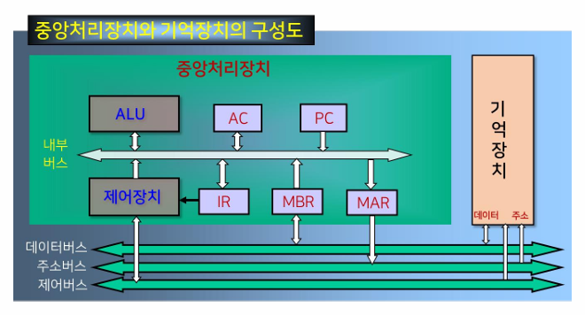

{:toc .large-only}

## 중앙처리장치

- 컴퓨터에서 명령어를 수행하고 데이터를 처리하는 장치
- 프로그램이 수행되는 전반적인 과정을 제어
- 처리장치와 제어장치로 구성

### 중앙처리장치의 내부 구조

- 산술논리연산장치(ALU)
  - 산술연산장치
  - 논리연산장치
  - 시프터
  - 상태 레지스터: 연산 결과의 상태를 나타내는 플래그(flag)를 저장하는 레지스터
  - 보수기: ALU 내의 데이터에 대해 보수연산을 수행
- 레지스터 세트
  - CPU 내의 레지스터 집합
  - 기억장치 중 액세스 속도가 가장 빠르며 CPU의 빠른 처리속도를 지원한다.
  - 가격이 비싸므로 CPU 내의 레지스터 수가 제한된다.
- 제어장치
  - 프로그램에 의한 연산의 순서대로 기억장치, 연산장치, 입출력장치에 제어신호를 발생한다.
- 내부버스
  - ALU와 레지스터 간의 데이터 전송을 위한 통로
  - 데이터버스와 제어버스로 구성
  - 외부장치(기억장치, 입출력장치)와 데이터 전송을 하기 위해서 시스템버스인 주소버스, 데이터버스, 제어버스를 이용
    - 내부버스와 시스템버스는 직접 연결되지 않으며 반드시 버퍼 레지스터나 시스템버스 인터페이스 회로를 통해 시스템버스와 연결됨

## 레지스터

### 범용 레지스터

- 데이터 저장과 같은 일반적인 목적으로 사용되는 레지스터
- CPU 내부에 있는 소규모의 일시적인 기억장치로 데이터나 연산 결과를 일시적으로 저장

### 특수 레지스터

#### 주소를 기억하는 레지스터

- 프로그램 카운터(PC)
  - 다음에 수행될 명령어가 있는 주소를 가짐. 즉, 데이터가 저장되어 있는 기억장치의 주소를 지정
  - 현재 처리하려고 하는 데이터를 인출한 후 자동적으로 1 증가
  - 프로그램 카운터의 비트 수는 기억장치의 용량에 따라 결정됨
- 기억장치주소 레지스터(MAR)
  - 기억장치 주소를 임시 저장하는 레지스터
- 스택 포인터(SP)
  - 스택 주소지정방식에서 사용되며 스택의 최상위 주소를 지정함
  - 프로그램 카운터와 같은 비트 수를 가짐
- 제어 주소 레지스터(CAR)
- 인덱스 레지스터(XR)
- 베이스 레지스터(BR)

#### 명령어를 기억하는 레지스터

- 명령어 레지스터(IR)
  - 프로그램 수행 중 기억장치로부터 가장 최근에 인출된 명령어(현재 수행되고 있는 명령어)를 갖고 있다.
  - 명령어 연산코드의 비트수와 같다.

#### 데이터를 기억하는 레지스터

- 기억장치 버퍼 레지스터(MBR)
  - 기억장치로 쓰여질 데이터나 기억장치로부터 읽혀질 데이터를 임시로 저장하는 레지스터
- 누산기(AC)
  - 데이터를 일시적으로 저장하는 레지스터

## 명령어 사이클

- 한 개의 명령어를 CPU에서 수행하는데 필요한 전체 수행 과정
- 인출 사이클, 실행 사이클, 간접 사이클, 인터럽트 사이클 종류가 있음

### 명령어 수행과정

1. 명령어 인출
1. 명령어 해석: 명령어를 해독하는 과정
1. 명령어 실행: 지정된 연산을 실행하는 과정. 간접주소지정인 경우 유효주소를 다시 인출
1. 저장: 수행된 연산 결과를 레지스터 혹은 기억장치에 저장
1. 인터럽트 처리: 명령어 실행 도중 인터럽트가 들어오면 그에 합당한 서비스를 제공

### 명령어 인출 사이클

기억장치에 저장되어 있는 명령어를 인출하는 과정

### 명령어 실행 사이클

명령어 인출과정을 통해 명령어 레지스터(IR)에 실린 명령어를 해독하고, 해독한 명령어에 따라 필요한 연산을 수행한다.

#### 수행되는 연산들의 기능

- 데이터의 이동 기능: 기억장치와 CPU 혹은 입출력장치 사이에 데이터의 이동
- 데이터의 처리 기능: 산술 혹은 논리연산을 통한 데이터 처리
- 데이터의 저장 기능: 연산 결과를 기억장치에 저장
- 제어 기능: 프로그램의 실행 순서를 결정

#### LOAD 명령어

데이터 이동 명령어로 원하는 기억장치의 데이터를 누산기로 가져오는 명령어

1. 누산기로 이동할 데이터가 들어있는 주소가 MAR에 실린다. (MAR ← IR(adrs))
1. MAR 레지스터에 있는 주소의 데이터가 MBR에 실린다. (MBR ← M\[MAR])
1. MBR에 들어있는 데이터를 누산기로 읽어온다. (AC ← MBR)

#### ADD 명령어

데이터 처리 명령어로 누산기에 있는 데이터와 기억장치에 있는 데이터를 더한 후 그 결과를 누산기에 저장하는 명령어

1. 더해질 데이터가 들어 있는 기억장치의 주소가 MAR에 실린다. (MAR ← IR(adrs))
1. MAR에 있는 기억장치 주소에 해당하는 데이터가 MBR에 실린다. (MBR ← M\[MAR])
1. 누산기에 있는 데이터와 MBR에 있는 데이터가 더해지고, 결과가 누산기에 저장된다. (AC ← AC + MBR)

#### STORE 명령어

데이터 저장 명령어로 연산 결과를 갖고 있는 누산기의 데이터를 기억장치에 저장하는 명령어

1. 저장될 주소가 MAR에 실린다. (MAR ← IR(adrs))
1. 누산기에 있는 데이터가 MBR에 실린다. (MBR ← AC)
1. MBR에 있는 데이터가 MAR에 있는 주소로 저장된다. (M\[MAR] ← MBR)

#### 분기 혹은 점프 명령어

제어기능을 수행하는 명령어로 프로그램 순서를 바꾸는 명령어

1. 분기 혹은 점프 명령어에 있는 주소가 PC에 실린다. (PC ← IR(adrs))

### 간접 사이클

간접주소지정방식에서 명령어 오퍼랜드의 유효주소를 결정하는 과정

1. 명령어의 주소가 MAR에 실린다. (MAR ← IR(adrs))
1. MAR이 지정한 주소의 데이터가 MBR에 실린다. (MBR ← M\[MAR])
1. MBR이 있는 데이터가 IR의 주소 필드에 실린다. (IR(adrs) ← MBR)

### 인터럽트 사이클

CPU의 정상적인 동작 중에 인터럽트 요청이 발생했을 때 실행되는 과정

실행 사이클이 끝난 직후에 인터럽트가 발생했는지를 검사하며, 발생했다면 인터럽트 서비스 루틴이 시작되도록 한다.

1. 현재 수행하고 있는 명령어를 처리한 후, 다음에 수행할 명령어 주소를 갖고 있는 PC의 내용을 스택에 저장한다. (MBR ← PC, MAR ← SP, PC ← ISR(adrs))
1. 요청된 인터럽트 서비스 루틴을 호출하여 그 서비스 루틴의 시작 주소를 PC에 저장한다. (M\[MAR] ← MBR)

#### 인터럽트가 발생하는 경우

- 프로그램이 잘못 실행된 경우
- 하드웨어 결함
- I/O 장치 등의 요청
