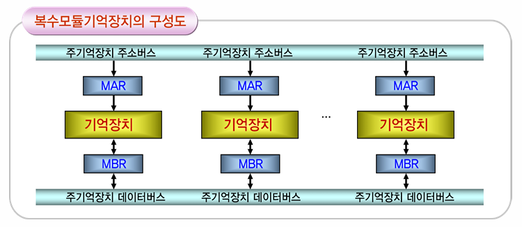
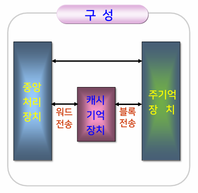

{:toc .large-only}

## 기억장치

프로그램과 데이터를 저장하는 장치

- 주기억장치
  - 처리에 당장 필요한 프로그램이나 데이터 저장
  - 중앙처리장치와 직접 데이터 교환이 가능
- 보조기억장치
  - 주기억장치에 저장이 어려운 대량의 자료를 보관하는 장치
  - 중앙처리장치와 직접적인 자료 교환이 불가능하며, 주기억장치를 통해서만 가능
  - 주기억장치에 비해 가격이 저렴하고 용량이 크지만 전송 속도는 느림

### 지역성의 원리

주어진 시간 동안의 프로그램 실행에서 발생하는 주소들은 기억장치 내의 몇몇 한정된 영역만을 반복적으로 지정하며, 그 밖의 영역에 대한 접근은 상대적으로 드문 현상

#### 시간적 지연성

- 어떤 내용이 한 번 참조되면, 곧바로 다시 참조되기 쉽다.

#### 공간적 지연성

- 어떤 내용이 한 번 참조되면, 그 내용에 가까운 곳에 있는 다른 내용이 곧바로 참조되기 쉽다.

#### 프로그램의 지역성

반복적으로 명령어와 데이터에 접근하는 대부분의 프로그램은 상당히 큰 시간적, 공간적 지연성을 보인다.

### 기억장치 계층

- 속도와 크기가 다른 기억장치를 여러 층으로 구성한 것
- 지역성의 원리를 이용하여 기억장치 계층을 구현
- 가격을 최소화하고 빠른 접근속도와 대용량의 크기를 제공하기 위한 입출력의 경제성을 확보

### 기억장치 성능평가의 요인

- 기억용량
- 접근 시간: 기억장치에서 데이터를 판독하거나 기록하는 데 걸리는 시간
- 사이클 시간: 하나의 액세스를 시작한 시간부터 다음 액세스를 시작할 때까지의 시간
- 기억장치 대역폭: 데이터 처리 속도, 데이터 전송률
- 가격

## 주기억장치

### 주기억장치 성능평가의 요인

- 접근시간
  - 주기억장치의 접근시간은 CPU의 클록 사이클 시간과 비교하여 수 배에서 수십 배 정도로 길다.
  - CPU와의 속도 차이 개선이 필요
- 대역폭
  - 주기억장치의 대역폭은 CPU와 보조기억장치, 입출력장치가 공동으로 사용하므로 제한적 (병목현상)
- 기억용량
  - 아무리 큰 용량의 주기억장치도 기억용량의 증가가 요구됨

#### 개선방법

- 속도 개선: 복수모듈 기억장치, 연관기억장치, 캐시기억장치
- 용량 개선: 가상기억장치

### 복수모듈 기억장치

- 독자적인 기억장치모듈을 여러 개 가지고 있는 기억장치
- 기억장치를 구성하고 있는 모듈 수만큼의 단어들을 동시에 접근 가능

#### 3-모듈기억장치

한 모듈에서 주소 버스를 통해 주소를 보내는 동안(A), 다른 모듈에서는 주소를 해독하여 기억장소에 접근하고(M), 또 다른 모듈에서는 읽어낸 데이터를 데이터버스를 통해 외부로 보낸다.(D)

여기서 A, M, D는 주기억장치를 접근하는 데 필요한 각 수행단계에 걸리는 시간이고, A=M=D라면 3-모듈기억장치는 최대의 속도로 동작한다.

#### 문제점

- 한 개의 버스를 공유할 경우, 동시에 버스 사용을 요구하면 버스경합 발생
- 동시에 한 개 이상의 모듈들이 동일 버스를 사용하면 데이터간의 충돌(기억장치충돌)이 발생

#### 해결 방법

- **메모리 인터리빙**
  - 버스경합이나 기억장치충돌과 같은 문제를 해결하기 위해 기억장치를 복수모듈로 구성하고 각 모듈이 동시에 접근할 수 있게 하는 방식
  - CPU가 각 모듈 별로 전송할 주소를 교대로 배치한 후 차례대로 전송하여 여러 모듈을 병행 접근하는 기법
  - 기억장치의 접근시간을 효율적으로 높일 수 있다.

### 연관기억장치

- 기억장치에 저장된 데이터의 내용을 이용하여 기억장치에 접근할 수 있는 기억장치
- 내용주소화 기억장치(CAM: Content Addressable Memory) 라고도 함
- RAM보다 접근 속도가 훨씬 빠름
  - 사이클이 같다고 가정했을 때 연관기억장치가 RAM의 약 2천배 속도로 검색 가능
- 기억소자에 병렬판독회로가 포함되므로 가격이 매우 비싸다.

## 캐시기억장치

- 주기억장치보다 속도가 빠른 기억소자들로 구성되어 CPU와 주기억장치 간의 속도 차이를 줄여주는 역할을 한다.
- 캐시기억장치에 데이터를 미리 저장해 두고 CPU가 주기억장치 대신 캐시기억장치에서 데이터를 가져오게 한다.
  - 지역성의 원리를 이용하여 주기억장치에서 접근할 데이터를 미리 예측하여 캐시기억장치로 옮겨 놓는다.
- 주기억장치보다 가격이 비싸고 용량도 작다.

### 캐시기억장치의 사상 방식

- 사상(mapping)
  - 캐시기억장치와 주기억장치 사이의 데이터 이동
  - CPU가 캐시기억장치에서 데이터를 가져오려 할 때 원하는 데이터가 없으면(미스) 캐시기억장치와 주기억장치 사이에 데이터 이동이 발생
- 직접 사상, 연관 사상, 집합-연관 사상이 있다.

### 직접 사상

- CPU가 주기억장치를 참조할 때 CPU로부터 나온 주소를 Tag 필드와 Index 필드로 나누는 방식
- 캐시기억장치에서 CPU 주소의 Index 필드와 같은 Index를 찾아 Tag까지 같다면 그 주소의 데이터를 가져간다.
- 만약 같은 Index에 데이더가 없거나, Index는 같으나 Tag가 다르면 주기억장치에서 데이터를 찾는다.

- 히트된 경우(①)
  - 찾고자 하는 데이터의 CPU 주소가 00002일 때 Tag는 00이고, Index는 002
  - 캐시기억장치에 동일한 Index(002)와 Tag(00)이 있으므로 원하는 데이터(8598)를 가져올 수 있다.
- 미스된 경우(②)
  - 찾고자 하는 데이터의 CPU 주소가 00003일 때 Tag는 00이고, Index는 003
  - 캐시기억장치의 Index(003)에 데이터가 없다.(미스 발생)
  - 주기억장치에서 데이터를 찾아 가져오고, 캐시기억장치의 Index(003)에 Tag(00)를 넣고 가져온 데이터(2541)를 저장한다.

- 캐시기억장치에 동일한 Index(002)는 있지만 Tag(01)가 다른 경우 미스가 발생
- 주기억장치에서 데이터를 찾아 가져오고, 캐시기억장치의 Index(002)에 Tag를 01로 교체하고 가져온 데이터(7548)로 교체한다.
- 캐시기억장치의 Index에는 서로 다른 두 개의 데이터를 공유할 수 없는 단점을 가진다.

### 연관 사상

- 캐시기억장치에 데이터 블록을 저장할 때, 데이터와 그 데이터의 주기억장치 주소도 함께 저장하는 방식

- 동일 주소가 존재하는 경우: 캐시기억장치에서 그 주소와 함께 저장된 데이터를 가져온다.
- 동일 주소가 존재하지 않는 경우: 주기억장치에서 찾아 가져온 다음 그 데이터 블록(주소+데이터 쌍)을 캐시기억장치의 여분의 자리에 저장시킨다.
- 캐시기억장치에서 찾을 때 모든 주소를 다 찾아야 하는 단점이 있다.

### 집합-연관 사상

- 직접 사상 방식과 연관 사상 방식을 조합하여 만든 방식
- 캐시기억장치의 하나의 Index에 두 개 이상의 서로 다른 데이터 블록을 저장시켜서 하나의 세트(집합)을 만든다.

- 캐시기억장치에서 먼저 동일한 Index(002)를 찾고, 다시 동일한 Tag(01)를 찾는다.
- 적중률을 높이려면 Index 집합을 크게 하면 되지만, 캐시의 단어 크기가 커지고 Tag를 찾기 위한 비교논리회로가 필요하다.

## 가상기억장치

- 보조기억장치와 같이 용량이 큰 기억장치를 마치 주기억장치처럼 사용하는 개념
- 주기억장치의 기억용량이 부족한 점을 개선하기 위해 비트 당 가격과 기억 용량이 보조기억장치와 같으며, 속도가 주기억장치와 같은 기억장치를 제공하는 것이 목적
- 프로그램을 블록 단위로 나누어, 실제 주기억장치에는 현재 실행되는 프로그램에 필요한 블록만을 기억시키고, 나머지 부분은 보조기억장치에 그대로 두었다가 필요 시 주기억장치로 올린다.
- 이러한 일련의 작업들은 운영체제가 담당

- CPU에서 참조되는 각 주소는 가상주소를 주기억장치의 물리주소로 전환하는 주소 매핑을 해야 한다.
- 가상주소: 가상기억장치 시스템에서 수행되는 프로그램의 명령어가 사용되는 주소
- 물리주소: 주기억장치에 접근하기 위해 실제 주기억장치에 적용하는 주소
- 주소 변환표(매핑표)를 이용하여 가상주소를 물리주소로 변환하여 주기억장치에 접근

### 페이징 기법

- 동일한 크기로 블록을 나눈 것을 페이지라고 함
- 가상기억공간을 동일한 크기의 페이지로 나누어 사용하는 기법

- 먼저 매핑표의 첫 번째 영역에서 동일한 페이지 번호(101)를 찾는다.
- 매핑표의 두 번째 영역(01)은 주기억장치의 페이지 번호이고, 세 번째 영역(1)은 주기억장치에의 존재 유무이다.
- 세 번째 영역의 값이 1이므로(주기억장치에 존재하므로) 주기억장치에서 동일한 페이지 번호(01)를 찾아 상대위치(0101010011) 번지의 내용을 가져온다.

### 세그먼트 기법

- 동일하지 않은 크기로 블록을 나눈 것을 세그먼트라고 함
- 가상기억공간을 세그먼트 단위로 나누어 사용하는 기법
- 가변길이의 주소 공간을 가짐

- 가상주로를 논리주소라고도 하며, 논리주소는 세그먼트 번호, 페이지 번호, 워드 번호 세 부분으로 나누어진다.
- 세그먼트 변환 표와 페이지 변환 표가 필요

## 보조기억장치

- 필요할 때에 주기억장치로 옮겨 사용할 수 있는 자료를 저장하는 장치
- 기억장치 계층 구조상 하위계층 수준에 위치

### 데이터의 접근 방법

- 순차접근 방법
  - 처음부터 순서적으로 데이터를 찾는 방법
  - 일괄처리에 주로 사용
  - ex) 자기 테이프
- 직접접근 방법
  - 직접 원하는 레코드에 접근할 수 있는 방법
  - 데이터 검색이 빠르며, 실시간 처리에 주로 사용
  - ex) 자기 디스크

### 자기 디스크

- 금속이나 플라스틱으로 만들어진 원형판을 자하된 물질로 코팅한 기억매체
- 트랙(track)이라는 동심원의 집합으로 이루어짐
- 데이터 전송은 블록 단위로 이루어지며, 일반적으로 한 블록의 크기는 한 트랙보다는 작다.

### 자기 테이프

- 산화자기 박막으로 코팅된 테이프
- 순차접근 방식의 기억장치로, 속도는 느리지만 기록밀도의 효율성이 높아 데이터 백업용으로 많이 사용
- 데이터는 레코드 단위로 기록됨

### SSD

- 자기 디스크가 아닌 반도체 메모리 내장
- 하드 디스크보다 빠른 속도의 데이터 읽기, 쓰기 가능
- 물리적인 움직임이 없으므로 작동 소음이 없고, 전력 소모가 적음

#### SSD의 동작

- 블록과 페이지를 기반으로 하므로 기존의 파일 시스템과 운영체제 등에서 직접 활용 불가능
- SSD 컨트롤러에서 물리 블록과 페이지 위에 논리 섹터를 구현하여 섹터 기반의 파일 시스템, 운영체제, 프로그램들이 SSD를 기존의 하드 디스크처럼 사용할 수 있도록 함
