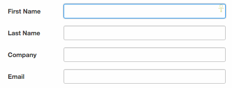

{:toc .large-only}

## :autofill

input에서 자동완성 항목 호버나 선택 시의 스타일을 지정한다.



```css
input {
  border: 3px solid grey;
  border-radius: 3px;
}

input:-webkit-autofill {
  border: 3px solid blue;
}
input:autofill {
  border: 3px solid blue;
}
```

## 참고사이트

[:autofill](https://developer.mozilla.org/en-US/docs/Web/CSS/:autofill)
