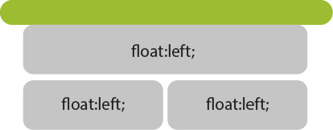
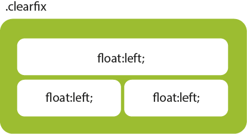

{:toc .large-only}

## clearfix

요소에 float 속성을 사용하면 height 영역이 생기지 않기 때문에 뒤에 float이 아닌 요소가 오면 겹쳐지게 된다.



float 요소들의 부모 요소의 가상선택자에 아래 clearfix 속성을 설정하면 요소들만큼의 height 영역을 차지하게 된다.

`content: ""; clear: both; display: block;`



## Example

```html
<style>
  ul:after {
    content: "";
    clear: both;
    display: block;
  }
  ul li {
    float: left;
    width: 300px;
    border: 1px solid red;
  }
  div {
    width: 300px;
    border: 1px solid blue;
  }
</style>

<ul>
  <li></li>
  <li></li>
  <li></li>
  <li></li>
  <li></li>
  <li></li>
</ul>
<div></div>
```

`inline-block`으로 하면 적용되지 않는다.

## 참고사이트

[[CSS] 클리어픽스(clearfix)](https://stonefree.tistory.com/60)
