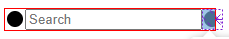
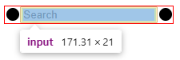

{:toc .large-only}

## 문제

```html
<div
  style="
    width: 210px;
    display: inline-flex;
    justify-content: space-between;
    border: 1px solid red;
    "
>
  <span style="display: flex; flex-shrink: 1">
    <svg width="20" height="20">
      <path d="M10 2a8 8 0 1 0 0 16 8 8 0 0 0 0-16z"></path>
    </svg>
    <input
      type="text"
      placeholder="Search"
      name="input"
      style="flex-shrink: 1"
    />
  </span>
  <svg width="20" height="20">
    <path d="M10 2a8 8 0 1 0 0 16 8 8 0 0 0 0-16z"></path>
  </svg>
</div>
```



위와 같은 flex 구조에서 자식인 input에 `flex-shrink: 1` 스타일이 적용되어 있지만, 너비가 줄어들지 않아 이웃 요소가 잘리는 현상이 발생했다.

input에 flex-shrink가 적용되지 않은 이유는 브라우저에서 input 요소의 **최소 너비**를 설정하고 있기 때문이다.

## 해결

input에 설정된 최소 너비를 없애기 위해 `min-width: 0;` 스타일을 적용한다.

또한 input의 부모에도 최소 너비가 적용되는 것 같으므로 부모 요소에도 `min-width: 0;` 스타일을 적용해주어야 한다.

```html
<div
  style="
    width: 210px;
    display: inline-flex;
    justify-content: space-between;
    border: 1px solid red;
    "
>
  <span style="display: flex; flex-shrink: 1; min-width: 0;">
    <svg width="20" height="20">
      <path d="M10 2a8 8 0 1 0 0 16 8 8 0 0 0 0-16z"></path>
    </svg>
    <input
      type="text"
      placeholder="Search"
      name="input"
      style="flex-shrink: 1; min-width: 0;"
    />
  </span>
  <svg width="20" height="20">
    <path d="M10 2a8 8 0 1 0 0 16 8 8 0 0 0 0-16z"></path>
  </svg>
</div>
```



## 참고 사이트

[input / button elements not shrinking in a flex container](https://stackoverflow.com/questions/42421361/input-button-elements-not-shrinking-in-a-flex-container)
