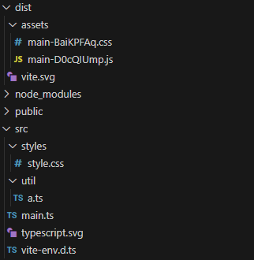
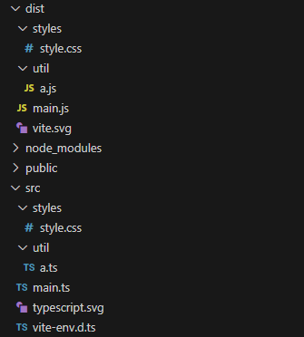
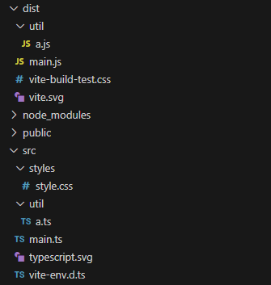

{:toc .large-only}



모듈 번들링 시 위처럼 `index.js` 같은 하나의 파일로 번들링하거나, 난수화 된 여러 청크 파일로 번들링하는 게 아니라,

원래 모듈의 폴더, 파일 구조를 따라 번들링하는 방법:

`vite.config.js` 파일에서 `build.rollupOptions.output.preserveModules: true`로 설정한다.

#### preserveModules

- 가능한 한 적은 청크를 생성하는 대신, 원래 모듈 이름을 파일 이름으로 사용하여 모든 모듈에 대해 별도의 청크를 생성
- 트리 쉐이킹은 여전히 ​​적용되며 제공된 진입점에서 사용되지 않는 파일의 내보내기를 제거함

#### preserveModulesRoot

- `output.preserveModules`가 true인 동안 `output.dir` 경로에서 제거되어야 하는 입력 모듈의 디렉토리 경로

```js
import { defineConfig } from "vite";

export default defineConfig({
  build: {
    rollupOptions: {
      input: "src/main.ts",
      output: {
        format: "es",
        dir: "dist",
        entryFileNames: `[name].js`, // entry 파일명에서 해시를 제거
        chunkFileNames: `[name].js`, // chunk 파일명에서 해시를 제거
        assetFileNames: `[name].[ext]`, // asset 파일명에서 해시를 제거
        preserveModules: true,
        preserveModulesRoot: "src"
      },
      preserveEntrySignatures: "strict" // preserveModules 옵션을 사용하기 위한 설정
    },
    assetsDir: "" // dist에 assets/ 하위 폴더를 사용하지 않도록 설정
  }
});
```



> 번들링 된 모습

<br/>

혹은 `build.lib` 설정으로 라이브러리 모드로 빌드하는 방법도 있다.

```js
import { defineConfig } from "vite";
import { resolve } from "path";

export default defineConfig({
  build: {
    lib: {
      entry: path.resolve(__dirname, "src/main.ts"),
      name: "MyLibrary", // 라이브러리 이름 설정
      fileName: (format, entryName) => `${entryName}$.${format}.js`, // 출력 파일명 설정
      formats: ["es"] // ES 모듈 형식으로 출력
    },
    rollupOptions: {
      output: {
        entryFileNames: `[name].js`,
        chunkFileNames: `[name].js`,
        assetFileNames: `[name].[ext]`,
        preserveModules: true,
        preserveModulesRoot: "src"
      }
    }
  }
});
```



> 번들링 된 모습. 라이브러리 모드에서는 css 파일이 `dist/styles/`가 아닌 `dist/`에 생성된다.
