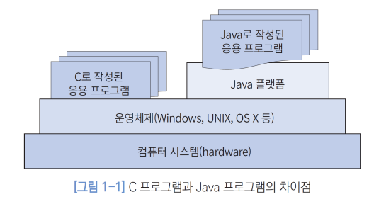
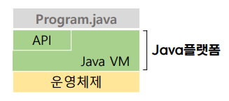
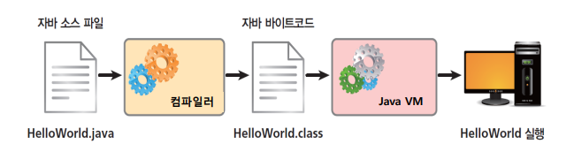
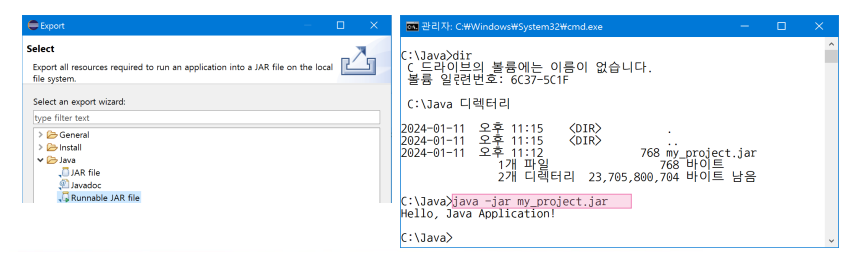

{:toc .large-only}

## Java 언어의 특징

- 운영체제와 무관, 하드웨어 플랫폼에 독립적
- 완전한 객체지향 프로그래밍 언어
- 데스크톱 응용 외에 웹 또는 네트워크 프로그래밍이 용이
- 변수 등의 사용에 있어서 엄격한 자료형의 검사
- 예외 처리 기능 제공
- 멀티 스레딩 지원

## Java 플랫폼

- Java 프로그램의 개발과 실행을 위한 환경
- 사용중인 운영체제에 맞는 Java 플랫폼(JDK)을 설치해야 함
- C언어는 컴파일되어 나오는 exe 파일이 운영체제에서 실행되지만, Java는 컴파일된 후 운영체제가 아닌 Java 플랫폼에서 동작함

### Java 플랫폼의 구성

- Java VM
  - Java 프로그램의 실행 환경을 제공하는 가상 기계
  - Java 프로그램의 구동 엔진
  - 실행에 필요한 사항을 관리
  - 메모리 정리를 자동으로 수행 (카비지 콜렉션)
- Java API
  - 프로그램 개발에 필요한 클래스 라이브러리
  - 패키지(클래스 묶음)들이 계층 구조로 분류되어 있음

## Java 프로그램의 실행

- Java 소스는 파일 확장자가 .java
- 바이트 코드는 파일 확장자가 .class인 파일(클래스 파일)
  - Java 소스를 컴파일한 결과물
  - Java 플랫폼의 **Java VM에서 실행 가능**한 코드

## 프로젝트 배포하기

- 실행에 필요한 클래스 파일들을 묶어서 .jar 파일을 만들 수 있음
- 이클립스에서 프로젝트를 마우스 오른쪽 클릭한 후 'Export..' 선택
  - export 유형, jar 파일의 경로와 이름 등을 지정
- 생성된 jar 파일은 외부에서 실행 가능

