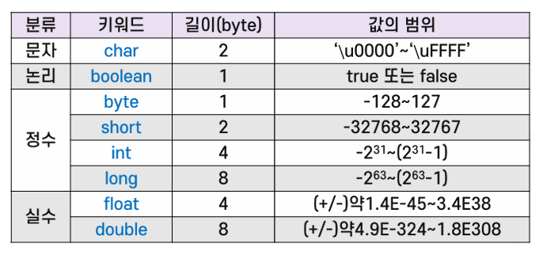

{:toc .large-only}

## 변수

- 클래스 변수: 클래스 정의에서 static 필드. 동종 객체 간 공유 변수(정적 변수)
- 인스턴스 변수: 클래스 정의에서 non-static 필드. 개별 객체가 소유한 변수
- 지역 변수: 메서드 내부(또는 블록 내부)에서 선언된 변수
- 파라미터: 메서드 호출 시 전달하는 값을 저장하기 위한 변수

## 자료형

### 기본 자료형



### 상수

- 값이 한 번 할당되면 변경할 수 없는 변수
- final 키워드 사용
- ex) `final int nConst = 3;`

### 리터럴

- 소스 코드에서 사용되는 실제 데이터 값

#### 정수형 리터럴

- byte, short, int 또는 long형
  - byte와 short는 허용 범위 안에서 int와 호환됨
- 소문자 i나 대문자 L로 끝나면 long형, 나머지는 int형
- ex)
  - 26**L** (long형)
  - 26 (10진수 int형)
  - **0b**11010 (2진수 int형)
  - **0**32 (8진수 int형)
  - **0x**1a (16진수 int형)

#### 실수형 리터럴

- 소수점이 있는 숫자
- f나 F로 끝나면 float형, 나머지는 double형
- ex)
  - 123.4**f** (float형)
  - 123.4 (double형)
  - 1.234e2 (double형)

## 배열

- 배열의 크기는 배열이 초기화 또는 생성될 때 정해짐
- 초기화 또는 생성 과정을 거쳐야 배열의 원소를 사용할 수 있음

### 배열의 선언

- **선언할 때 크기를 지정할 수 없음**
- 형식은 `자료형[] 변수이름;` 또는 `자료형 변수이름[];`

```java
int[] a;
int b[];
int[] e[];

int[][] c;
int d[][];

int f[10]; //오류
```

### 배열의 초기화

- <u>선언과 동시에</u> 중괄호(`{}`)를 이용하여 초기값을 지정
- 자동으로 메모리 공간이 확보됨

```java
int a[] = {2, 3, 5, 7, 11}; //선언과 동시에 초기화
int anArray[][] = { {1, 2, 3}, {4, 5, 6} };
int b[]; b = {4, 5, 6}; //오류: 선언과 동시에 초기화해야 함
```

### 배열의 생성

- new 연산자를 이용
- new 연산자는 메모리의 주소값을 리턴함
- 배열의 크기를 정하고 메모리 공간을 확보
- 원소가 숫자인 경우 0, 참조형인 경우 null로 자동 초기화

```java
int a[] = new int[3]; //선언과 생성
int b[]; b = new int[10];
int anArray4[][] = new int[3][2];
```

## String 클래스

- 문자열을 표현하고 처리하기 위한 **참조형**
- String형의 변수는 참조형이나 기본형 변수처럼 사용할 수 있음

```java
String s1 = "Java"; //기본형 변수처럼 사용 - 스택 영역에 저장됨
String s2 = new String("Java"); //생성자 사용 - 힙 영역에 저장됨
if (s1 != null) {...}
```

> Java 언어에서의 스택 영역과 힙 영역
>
> - 스택(Stack) 영역: 기본 데이터 타입(primitive type) 변수와 객체의 참조 변수가 저장됨<br/>
> - 힙(Heap) 영역: new 키워드로 생성되는 객체들이 저장됨

### 문자열의 + 연산자

- `+` 연산자를 사용할 때 기본형 또는 참조형 값은 문자열로 자동 형변환 가능

```java
System.out.println("result=" + " " + result);
System.out.println('A' + 0); //65 //'A'가 형변환되어 65+0이 됨
```

## Scanner 클래스

- 키보드나 파일로부터 자료를 입력받을 때 사용
- 기본적으로 공백 문자로 구분되는 단어(토큰) 단위로 입력됨
- 문자열이나 기본형 값의 입력을 위해 `next()` 또는 `nextInt()`와 같은 메서드를 제공함
- `System.in`을 이용하여 Scanner 객체를 만들고 사용함

```java
Scanner sc = new Scanner(System.in);
String name = sc.next();
```
