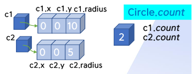

{:toc .large-only}

## 클래스

- 동족 객체를 표현하기 위한 데이터 필드(멤버 변수)와 메서드를 정의함
  - 데이터 필드는 클래스 변수(static)와 인스턴수 변수(non-static)로 나뉜다.
- 부모 클래스의 상속, 인터페이스의 구현, 추상 클래스, final 클래스 등을 정함

```java
[접근제어자] class 클래스이름
  [extends 부모클래스이름] [implements 인터페이스이름]
{
  <데이터필드 선언>;
  <생성자 선언>;
  <메서드 선언>;
}
```

### 메서드

- 헤더와 몸체로 구성됨
- 클래스 정의 내부에 존재함

```java
[접근제어자] 반환형 메서드이름([자료형 인자[, 자료형 인자...]]) [throws 예외이름]
  {
    <문장>;
  }
```

```java
class Circle {
  ...
  public double getArea() {
    return this.r * this.r * 3.14;
  }
}
```

#### 메서드 오버로딩

- 매개변수의 개수나 자료형이 다르면 같은 이름의 메서드를 한 클래스에서 여러 개 정의 가능
  - 매개변수의 개수와 자료형이 일치하면 중복 정의 불가
  - 리턴형과 접근 제어자는 구분의 기준이 되지 못함
- 메서드를 호출할 때 가장 가까운 매개변수 목록을 가진 메서드가 호출됨

```java
class PrintStream {
  public void println() {}
  public void println(String x) {}
}
```

#### 메서드 체이닝

- 하나의 명령문에서 동일 객체에 대해 연속적으로 메서드를 호출하는 프로그래밍 기법
- 메서드 체이닝에 사용되는 메서드는 현재 객체의 참조값(this)을 반환해야 한다.

```java
p.setName('홍길동').setAge(30).setAddress("서울");
```

### static

#### static 필드

- 정적 필드 (=클래스 변수)
- 클래스의 모든 객체가 공유하는 데이터
- **객체의 생성이 없어도 사용 가능**

```java
class Circle {
  int x, y;
  int radius;
  static int count;
}
```



#### static 메서드

- 정적 메서드 (=클래스 메서드)
- static 메서드는 몸체에서 **this를 사용할 수 없고** static 필드만 사용할 수 있다.

```java
class Math {
  public static double sqrt(double a) {
    ...
  }
}

Math.sqrt(2.0);
Integer.parseInt("120"); //parseInt는 Integer의 static 메서드
```

### final

#### final 필드

- 상수 데이터
- 선언할 때 초기값을 지정해야 함
- 주로 static과 함께 사용됨
- ex) `final static double PI = 3.141592;`

#### final 메서드

- 자식 클래스로 상속은 가능하나 자식 클래스에서 재정의(오버라이딩) 할 수 없는 메서드

### 필드의 초기화

- 객체를 생성할 때 데이터 필드에 초기값을 지정하는 것
- 데이터 필드는 자동으로 초기값(0, false 또는 null)이 주어질 수 있음
- static 필드는 프로그램이 시작할 때 초기화 됨
- 객체 초기화를 위해 초기화 블록 사용 가능
  - 초기값 지정을 위한 코드로 클래스 정의에서 메서드 바깥에서 사용
  - static 필드는 static 초기화 블록을 사용

```java
class IniTest {
  static int nStatic = 0;
  int nValue = 1;

  //초기화 블록
  {
    nValue = 2;
  }
  //static 초기화 블록
  static {
    nStatic = 1;
  }
  public IniTest() {
    nValue = 3;
  }
}
```

#### 필드 초기화 실행 순서

1. static 필드의 선언문에서 초기화
2. static 초기화 블록 실행
3. non-static 필드의 선언문에서 초기화
4. non-static 초기화 블록 실행
5. 생성자 실행

### 접근 제어자

- 클래스, 데이터 필드, 메서드의 접근 범위를 제한하는 키워드 (정보 은닉)
- public: 모든 클래스에서 사용 가능
- protected: 같은 패키지와 자식 클래스에서 사용 가능
- 접근 제어자 생략: 같은 패키지에 있는 클래스에서 사용 가능
- private: 같은 클래스에서만 사용 가능
- 클래스에 접근 제어자를 사용할 때는 private과 protected는 내부 클래스에만 사용 가능

| Alpha 클래스에서 멤버 선언 | Alpha (public 클래스) | 같은 패키지에 있는 다른 클래스 | 다른 패키지에 있는 Alpha의 자식 클래스 | 다른 패키지에 있는 클래스 |
| -------------------------- | :-------------------: | :----------------------------: | :------------------------------------: | :-----------------------: |
| public                     |       사용 가능       |           사용 가능            |               사용 가능                |         사용 가능         |
| protected                  |       사용 가능       |           사용 가능            |               사용 가능                |             X             |
| 생략된 경우                |       사용 가능       |           사용 가능            |                   X                    |             X             |
| private                    |       사용 가능       |               X                |                   X                    |             X             |

### 생성자 (constructor)

- new 키워드를 사용하여 객체를 생성할 때 자동으로 실행되는 메서드
- 객체 필드 값의 초기화나 메모리 할당 등을 작업
- ex) `Circle c = new Circle(5);`
  - new 연산자를 이용하여 객체를 생성(메모리 할당)하고 생성자가 호출(데이터 필드의 초기화)되면서 객체의 참조값을 변수에 대입
- 반환형을 지정할 수 없음
- 생성자 이름은 클래스 이름과 같음
- 접근 제어자는 보통 public
- 한 클래스에서 여러 생성자를 정의할 수 있음 (생성자 오버로딩)
  - 매개 변수의 개수와 자료형으로 구분

```java
class Circle {
  double r;
  public Circle(double a) { //생성자
    r = a;
  }
  public double getArea( ) {
    return r * r * 3.14;
  }
  public double getRadius( ) {
    return r;
  }
}

public class Main {
  public static void main(String args[ ]) {
    Circle c = new Circle(5.0); //객체 생성 -> 생성자 호출
    System.out.println(c.r);
    System.out.println(c.getArea());
  }
}
```

#### 기본 생성자 (default constructor)

- 인자가 없는 생성자를 기본 생성자라고 함
- 클래스에 생성자를 정의하지 않으면 컴파일러가 아래와 같은 기본 생성자를 자동으로 만들어 줌

```java
public Circle() {}
```

### this

- this는 현재 객체에 대한 참조값을 가짐
- 인스턴스 메서드나 생성자에서 필드를 참조하거나 메서드를 호출할 때 사용 가능
- 메서드 호출 시 숨은 인자로 this가 메서드에 전달됨
- 생략 가능

```java
class Circle {
  static double PI = 3.14;
  double radius;
  ...
  public double getArea() {
    return this.radius * this.radius * PI;
  }
  public void display() {
    System.out.println("반지름:" + this.radius + " 면적:" + this.getArea());
  }
}
```

### this()

- 클래스 안에 여러 생성자가 있을 때, 생성자 안에서 다른 생성자를 호출하는 것
- 생성자 몸체의 첫 줄에 위치해야 함

### 클래스 합성

- 클래스를 정의할 때 기존 클래스를 데이터 필드의 자료형으로 사용
- has-a 관계
- ex) `class Line { Point begin, end; ... }`

## 상속

- extends 키워드를 사용하여 기존 클래스(부모)를 상속받아 새로운 클래스(자식)을 정의
- 코드의 중복 작성을 줄이고 기존 클래스를 확장함
- 자식 "is-a" 부모 관계
  - ex) Dog(자식) is a Animal(부모)
- 클래스의 상속은 단일 상속만 가능
  - 인터페이스 상속은 다중 상속 가능

### 상속 클래스의 자료형

- 객체가 부모 클래스형이면 부모 객체와 자식 객체를 가리킬 수 있다.

```java
class Shape {
  public double getArea(double h, double w) {
    return h * w;
  }
}

class Triangle extends Shape {
  public double getArea(double h, double w) {
    return h * w * 0.5;
  }
}

public class Main {
  public static void main(String args[]) {
    Shape t = new Triangle(); //Shape 객체와 Triangle 객체를 가리킬 수 있다.
    System.out.println(t.getArea(3.0, 4.0));
  }
}
```

### 접근 제어자

- 자식 클래스에서 부모 클래스의 private 데이터 필드에 접근할 수 없다.
- 부모 클래스의 private 변수를 사용하는 public 메서드를 호출하는 것은 가능하다.

```java
public class CSuper {
	public int f1;
	private int f2;

	public void setPublic(int i) {
		f1 = i;
	}
	public void setPrivate(int i) {
		f2 = i;
	}
	private void mPrivate() {
		f2 = 30;
	}
}

public class CSub extends CSuper {
	public int f3;
	private int f4;

  public void getPrivate() {
		System.out.println(f2); //오류 - private 데이터 필드
	}
}
```

```java
public class Main {
  public static void main(String args[]) {
    CSub sub = new CSub();

    sub.f1 = 40;
    sub.f2 = 50; //오류 - private 데이터 필드
    sub.f3 = 60;
    sub.f4 = 70; //오류 - private 데이터 필드
    sub.setPublic(10);
    sub.setPrivate(20); //호출 가능
    sub.mPrivate(); //오류 - private 메서드
  }
}
```

### 메서드 오버라이딩

- 부모 클래스로부터 상속받은 메서드의 몸체를 자식 클래스에서 재정의하는 것
- 부모와 자식에서 같은 이름의 메서드가 다른 기능을 수행하게 됨
- 메서드의 이름, 인자의 개수와 자료형, 반환형이 같은 메서드를 정의
  - 단, 반환형은 서브 타입(상속 관계에서 자식 클래스)도 가능함
- 접근 제어자는 같거나 더 넓어져야 함
  - 부모가 protected인 경우 자식은 protected 또는 public 가능
  - 부모가 public인 경우 자식은 public만 가능

### super

- this와 같으나 자료형이 부모 클래스형
- 자식 클래스의 인스턴스 메서드나 생성자에서 사용됨
- static 메서드에서 사용할 수 없음
- 오버라이딩한 부모 클래스의 메서드를 호출하거나, 상속되었으나 감춰진 필드에 접근할 때 필요

```java
class CSuper {
	public int x = 0;

	public void f() {
    System.out.println("CSuper");
  }
}

class CSub extends CSuper {
	public int x = 1;

	public void f() {
    System.out.println("CSub");
  }
  public void print() {
		System.out.println(this.x); //1
    this.f(); //CSub

		System.out.println(super.x); //0
    super.f(); //CSuper
	}
}
```

### super()

- 자식 클래스의 생성자에서 부모 클래스의 생성자를 호출하여 상속받은 데이터 필드를 초기화
- 자식 클래스의 생성자 몸체의 첫 줄에 부모 생성자의 명시적 호출이 없다면, 인자가 없는 생성자인 `super()`가 자동 호출됨

```java
class Cylider extends Circle {
  private double height;
  static final double PI = 3.14;

  public Cylinder() {
    super(); //인자가 없는 생성자
  }
  public Cylinder(double radius, double h) {
    super(radius); //인자가 있는 생성자
  }
}
```
