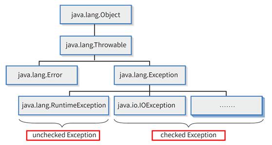

{:toc .large-only}

## 패키지

- 관련이 있는 클래스와 인터페이스의 묶음
  - 클래스와 인터페이스는 패키지의 멤버로 존재
- 패키지 단위의 계층 구조를 이룸
  - 도트(.)로 상위 패키지와 하위 패키지 구분 (ex. `java.lang`)
- 패키지를 나누어 클래스의 이름 충돌을 피할 수 있음
  - ex) `graphics.Rectangle`와 `java.awt.Rectangle`
- 패키지를 통해 클래스의 접근 범위를 제한할 수 있음

### 시스템 패키지

- JDK가 제공하는 클래스 라이브러리
- 가장 기본이 되는 최상위 시스템 패키지는 java 패키지
  - 대부분의 시스템 패키지는 `java.`로 시작됨
- Java 언어에서 가장 기본적 클래스는 `java.lang` 패키지에 존재

### 사용자 정의 패키지

```java
package com.vehicle;

public class Car {
  String szType = "승용차";
}
```

- 맨 위에 package 구문을 사용하여 패키지 위치를 지정
  - 컴파일 결과로 Car.class는 `com.vehicle` 패키지에 저장됨
  - pacakge 구문이 없다면 디폴트 패키지에 저장됨
- 컴파일 시 `-d` 옵션을 사용하여 com 패키지의 경로를 지정할 수 있음
  - ex) `javac Car.java -d D:\javaClasses`

### 패키지와 클래스의 사용

```java
import java.util.Scanner;

public class Main {
  public static void main(String args[]) {
    Scanner s = new Scanner(System.in);
  }
}
```

- 맨 위에 import 구문을 사용하여 클래스를 가져와서 사용
  - 와일드카드 사용 가능 `import com.vehicle.*;`
  - import 구문 없이 사용한다면 `java.util.Scanner s = new java.util.Scanner(System.in);`
- 다른 패키지에 존재하는 public 클래스를 사용하려면 기본적으로 패키지 경로를 포함한 완전한 클래스 이름을 사용하는 것이 원칙

### 클래스 찾기

- 컴파일러가 A.class가 위치한 경로 또는 A.class를 포함하고 있는 jar 파일을 찾아야 함
- 환경 변수 CLASSPATH에 지정된 경로에서 사용자 클래스를 찾을 수 있음

## 예외 처리

- 예외(Exception) 발생이란 정상적 실행 흐름을 벗어난 예외적 사건 발생을 의미
- 에러는 실행 중 발생하는 심각한 오류로 더 이상의 실행이 불가하나, 예외는 경미한 오류로 복구가 가능함
- 실행 중 예외가 발생하면 예외 처리 코드(exception handler)에 예외 객체를 생성하여 throw 함
- 예외 처리 코드가 있다면 예외 객체를 catch하여 처리하고, 없다면 오류 메시지가 출력되면서 프로그램이 즉시 비정상적으로 종료됨
- 예외 객체는 Throwable 클래스의 자식 클래스인 Exception 클래스(또는 하위 클래스)로 표현되며 예외 발생 정보를 가짐
  - `toString()`, `printStackTrace()` 등을 상속받음



- checked Exception
  - 예외가 발생할 수 있는 경우 반드시 명시적인 예외 처리 필요
  - 예외 처리 코드가 없으면 컴파일 오류 발생
- unchecked Exception (RuntimeException)
  - 프로그램을 정확하게 작성하지 않은 경우 발생
  - 예외 처리를 하지 않아도 컴파일 오류가 발생하지 않음
  - ex) ArithmeticException, NullpointerException, IndexOutOfBoundsException 등

### 예외 처리 방법

#### 직접 처리

try-catch 또는 try-catch-finally 구문을 사용하여 예외가 발생한 곳에서 예외 객체를 찹아서 처리하는 방식

```java
try {...}
catch (ExceptionType1 ex1) {...}
catch (ExceptionType2 ex2) {...}
finally {...}
```

- 예외 발생 가능성이 있는 코드 혹은 예외 객체를 throw 하는 코드를 try 블록에 둠
  - 실행 중 예외가 발생하면 try 블록은 즉시 종료되고 catch 블록이 실행됨
- catch 블록은 1개의 예외 유형 인자를 가지는 메소드 형태
  - 예외 유형에 따라 여러 개의 catch 블록을 만들 수 있음
  - 발생된 예외 자료형에 따라 하나의 catch 블록만 실행됨
  - 상위와 하위 유형 예외를 처리하는 catch 블록이 모두 있다면, 하위 유형 예외를 처리하는 블록을 먼저 정의해야 함
- finally 블록은 예외 발생 여부와 무관하게 마지막에 항상 실행되며 생략 가능
  - 사용 예시: try 블록에서 파일, DB 연결 등을 다룰 때 `open()` 했던 파일을 `close()` 하는 코드를 finally 블록에 둠

```java
public class Main {
  public static void main(String[] args) {
    try {
      // 예외가 발생할 수 있는 코드 블록
      int[] numbers = { 1, 2, 3 };
      System.out.println(numbers[4]); // 배열 인덱스 범위를 초과하여 예외 발생
      int result = 10 / 0; // ArithmeticException 발생
      System.out.println("결과: " + result);
    } catch (ArrayIndexOutOfBoundsException e) {
      // ArrayIndexOutOfBoundsException 처리
      System.out.println("배열 인덱스가 잘못되었습니다.");
    } catch (ArithmeticException e) {
      // ArithmeticException 처리
      System.out.println("0으로 나눌 수 없습니다.");
    }
    System.out.println("프로그램이 정상 종료됩니다.");
  }
}
// 출력된 내용:
// 배열 인덱스가 잘못되었습니다.
// 프로그램이 정상 종료됩니다.
```

- try-with-resources 구문을 사용하여 try 블록에 리소스 객체를 선언하면 리소스의 자동 반환을 보장함
  - finally 블록에서 리소스에 대한 `close()` 처리를 하지 않아도 됨

```java
// finally 블록 사용
BufferedReader br = null;
try {
  br = new BufferedReader(new FileReader("file.txt"));
  String line;
  while ((line = br.readLine()) != null) {
    System.out.println(line);
  }
} catch (IOException e) {
  e.printStackTrace();
} finally {
  try {
    if (br != null) br.close();
  } catch (IOException ex) {
    ex.printStackTrace();
  }
}

// try-with-resources 구문 사용
try (BufferedReader br = new BufferedReader(new FileReader("file.txt"))) {
  String line;
  while ((line = br.readLine()) != null) {
    System.out.println(line);
  }
} catch (IOException e) {
  e.printStackTrace();
}
```

#### 간접 처리

- 예외 발생 가능성이 있는 코드를 가진 메소드의 선언부에 throws 키워드를 사용하여 예외를 선언
- 자신을 호출한 메소드에게 예외를 전파하여 예외 처리를 전달 또는 위임함 (호출하는 곳에서 예외 처리가 필요함)

```java
class CharInput {
  int ninput;
  public char getInput() throws IOException {
    nInput = System.in.read();
    return (char) nInput;
  }
}

// 호출하는 곳에서 예외 처리
try {
  c = obj.getInput();
} catch (IOException ex) {
  ...
}
```

- **반드시 예외 처리가 필요한 메소드**
  - FileInputStream 클래스의 생성자
    - `public FileInputStream(String name) throws FileNotFoundException`
  - InputStream(또는 Reader) 클래스의 메소드
    - `public int read() throws IOException`

#### 사용자 정의 예외

- 사용자가 직접 예외 클래스를 작성할 수 있음
- 일반적으로 Exception 클래스를 상속받음

```java
class MyException extends Exception {
  public MyException() {
    super();
  }
  public String toString() {
    return "MyException";
  }
}

class MyExceptionTest {
  public void testFunc(int x) throws MyException {
    if (x > 10) throw new MyException();
  }
}
```
