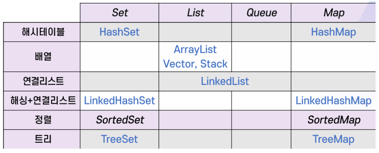

{:toc .large-only}

## 컬렉션

- 여러 원소를 하나의 그룹으로 묶어 관리하기 위한 자료구조
- JSF(Java Collections Framework)
  - 컬렉션을 일관된 방법으로 다루기 위한 통합 프레임워크
  - 다양한 방식으로 저장, 정렬, 검색, 수정하는 도구를 제공

### JSF의 인터페이스

- java.util 패키지에 포함되며 제네릭 타입
- Set: 데이터의 순서는 의미가 없으며 중복을 허용하지 않는 자료구조
- List: 중복을 허용하고 순서가 있는 자료구조
- Queue: List와 유사하나 원소의 삽입/삭제가 FIFO 방식임
- Map: 원소가 `<key, value>` 형태이며 키는 유일해야 함



### 컬렉션 객체 선언

- 변수 선언은 해당 인터페이스 유형으로, 객체 생성은 인터페이스를 구현하는 클래스를 사용한다.

```java
Set<Integer> set = new HashSet<>();
List<Integer> list = new ArrayList<>();
List<Integer> list = new LinkedList<>();
Queue<Integer> list = new LinkedList<>();
Map<String, Integer> list = new HashMap<>();
```

### Collection`<E>` 인터페이스

- Set, List, Queue에서 공통으로 지원해야 하는 기능을 정의

#### 원소 탐색 메소드

| 메소드                               | 설명                                                                  |
| ------------------------------------ | --------------------------------------------------------------------- |
| boolean contains(Object o)           | 현재 컬렉션이 주어진 요소를 가지고 있으면 true를 리턴함               |
| boolean containsAll(Collection<?> c) | 현재 컬렉션에 주어진 컬렉션의 모든 요소를 가지고 있으면 true를 리턴함 |
| boolean isEmpty()                    | 현재 컬렉션이 빈 컬렉션이면 true를 리턴                               |

#### 원소의 삽입과 삭제 메소드

| 메소드                                    | 설명                                                                |
| ----------------------------------------- | ------------------------------------------------------------------- |
| boolean add(E e)                          | 주어진 요소를 현재 컬렉션에 추가. 성공적으로 추가되면 true를 리턴함 |
| boolean addAll(Collection<? extends E> c) | 주어진 컬렉션의 모든 요소를 현재 컬렉션에 추가                      |
| boolean remove(Object o)                  | 주어진 요소를 컬렉션에서 제거                                       |
| boolean removeAll(Collection<?> c)        | 주어진 컬렉션에 포함된 모든 요소를 현재 컬렉션에서 제거             |
| boolean retainAll(Collection<?> c)        | 현재 컬렉션의 요소 중, 주어진 컬렉션에 있는 요소만 남김             |
| void clear()                              | 컬렉션의 모든 요소를 제거하여 비움                                  |

#### 기타 메소드

| 메소드                 | 설명                                                       |
| ---------------------- | ---------------------------------------------------------- |
| int size()             | 현재 컬렉션에 포함된 요소의 개수를 리턴함                  |
| int hashCode()         | 현재 컬렉션의 해시 코드값을 리턴함                         |
| Object[] toArray()     | 현재 컬렉션을 객체의 배열로 변환하여 리턴함                |
| Iterator<E> iterator() | Iterator 객체를 리턴함                                     |
| boolean equals(Object) | 두 컬렉션이 같은 요소를 같은 순서로 포함하면 true를 리턴함 |

## HashSet, ArrayList, LinkedList 클래스

### HashSet 클래스

```java
Set<String> set = new HashSet<String>();
set.add("one");
set.add("two");
set.add("three");
set.add("four");

System.out.println(set.add(new String("one"))); //에러: 중복을 허용하지 않음
System.out.println(set.size()); //4
System.out.println(set.contains("four")); //true
System.out.println(set.contains(new String("one"))); //true

set.remove("four");
set.remove(new String("one"));
System.out.println(set.size()); //2

set.clear();
System.out.println(set.size()); //0
```

### ArrayList`<E>` 클래스

- List 인터페이스를 구현한 클래스
- 크기 조절이 가능한 배열로 구현
- 같은 자료가 중복될 수 있으며, 입력된 순서대로 관리됨
- 특정 위치의 자료를 참조하기 위해 첨자를 사용할 수 있음

### Iterator`<E>` 인터페이스

- 컬렉션에 저장된 원소를 차례대로 다룰 수 있음
- `hasNext()`, `next()` 메소드 제공
- HashSet, ArrayList, LinkedList 등에서 Iterator 객체를 리턴하는 `iterator()` 메소드를 사용할 수 있음

```java
List<String> list = new ArrayList<String>;
Iterator<String> it = list.iterator();
while (it.hasNext())
  System.out.println(it.next());
```

### LinkedList 클래스

- List 인터페이스를 구현한 클래스
- 스택 자료구조에서 필요한 메소드 제공
  - `push(E)`, `pop()`
- Queue 인터페이스도 구현함

| 메소드           | 설명                                                   |
| ---------------- | ------------------------------------------------------ |
| boolean offer(E) | 뒤에 원소를 추가함 (중복이어도 예외를 발생시키지 않음) |
| E poll()         | 앞의 원소를 삭제하고 리턴함 (예외를 발생시키지 않음)   |
| peek()           | 앞의 원소를 리턴함 (예외를 발생시키지 않음)            |

```java
LinkedList<String> queue = new LinkedList<String>();
queue.offer("one");
queue.offer("two");
queue.offer("three");
queue.offer("four");

String s = queue.poll();
while (s != null) {
  System.out.println(s);
  s = queue.poll();
}
```

## Map`<K, V>` 인터페이스

- `<key, value>`로 이루어진 원소로 구성되는 컬렉션을 다루기 위한 인터페이스
- key는 중복되지 않으며, 하나의 key에 하나의 value만 대응됨
- 원소들의 순서는 중요하지 않음

| 메소드                          | 설명                                                             |
| ------------------------------- | ---------------------------------------------------------------- |
| V put(K key V value)            | 맵에 <키, 값> 매핑을 추가. 이미 키가 존재하면 값이 변경됨        |
| V get(Object key)               | 맵에서 키와 매핑된 값을 리턴함. 없으면 null을 리턴               |
| V remove(Object key)            | 맵에서 키와 매핑된 값을 제거하고 값을 리턴함. 없으면 null을 리턴 |
| boolean containsKey(Object key) | 지정된 키가 맵에 있으면 true를 리턴함                            |
| Collection<V> values()          | 맵에 존재하는 값들로 구성된 컬렉션을 리턴함                      |
| Set<V> keySet()                 | 맵에 존재하는 키들로 구성된 컬렉션을 리턴함                      |

### HashMap 클래스

- 해싱을 이용하여 Map 인터페이스를 구현한 클래스
- 자료 탐색 방법이 ArrayList나 LinkedList 클래스와 다름

```java
Map<String, Integer> lectures;
Map<String, Map> scores = new HashMap<>();

lectures = new HashMap<String, Integer>();
lectures.put("국어", 100);
lectures.put("영어", 95);
lectures.put("수학", 80);
score.put("영희", lectures);

System.out.println(scores.get("영희").get("국어"));
System.out.println(scores.get("영희").get("영어"));
System.out.println(scores.get("영희").get("수학"));
```
