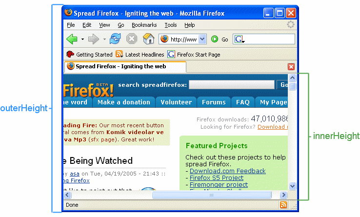
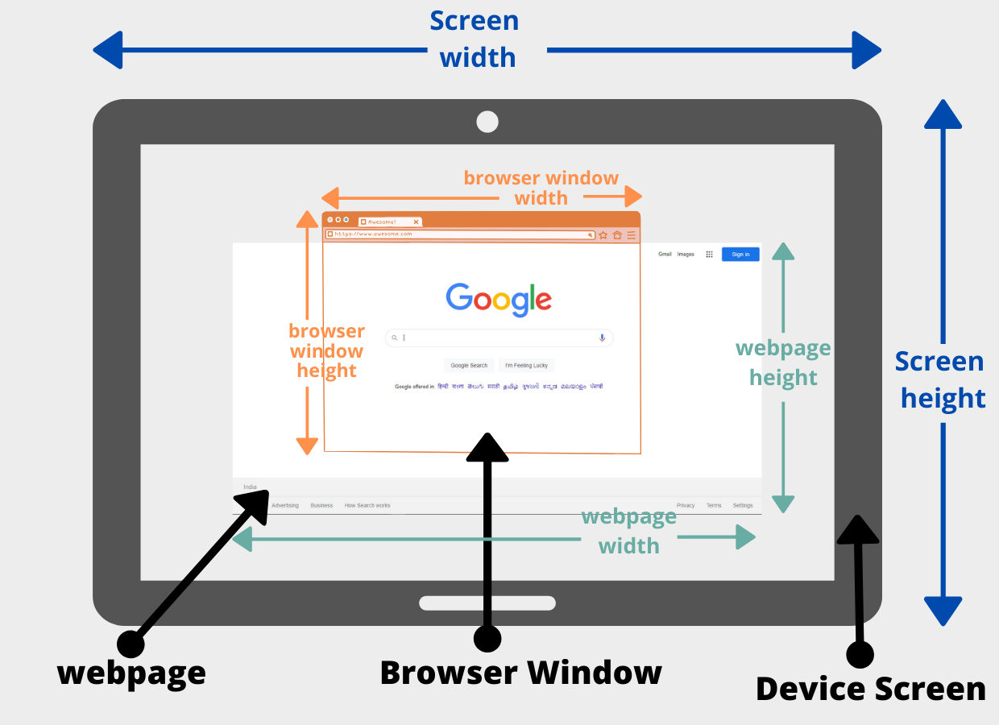
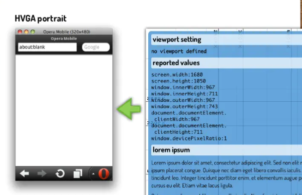

{:toc .large-only}

잊을만하면 다시 꺼내쓰게 되는 `viewport` 한번 정리하고 가야겠다.

**PC와 Mobile는 Viewport가 다르다.**

> 편의상 `height` 기준으로 작성. `width`도 동일하다고 이해하라.

## PC Viewport

### window.innerHeight / window.outerHeight

- `window.innerHeight` : 가로 스크롤을 포함한 <u>페이지</u>의 높이
- `window.outerHeight` : 주소창, 작업 표시줄, 제목 표시줄, 가로 스크롤을 포함한 <u>전체 브라우저</u>의 높이

 

### window.screen.height

- `window.screen.height` : 브라우저가 아닌 <u>화면(스크린)</u>의 높이

 

## Mobile Viewport

모바일에서는 브라우저 창 크기를 조절할 수 없기 때문에 `inner/outerHeight`와 `screen.height`가 다르다.

### window.innerHeight / window.outerHeight

- **주소창, 메뉴바를 제외한** <u>페이지</u>의 높이
- 모바일에서 `innerHeight`와 `outerHeight`의 차이점을 모르겠다.. 콘솔 찍어보면 페이지의 길이와 상관없이 같게 나온다.
- IOS에서는 `viewport` meta tag에 따라 두 값이 달라지는 것 같다.

### window.screen.height

- `window.screen.height` : 주소창, 메뉴바를 포함한 <u>화면(스크린)</u>의 높이

 

 

사실 `screen.height`을 사용할 일이 많진 않다.

하지만 모바일에서 주소창, 메뉴바를 포함한 전체 height을 얻어야 할 때 PC와 헷갈려서 `outerHeight`를 사용하게 될 수 있으니 기억해두도록 하자.

 

[브라우저 뷰포트 (layout 와 visual viewport) 간단 정리하기](https://pks2974.medium.com/%EB%B8%8C%EB%9D%BC%EC%9A%B0%EC%A0%80-%EB%B7%B0%ED%8F%AC%ED%8A%B8-layout-%EC%99%80-visual-viewport-%EA%B0%84%EB%8B%A8-%EC%A0%95%EB%A6%AC%ED%95%98%EA%B8%B0-47756d5ee3cf) 
[Window.outerHeight](https://developer.mozilla.org/en-US/docs/Web/API/Window/outerHeight) 
[Android browser's screen.width, screen.height & window.innerWidth & window.innerHeight are unreliable](https://stackoverflow.com/questions/10610743/android-browsers-screen-width-screen-height-window-innerwidth-window-inner) 
[HVGA portrait <meta name="viewport" content="width=device-width,](https://pt.slideshare.net/andreasbovens/responsive-design-techniques-and-tricks-to-prepare-your-websites-for-the-multiscreen-future/40-HVGA_portrait_HVGA_landscape_meta) 
[JavaScript에서 화면, 창 및 웹 페이지 크기 가져 오기](https://www.delftstack.com/ko/howto/javascript/javascript-get-screen-size/)
