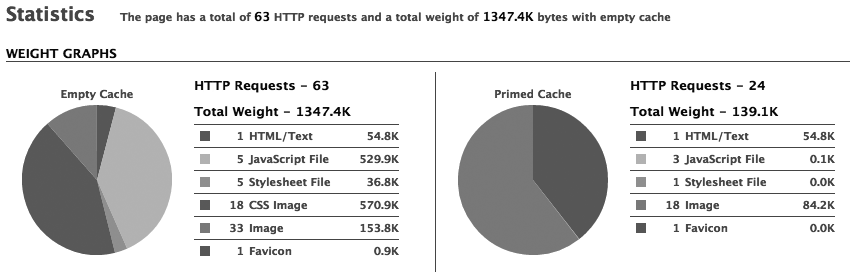

{:toc .large-only}

## 웹 사이트 성능 최적화

웹 사이트 성능 최적화 방법에는 크게 두 가지가 있다.

1. 로딩 성능 최적화

2. 렌더링 성능 최적화

로딩 성능 최적화는 서버에서 데이터 및 파일을 가져오는 성능을 의미하고, 렌더링 성능 최적화는 로딩을 통해 받아온 정보 및 파일들을 브라우저에 표시해주는 성능을 의미한다.

## 웹 사이트 성능 최적화 방법

- HTTP 요청 최소화하기

서버로부터 응답 받아야 할 파일(HTML, CSS, JS)이 많으면 로딩 속도가 느려진다.

브라우저의 캐시를 이용하면 페이지 로딩 속도를 개선할 수 있다.

아래 이미지에서 캐시가 없는 상태에서는 총 63개의 구성 요소를 다운로드하고, 캐시가 있는 상태에서는 24개의 구성 요소를 다운로드한다.



> 브라우저가 시도하는 모든 HTTP 요청은 먼저 브라우저 캐시로 라우팅되어, 요청을 수행하는데 사용할 수 있는 유효한 캐시가 있는지를 먼저 확인한다. 만약 유효한 캐시가 있으면, 이 캐시를 읽어서 불필요한 전송으로 인해 발생하는 네트워크 대기시간, 데이터 비용을 모두 상쇄한다.

- 캐시 만료일 설정

캐시 만료일은 웹 서버에서 보내는 응답 헤더의 Cache-control 값을 통해 설정할 수 있다.

만료 날짜를 1년 후로 설정하면, 사용자가 캐시 파일을 지우기 전까지는 1년 동안 계속 캐시 파일을 읽는다.

- CSS 스프라이트(sprite)

메뉴, 아이콘 등의 여러 이미지를 모아 하나의 이미지로 통합한 다음, css의 `background-position`으로 해당 이미지의 좌표에 접근하는 방법이다.

여러 개의 이미지를 불러올 필요 없이 아래와 같이 하나의 이미지를 불러오므로 로딩 속도가 개선된다.


- 코드 스플리팅(Code Splitting)

bundle : Webpack에서는 자바스크립트를 포함하여 여러 리소스들을 묶은 결과물이다. bundle은 여러 개의 chunk로 구성된다.

chunk : 모든 코드를 하나의 거대한 파일(bundle)로 만들지 않기 위해서 여러 개의 chunk라는 단위로 나눈다. 코드가 어떻게 나뉘는지에 대한 방법도 임의로 구성할 수 있다.

싱글 페이지 어플리케이션의 단점은 규모가 커지면 자바스크립트 번들 파일의 용량이 커지기 때문에 로딩속도가 지연된다는 것이다.

코드 스플리팅은 bundle을 여러 개의 chunk로 나눠서 각 코드를 필요할 때만 불러옴으로써 로딩속도를 더 빠르게 할 수 있다.

- Lazy Loading

Lazy Loading은 페이지 내에서 실제로 필요로 할 때까지 리소스의 로딩을 미루는 것을 말한다.

img 태그에 dataset 값을 설정하고 이미지를 불러와야 할 때 src에 dataset 값을 집어넣을 수 있다.

React에서도 lazy 함수를 사용하여 컴포넌트를 동적으로 불러올 수 있다.

React.lazy는 default export를 가진 모듈을 Promise로 반환한다.

Suspense는 lazy 컴포넌트가 로드되길 기다리는 동안 로딩 화면과 같은 예비 컨텐츠를 보여줄 수 있도록 한다.

```js
import React, { Suspense } from "react";

const OtherComponent = React.lazy(() => import("./OtherComponent"));

function MyComponent() {
  return (
    <div>
      <Suspense fallback={<div>Loading...</div>}>
        <OtherComponent />
      </Suspense>
    </div>
  );
}
```

- Reflow 발생 최소화하기

Reflow를 발생시키는 CSS 속성(left, top, margin, padding, border, width, height..)보다 transform 같이 Repaint만 발생시키는 속성을 사용하는 것이 좋다.

애니메이션은 JavaScript보다 CSS을 사용하는 것이 메인 쓰레드가 아닌 별도의 컴포지터 쓰레드(Compositor Thread)에서 그려지기 때문에 더 효율적이다.

애니메이션이나 reflow를 많이 발생시키는 요소는 css에서 `position: absolute` 또는 `position: fixed`를 사용하는 것이 좋다.

- CDN(Content Delivery Network)

CDN은 여러 지역에 걸쳐 분산된 웹서버의 집합체로, 사용자가 요청을 했을 때 사용자의 네트워크에서 가장 가까운 서버를 측정하여 선택하기 때문에 가장 빠른 응답시간의 서버가 선택된다.

- 이미지 사이즈 최적화

이미지의 사이즈가 작으면 해상도가 떨어져 이미지가 깨져서 보일 수 있고, 사이즈가 크면 로딩 속도가 느려진다.

개인적인 경험으로는 아이콘 등의 이미지 크기는 페이지에서 보여줄 사이즈의 2~3배가 적당한 것 같다.

- 리다이렉트 피하기

리다이렉트는 URL에서 다른 URL로 이동하는 것을 말한다.

페이지가 리다이렉트되면 문서를 다시 요청하여 받아오므로 속도가 느려진다.

## 참고사이트

[웹 사이트 최적화 방법](https://bearjin90.tistory.com/21)<br/>
[기본적인 웹 사이트 최적화 방법 (1) – HTTP 요청 최소화](https://wikibook.co.kr/article/web-sites-optimization-1/)<br/>
[HTTP Cache로 불필요한 네트워크 요청 줄이기](https://yceffort.kr/2020/10/http-cache)<br/>
[블로그 사이트 최적화 part1](https://velog.io/@kmlee95/%ED%94%84%EB%A1%A0%ED%8A%B8%EC%97%94%EB%93%9C-%EC%84%B1%EB%8A%A5%EC%B5%9C%EC%A0%81%ED%99%94-2)<br/>
[웹 성능 최적화를 위한 Image Lazy Loading 기법](https://helloinyong.tistory.com/297)<br/>
[React.lazy](https://ko.reactjs.org/docs/code-splitting.html#reactlazy)<br/>
[렌더링 최적화](https://taeny.dev/graphics/graphics-rendering/#4-%EB%A0%8C%EB%8D%94%EB%A7%81-%EC%B5%9C%EC%A0%81%ED%99%94)
