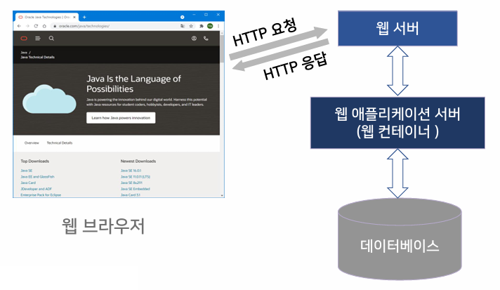
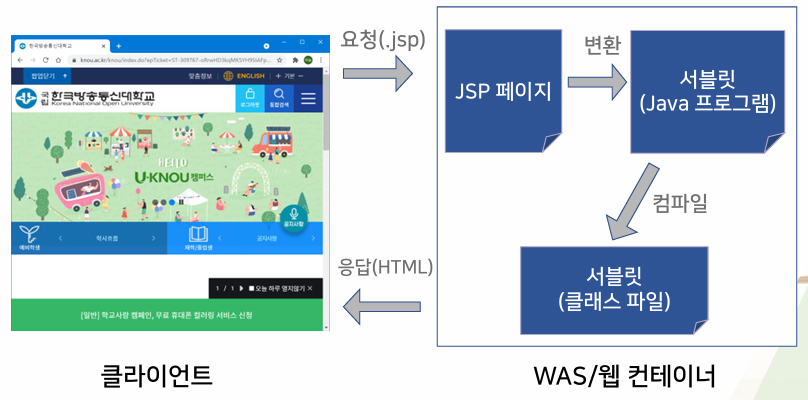

{:toc .large-only}

## 웹 애플리케이션

- 웹에서 실행되는 응용 프로그램



### 웹 서버

- HTTP 프로토콜을 기반으로 웹 클라이언트의 요청을 받아 처리한 후 결과를 다시 클라이언트로 전송
- 요청을 받는 일과 결과를 전송하는 부분만 웹 서버가 담당하고, 서비스 처리에 필요한 비즈니스 로직은 웹 애플리케이션 서버(WAS)가 제공하는 컨테이너가 담당
- 웹 컨테이너가 전달해준 결과물을 사용자에게 응답
- ex) Apache, Nginx

### 웹 애플리케이션 서버 (WAS)

- 웹 애플리케이션이 실행될 수 있는 환경을 제공하는 소프트웨어
- 웹 서버의 역할도 수행할 수 있으나, 효율적인 웹 애플리케이션 실행 환경을 구축하기 위해 웹 서버와 WAS를 분리하는 것이 좋다.
- 비즈니스 로직 처리, DB 조회 등 프로그램 실행 환경 제공
- ex) Tomcat, JBoss, WebLogic

### 웹 컨테이너 (서블릿 컨테이너)

- 웹 애플리케이션 서버의 구성 요소
- 웹 서버가 전송해준 요청으로 JSP 프로그램을 실행시키고 결과를 다시 웹 서버에 전달한다.
  - HTTP 요청을 서블릿이 처리할 수 있는 형태(ServletRequest)로 변환
  - 요청을 적절한 서블릿에 매핑
- 서블릿의 생명주기 관리
- JSP를 서블릿으로 변환하고 실행

## JSP (Java Serser Pages)

- Java EE(Java Platform, Enterprise Edition)를 구성하는 기술 중의 하나
- Java 언어를 사용하여 서버 측에서 동적인 웹 페이지를 생성
- 스크립트 언어로 HTML 페이지 내에 삽입됨
- 표현 언어, 표현식, 액션 태그 등 스크립트적인 요소 제공

### 서블릿

- Server + Applet의 합성어
- Java 클래스
- Java 언어로 서블릿 클래스를 만들고, 컴파일 된 바이트 코드를 서버에 탑재하여 웹 서비스 제공

### JSP 페이지 처리 과정



- 클라이언트가 JSP 페이지를 요청하면 JSP 파일을 서블릿 Java 소스(.java)로 변환한다.
- 서블릿 소스를 컴파일해서 클래스 파일(.class)을 생성한다.
- 서블릿 클래스를 로드하고 인스턴스 생성
- `_jspInit()` 메서드 호출
- `_jspService()` 메서드 호출
- 응답을 생성하여 클라이언트에게 전송한다.
- 두 번째 요청부터는 이미 변환된 서블릿이 존재하는지 체크하여 JSP 페이지가 수정되지 않았다면 기존 서블릿 인스턴스를 재사용한다.

```jsp
<!-- hello.jsp -->
<%@ page language="java" contentType="text/html; charset=UTF-8" %>
<html>
<body>
    <% String message = "Hello JSP"; %>
    <%= message %>
</body>
</html>
```

```java
// 서블릿으로 변환됨
public class hello_jsp extends HttpServlet {
    public void _jspInit() {
        // 초기화 코드
    }

    public void _jspService(HttpServletRequest request, HttpServletResponse response) {
        String message = "Hello JSP";
        out.write("<html><body>");
        out.write(message);
        out.write("</body></html>");
    }

    public void _jspDestroy() {
        // 리소스 해제 코드
    }
}
```
