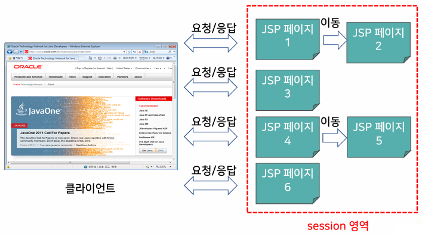

{:toc .large-only}

## 내장 객체

- JSP 프로그래밍에 필요한 여러 기능을 묶어서 미리 만들어 제공되는 객체
- JSP 컨테이너가 번역 과정에서 만들어서 제공
- 별도의 선언이나 초기화 없이 사용 가능

| 내장 객체   | 클래스                               | 기능                                                        |
| ----------- | ------------------------------------ | ----------------------------------------------------------- |
| request     | HttpServletRequest, ServletRequest   | 클라이언트의 요청 정보 관리                                 |
| response    | HttpServletResponse, ServletResponse | 웹 서버의 응답 정보 관리                                    |
| pageContext | PageContext                          | JSP 페이지에 대한 정보 관리                                 |
| session     | HttpSession                          | HTTP 세션 정보 관리                                         |
| application | ServletContext                       | 웹 애플리케이션에 대한 정보 관리                            |
| out         | JspWriter                            | JSP 페이지가 생성하는 결과를 출력할 때 사용되는 출력 스트림 |
| config      | ServletConfig                        | JSP 페이지에 대한 설정 정보 관리                            |
| page        | Object                               | JSP 페이지를 구현한 자바 클래스의 인스턴스                  |
| exception   | Throwable                            | 에러페이지에서만 예외 처리에 사용                           |

### pageContext 내장 객체

- 페이지 컨텍스트를 관리하는 객체
- 다른 내장 객체의 참조 값을 리턴하는 메서드 제공
- javax.servlet.jsp.PageContext의 인스턴스
- pageContext 내장 객체를 사용하지 않아도 기본적으로 내장 객체들을 사용할 수 있기 때문에 JSP 페이지에서 직접 사용하는 경우는 드물다.

| 메서드              | 리턴 타입       | 기능                    |
| ------------------- | --------------- | ----------------------- |
| getRequest()        | ServletRequest  | request 객체를 리턴     |
| getResponse()       | ServletResponse | response 객체를 리턴    |
| getSession()        | HttpSession     | session 객체를 리턴     |
| getServletContext() | ServletContext  | application 객체를 리턴 |
| getServletConfig()  | ServletConfig   | config 객체를 리턴      |
| getOut()            | JspWriter       | out 객체를 리턴         |
| getException()      | Exception       | exception 객체를 리턴   |
| getPage()           | Object          | page 객체를 리턴        |

### application 내장 객체

- 웹 애플리케이션과 관련된 정보를 관리
- web.xml 파일에서 설정 정보를 읽어옴
  - 웹 컨테이너 정보, 로그 메시지, 웹 애플리케이션의 폴더 정보 등
- javax.servlet.ServletContext의 인스턴스
- 웹 애플리케이션에 포함된 모든 JSP 프로그램들은 하나의 application 내장 객체를 공유한다.

| 메서드                        | 리턴 타입           | 기능                                                                   |
| ----------------------------- | ------------------- | ---------------------------------------------------------------------- |
| getInitParamater(string name) | String              | 이름이 name인 파라미터를 읽어온다. 존재하지 않을 경우 null을 리턴한다. |
| getInitParamaterNames()       | Enumeration<String> | 웹 애플리케이션 파라미터의 이름 목록을 리턴한다.                       |

#### web.xml

- 웹 애플리케이션 내의 모든 JSP 페이지에서 공유되는 설정 정보를 저장
- 이클립스 동적 웹 프로젝트에서 ...\webapp\WEB-INF 에 위치함
- `<web-app>` 태그 안에 `<context-param>` 태그를 이용하여 설정 정보를 공유할 수 있음

```xml
<web-app>
  <context-param>
    <description>파라미터설명(생략가능)</description>
    <param-name>파라미터이름</param-name>
    <param-value>파라미터값</param-value>
  </context-param>
</web-app>
```


#### 웹 컨테이너 정보를 읽기 위한 메서드

| 메서드            | 리턴 타입 | 기능                                              |
| ----------------- | --------- | ------------------------------------------------- |
| getServerInfo()   | String    | 서버의 정보를 리턴                                |
| getMajorVersion() | String    | 서버가 지원하는 서블릿 규약의 버전 앞 번호를 리턴 |
| getMinorVersion() | String    | 서버가 지원하는 서블릿 규약의 버전 뒷 번호를 리턴 |


### out 내장 객체

- 클라이언트로 보낼 컨텐츠를 작성하기 위해 사용하는 출력 스트림
- JSP 페이지에서 데이터 출력
- JspWriter 클래스로부터 생성된 객체

#### out 내장 객체의 출력 메서드

- `print()` : 데이터를 출력한다.
- `println()` : 데이터를 출력하고 줄 바꾸기 문자를 출력한다.
- `newLine()` : 줄 바꾸기 문자를 출력한다.
- JSP가 서블릿 프로그램으로 변환될 때
  - HTML 태그나 텍스트는 `out.print(String)`에 문자열로 전달됨
  - 표현식에서는 수식이 `out.print(수식)`에 인자로 전달됨

#### JSP 코드

```jsp
<%@pagecontentType="text/html; charset=UTF–8"%>
 <html>
 <body>
 <%
 Stringstr="Hello, JSP";
 %>
 <%=str%>
 </body>
 </html>
```

#### 서블릿으로 변환 후

```jsp
<%@pagecontentType="text/html;charset=UTF–8"%>
 <%
 out.print("<html>");
 out.print("<body>");
 Stringstr="Hello, JSP";
 out.print(str);
 out.print("</body>");
 out.print("</html>");
 %>
```

#### out 내장 객체와 버퍼링

- JSP 페이지의 실행 결과는 기본적으로 자동 버퍼링 됨
  - page 지시어에서 buffer 속성의 기본 값은 8kb
- 버퍼는 out 객체가 내부적으로 사용하는 버퍼

| 메서드          | 리턴 타입 | 기능                                                                      |
| --------------- | --------- | ------------------------------------------------------------------------- |
| getBufferSize() | int       | 버퍼의 크기를 리턴                                                        |
| getRemaining()  | int       | 현재 남아 있는 버퍼의 크기를 리턴                                         |
| clear()         | void      | 버퍼의 내용을 비움. 버퍼가 비워져 있다면 IOException을 발생시킨다.        |
| clearBuffer()   | void      | 버퍼의 내용을 비움. 버퍼가 비워져 있어도 IOException을 발생시키지 않는다. |
| flush()         | void      | 버퍼의 내용을 비워 출력시킨다.                                            |
| isAutoFlush()   | boolean   | page 지시어에서 설정한 autoFlush 속성 값 리턴                             |


## 내장 객체와 영역

- JSP 페이지에서 객체들은 scope 속성을 가짐
  - scope는 객체의 활동 영역 또는 객체의 사용 범위를 의미한다.
  - 영역을 표시하는 속성 값으로 **page, request, session, application**이 존재함
- 같은 영역 내의 JSP 페이지들은 협력 작업을 위해 정보를 공유한다.

### page 영역

- 하나의 JSP 페이지 내부 영역
- 클라이언트에게 응답을 보내거나 포워딩(페이지 이동)이 일어나면 page 영역은 없어진다.
- page 영역에 존재하는 객체 레퍼런스들은 pageContext 객체에 저장된다.

### request 영역

- 웹 브라우저의 요청 한 번을 영역으로 한다.
  - 웹 브라우저가 요청을 보낼 때마다 새로운 request 영역이 만들어진다.
- 요청에 대한 응답이 끝나면 request 영역은 없어진다.
- 같은 요청을 처리하는 페이지들로 이루어짐
  - 요청이 1개의 페이지에서 처리되면 page 영역과 request 영역은 동일하다.
  - 요청을 처리할 때 페이지를 이동하여 응답한다면 여러 page 영역이 합쳐진 request 영역으로 확장된다.
- 영역의 정보는 request 객체에 저장된다.


### session 영역

- 하나의 웹 브라우저에서 같은 세션 내에서 일련의 요청을 처리하는 페이지들로 이루어짐
- 웹 브라우저가 종료될 때, 혹은 세션이 만료될 때 session 영역은 없어진다.
- session 영역의 객체 레퍼런스는 session 객체에 저장된다.



### application 영역

- 웹 애플리케이션 서버가 구동되고 있는 동안의 웹 애플리케이션 전체 영역
- 웹 애플리케이션 서버가 종료되면 application 영역은 없어진다.
  - 웹 애플리케이션 서버를 다시 시작하면 새로운 application 영역이 만들어진다.
- 영역의 정보는 application 객체에 저장된다.

### 속성을 이용한 데이터 공유

- 속성은 `<이름, 값>` 형태
  - ex) `setAttribute(String name, Object value)`
- pageContext, request, session, application 내장 객체에서 속성을 통해 영역 내에서 데이터를 공유할 수 있다.
  - ex) `request.setAttribute("average", new Float(35.4f))`

| 메서드                                  | 리턴 타입           | 기능                                                                                                                                       |
| --------------------------------------- | ------------------- | ------------------------------------------------------------------------------------------------------------------------------------------ |
| getAttribute(String name)               | Object              | 이름이 name인 속성의 값을 리턴. 지정한 이름의 속성이 존재하지 않으면 null을 리턴한다.<br/>속성 값은 Object형으로 리턴됨                    |
| setAttribute(String name, Object value) | void                | 이름이 name인 속성의 값을 value로 지정<br/>value 파라미터에 Object가 아닌 기본 자료형으로 전달해도 대응되는 Wrapper 클래스로 자동 형변환됨 |
| removeAttribute(String name)            | void                | 이름이 name인 속성을 삭제                                                                                                                  |
| getAttribueNames()                      | Enumeration<String> | 속성의 이름 목록을 리턴                                                                                                                    |


