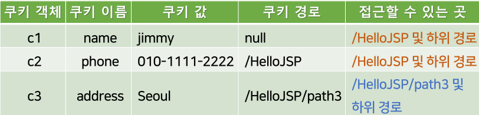

{:toc .large-only}

## 쿠키

- 웹 브라우저에 저장되는 작은 크기의 텍스트 데이터
- <이름, 값> 쌍으로 구성
- 최초 요청의 처리에서 웹 서버가 쿠키를 만들어 응답 헤더에 포함시킴
- 웹 브라우저가 쿠키를 저장했다가 같은 서버에 요청을 보낼 때 쿠키를 요청 헤더에 넣어 전송한다.
- 서버와 클라이언트 간 상태 정보를 공유함으로써 연이은 여러 요청을 관련지어 처리할 수 있음

## 쿠키의 구성

- 하나의 쿠키는 하나의 <이름, 값>을 가짐
  - 이름과 값은 알파벳과 숫자로 구성된 문자열
- 쿠키는 추가 정보를 가질 수 있음
  - 유효 시간: 쿠키의 유효시간
  - 도메인: 쿠키를 만들고 이용할 서버를 지정
  - 경로: 쿠키가 보내질 서버의 경로를 지정
  - 주석: 쿠키의 목적을 설명
  - 이러한 추가 정보는 브라우저에서 기억하고 있음

## Cookie 클래스의 메서드

| 메서드                    | 리턴 타입 | 기능                                                                            |
| ------------------------- | --------- | ------------------------------------------------------------------------------- |
| getName()                 | String    | 쿠키의 이름을 리턴                                                              |
| getValue()                | String    | 쿠키의 값을 리턴                                                                |
| setValue(String value)    | void      | 쿠키의 값을 value로 지정                                                        |
| getDomain()               | String    | 쿠키가 전송될 서버의 도메인을 리턴                                              |
| setDomain(String pattern) | void      | 쿠키가 전송될 서버의 도메인을 지정                                              |
| getPath()                 | String    | 쿠키의 전송 경로를 리턴                                                         |
| setPath(String uri)       | String    | 쿠키의 전송 경로를 지정                                                         |
| getMaxAge()               | String    | 쿠키의 유효시간을 리턴                                                          |
| setMaxAge(int seconds)    | void      | 쿠키의 유효시간을 초 단위로 지정. 음수로 지정하면 웹 브라우저 종료 시 쿠키 삭제 |

## 쿠키의 생성과 전송

- JSP 페이지에서 Cookie 클래스의 객체를 생성함
  - `newCookie(Stringname, Stringvalue)`
- 응답 헤더에 쿠키 하나를 추가함
  - `response.addCookie(Cookie)`
- 쿠키를 전송하기 전에 추가 정보를 설정할 수 있음

```jsp
<%
  Cookie cookie = new Cookie("name", "value");
  response.addCookie(cookie);
%>
```

## 쿠키 값 읽기

- `request.getCookies()` 사용
  - 웹 브라우저로부터 전송된 Cookie 객체들의 배열을 리턴함

```jsp
<%
	Cookie[] cookies = request.getCookies();
	for(Cookie c: cookies) {
		out.print(c.getName() + ":" + c.getValue() + "<br>");
	}
%>
```

## 쿠키의 유효시간

- 브라우저가 쿠키를 저장하는 기간
- 쿠키 생성 후 Cookie 클래스의 `setMaxAge(int seconds)`로 지정
- 유효시간이 경과된 쿠키는 웹 브라우저에서 자동 삭제됨
- 유효시간을 0으로 설정하면 기존 쿠키를 삭제함
- 시간을 설정하지 않거나 음수로 설정하면 웹 브라우저가 종료될 때 쿠키가 삭제됨

## 쿠키의 삭제

- JSP에서 쿠키를 삭제하는 메서드는 별도로 제공되지 않는다.
- `setMaxAge(0)`로 쿠키의 유효시간을 0으로 변경한 후 응답 헤더에 전송하면 다음 응답 시 쿠키를 삭제한다.

```jsp
<%
	Cookie cookie = new Cookie("name", "jimmy");
	cookie.setMaxAge(0);
	response.addCookie(cookie);
%>
```

## 쿠키의 도메인

- 기본적으로 쿠키는 그 쿠키를 생성한 서버에게만 전송될 수 있음
  - ex) 'http://www.oracle.com/JSP/create_cookie.jsp'에서 생성된 쿠키는 'http://www.oracle.com'으로 시작되는 페이지에 접속할 때만 전송됨
- `setDomain(String pattern)`로 쿠키에 도메인 설정을 하면 같은 도메인 상에 있는 다른 호스트들과 쿠키를 공유할 수 있음
  - 자신이 속한 도메인 내에서만 도메인 설정이 가능하다.

```jsp
<%
	Cookie cookie = new Cookie("name", "jimmy");
	cookie.setDomain("java.oracle.com");
	response.addCookie(cookie);
%>
```

## 쿠키의 경로

- `setPath(String uri)`를 사용해 쿠키를 보낼 서버 상의 경로를 지정
  - ex) 'http://localhost:8080/HelloJSP/8-1.jsp'에서 경로는 '/HelloJSP'
- 지정 경로(하위 경로 포함)에 있는 페이지에만 쿠키를 보냄
- 경로를 지정하지 않으면 쿠키를 만든 페이지가 위치한 경로로 설정됨

```jsp
<%
  Cookie c1 = newCookie("name","jimmy");
  response.addCookie(c1);

  Cookie c2 = newCookie("phone","010-1111-2222");
  c2.setPath("/HelloJSP");
  response.addCookie(c2);

  Cookie c3 = newCookie("address","Seoul");
  c3.setPath("/HelloJSP/path3");
  response.addCookie(c3);
%>
```



## 쿠키를 이용하여 로그인 구현하기

1. 사용자가 입력한 아이디, 비밀번호를 읽고 가입된 회원인지 판단한다.
1. 가입된 회원이라면 로그인에 사용될 쿠키를 생성한다.
1. 이후 페이지를 방문할 때는 클라이언트가 보낸 쿠키로 로그인 여부를 판단한다.
1. 로그아웃을 하면 사용했던 쿠키를 삭제한다.

### 로그인 작업

```html
<form action="8-9.jsp" method="post">
  아이디 <input type="text" name="id" /><br />
  비밀번호 <input type="password" name="pw" /><br />
  <input type="submit" value="확인" />
</form>
```

### 로그인 처리

```jsp
<%
	String id = request.getParameter("id");
	String pw = request.getParameter("pw");
	if(id.equals("admin") && pw.equals("pass")) {
		Cookie cookie = new Cookie("ID", "ADMIN");
		response.addCookie(cookie);
		out.print("<h3>로그인 성공</h3>");
	} else {
		out.print("<h3>로그인 실패</h3>");
	}
%>
```

### 로그인 확인

```jsp
<%
	Cookie[] cookies = request.getCookies();
	boolean isLogin = false;
	for(Cookie c: cookies) {
		if(c.getName().equals("ID") && c.getValue().equals("ADMIN")) {
			isLogin = true;
			break;
		}
	}
	if(isLogin) {
		out.print("<h3>로그인한 상태입니다.</h3>");
		out.print("<a href=8-11.jsp>로그아웃</a>");
	} else {
		out.print("<h3>로그인한 상태가 아닙니다.</h3>");
		out.print("<a href=8-8.jsp>로그인</a>");
	}
%>
```

### 로그아웃 처리

```jsp
<%
	Cookie[] cookies = request.getCookies();
	for(Cookie c: cookies) {
		if(c.getName().equals("ID")) {
			c.setMaxAge(0);
			response.addCookie(c);
		}
	}
%>
```
