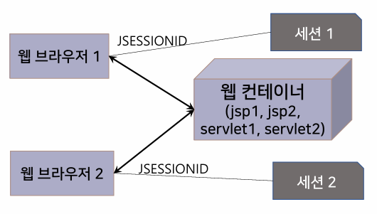
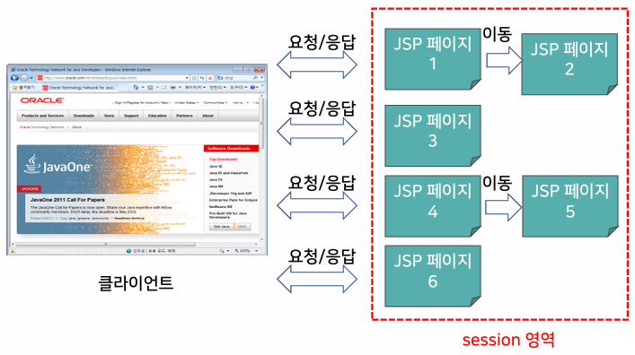
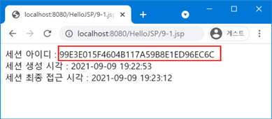
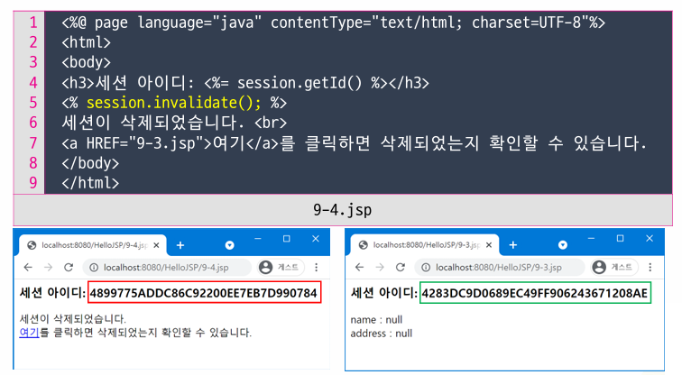

{:toc .large-only}

## 세션

- 클라이언트의 상태 관리를 위한 기법
- 클라이언트가 특정 작업을 수행하는 기간
- 웹 브라우저를 종료하거나 세션 유효시간이 경과되면 세션이 삭제됨

## 세션 관리

- 웹 컨테이너는 웹 브라우저당 1개의 세션 아이디를 부여함
- 클라이언트의 최초 요청 시 웹 컨테이너는 session 객체를 만들고 세션 아이디를 부여함
- 최초 요청의 응답에서 세션 아이디(JSESSIONID)를 쿠키에 포함시켜 웹 브라우저에게 전송한다.
- 이후 웹 브라우저는 자신의 세션 아이디를 웹 컨테이너에 전송하고, 서버는 세션 아이디를 이용하여 사용자를 식별한다.
- 세션을 자동으로 생성하지 않으려면 page 지시어에서 session 속성을 "false"로 설정한다.



## 쿠키와 세션 비교

| 구분      | 쿠키                      | 세션                        |
| --------- | ------------------------- | --------------------------- |
| 저장 위치 | 클라이언트 측에 저장      | 서버 측에 저장              |
| 저장 형태 | 텍스트 파일로 저장됨      | 객체 형태로 저장됨          |
| 크기      | 정보의 크기에 제한이 있음 | 정보의 크기에 제한이 없음   |
| 보안      | 상대적으로 보안에 약함    | 서버에 저장되어 보안에 유리 |

## session 내장 객체

- session 객체는 세션이 유지되는 동안 여러 요청을 처리하는데 사용되는 JSP 페이지들 사이에서 공유됨
  - 이러한 JSP 페이지들은 같은 session 영역 내에 존재함

| 메서드                                  | 리턴 타입 | 기능                                                                                                                                       |
| --------------------------------------- | --------- | ------------------------------------------------------------------------------------------------------------------------------------------ |
| getId()                                 | String    | 세션별로 고유하게 부여되는 세션 아이디를 리턴                                                                                              |
| getCreationTime()                       | long      | 세션이 생성된 시간을 리턴. PC의 기준이 되는 날짜(1970년 1월 1일 0시)부터 세션이 생성된 시각까지의 시간을 0.001초 단위로 계산하여 리턴한다. |
| getLastAccessedTime()                   | long      | 클라이언트가 해당 세션에 가장 마지막으로 접근한 시간을 리턴                                                                                |
| setMaxInactiveInterval(long)            | void      | 세션의 유효시간을 초 단위로 설정. 0이나 음수로 설정하면 웹 브라우저를 종료할 때까지 유지                                                   |
| invalidate()                            | void      | 세션을 삭제한다.                                                                                                                           |
| getAttribute(String name)               | void      | 세션의 속성을 리턴                                                                                                                         |
| setAttribute(String name, Object value) | void      | 세션에 속성을 저장                                                                                                                         |

### session 영역



### 세션의 확인

```jsp
<%@ page language="java" contentType="text/html; charset=UTF-8"
    pageEncoding="UTF-8"%>
<%@ page import="java.util.Date, java.text.SimpleDateFormat" %>
<!DOCTYPE html>
<html>
<body>
<%
	Date c_time = new Date(), m_time = new Date();
	SimpleDateFormat formatter = new SimpleDateFormat("yyyy-MM-dd HH:mm:SS");
	c_time.setTime(session.getCreationTime());
	m_time.setTime(session.getLastAccessedTime());
%>
세션 아이디: <%= session.getId() %><br/>
세션 생성 시각: <%= formatter.format(c_time) %><br/>
세션 최종 접근 시각: <%= formatter.format(m_time) %>
</body>
</html>
```



### 세션의 삭제

- 세션을 삭제한다는 것은 세션의 속성값들을 지우고 초기화하는 것
- `invalidate()` 메서드 사용하면 해당 세션에 저장된 모든 속성이 삭제됨
- 웹 브라우저를 종료하거나 설정된 유효시간(타임아웃 시간)이 초과되면 기존 세션이 삭제됨



### 세션의 유효시간

- 클라이언트가 서버에 추가 요청을 하지 않고도 세션을 유지시킬 수 있는 최대 시간
  - ex) 세션의 유효시간이 1분이라면 마지막 요청 후 1분 이내에 추가 요청이 있어야 세션이 유지된다.
- 세션의 유효시간을 설정하지 않으면 웹 브라우저를 종료하지 않는 이상 서버에 세션이 계속 남아있다.
- 세션의 유효시간을 설정하는 방법은 `session.setMaxInactiveInterval(long)`를 실행하거나 web.xml 파일을 수정하는 방법이 있다.
  - `<session-timeout>` 태그의 단위는 분이다.

```xml
<session-config>
    <session-timeout>30</session-timeout>
</session-config>
```

### HttpSession 인터페이스

- session 객체는 HttpSession 유형이다.
- request 내장 객체의 `getSession()` 메서드는 세션이 있으면 현재 세션 객체를 리턴하고, 없다면 HttpSession 인터페이스 유형의 세션 객체를 생성하여 리턴한다.
  - 만약 `getSession(false)`로 실행하면 세션이 존재하지 않으면 null을 리턴한다.
- 한 개의 브라우저에 한 개의 세션이 생성되므로 session 내장 객체와 request 내장 객체의 `getSession()`이 리턴하는 세션 객체는 동일하다.

```jsp
<%@page language="java" contentType="text/html; charset=UTF-8" %>
<%
    HttpSession httpSession = request.getSession();
%>
<html>
<body>
세션아이디1: <%= session.getId() %><br>
세션아이디2: <%= httpSession.getId() %>
</body>
</html>
```

## 세션을 이용하여 로그인 구현하기

1. 사용자가 입력한 아이디, 비밀번호를 확인한다.
1. 정보다 맞으면 session 내장 객체에 로그인 여부 확인을 위한 속성을 설정한다.
1. 로그인 여부는 세션에 특정 속성이 설정되어 있는지 여부로 확인한다.
1. 로그아웃을 하면 세션을 삭제한다.

### 로그인 작업

```html
<form action="9-7.jsp" method="post">
  아이디 <input type="text" name="id" /><br />
  비밀번호 <input type="password" name="pw" /><br />
  <input type="submit" value="확인" />
</form>
```

### 로그인 처리

```jsp
<%
	String id = request.getParameter("id");
	String pw = request.getParameter("pw");
	if(id.equals("admin") && pw.equals("pass")) {
		session.setAttribute("login", id);
		out.print("<h3>로그인 성공</h3>");
	} else {
		out.print("<h3>로그인 실패</h3>");
	}
%>
```

### 로그인 확인

```jsp
<%
	String id = (String)session.getAttribute("login");
	if(id != null && id.equals("admin")) {
		out.print("<h3>로그인한 상태입니다. ID = " + id + "</h3>");
		out.print("<h3><a href=9-9.jsp>로그아웃</a></h3>");
	} else {
		out.print("<h3>로그인한 상태가 아닙니다.</h3>");
		out.print("<a href=9-6.jsp>로그인</a>");
	}
%>
```

### 로그아웃 처리

```jsp
<% session.invalidate(); %>
```
